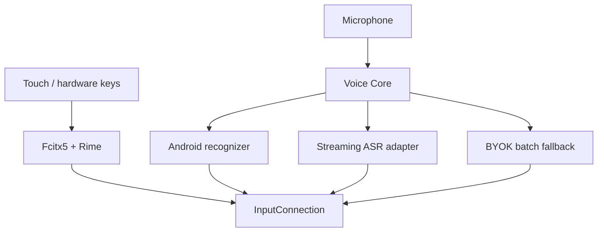

# OpenTypeless Android IME 1.0 upgrade specification

Date: 2026-08-09
Status: implementation baseline
Target device: Xiaomi 15, HyperOS 2/3, Android 15/16

## Outcome

OpenTypeless Android becomes a complete, daily-use Chinese keyboard instead of a voice-only panel.
The normal keyboard path is deterministic Rime input (including user-owned 小鹤音形 schemas and
code tables). Voice is a parallel input path that can update the active editor while the user is
speaking. Optional AI may format or translate voice text, but it must never change normal Rime key
results.

The release is accepted only after the candidate APK passes the automated gates in this document
and a physical Xiaomi 15 run. An emulator or another OEM can prove Android API compatibility but
cannot replace the Xiaomi acceptance run.

## Product decisions

| Area | Decision | Reason |
| --- | --- | --- |
| Keyboard engine | Fcitx5 Android with its Rime plugin is the 1.0 base | It already supplies mature composing, candidates, clipboard, emoji, themes and Android lifecycle handling. Reimplementing these in the current voice panel would create a second, less reliable keyboard engine. |
| Chinese schemas | Rime data remains user-controlled; ship a tested 小鹤音形 starter profile and import/export | Key-to-code behavior stays deterministic and can be customized without AI. |
| Voice integration | Embed Voice Core in the same IME process and toolbar | Switching to a second `voice` subtype is not the target experience. Keyboard and voice converge only at the editor commit/composing boundary. |
| System recognition | Keep as the zero-configuration, low-power route | It can use OEM/on-device models and avoids a user API key, but partial-result and offline flags are provider hints, not guarantees. |
| Production streaming | Add a provider-neutral streaming session API; first adapters are DashScope Paraformer realtime and self-hosted FunASR | Both support Mandarin streaming, incremental hypotheses and punctuation. The adapter boundary prevents provider lock-in. |
| Existing BYOK route | Keep OpenAI-compatible file transcription as a batch fallback | It is portable and useful for self-hosting, but an HTTP upload of a completed WAV is not described as realtime streaming. |
| AI formatting | Optional final-pass operation, never part of Rime key handling | Dictation remains useful and reversible when an LLM is unavailable. |
| Privacy | Password fields disable voice; no-learning fields do not persist context/history; credentials stay in Android Keystore | Preserves the 0.2 safety contract. |

## Architecture

`Voice Core` owns audio capture, VAD, transcript revisions, personalization, optional formatting,
target validation, undo and raw restoration. It does not own Rime composition. A voice session may
publish an unstable hypothesis with `setComposingText`; only a final result uses `commitText`.

### Transcript contract

Every recognition engine emits a monotonic `TranscriptUpdate`:

- `stableText`: prefix the engine promises not to revise;
- `unstableText`: replaceable suffix currently shown as editor composition;
- `isFinal`: no later update exists for the session;
- `sequence`: strictly increasing session-local revision number;
- `source`: system, Paraformer, FunASR, or batch.

The editor adapter rejects stale sequence numbers and binds the session to the original
`InputConnection`, package, field, editor epoch and cursor context. Cursor movement caused by the
adapter's own composing operation is expected; user movement or an editor/window change cancels the
session and removes only OpenTypeless-owned composing text.

### Streaming punctuation

Partial text is allowed to revise words and punctuation. Stable prefixes are committed only if the
provider explicitly marks them stable; otherwise the whole hypothesis stays as composition. The
final deterministic personalization pass runs once. Optional AI formatting runs after recognition
and must preserve the raw transcript for one-tap restore.

## Delivery milestones

The reviewed M3 upstream baseline is Fcitx5 Android commit
`3f3a19dcdfa1524cc47eedab409e245737c1fcd1` (2026-08-05). Migration work must pin that commit and
every native/data submodule SHA before implementation; updating the baseline requires a separate
dependency, license and Xiaomi regression review. A floating `main` dependency is not acceptable
for a release candidate.

### M0 — frozen baseline

- Record current 0.2 behavior and known limitations.
- Freeze this architecture and the Xiaomi 15 acceptance matrix.
- Keep desktop behavior unchanged.

### M1 — Voice Core 0.3 on the current Android module

- Replace status-only partials with editor composing text and a visible transcript strip.
- Add self-mutation-aware cursor guarding, cancellation cleanup and stale-revision rejection.
- Request latency-optimized system formatting and default Simplified Chinese locale on Chinese
  devices; tolerate `zh`, `cmn`, script and region aliases in model-support results.
- Report the actual selected recognition service, requested route, model support and any fallback
  reason. Do not label a route offline merely because offline was requested.
- Redesign the compact IME surface with theme tokens, minimum 48 dp targets, dark mode, large-font
  wrapping and clear recording/error states.
- Preserve batch BYOK, personalization, selected-text safety, undo and raw restore.

M1 is intentionally implemented as portable Voice Core work. It improves the currently installable
APK and is moved into the 1.0 keyboard rather than discarded.

### M2 — true streaming

- Refactor audio capture to emit bounded 20–40 ms PCM frames without retaining an unbounded
  recording in memory.
- Implement reconnect/cancel/timeout-safe WebSocket sessions behind the provider-neutral contract.
- Add DashScope Paraformer realtime and self-hosted FunASR adapters, hotwords, incremental
  punctuation, explicit endpoint allowlisting and secrets-at-rest protection.
- Never silently route audio to a different provider. A runtime failure offers or applies only the
  user-configured fallback policy and records the reason locally without transcript contents.

### M3 — full keyboard

- Rebase the Android product surface on Fcitx5 Android and its Rime plugin while retaining the
  OpenTypeless application ID and migration path.
- Embed Voice Core in the candidate/toolbar UI; do not switch to a second input method.
- Ship/import/export the 小鹤音形 schema, user dictionary and direct-function mappings.
- Verify QWERTY, symbols, numbers, emoji, clipboard, one-handed layouts, hardware keyboard,
  candidate paging and per-app incognito behavior.
- Preserve upstream notices and satisfy LGPL/source-distribution requirements. No Fcitx upstream
  trademark or signing identity is reused.

### M4 — release candidate

- Complete review, static analysis, unit/instrumentation tests, accessibility audit, performance
  profiling and Xiaomi 15 physical acceptance.
- Produce a signed internal candidate from maintainer-controlled keys. Public publication remains
  a separate explicit release action.

## Xiaomi 15 acceptance matrix

The exact phone model, HyperOS build, Android API, system recognition package/version and battery
mode are recorded with the result.

| ID | Scenario | Pass condition |
| --- | --- | --- |
| XM-01 | Install, enable and select IME | No crash or settings loop; keyboard survives process restart and reboot. |
| XM-02 | HyperOS permission flow | Microphone denial is explained; granting it works without reinstall; privacy indicator appears only while recording. |
| XM-03 | Normal 小鹤音形 typing | Expected codes and candidates are deterministic in WeChat, Notes and a browser; voice/AI settings cannot alter them. |
| XM-04 | System voice, Mandarin | First visible partial p50 <= 900 ms when the provider supplies partials; editor text revises in place; final text is not duplicated. |
| XM-05 | System route truthfulness | UI names the actual recognition service and reports online/on-device/unsupported/unknown without claiming a false offline guarantee. |
| XM-06 | Paraformer/FunASR streaming | First partial p50 <= 700 ms on a stable network; final p95 <= 1.5 s after end-of-speech; incremental punctuation is allowed to revise. |
| XM-07 | Network loss | Session ends or follows the explicit fallback policy within 10 s; no duplicate/late commit and no stuck microphone. |
| XM-08 | Cursor/app switch during speech | Session cancels; no text reaches the new field/app; owned composition is removed from the old field where possible. |
| XM-09 | Password/no-learning fields | Password recording is blocked; no-learning fields create no history/context/learning updates. |
| XM-10 | Rotation, floating window and app relaunch | No stale result, leaked window or lost committed text. |
| XM-11 | HyperOS battery restriction | Foreground IME session works with default battery policy; the app explains any OEM restriction rather than requesting blanket exemption. |
| XM-12 | Accessibility and display | TalkBack labels/states are correct; 1.0x and 2.0x font scales, dark mode and high contrast remain operable; touch targets >= 48 dp. |
| XM-13 | Performance | No main-thread network/disk access; no sustained idle CPU; peak memory is bounded during a 9-minute configured session; no audio buffer growth after cancel. |
| XM-14 | Compatibility suite | Android API 26, 33, 35 and 36 automated tests pass; target-app smoke tests cover WeChat, Xiaomi Notes, Chrome and an AOSP text field. |

Latency is measured over at least 20 utterances per configured route. Recognition accuracy uses a
fixed Mandarin set with names, mixed English and punctuation; raw and personalized CER are reported
separately so correction rules cannot conceal recognizer quality.

## Automated release gates

- JVM unit tests, Android instrumentation tests and lint pass with no new baseline suppressions.
- Debug, minified release and test APKs assemble reproducibly.
- Transcript sequences, composing replacement, cancellation, cursor races and late callbacks have
  deterministic tests using a fake editor connection.
- Streaming protocol parsers are tested with recorded provider events; transport tests cover
  fragmented messages, malformed JSON, authentication failure, timeout, disconnect and cancel.
- Secrets never appear in logs, exported preferences, screenshots, error strings or test fixtures.
- Dependency licenses and notices are regenerated and reviewed.
- A reviewer completes the checklist below on the exact release commit.

## Review checklist

- Architecture: no AI dependency in the Rime key path; engine/provider boundaries do not leak UI
  or Android editor state.
- Correctness: no partial can be committed twice; cancellation is idempotent; a late callback cannot
  target a new editor.
- Security/privacy: endpoint policy, microphone attribution, encrypted credentials and sensitive
  field checks remain fail-closed.
- Reliability: all sessions have bounded memory, terminal timeouts and generation-safe cleanup.
- UX/accessibility: system state, provider, fallback and errors are truthful and actionable.
- Release: Xiaomi evidence, checksums, signature identity and exact commit SHA are attached.

## Non-goals and honest limits

- Android system recognizers are OEM/provider implementations. OpenTypeless can request partial,
  offline and formatting behavior, but cannot force a provider to honor those hints.
- Voice partial latency targets do not apply when the selected system provider emits final results
  only; the diagnostics screen must make that observable and M2 provides a deterministic streaming
  alternative.
- Emulator success does not constitute XM-01 through XM-13. Final physical acceptance requires the
  maintainer to connect the Xiaomi 15 or run the supplied acceptance script and return its bundle.
- Public store publication, destructive migration of existing data and external provider spend are
  not performed without explicit maintainer approval.
