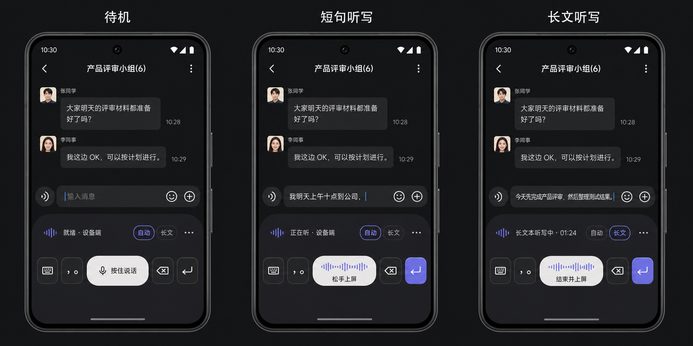

# Android IME visual direction v1 — 2026-08-11

## Style diagnosis

The supplied Typeless screens use a dark editorial neo-minimalist language: large type, restrained
graphite surfaces, sparse outlines, generous negative space, one dominant action, and progressive
disclosure. It is closer to a calm native utility than a decorative “AI app”. Its strongest trait
is hierarchy; its large voice-keyboard footprint is not appropriate for OpenTypeless's combined
hold-to-talk and continuous-dictation workflows.

OpenTypeless should keep the restraint while becoming more compact, state-led, and operationally
truthful. The keyboard is a two-row voice tool, not a feature dashboard or an abbreviated full
keyboard.

## Core layout

The IME keeps one stable geometry across all states:

1. A 48 dp toolbar: OpenTypeless wave/status, processing-mode chip, Long action, and overflow.
2. A 56 dp editing row: keyboard switch, punctuation, flexible voice/Space pill, Backspace, and a
   dynamic Enter/Search/Send action.
3. The host editor owns live composing text. The keyboard never duplicates the transcript.
4. The bottom safe area follows Android navigation/gesture insets and is not painted as a third row.

The voice pill is the only primary surface. A tap inserts one space; a long press starts short
dictation; release finishes and commits. Long dictation is a secondary toolbar action until active,
then it becomes the current primary state. Explicit discard remains under overflow with
confirmation and is never a permanent key.

## State model

| Phase | Status | Voice pill | Accent behavior |
| --- | --- | --- | --- |
| Idle | `就绪 · 设备端` | `按住说话` | Pearl primary surface, no animation |
| Preparing | `正在准备麦克风` | `准备` | Neutral surface; no listening haptic yet |
| Hold recording | `正在听 · 设备端` | `松手上屏` + waveform | Periwinkle waveform; Enter may retain editor tint |
| Long recording | `长文本听写中 · mm:ss` | `结束并上屏` + waveform | Long chip outlined in periwinkle |
| Finalizing | Actual route phase | `处理中` | No fake waveform; editing keys disabled |
| Recoverable | `结果已保留` | `插入草稿` | Warning outline, no destructive automatic action |
| Sensitive field | `此字段不可语音` | `空格` | Voice affordance removed; regular Space remains |

## Visual tokens

| Token | Value | Use |
| --- | --- | --- |
| Canvas | `#171719` | IME background |
| Surface | `#242427` | Toolbar and secondary keys |
| Surface high | `#2B2B2F` | Selected or elevated controls |
| Primary | `#F6F4F1` | Idle voice pill |
| On primary | `#171719` | Primary-pill text and icon |
| On surface | `#F3F1EE` | Main text/icons |
| Muted | `#A9A7AD` | Route and secondary state |
| Accent | `#7774F2` | Active waveform/current mode only |
| Outline | `#3A3A40` | One-pixel control outlines |
| Danger | `#E07178` | Confirmed discard and unrecoverable errors only |

Use 22 dp radius for the voice pill, 16 dp for chips, and 14 dp for square editing keys. Prefer a
one-pixel outline and tonal separation over shadows. Avoid blur, glass, bright gradients, glow,
neon, or decorative motion.

## Typography and accessibility

- Status: 13 sp medium; route detail: 12 sp regular.
- Primary action: 15 sp medium; compact fallback: 13 sp medium.
- Every control remains at least 48 × 48 dp at 320 dp width and font scale 2.0.
- Labels may shorten but content descriptions must remain complete and state-specific.
- TalkBack exposes start/finish as a stateful click action; touch users retain press/release.
- Listening feedback starts only after the microphone is actually ready.
- Color never carries phase or selection alone; icon, text, state description, and enablement agree.

## Deliberate differences from Typeless

- No half-screen microphone panel: the host conversation remains visible.
- No duplicate transcript: partials revise the real editor composition.
- No permanent Cancel: normal release/end/error preserves text; only confirmed discard removes it.
- No equal-weight feature grid: processing mode, Long, and overflow are progressively disclosed.
- No provider ambiguity: the compact status always reports the actual route or a truthful phase.

This image is a visual-direction artifact, not a pixel-perfect implementation screenshot. Native
Android rendering, dynamic color compatibility, landscape behavior, three-button navigation,
Chinese/English text metrics, and TalkBack must still pass the Xiaomi 15 physical matrix.
