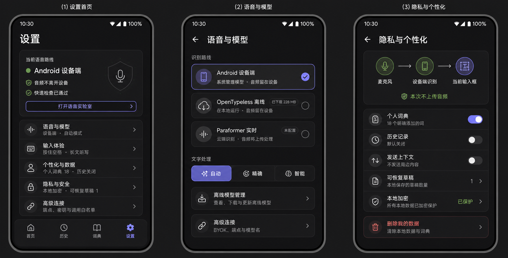

# Android settings visual direction v1 — 2026-08-11

## Product principle

Settings must first answer three user questions: which recognition route is active, where the audio
goes, and whether the route is ready. Provider names, endpoints, model identifiers, and API keys are
implementation details and belong behind progressive disclosure.

This makes the companion app a control and trust surface for the keyboard, rather than a long
engineering form. It uses the same calm, dark editorial neo-minimalism as the IME while allowing
more vertical space, explanatory copy, and a four-item app navigation.

## Information architecture

### Settings home

The first card is live product status, not decoration:

- `Current voice route`: actual backend and model class in use.
- A truthful privacy statement, such as `Audio stays on this device`.
- Readiness or the most useful next action, such as `Quick check passed` or `Download model`.
- A single entry to `Voice Lab` for a real microphone and recognition test.

The remaining rows are grouped by user intent:

1. `Voice & models` — route, downloaded models, and processing mode.
2. `Input experience` — hold-to-talk, long dictation, haptics, and language behavior.
3. `Personalization & data` — explicit dictionary, correction rules, history, and backups.
4. `Privacy & security` — audio destination, context sharing, encryption, and recoverable drafts.
5. `Advanced connections` — BYOK endpoints, credentials, allowlist, and developer diagnostics.

### Voice & models

Recognition routes are mutually exclusive route cards, not unrelated toggles. Every card reports
its real capability and state: device-managed, OpenTypeless offline, streaming, downloaded,
unavailable, or not configured. Download size and storage actions are visible before installation.

`Automatic`, `Exact`, and `Smart` belong to a separate text-processing control. They must not be
presented as ASR engines. Automatic mode explains which behavior it resolved to for the current
editor.

Provider secrets and model names remain in a collapsed `Advanced connections` section. The home
screen never displays an API key field.

### Privacy & personalization

Use a small data-flow diagram to explain the current route:

`Microphone -> recognition location -> current editor`

The statement below it is computed from current settings and must never make a generic privacy
claim. Personal dictionary, history, context sharing, and recoverable drafts are separate controls
because they have different learning, retention, and transmission semantics. Destructive data
deletion is isolated at the end of the page and always confirmed.

## Navigation

The companion app uses four stable destinations: Home, History, Dictionary, and Settings. Nested
settings use a back action instead of repeating the bottom navigation. There is no Account or
Subscription destination in the open-source fork.

## Visual system

Reuse the IME tokens: graphite `#171719`, charcoal `#242427`, raised surface `#2B2B2F`, off-white
text, muted warm gray descriptions, periwinkle `#7774F2` for the current selection, and green only
for a verified success or on-device route. Cards use 16–22 dp radii, thin outlines, almost no
shadow, and at least 48 dp touch targets.

Large titles and generous section spacing create hierarchy. Avoid gradients, glass blur, neon,
feature-button grids, decorative AI imagery, and equal visual weight for every setting.

## Truthfulness and accessibility

- Route, model availability, download state, and privacy copy come from runtime state.
- `On device` is shown only when the selected recognizer is confirmed to run locally.
- A route can be installed but not ready; the two states are not conflated.
- Every icon has a text label or content description; color is never the only state signal.
- Text reflows at font scale 2.0 and controls remain usable at 320 dp width.
- Secrets disable Autofill and screenshots, never appear in summaries, and are revealed only on
  deliberate action.

This board is a design-direction artifact, not an implementation screenshot. It should be converted
into native Android components after the information architecture and copy are accepted, then
verified in light/dark themes and on the Xiaomi 15 accessibility matrix.
