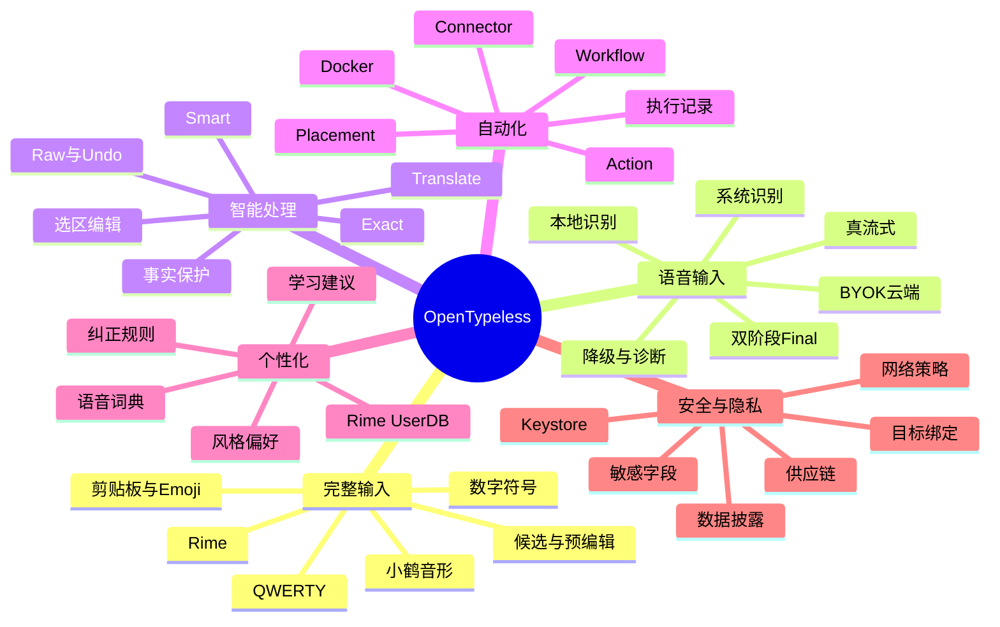
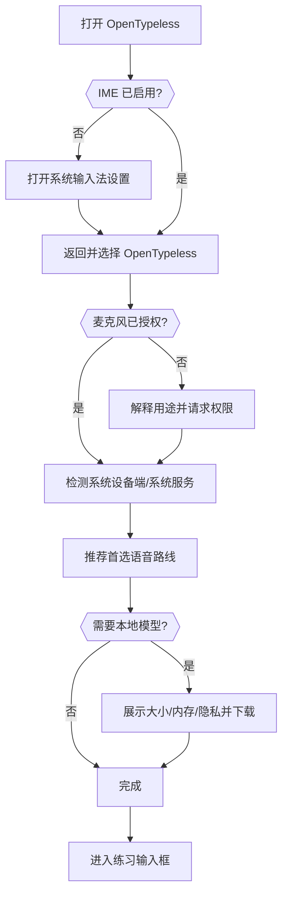
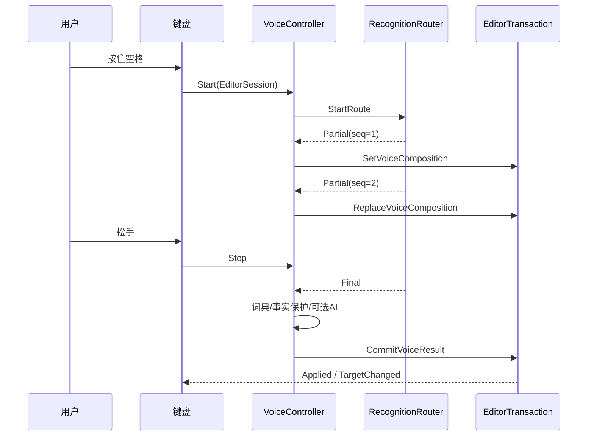
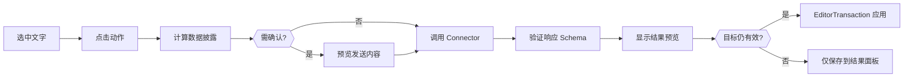

# OpenTypeless 产品设计文档

> 文档版本：1.0  
> 生成日期：2026-08-12  
> 适用仓库：`dengxuezhao/opentypeless`  
> 代码基线：`main@67be488dcd2e9f36520618f9f644f97c3ec02b98`  
> 目标读者：产品负责人、Android/IME 工程师、语音与模型工程师、安全工程师、测试工程师，以及 Codex / Claude Code 等编码代理  
> 状态：**拟议目标方案（Proposed Target Architecture）**；涉及键盘底座、许可证和 Rime 集成的不可逆决策，必须先完成 ADR 技术验证

## 1. 执行摘要

OpenTypeless 的产品机会不在于“再做一个语音按钮”，而在于把用户每天最高频的文本入口升级为一个统一输入平台：

- 普通键盘负责确定性、高频、低延迟输入；
- Rime/小鹤音形负责用户熟悉的高效率中文编码；
- 语音负责长文本、移动场景和低操作成本；
- 智能处理负责标点、分段、翻译、选区编辑和保守润色；
- 动作平台负责把输入内容送入用户自托管的 Docker 或其他服务；
- 个性化系统负责显式、可解释、可迁移的词汇和纠错；
- 安全层确保任何异步结果只写回原输入目标，敏感数据不会被静默上传。

产品长期定位：

> **OpenTypeless 是语音优先、键盘完整、可编排、隐私可控的个人输入平台。**

它不是“AI 自动替用户决定一切”，也不是“把所有键入内容上传后建立黑箱记忆”。其核心价值是：**低修改成本、明确控制权、跨场景一致性和可验证安全性。**

---

## 2. 产品背景与现状

### 2.1 已有优势

当前 Android 0.2 已经具备以下可复用资产：

- 独立 IME、`RecognitionService`、`RecognizerIntent` 三类入口；
- Android 设备端、系统服务、本地 SenseVoice、OpenAI Compatible 等识别路径；
- 系统 partial 与本地可修订前缀预览；
- App、字段、选区、光标上下文及 `InputConnection` 绑定；
- 敏感字段保护；
- Raw 恢复、Undo 和显式 Teach；
- 个人术语、别名、读音和纠正规则；
- LLM 失败回退原始转写；
- 数字、金额、日期、URL、邮箱、代码形态和否定词保护；
- API Key 与历史正文加密；
- App Profile、历史、词典导入导出；
- 本地模型哈希校验和私有目录存储。

这些能力说明项目已经跨过“能否做出语音输入”的验证阶段。

### 2.2 当前产品问题

现在的主要问题不是缺少功能，而是功能组织方式和长期抽象不足：

1. **输入法不是完整键盘。**  
   当前按键仅能承担语音入口、删除、空格、回车和切换，无法独立替代成熟键盘。

2. **产品主线不够清楚。**  
   设置页把识别、模型、标准语音入口、LLM、翻译、历史、隐私、App Profile 和输入法启用混在一个长页面。

3. **同一概念多次出现。**  
   全局模式、App 模式、翻译目标、自定义指令、上下文发送分别存在于多个层级，但没有一致的继承/覆盖语义。

4. **语音、键盘和自动化没有统一编辑模型。**  
   未来接入 Rime、候选和 Docker 动作后，如果各自直接操作 `InputConnection`，会产生竞态和误写。

5. **学习与历史边界不清。**  
   “个人词典、纠正规则、使用次数、输入历史、Rime 词频、风格偏好”不能都叫记忆。

6. **本地 partial 容易被误解为真流式。**  
   当前是定期重识别有界前缀，产品文案必须诚实区分“可修订预览”和“原生流式”。

7. **缺少可操作的诊断。**  
   用户只知道发生降级，却不知道系统服务缺失、OEM 麦克风阻断、模型未安装、网络失败还是配置错误。

---

## 3. 产品目标与非目标

### 3.1 核心目标

| ID | 目标 | 可验证结果 |
|---|---|---|
| G-01 | 成为可长期使用的完整 Android 输入法 | 用户无需频繁切回其他键盘完成普通输入 |
| G-02 | 语音结果低修改成本 | 原始识别、确定性纠正和可选 AI 各自可解释、可撤回 |
| G-03 | 支持小鹤音形/Rime | Schema、预编辑、候选、翻页、UserDB 和配置生命周期完整 |
| G-04 | 支持安全的自定义动作 | 用户可把选区或语音结果送到自建服务，并受限地插入/替换结果 |
| G-05 | 配置清晰且可诊断 | 用户能看到首选路线、实际路线、降级原因和最终生效规则 |
| G-06 | 隐私默认安全 | 历史、上下文、云端处理和自动学习默认遵循最小披露 |
| G-07 | 跨平台协议一致 | Android 与桌面共享词典、动作和 Provider 配置语义，而非共享 UI |
| G-08 | 可由小团队和编码代理维护 | 任务边界清楚、接口稳定、测试可自动验证、变更可回滚 |

### 3.2 非目标

OpenTypeless 不做以下事情：

- 不在输入法进程执行任意 Shell、JavaScript 或远端下发代码；
- 不允许服务端直接控制 `InputConnection`；
- 不静默点击第三方 App 的“发送”按钮；
- 不默认采集用户所有键盘输入建立云端画像；
- 不把 LLM 输出当作事实来源；
- 不在密码、支付、验证码等敏感字段自动联网；
- 不为追求“智能”破坏键盘输入的确定性和响应速度；
- 不在没有基准数据时宣称识别率全面领先商业输入法；
- 不未经许可证审查复制 GPL/LGPL 项目代码；
- 不一次性重写整个 Android 子项目。

---

## 4. 用户与核心任务

### 4.1 核心用户类型

#### A. 语音高频用户

需要在微信、飞书、邮件、浏览器、笔记和搜索框中快速输入长文本，希望少改错字、少补标点。

#### B. 形码/Rime 用户

已经形成小鹤音形、双拼或自定义 Schema 肌肉记忆，不能接受为了语音功能放弃完整键盘效率。

#### C. 专业术语用户

经常输入姓名、项目名、技术术语、公司名、药品名、代码符号，需要显式词典和稳定纠错。

#### D. 自托管与自动化用户

拥有 NAS、服务器或云端 Docker，希望把选区发送到自己的翻译、总结、检索、知识库或业务接口。

#### E. 隐私敏感用户

要求本地处理、BYOK、明确数据去向、可删除历史和敏感字段硬隔离。

### 4.2 Jobs to Be Done

- 当我需要输入普通短句时，我希望键盘和成熟输入法一样直接可靠。
- 当我需要输入较长内容时，我希望按住说话，边说边看到可修订文本，松手后快速得到最终结果。
- 当识别错了我的专有名词时，我希望只教一次，并知道它在哪些 App 生效。
- 当我选中一段文字时，我希望一键翻译、改写或发送到自建服务，且返回结果不会覆盖错误的输入框。
- 当识别服务失败时，我希望知道原因以及实际使用了哪条备用路线。
- 当我进入敏感字段时，我希望产品自动收紧能力，而不是让我依赖记忆关闭开关。
- 当我更换手机或桌面设备时，我希望词典、纠正规则和动作配置能够迁移。

---

## 5. 产品原则

### 5.1 确定性优先于生成式智能

键盘输入、Rime 候选、显式纠正规则和 Exact 模式必须可预测。LLM 只作为可选后处理，不得成为所有输入的强制路径。

### 5.2 所有智能都必须可撤回

任何 AI 改写、翻译、动作替换都必须：

- 保留输入来源；
- 绑定原始输入目标；
- 支持预览或 Undo；
- 在事实保护失败时不破坏原文。

### 5.3 默认最小披露

产品在联网前明确计算本次将发送的数据：

- 音频；
- 选中文字；
- 光标前后上下文；
- App 标识；
- 个人词条；
- 请求元数据。

只有动作真正需要的字段才发送。

### 5.4 路由透明

“用户选择的首选路线”和“本次实际使用的路线”必须区分。任何隐私等级变化都不得静默发生。

### 5.5 记忆可解释

每一项记忆都能回答：

- 它是什么；
- 从哪里来；
- 为什么生效；
- 在哪些 App 生效；
- 何时使用过；
- 如何停用或删除。

### 5.6 输入热路径不承担非必要工作

按键、候选和组合文本不能等待数据库、网络、模型加载或复杂 UI 渲染。重任务必须异步，且不能阻塞主线程。

---

## 6. 产品能力地图



---

## 7. 信息架构

### 7.1 管理端一级导航

推荐采用底部导航或自适应 Navigation Rail，一级入口保持 4 个：

1. **首页**
2. **输入**
3. **自动化**
4. **我的**

其中“我的”不是账户页，而是个人配置与数据中心。

### 7.2 完整导航树

```text
首页
├── 启用状态
├── 当前键盘方案
├── 当前语音首选路线
├── 本地模型状态
├── 服务健康状态
├── 最近问题
└── 快速诊断

输入
├── 键盘
│   ├── 布局与高度
│   ├── 按键反馈
│   ├── 单手/悬浮
│   ├── 数字符号
│   └── 剪贴板与 Emoji
├── 中文输入
│   ├── 输入方案
│   ├── Rime Schema
│   ├── 小鹤音形
│   ├── 候选与预编辑
│   └── 用户词频
├── 语音输入
│   ├── 识别路线
│   ├── 按住说话
│   ├── 实时预览
│   ├── 自动停录
│   ├── 录音上限
│   └── 失败降级
└── 智能处理
    ├── Exact
    ├── Smart
    ├── Translate
    ├── 自定义处理方案
    └── 事实保护

自动化
├── 动作
├── 工具栏布局
├── 连接器
├── 工作流
├── 动作执行记录
└── 导入导出

我的
├── 个性化
│   ├── 语音词典
│   ├── 纠正规则
│   ├── 学习建议
│   └── Rime 用户词库
├── 应用规则
│   ├── App 规则
│   ├── 字段规则
│   └── 规则解释器
├── 数据与隐私
│   ├── 上下文发送
│   ├── 历史
│   ├── 敏感字段策略
│   ├── 数据保留
│   └── 清除与导出
├── 服务与模型
│   ├── ASR Provider
│   ├── LLM Provider
│   ├── 本地模型
│   └── 连接测试
└── 诊断与关于
    ├── 当前实际路线
    ├── 错误与降级记录
    ├── 性能
    ├── 日志导出
    ├── 版本
    └── 开源许可
```

### 7.3 去重原则

- Provider 的 URL、Key、模型只在“服务与模型”配置一次；
- 输入功能只引用 Provider ID；
- App 规则只保存覆盖项，不复制完整全局配置；
- 工具栏只保存 Action ID 和布局，不复制 Action 定义；
- 历史不承担词典管理；
- Rime UserDB 不写入语音纠正规则表。

---

## 8. 核心输入模式

### 8.1 输入模式定义

| 模式 | 目标 | LLM | 适用场景 |
|---|---|---:|---|
| Auto | 根据字段和规则选择 Exact/Smart | 可选 | 默认 |
| Exact | 忠实转写 + 确定性词典/纠错 | 否 | 搜索、姓名、URL、数字、代码 |
| Smart | 保守分段、标点和表达整理 | 可选 | 消息、正文、邮件 |
| Translate | 忠实翻译到目标语言 | 是 | 跨语言交流 |
| Edit Selection | 按语音或动作编辑选区 | 是或动作服务 | 已选择文本 |
| Command | 执行本地声明式输入命令 | 否或可选 | 换行、删除、插入模板 |

### 8.2 Auto 解析原则

```text
密码/验证码/支付
└── 禁止语音或仅本地 Exact，禁止上下文、历史和学习

URL/邮箱/数字/电话/人名/搜索/代码
└── Exact

短消息/长文本/普通正文
└── Smart（仅在 LLM 已启用且规则允许时）

有选区
└── Edit Selection；失败必须保留原选区
```

用户显式选择的模式可以覆盖 Auto，但不能覆盖硬安全规则。

---

## 9. 完整键盘规格

### 9.1 MVP 必备

- QWERTY 字母层；
- Shift、Caps Lock；
- 数字和常用符号层；
- 长按字符；
- 空格、回车、删除和连续删除；
- 输入法切换键；
- 字段适配：文本、URL、邮箱、电话、数字、日期、密码；
- 组合文本；
- 候选栏；
- 键盘高度；
- 按键震动；
- 横竖屏；
- TalkBack 基本语义；
- 物理键盘基本支持；
- 敏感字段无痕模式。

### 9.2 完整版能力

- 单手模式；
- 悬浮模式；
- 光标滑动；
- 滑行输入；
- Emoji；
- 剪贴板历史；
- 文本片段；
- 多语言/多 Schema 切换；
- 自定义工具栏；
- 主题；
- 大字体；
- 平板布局；
- 手写作为远期插件能力。

### 9.3 小鹤音形/Rime

必须完整支持：

- Schema 安装、校验和部署；
- Schema 切换；
- 按键传递；
- Preedit；
- 候选列表和翻页；
- 候选选择；
- 方案选项；
- 中英切换；
- 标点；
- 简繁转换；
- UserDB；
- 用户词典备份；
- Schema 更新和回滚；
- 坏配置隔离；
- 进程重启恢复；
- 小鹤音形码表与词库许可证展示。

---

## 10. 语音输入规格

### 10.1 用户入口

- 点击麦克风：开始/停止；
- 按住空格：超过长按阈值开始，松手停止；
- 按住麦克风：支持上滑锁定、左滑取消作为增强项；
- 工具栏动作：开始语音、仅本地语音、翻译语音；
- Android 标准语音服务入口；
- 桌面端全局快捷键。

### 10.2 状态反馈

用户必须能区分：

- 正在准备；
- 正在等待系统服务；
- 正在录音；
- 已检测到说话；
- 正在显示临时结果；
- 正在等待 Final；
- 正在应用词典；
- 正在 AI 整理；
- 已插入；
- 已降级；
- 已取消；
- 输入目标变化，结果未写入。

### 10.3 Partial 和 Final

- Partial 必须标记为临时，可原位修订；
- Final 必须一次性结束当前语音组合态；
- 同一 Session 的事件必须带序号；
- 旧序号不得覆盖新文本；
- 本地前缀重识别必须在 UI 中称为“实时预览”，不能称为原生流式；
- 真流式 Provider 使用统一事件协议；
- 最终高准确率模型可以替换流式结果，但必须经过词典、事实保护和目标校验。

### 10.4 降级

用户配置的是一条**路线**，不是单个枚举：

```text
首选：本地流式
备用 1：Android 设备端
备用 2：自建 Qwen3-ASR
禁用：公共云
```

每一步必须包含：

- 触发错误；
- 是否可重试；
- 是否允许进入下一条；
- 数据是否离开设备；
- 是否需要用户确认；
- 熔断和恢复策略。

---

## 11. 智能处理规格

### 11.1 处理链

```text
Raw ASR
→ Unicode/空白规范化
→ 显式词典和纠正规则
→ 字段策略
→ 可选 LLM/翻译
→ 事实完整性检查
→ 输出策略
→ EditorTransaction
```

### 11.2 Smart 模式边界

允许：

- 标点；
- 合理分段；
- 口头填充词的可配置移除；
- 大小写；
- 轻度语序修复；
- 用户明确的写作偏好。

默认不允许：

- 新增事实；
- 删除否定；
- 改数字、金额、日期、链接、邮箱；
- 改代码 token；
- 把不确定内容改成确定结论；
- 擅自改变人称和责任主体。

### 11.3 失败策略

| 场景 | 行为 |
|---|---|
| 普通听写 AI 失败 | 插入确定性处理后的 Exact 文本 |
| AI 事实校验失败 | 插入 Exact，并说明已阻止改写 |
| 选区编辑 AI 失败 | 保留原选区，不插入语音指令 |
| 翻译失败 | 保留原文本，不把指令写入输入框 |
| 动作服务失败 | 显示错误；默认不修改输入框 |
| 输入目标变化 | 丢弃或转入结果面板，不自动写入 |

---

## 12. 自定义动作产品模型

### 12.1 四个核心概念

1. **Connector**：连接方式、地址、鉴权、TLS、超时；
2. **Action**：输入来源、请求模板、输出行为、隐私策略；
3. **Placement**：按钮放在哪、何时显示、点击和长按行为；
4. **Workflow**：声明式串联多个安全步骤。

### 12.2 用户可创建的动作示例

- 选区翻译；
- 改得更正式；
- 提炼待办；
- 发送到思源/Obsidian；
- 查询家庭知识库；
- 生成 SQL；
- 解释错误日志；
- 将语音记为 LifeLog；
- 调用家庭 NAS 上的 Docker；
- 插入固定模板或变量。

### 12.3 默认输出策略

动作创建时必须显式选择：

- 只预览；
- 插入光标；
- 替换选区；
- 替换最近一次语音提交；
- 复制到剪贴板；
- 打开结果面板。

“直接替换”属于高风险行为，首次执行必须确认。

---

## 13. 应用规则与继承

### 13.1 三态配置

每个可覆盖项必须支持：

- **继承**
- **关闭**
- **指定值**

不能用空字符串或普通 Boolean 隐式表达继承。

### 13.2 规则优先级

```text
硬安全规则
> 当前会话临时选择
> 字段规则
> App 规则
> 全局配置
> Provider 默认值
```

### 13.3 规则解释器

在任意输入框中，用户应能打开“本次生效配置”，看到：

```text
语音路线：本地流式
来源：微信 App 规则

处理模式：Exact
来源：搜索字段规则

上下文发送：关闭
来源：字段规则

历史记录：关闭
来源：全局配置

自定义动作“发送到知识库”：隐藏
来源：敏感字段硬规则
```

这能解决配置重复和“为什么没有按我的设置生效”的问题。

---

## 14. 个性化与学习

### 14.1 数据域

| 域 | 内容 | 默认学习方式 |
|---|---|---|
| VoiceLexicon | 标准词、读音、别名、App Scope | 用户添加或建议确认 |
| CorrectionRule | 错误短语 → 正确短语 | 明确确认 |
| RimeUserDB | 候选频率和造词 | Rime 自主管理 |
| StylePreference | 标点、分段、语气偏好 | 明确开启 |
| ContentHistory | Raw/Final 审计与恢复 | 默认关闭 |
| RejectionSignal | Raw、Undo、忘词 | 本地负反馈 |
| ActionAudit | Action ID、耗时、状态 | 默认不存正文 |

### 14.2 学习建议

系统可以在本地发现：

- 同一错误连续被改为同一正确词；
- 某个词被频繁 Teach；
- 某 App 反复切换同一模式；
- 某个 AI 结果经常被 Raw 恢复。

但只能形成建议：

> “你已 3 次将‘思源比记’修正为‘思源笔记’，是否记住这条纠正？”

不得静默写入永久规则。

### 14.3 Teach 约束

- 单一短跨度替换可预填；
- 多处差异进入建议编辑器；
- LLM 大幅重写默认不生成纠正规则；
- 保存前展示可能命中的示例；
- 检测冲突和覆盖；
- 用户选择全局或 App Scope；
- 保存后立即提供撤销。

---

## 15. 隐私产品要求

### 15.1 数据披露卡

联网功能执行前，产品能够解释：

```text
本次将发送
✓ 选中的 86 个字符
✓ 目标语言：英文
✗ 不发送光标前上下文
✗ 不发送历史
✗ 不发送剪贴板
服务：家庭服务器 / 192.168.10.8
传输：HTTPS
```

### 15.2 敏感字段

密码、验证码、支付、身份证、银行卡等字段默认：

- 禁用语音或仅允许明确配置的本地路线；
- 禁止历史；
- 禁止上下文；
- 禁止动作；
- 禁止 Teach；
- 禁止截图；
- 不显示剪贴板历史；
- 不自动切换到云端备用。

### 15.3 隐私等级

Provider 和路线标记：

- `LOCAL_ONLY`
- `LAN_SELF_HOSTED`
- `BYOK_CLOUD`
- `SYSTEM_UNKNOWN`

从更高隐私等级降到更低等级必须获得用户预先授权，必要时本次确认。

---

## 16. 诊断能力

### 16.1 用户级诊断

- 输入法是否启用；
- 麦克风权限；
- 当前系统识别服务包名；
- Android 设备端模型可用性；
- 本地模型版本、大小、哈希、最后验证时间；
- 首选路线和实际路线；
- 最近错误码；
- 最近降级原因；
- Provider 连接状态；
- 平均首字延迟和 Final 延迟；
- 高峰内存；
- Rime Schema 状态；
- 动作连接器状态。

### 16.2 导出诊断包

默认只包含：

- App 版本、设备型号、Android/HyperOS 版本；
- 配置结构，不含 Key；
- Provider 类型和经过脱敏的 Host；
- 状态机事件；
- 错误码；
- 耗时和内存；
- 模型版本与校验值；
- 数据库 Schema 版本。

正文、音频、剪贴板、词典内容和 API Key 默认不导出。

---

## 17. 用户主流程

### 17.1 首次启用



### 17.2 语音输入



### 17.3 自定义动作



---

## 18. 成功指标

### 18.1 核心体验指标

| 指标 | 目标方向 |
|---|---|
| 语音后人工修改字符率 | 持续下降 |
| Raw 恢复率 | 按 Provider、模式和 App 分析 |
| Undo 率 | 用于发现错误处理或误写 |
| 专有名词召回率 | 持续提升 |
| 首个 Partial 延迟 | 降低 |
| 停止说话到 Final 延迟 | 降低 |
| 输入目标误写 | 必须为 0 |
| 敏感字段联网请求 | 必须为 0 |
| App 崩溃和 ANR | 持续降低 |
| QWERTY 按键 P95 延迟 | 不因语音/自动化退化 |
| Rime 候选 P95 延迟 | 保持稳定 |
| Action 成功率 | 按连接器和错误类型分析 |
| Teach 建议接受率 | 衡量建议质量，不追求数量 |

### 18.2 不使用的虚荣指标

- 录音总分钟数本身；
- 创建了多少“记忆”；
- AI 调用了多少次；
- 设置项数量；
- Provider 数量。

这些指标不能替代输入质量和可靠性。

---

## 19. 分阶段产品路线

### Stage A：可信基础

- CI 恢复绿灯；
- 编辑事务统一；
- 组合态协调；
- 设置与规则模型重构；
- 路由诊断；
- 原有语音能力无回归。

### Stage B：完整键盘

- 键盘底座 ADR；
- QWERTY；
- 候选和组合；
- 字段适配；
- Rime；
- 小鹤音形；
- 工具栏与语音统一。

### Stage C：真流式与自托管

- Provider Capability；
- 流式事件协议；
- 本地流式 + 高质量 Final；
- Qwen3-ASR/Docker 服务器；
- 路由、熔断和降级。

### Stage D：动作平台

- Connector；
- Action；
- Placement；
- 预览和 EditorOperation；
- Docker Protocol v1；
- 动作导入导出。

### Stage E：辅助学习与跨端

- 学习建议；
- 反馈信号；
- 规则冲突分析；
- Android/桌面共享词典、动作和 Provider Schema；
- 可选端到端加密同步。

### Stage F：1.0 发布

- 小米 15/HyperOS 等真机认证；
- 性能、电量和稳定性门槛；
- 无障碍；
- 中文/英文完整本地化；
- 签名、校验和、SBOM 和第三方许可；
- 可回滚的正式升级路径。

---

## 20. 产品发布门槛

达到 1.0 前必须同时满足：

- 完整 QWERTY 可独立日常使用；
- 小鹤音形通过指定验收语料；
- 原有语音准确、安全和 Raw/Undo 能力无回归；
- 真实流式 Provider 至少有一条本地或自托管路线；
- 所有异步写入统一经过 EditorTransaction；
- 密码字段不录音、不联网、不留历史；
- 最新 `main` 全部 CI 通过；
- 小米 15/HyperOS 完成完整手工矩阵；
- 无已知 P0/P1 数据丢失或误写问题；
- 发布 APK 正式签名并提供 SHA-256；
- 升级和数据库迁移经过旧版本实测；
- 外部依赖和码表许可证完成审计；
- 用户能清楚查看和清除所有持久数据。
