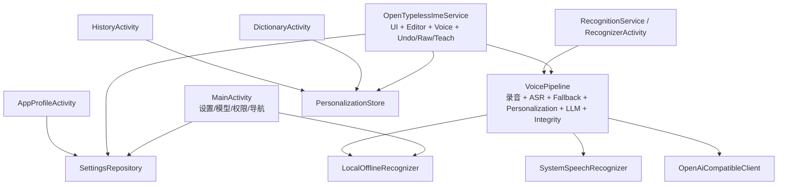
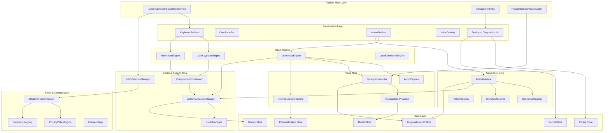
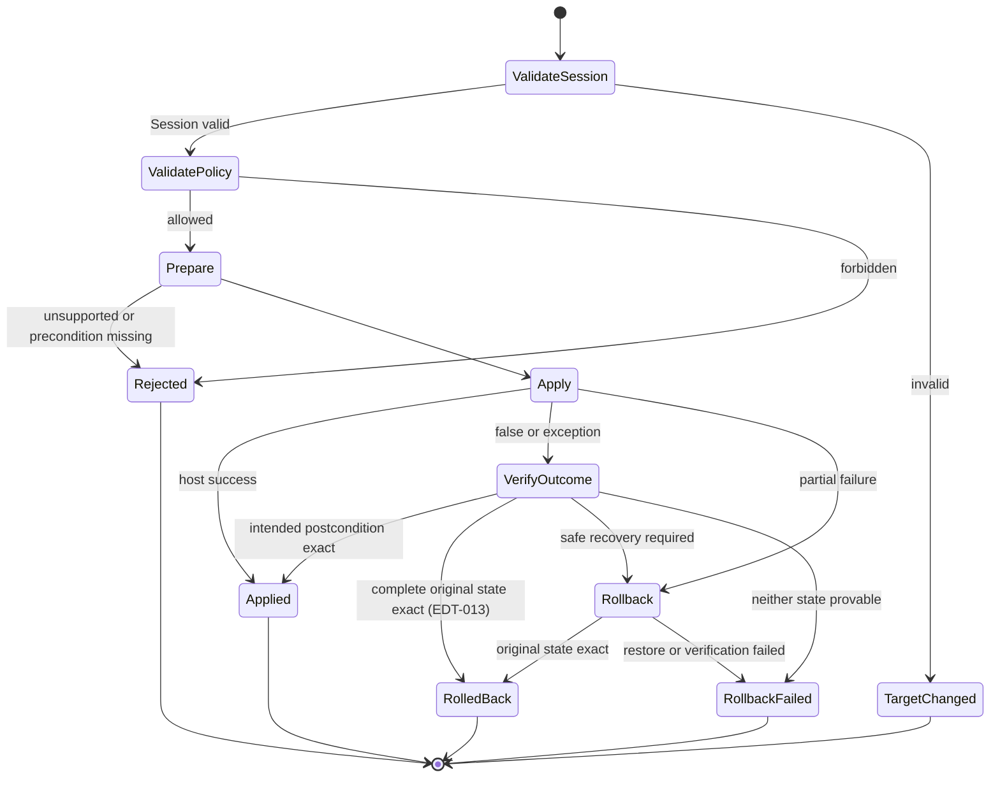
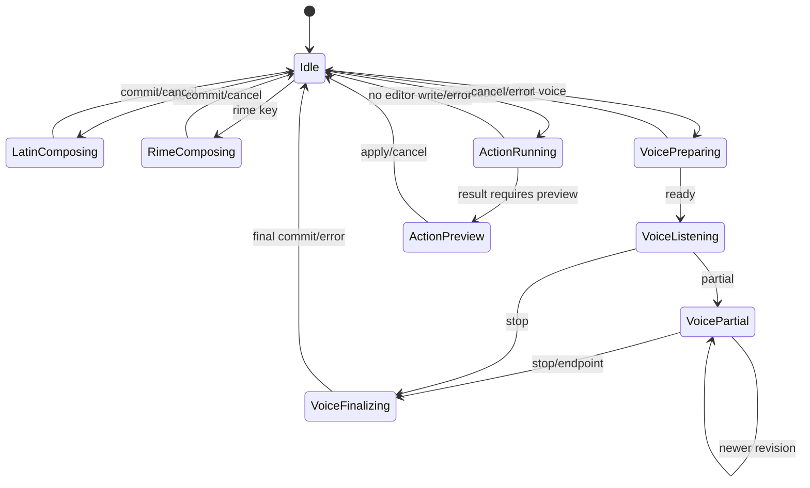
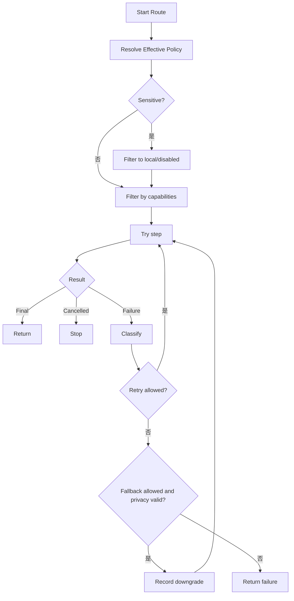
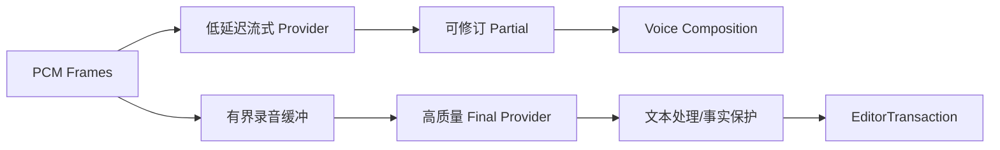
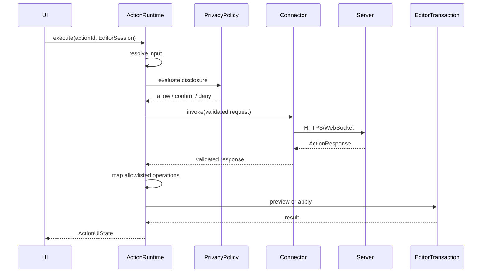

# OpenTypeless 架构与开发设计文档

> 文档版本：1.0  
> 生成日期：2026-08-12  
> 适用仓库：`dengxuezhao/opentypeless`  
> 代码基线：`main@67be488dcd2e9f36520618f9f644f97c3ec02b98`  
> 目标读者：产品负责人、Android/IME 工程师、语音与模型工程师、安全工程师、测试工程师，以及 Codex / Claude Code 等编码代理  
> 状态：**拟议目标方案（Proposed Target Architecture）**；涉及键盘底座、许可证和 Rime 集成的不可逆决策，必须先完成 ADR 技术验证

## 1. 文档目的

本文定义 OpenTypeless Android 从“语音输入层”迁移到“完整个人输入平台”的目标架构、接口边界、状态模型、数据流、线程模型、模块拆分和渐进迁移方案。

它重点解决五个系统性问题：

1. 多个输入来源并发修改同一 `InputConnection`；
2. `InputMethodService` 和 `VoicePipeline` 职责过载；
3. Provider、处理模式、App 规则和隐私配置相互耦合；
4. QWERTY/Rime、语音和动作平台无法共享统一编辑语义；
5. 大规模重构期间如何保持现有语音能力可用、可测试和可回滚。

---

## 2. 当前架构快照

### 2.1 构建与技术栈

当前 Android 子项目：

- 只有 `:app` 一个 Gradle 模块；
- `minSdk 26`、`compileSdk/targetSdk 35`；
- Java 17；
- 依赖一个固定 SHA-256 的 `sherpa-onnx-asr-1.13.4.aar`；
- 管理页面主要使用 Java 程序化 View；
- 没有建立 Kotlin Android/Compose 应用架构；
- CI 覆盖 JVM 测试、Lint、APK 构建和 API 35 Emulator Instrumentation。

### 2.2 当前主要组件



### 2.3 当前架构中的正确资产

必须保留并迁移，而不是在重写中丢失：

- editor epoch；
- App、field、选区、光标前后指纹；
- stale callback 防护；
- 录音取消令牌；
- Watchdog；
- Raw、Undo、Teach；
- 密码字段阻断；
- `IME_FLAG_NO_PERSONALIZED_LEARNING`；
- 个人规则一次性非级联应用；
- 事实完整性保护；
- API Key 与历史加密；
- Provider 响应大小、重定向和明文网络限制；
- 模型哈希和原子安装；
- RecognitionService 调用方白名单和限流。

### 2.4 当前结构性债务

#### 超级 IME Service

`OpenTypelessImeService` 同时负责：

- Android IME 生命周期；
- 视图构建；
- 模式按钮；
- 按键输入；
- 编辑目标捕获；
- 组合文字；
- 语音启动；
- 结果提交；
- Undo/Raw/Teach；
- 打开设置和 App Profile。

#### 超级 VoicePipeline

`VoicePipeline` 同时负责：

- 录音；
- 系统识别；
- 本地识别；
- 云端上传；
- 自动降级；
- 个人词典；
- 语音命令；
- LLM；
- 翻译；
- 事实校验；
- 结果构造。

#### 扁平配置

`AppSettings` 把识别后端、URL、Key、模型、语言、处理模式、LLM、翻译、个性化、历史、上下文和录音上限放在一个 Record 中。它不适合：

- 一个 Provider 被多条路线复用；
- App 只覆盖某些字段；
- 识别路线包含多个备用；
- 动作连接器独立管理；
- 跨端配置版本化。

---

## 3. 架构驱动因素

| 驱动因素 | 架构要求 |
|---|---|
| IME 是高频系统组件 | 热路径小、快、可预测，主线程无 I/O |
| 多输入来源 | 所有写入统一事务化 |
| Android 生命周期复杂 | Session 和异步任务必须代际绑定 |
| Rime 有组合态 | 必须有独立 CompositionCoordinator |
| 语音有 partial/final | 支持可修订组合和事件序列 |
| Action 是异步远端调用 | 返回后重新校验目标，不直接写入 |
| 隐私要求高 | 数据最小化、能力级授权、敏感字段硬规则 |
| 多 Provider | 能力描述、路由、错误分类、熔断和透明降级 |
| 小团队维护 | 清晰接口、垂直切片、ADR、Feature Flag |
| 跨平台 | 共享协议和领域模型，不强行共享 UI/系统适配代码 |
| 开源分发 | 许可证、模型来源、SBOM 和可复现构建 |

---

## 4. 目标架构总览



### 4.1 核心规则

> **除了 `EditorTransactionManager`，任何组件都不得调用会修改编辑器内容的 `InputConnection` 方法。**

输入引擎、语音、动作、候选和 Undo 只产生 `EditorOperation`，不能直接提交文字。

---

## 5. 分层与模块职责

### 5.1 Android Host Layer

负责：

- `InputMethodService` 生命周期；
- `EditorInfo` 和 `InputConnection` 获取；
- Window/Insets；
- 系统输入法切换；
- 权限和 Android API 适配；
- `RecognitionService` Binder 适配；
- 将 Android 回调转换为领域事件。

禁止：

- 直接实现识别路由；
- 直接访问数据库；
- 直接执行网络；
- 直接实现个性化规则；
- 在 Host 中保存复杂业务状态。

### 5.2 Presentation Layer

负责渲染：

- 键盘按键；
- Preedit；
- 候选；
- 工具栏；
- 语音波形和状态；
- 动作预览；
- 设置和诊断。

Presentation 只消费不可变 `UiState`，发送 `UiIntent`。

### 5.3 Editor & Session Core

这是整个产品的安全核心：

- 捕获输入目标；
- 维护 editor epoch；
- 生成指纹；
- 协调组合态；
- 校验操作；
- 应用编辑事务；
- 记录 Undo。

### 5.4 Input Engines

各引擎只负责把用户事件转成候选、组合和操作：

- `LatinKeyboardEngine`
- `RimeInputEngine`
- `VoiceInputEngine`
- `LocalCommandEngine`

### 5.5 Voice Core

负责：

- 音频采集；
- Provider 选择；
- partial/final 事件；
- 降级；
- 文本处理；
- 事实保护；
- 生成最终 `EditorOperation`。

### 5.6 Automation Core

负责：

- Connector；
- Action；
- Placement；
- Workflow；
- 数据披露；
- 网络调用；
- 响应验证；
- 预览；
- 将受限响应映射成 `EditorOperation`。

### 5.7 Policy & Configuration

负责在一个位置解析：

- 全局设置；
- App 规则；
- 字段规则；
- 会话临时设置；
- Provider 能力；
- 硬安全规则；
- Feature Flag。

---

## 6. EditorSession 模型

### 6.1 不可变 Session 快照

推荐 Kotlin 领域模型：

```kotlin
data class EditorSessionSnapshot(
    val epoch: Long,
    val connectionToken: Long,
    val packageName: String,
    val fieldId: Int,
    val fieldKind: FieldKind,
    val inputType: Int,
    val imeOptions: Int,
    val selection: TextRange,
    val selectedText: String,
    val beforeFingerprint: String,
    val afterFingerprint: String,
    val contextFingerprint: String,
    val learningAllowed: Boolean,
    val sensitive: Boolean,
    val capturedAtElapsedRealtimeMs: Long,
)
```

### 6.2 connectionToken

不可把 `InputConnection` 暴露给领域层。Host 为每个连接注册一个进程内 token：

```kotlin
interface InputConnectionRegistry {
    fun currentToken(): Long?
    fun resolve(token: Long): InputConnection?
}
```

领域对象只保存 token，事务执行时由 Host 解析当前连接。

### 6.3 Session 失效条件

任一条件满足即失效：

- `onStartInput` 创建了新 epoch；
- `InputConnection` 对象变化；
- 包名变化；
- fieldId 变化；
- 输入类型变化为敏感；
- 选区与原快照不匹配；
- before/after 指纹变化；
- 用户主动取消；
- IME 隐藏且策略要求取消；
- 进程恢复后没有可验证的同一连接。

### 6.4 Session 权威校验

`SessionValidator` 是纯领域比较器，不引用 Android 类型，也不使用
`EditorSessionSnapshot.equals()`。它逐字段比较 epoch、connection token、编辑器元数据、
安全状态、已知选区和 typed fingerprint；`capturedAtElapsedRealtimeMs` 与正文不参与相等性。

Host 必须在 owner/main thread 上按固定顺序完成一次同步校验：

1. 从 `EditorSessionManager` 冻结 epoch、token、authority revision、缓存元数据和选区，
   并通过同一进程内 registry 解析 exact connection identity；
2. 现场读取并复制第一次 `EditorInfo` 与 `InputConnection` authority；在任何正文读取前
   拒绝 revoked、epoch/token/connection、安全状态、元数据或未知/变化选区；
3. 非敏感目标只允许一次绑定到该 exact connection 的有界 evidence read；null、unavailable、
   超限、畸形 UTF-16 或异常统一 fail closed 为 `EVIDENCE_UNAVAILABLE`，且不保留异常文案；
4. 对双方均为敏感且 `learningAllowed=false` 的同一目标使用全空脱敏 evidence，正文 reader
   调用次数必须为零；是否允许具体操作仍由后续 policy 决定；
5. evidence 后再次现场读取 authority，并完整复核 epoch、token、identity、元数据、安全状态、
   选区和 authority revision，再调用纯领域比较器验证 selected/before/after/context fingerprint。

该双 authority + 单 evidence 流程必须捕获同一 `InputConnection` 被 OEM 重用、同一连接重新
`onStartInput`、以及选区 A→B→A。返回值为 content-free 的 `Valid` 或
`Invalid(TargetChangeReason)`，不得静默重捕获新 Session 后写入。

Host 可在成功后签发仅限 `editor.host` 包、owner-thread、一次性使用的 identity lease。
lease 不强持有 `InputConnection`，只暴露 content-free 的敏感分类，并且**不是写授权**。
EDT-007 在 `beginBatchEdit()` 后、首个 mutator 前仍必须重新执行完整 evidence/fingerprint
校验，随后同步解析 exact token 并立即写入；中间不得出现 await、回调或异步间隙。

### 6.5 允许弱校验的操作

只有显式设计的操作可以使用较弱校验，例如：

- “复制到剪贴板”不需要有效编辑目标；
- “打开结果面板”不需要写入；
- “插入当前光标”若目标变化必须重新询问用户，不能自动降级为弱校验。

---

## 7. EditorOperation 与事务

### 7.1 操作类型

```kotlin
enum class CompositionOwner {
    NONE,
    LATIN,
    RIME,
    VOICE,
    ACTION_PREVIEW,
}

enum class OperationSource {
    LATIN,
    RIME,
    VOICE,
    ACTION,
    UNDO,
    RAW_RESTORE,
}

enum class EditorAction {
    GO,
    SEARCH,
    SEND,
    NEXT,
    DONE,
    PREVIOUS,
}

enum class FingerprintDomain(val stableId: Int) {
    SELECTED_TEXT(1),
    BEFORE_CONTEXT(2),
    AFTER_CONTEXT(3),
    CONTEXT_V1(4),
    COMMITTED_TEXT(5),
}

data class TextFingerprint(
    val domain: FingerprintDomain,
    val sha256Hex: String,
)

sealed interface EditorOperation {
    val source: OperationSource

    data class SetComposition(
        val text: String,
        val owner: CompositionOwner,
        val revision: Long,
        override val source: OperationSource,
    ) : EditorOperation

    data class CommitComposition(
        val owner: CompositionOwner,
        val expectedRevision: Long,
        override val source: OperationSource,
    ) : EditorOperation

    data class InsertText(
        val text: String,
        override val source: OperationSource,
    ) : EditorOperation

    data class ReplaceSelection(
        val expectedSelection: TextRange,
        val expectedTextHash: TextFingerprint, // SELECTED_TEXT domain
        val text: String,
        override val source: OperationSource,
    ) : EditorOperation

    data class ReplaceLastCommit(
        val commitId: String,
        val expectedTextHash: TextFingerprint, // COMMITTED_TEXT domain
        val text: String,
        override val source: OperationSource,
    ) : EditorOperation

    data class DeleteBeforeCursor(
        val codePoints: Int,
        override val source: OperationSource,
    ) : EditorOperation

    data class PerformEditorAction(
        val action: EditorAction,
        override val source: OperationSource,
    ) : EditorOperation
}
```

`CommitComposition.expectedRevision` 与 owner 一起校验，防止旧 Final 在同一 owner
重新取得组合态后提交更新的组合内容。`PerformEditorAction` 只接受上述语义枚举，且只允许
LATIN/RIME 直接键盘来源；Action/Voice/Undo/Raw Restore 不能生成编辑器 Action。

明确不提供：

- 任意 KeyEvent 注入；
- 任意 Android Intent；
- 点击第三方 UI；
- Shell；
- Accessibility 操作；
- 服务器指定的 InputConnection 方法名。

### 7.2 事务结果

```kotlin
enum class TargetChangeReason {
    NO_ACTIVE_SESSION,
    SESSION_REVOKED,
    EPOCH_CHANGED,
    CONNECTION_CHANGED,
    EDITOR_METADATA_CHANGED,
    SELECTION_CHANGED,
    SELECTED_TEXT_CHANGED,
    SURROUNDING_TEXT_CHANGED,
    SECURITY_STATE_CHANGED,
    EVIDENCE_UNAVAILABLE,
}

enum class RejectionReason {
    OPERATION_NOT_SUPPORTED,
    POLICY_DENIED,
    SENSITIVE_FIELD,
    COMMIT_RECORD_UNAVAILABLE,
    COMPOSITION_OWNER_MISMATCH,
    COMPOSITION_REVISION_MISMATCH,
    EDITOR_ACTION_UNAVAILABLE,
    ROLLBACK_PRECONDITION_UNAVAILABLE,
    BATCH_EDIT_REJECTED,
}

enum class TransactionFailurePhase { APPLY, ROLLBACK }

enum class TransactionFailureStep(val phase: TransactionFailurePhase) {
    DELETE_TEXT(TransactionFailurePhase.APPLY),
    INSERT_TEXT(TransactionFailurePhase.APPLY),
    SET_COMPOSITION(TransactionFailurePhase.APPLY),
    FINISH_COMPOSITION(TransactionFailurePhase.APPLY),
    SET_SELECTION(TransactionFailurePhase.APPLY),
    PERFORM_EDITOR_ACTION(TransactionFailurePhase.APPLY),
    RESTORE_TEXT(TransactionFailurePhase.ROLLBACK),
    RESTORE_SELECTION(TransactionFailurePhase.ROLLBACK),
    RESTORE_COMPOSITION(TransactionFailurePhase.ROLLBACK),
    VERIFY_EDITOR_STATE(TransactionFailurePhase.ROLLBACK),
}

enum class TransactionFailureKind {
    EDITOR_REJECTED,
    RUNTIME_FAILURE,
    OUTCOME_UNCONFIRMED,
    TARGET_INVALIDATED,
    NOT_SAFE_TO_ATTEMPT,
}

data class TransactionFailure(
    val phase: TransactionFailurePhase,
    val step: TransactionFailureStep,
    val kind: TransactionFailureKind,
)

sealed interface EditorTransactionResult {
    data object Applied : EditorTransactionResult
    data class TargetChanged(val reason: TargetChangeReason) : EditorTransactionResult
    data class Rejected(val reason: RejectionReason) : EditorTransactionResult
    data class RolledBack(
        val originalFailure: TransactionFailure,
    ) : EditorTransactionResult
    data class RollbackFailed(
        val originalFailure: TransactionFailure,
        val rollbackFailure: TransactionFailure,
    ) : EditorTransactionResult
}
```

结果契约遵守以下不变量：

- `Applied` 是零字段成功结果，不提前依赖 EDT-010 的 `CommitRecord`；
- `TargetChanged` 只表达 Session/目标证据失效；
- `Rejected` 仅允许在尚未调用任何内容 mutator 时返回；mutator 返回 `false` 也不能单独证明“没有写入”；
- `TransactionFailure` 的 phase 必须与 step 静态匹配；`NOT_SAFE_TO_ATTEMPT` 只允许 rollback restore step；
- `RolledBack.originalFailure` 必须属于 `APPLY`，并表示原始 editor state 已完整恢复且精确验证；
- `RollbackFailed` 必须包含 `APPLY` original failure 和 `ROLLBACK` failure；
- mutator 返回 `false` 或抛异常后，若目标 postcondition 精确验证成功则为 `Applied`；只有完整原始 editor state 或经恢复后的原始状态被精确验证时才可为 `RolledBack`，两者都不能证明则为 `RollbackFailed`；
- `TransactionFailure` 不得包含正文、哈希、坐标、ID、`Throwable`、异常 message、OEM 类名或 Android capability。

EDT-007 的基础实现只有有界 selected/before/after/context fingerprint，不能用“原窗口仍匹配”
证明远端 mutator 未在窗口外产生副作用。因此该基础在 mutator 返回 `false` 或抛异常、且目标
postcondition 未成立时，即使原窗口仍匹配也必须保守返回 `RollbackFailed(OUTCOME_UNCONFIRMED)`；
不得提前声称 `RolledBack`。EDT-013 提供可恢复的完整原状态与精确恢复验证后，才允许走
`RolledBack` 分支。

EDT-010 在 `EditorTransactionResult` 外定义独立的原子 `TransactionReceipt/CommitLedger`
envelope：需要 CommitRecord 的事务必须在同一事务内生成并返回关联，禁止成功后查询可变的
“latest commit”。不生成 CommitRecord 的成功操作仍只返回零字段 `Applied`。

### 7.3 事务阶段



EDT-007 基础切片的执行契约固定为：

- 仅支持 `InsertText`、`DeleteBeforeCursor` 和 `PerformEditorAction`；其余 operation 在任何内容
  mutator 前以 `OPERATION_NOT_SUPPORTED` 拒绝；
- 全流程同步运行于 owner/main thread：先做初次完整 Session/evidence/fingerprint 校验与 policy
  校验，再从一次性 lease 获得受限的 exact `InputConnection` 使用作用域；
- `beginBatchEdit()` 成功后、首个 mutator 前再次完成同样的完整校验与 policy 校验，再从新的
  一次性 lease 同步解析并核对仍是同一 exact connection；中间没有 await、回调或异步间隙；
- 每个事务最多调用一个内容 mutator，并且只允许映射到 `commitText(text, 1)`、
  `deleteSurroundingTextInCodePoints(codePoints, 0)` 或白名单语义的 `performEditorAction(actionId)`；
- 敏感字段只允许 `LATIN`/`RIME` 本地来源，初次、二次及失败分类都不读取正文 evidence；其
  mutator 返回 `false` 或抛异常时按 `OUTCOME_UNCONFIRMED` fail closed；
- `beginBatchEdit()` 一旦成功，所有返回和异常分类路径都在 `finally` 中对原 connection 恰好
  调用一次 `endBatchEdit()`；cleanup 拒绝、异常或诊断 sink 失败均不得覆盖文本结果。

#### EDT-009 Composition primitive

EDT-009 只在同一事务管线中加入尚未接线的 `SetComposition` / `CommitComposition` primitive，
不等同于现有语音或其他 legacy composition 路径已经迁移。它遵守以下附加不变量：

- 初次完整 Session 校验成功后，才把 guard 绑定到 `(editor epoch, connection token)`；有效的
  新 session key 会清空 owner、revision、每 owner high-water 和 poison，失效目标不能借机重置；
- `SetComposition` 只允许 Idle 或当前相同 owner，revision 必须严格大于该 owner 在本 session 的
  high-water；空文本仍精确调用 `setComposingText("", 1)`，并保留逻辑 owner/revision；
- `CommitComposition` 必须命中当前活动 owner 和精确 `expectedRevision`，成功后释放活动 owner，
  但保留 per-owner high-water；活动 composition 会在 batch 前拒绝普通非 composition 写入；
- 每次 Set/Commit 仍执行初次与 begin 后的二次完整校验并核对 exact connection。Set 改变 live
  selection 后，调用方必须重新捕获 fresh snapshot 再 finish，guard 不是绕过 selection/fingerprint
  校验的授权；
- `setComposingText` / `finishComposingText` 返回 false 或抛异常时，当前切片无法精确证明远端
  composing span，因此返回原始 `SET_COMPOSITION` / `FINISH_COMPOSITION` 失败加
  `VERIFY_EDITOR_STATE(OUTCOME_UNCONFIRMED)` 的 `RollbackFailed`，并 poison 当前 session，
  不在同一 session 猜测重试；
- 敏感字段只允许 `LATIN` / `RIME` 本地 composition，完整流程（含失败分类）正文 evidence
  getter 调用为零；`VOICE` / `ACTION` 在 batch 前拒绝。

EDT-017 及后续 CMP 接线必须让同一个 `EditorSessionManager` 只持有一个长寿命
`EditorTransactionManager`；不得每次 apply 新建或并存多个实例，否则实例级 owner/high-water/poison
会分裂。Feature Flag 必须保证新旧 composition writer 互斥。EDT-009 的 revision high-water 只能
拒绝不递增结果；Final 后到达但 revision 数值更大的 late partial，仍必须由 CMP/EDT-017 的
generation 与 terminal-state gate 丢弃。

#### EDT-010 CommitRecord 与原子 receipt/ledger seam

EDT-010 不给 `EditorTransactionResult.Applied` 增加字段；它仍是零字段结果。需要关联提交证据的
调用改用同栈 `TransactionReceipt` 闭合 envelope：`Committed(Applied, CommitRecord)` 原子返回
该次事务生成的 exact record，`WithoutCommit(result)` 表示没有 record。调用方不得通过
`latestCommit`、`last`、`peek`、无参 `take/poll/current` 等可变查询在事后猜测关联。

该 seam 的契约固定为：

- `CommitRecord` 是不可变、不可序列化的进程内对象，精确携带实际 `OperationSource`、原始
  `EditorSessionSnapshot`（含原选区）、实际插入文本、Host 内部派生的
  `COMMITTED_TEXT` domain fingerprint、显式 Raw absent/present 和不透明 `commitId`；producer
  request 只能提供 Raw 的显式存在性与内容，不能伪造 source、Session、正文、fingerprint 或 ID。
  production ID 由进程 generation 前缀和 UUID 不透明 source 形成，不包含正文或正文 hash；
- 只有 `VOICE` / `ACTION` 的 eligible text transaction 可以申请 record；Host 必须在
  `beginBatchEdit()` 和唯一内容 mutator 前预留 ID。生成器异常、非法 ID、能力或前置条件不足均以
  `COMMIT_RECORD_UNAVAILABLE` 在写入前拒绝；只有最终 `Applied` 才发布 record，其他终态均不发布；
- 敏感字段永不生成 record，且 record-required 请求在分配 ID 前 fail closed。非敏感但
  `learningAllowed=false` 的事务可以在固定短生命周期内仅为 Undo/Raw 保留 record，但不得进入
  History、Feedback、Teach、Suggestion、个性化、持久化或导出；
- `CommitLedger` 是 owner-thread、process-only、固定容量一的 exact-ID 单槽。新 record 替换旧槽；
  后续无 record 的成功内容变更、目标失效、`RollbackFailed`、composition poison、start/finish/close
  lifecycle 均撤销旧槽。它不提供“最近一次提交”能力；事务执行期间若 lifecycle 重入，已生成的
  exact record 仍可随同栈 receipt 返回，但 pending lifecycle 清理必须使 ledger 槽随后为空；在
  transaction applying 或 lifecycle revoke pending 期间，exact-ID `resolve/consume` 也必须为空；
- `SetComposition` 本身始终生成零 record。首个 eligible `VOICE` / `ACTION` Set 冻结 original
  snapshot；同 owner 的成功新 partial 只更新 latest text/revision，exact final
  `CommitComposition` 才可从该 origin 与 latest partial 生成 record。Set/finish 的 false、异常或
  poison 必须清除这份 basis；empty Set 仍是合法 composition primitive，但 empty final 不得成为
  Undo/Raw record，record-required final 必须在 `finishComposingText` 前以
  `COMMIT_RECORD_UNAVAILABLE` 拒绝；
- EDT-008 已接通 package-confined 的非折叠 `ReplaceSelection` primitive，并可在成功事务的同栈
  receipt 中保留 selected origin；同一个 exact-ID Host core 也支持 selected-origin Undo/Raw，EDT-017
  随后以冻结的单 writer route 完成 production receipt/UI 接线；
- exact-ID `resolve/consume` 只是进程内身份解析，不是编辑器写授权。EDT-011/012 在 Undo/Raw 前仍须
  重新完成完整 Session、selection、context 与 `COMMITTED_TEXT` fingerprint 校验；同一个
  `EditorSessionManager` 必须拥有唯一长寿命 `EditorTransactionManager`，禁止每次 apply 新建。

#### EDT-008 safe ReplaceSelection 与 selected-origin recovery core（DONE）

EDT-008 已在既有 package-confined `EditorSessionManager.apply/applyWithReceipt` 中实现安全的非折叠
`ReplaceSelection` primitive，不新增 façade 或 framework writer。`expectedSelection` 与
`expectedTextHash` 只是 CAS 前置条件：Host 必须同时验证 operation、调用方 fresh Session observation
和 live editor evidence，不能把公开 operation、receipt 或 manager 缓存选区当作写授权。

该 primitive 固定遵守以下边界：

- 初验与 `beginBatchEdit()` 后复验都执行 live authority preflight → exact connection 上一次
  `CurrentEvidenceReader` 读取 → authority/revision postflight。evidence 同时携带 live 绝对选区、完整
  selected text 与有界 before/after；operation range、Session range、live range 以及三者的 selected-text
  fingerprint 必须全部一致。selected text 上限为 4,000 code points / 8,000 UTF-16 units，replacement
  上限为 40,000 code points / 80,000 UTF-16 units，null、截断、畸形、超限、hostile `CharSequence`、
  selection/authority ABA 或 begin 后漂移均在内容写前 fail closed；
- 正向和反向选区都保留为 CAS observation，物理锚点取 `min(start,end)`。空 replacement 仍执行一次
  `commitText("", 1)`；Insert 与 Replace 在 dispatcher 内归一到同一个既有 `commitText(text,1)` sink，
  禁止先 delete、调用 `setSelection` 或新增第二个 writer edge，compiled writer inventory 仍精确为七条；
- 敏感 Session 对所有 source 都在正文 evidence、ID、batch 和写入前拒绝。普通 `UNDO` / `RAW_RESTORE`
  source 不能借 Replace 绕过 exact-ID authority；active composition 或 poison 状态也禁止 Replace；
- `commitText` 返回 true 时沿用既有 host contract 判为 `Applied`。返回 false 或抛异常时，content-free、
  owner-bound、one-shot `ReplaceTransition` 只用于诊断 intended/original 状态，并允许 evidence bracket 内
  唯一一次 old revision → old revision + 1 且选区精确到 intended target 的延迟 callback；replay、foreign
  owner、第三选区、+2 或 ABA 均拒绝。由于有界 right context 无法从信息上证明旧 selected suffix 已被
  完整删除，false/异常路径一律保守返回 `RollbackFailed`、不发布 receipt，不把周期性 suffix 误判成功；
- 只有非敏感 `VOICE` / `ACTION` 的 true-success Replace 可发布同栈 `Committed` record，original Session
  精确保留选区方向与 selected text，inserted text 为实际 replacement。`LATIN` / `RIME` 不生成 record；
  no-learning record 仍只允许进程内短期恢复用途。
- selected-origin Undo/Raw 只接受固定单槽的 exact ID，并复用同一套 full-span、live absolute selection、
  authority-bracket proof。写入序列为 `COMMITTED` proof → 删除 inserted Final → `ORIGINAL` proof → 插入
  original selected text（Undo）或 exact record Raw（Raw Restore）→ target proof；正反向 origin 均以
  `min(start,end)` 为物理锚点，不新增 `setSelection`。两步路径只有 mutator true 且相应 target proof
  成立才允许继续或 `Applied`；未确认的第一步不会开始第二个 target 写。第二个 target 写失败后，只有
  EDT-013 先精确证明仍处于 `ORIGINAL` 才允许一次有界 Final 恢复，否则 fail closed。

EDT-008 的 package-confined core 已完成，Backlog 标记 `DONE`。EDT-017 随后以默认开启、按 session
冻结的 Feature Flag 证明新旧 writer/composition 路径互斥并接入 production；transaction route 不会在
失败后回退 legacy，从而避免 `commitText` 在未知外部 composing span 上误写。

#### EDT-011 exact-ID Undo（DONE，production migration 由 EDT-017 完成）

EDT-011 已完成 package-confined 的 exact-ID Undo primitive：
`EditorSessionManager.undoCommit(commitId, expectedCurrent, authoritySupplier, evidenceReader)` 只把请求
委托给同一个长寿命 `EditorTransactionManager`。`expectedCurrent` 只是调用方刚捕获的 CAS observation；
公开 `TransactionReceipt`、`CommitRecord`、`ReplaceLastCommit` 或普通 `EditorOperation` 都不是写授权。

该 primitive 固定遵守以下边界：

- 首先按 exact commit ID 从固定单槽解析候选；候选必须来自非敏感 `VOICE` / `ACTION`，插入正文非空，
  original selection 与 selected text 结构一致。折叠 origin 使用单次 code-point delete；非折叠 origin
  使用 EDT-008 的 two-stage selected recovery，目标正文只取自 exact record；
- 每轮证明都以 live authority preflight 开始，只允许 `UndoEvidenceReader` 在 exact registry-owned
  connection 上读取一次 selected/before/after，再完成 live authority 与 authority revision postflight。
  committed proof 会读取完整已提交 suffix（最多 40,000 code points / 80,000 UTF-16 units）及最多
  800 UTF-16 units 的有界上下文，验证整个 `COMMITTED_TEXT` fingerprint，并在剥离 suffix 后复核
  original before/after/context；初验与 `beginBatchEdit()` 后、首 mutator 前各执行一轮；
- 所有物理写仍只经 dispatcher。折叠 origin 使用
  `DeleteBeforeCursor(insertedText.codePointCount, UNDO)`；selected origin 删除 inserted Final 后，仅在
  exact `ORIGINAL` proof 成立时插入 original selected text，并验证 `UNDO` target。普通 `apply()` 明确
  拒绝 `UNDO` source 和 caller-constructed `ReplaceLastCommit`，不能绕过 exact-ID ledger 与全文证明；
- begin false/异常在零内容写时返回 `BATCH_EDIT_REJECTED` 并保留 record；target/session/evidence 在已命中
  exact record 后变化会 `TargetChanged` 并撤销槽。折叠单 delete 的 false/异常只有在第三轮完整证明
  original intended state时才可 `Applied`；selected two-stage 的第一步 false/异常不得开始 target insert，
  第二步失败也不得重试 target。EDT-013 仅在精确 `ORIGINAL` basis 上允许一次 Final 恢复；其余 outcome
  返回 content-free `RollbackFailed`、撤销槽且禁止破坏性重试；end cleanup 失败不覆盖已经确定的结果；
- 敏感字段理论上不能产生 record，安全状态变化在正文 getter 前拒绝。`learningAllowed=false` 的非敏感
  record 仍可用于进程内短期 Undo，但不得进入 History、Feedback、Teach、Suggestion、持久化或导出。

EDT-017 已完成 production migration：default-on transaction route 的 voice Final 在同一调用栈取得
exact commit ID，UI Undo 只经 public narrow façade 调用上述 primitive；legacy LastVoiceCommit/
SessionUndoLedger 只存在于一次 session capture 时冻结的 rollback route，transaction failure 不会回退。
因此 EDT-011 标记 `DONE`。

#### EDT-012 exact-ID Raw Restore（DONE，production migration 由 EDT-017 完成）

EDT-012 已完成 package-confined 的 exact-ID Raw Restore primitive：
`EditorSessionManager.restoreRawCommit(commitId, expectedCurrent, authoritySupplier, evidenceReader)` 只把
请求委托给同一个长寿命 `EditorTransactionManager`。唯一授权是固定单槽中的 opaque exact commit ID；
公开 receipt、record、operation 或调用方提供的文本都不能授权 Raw 写入，普通 `apply()` 也明确拒绝
`RAW_RESTORE` source。

该 primitive 固定遵守以下边界：

- 候选只能是非敏感 `VOICE` record，Final 非空、Raw 显式存在且与 Final 不同，original selection 与
  selected text 结构一致。Raw absent/相同、`ACTION` 或结构不合法在 batch 前拒绝且保留 exact slot；
  foreign ID 不读正文、不写入，也不误清另一 record。非折叠 origin 复用 EDT-008 selected recovery；
- 每轮 proof 都在 live authority pre/post bracket 内，从 exact registry-owned connection 一次读取
  selected/before/after，并要求 live **绝对选区**与该次已证明的物理状态一致，不能把 manager 缓存坐标
  当作后续写入起点。Final 与 Raw 均按完整 span 证明，单段上限为 40,000 code points / 80,000
  UTF-16 units，另带最多 800 UTF-16 units 的有界上下文；
- 写入序列固定为：初次 `COMMITTED` proof，`beginBatchEdit()` 后、首 mutator 前第二次 `COMMITTED`
  proof，删除完整 Final，证明精确 `ORIGINAL` 状态后才插入 Raw，最后证明精确 `RAW` 终态。
  每个 target 步骤都要求 mutator true 与相应 live proof 同时成立；第一步 false/异常不得触发 Raw 写，
  第二步失败也不得重试 Raw。该保守边界避免重复/周期性文本在只改变选区时伪造完整替换；
- 两个物理 mutator 都复用 `EditorTransactionManager` 既有 dispatcher，因此 compiled writer
  inventory 仍精确为七条 edge。删除后若不能证明 `ORIGINAL`，绝不继续插入；Raw insert 未得到 true
  ack 与完整 proof 时进入 EDT-013：只有再次精确证明 `ORIGINAL` 才允许一次 Final 恢复；
- `Applied` consume exact slot；命中后的 `TargetChanged`、lifecycle revoke 或不确定 outcome 撤销 slot；
  结构性拒绝与零内容写的 begin 拒绝保留 slot。敏感状态在正文 getter 前 fail closed，正文 evidence
  调用为零；`learningAllowed=false` 的非敏感 record 只允许进程内短期 Raw 恢复，不得进入 History、
  Feedback、Teach、Suggestion、个性化、持久化或导出。

EDT-017 已完成 production migration：default-on transaction route 的 Raw 按钮只携带同栈 receipt
派生的 opaque commit ID，并经 public narrow façade 调用上述 primitive；成功后消费原 capability，不伪造
successor record。legacy Raw writer 只存在于冻结的 rollback route，transaction failure 不会回退。因此
EDT-012 标记 `DONE`。

#### EDT-013 verified transaction rollback path（DONE Host core）

EDT-013 已在 exact-ID selected-origin Undo 与 Raw Restore 的第二个 target 写入失败后加入一次有界、可证明
的恢复路径。恢复目标不是调用方提供的正文，而是同一 exact `CommitRecord` 中的 committed Final；恢复后
的 selection 必须是该事务开始前已证明的 collapsed committed cursor。该路径不改变普通 Replace、折叠
单 delete、composition 或 legacy service 的 outcome 语义。

恢复固定遵守以下边界：

- target insert 返回 false、抛异常、true-no-op 或写入错误正文后，必须先消费 owner-bound、one-shot 的
  `ORIGINAL → ORIGINAL` proof；它重新绑定 owner thread、epoch、connection token、authority revision、
  exact connection、live absolute selection、完整正文关系与 original context。proof 失败、lifecycle
  变化或 connection 漂移时不执行恢复，并返回
  `RollbackFailed(ROLLBACK/RESTORE_TEXT/NOT_SAFE_TO_ATTEMPT)`；
- 只有 safe basis 成立才构造 `ORIGINAL → COMMITTED` transition，并经既有
  `invokeMutator(InputConnection, InsertText)` 对 exact connection 写回 ledger-bound Final。该 restore
  mutator **必须返回 true**，且随后完整 `COMMITTED` proof 也必须成立，才返回
  `RolledBack(original APPLY failure)`；framework boolean 本身不是恢复证明；
- restore 返回 false/异常分别分类为 `ROLLBACK/RESTORE_TEXT/EDITOR_REJECTED|RUNTIME_FAILURE`；返回 true
  但最终状态无法确认或目标失效时分类为
  `ROLLBACK/VERIFY_EDITOR_STATE/OUTCOME_UNCONFIRMED|TARGET_INVALIDATED`。这些路径一律
  `RollbackFailed`，不得声称文本已恢复；
- `RolledBack` 保留同一 exact ledger record，使用户可在仍然相同的 Session/文本上显式重试；
  `RollbackFailed`、TargetChanged 或 lifecycle revoke 撤销槽。恢复不生成新 receipt/record，不进入
  History、Feedback、Teach、Suggestion、持久化或导出；敏感目标仍不产生 record 或正文 evidence；
- 回滚与 target 写入位于原 balanced batch 中，`endBatchEdit()` cleanup 失败不覆盖已确定结果。恢复复用
  已有唯一 `commitText` sink，不新增 `setSelection` 或第八条 framework writer edge。compiled gate 精确
  锁定 7 条 `prepareRawTransition`、5 条 `validateRawTransitionState` 和唯一由
  `restoreCommittedAndClassify` 构造的 `RolledBack`。

因此 EDT-013 的 package-confined rollback core 标记 `DONE`；EDT-017 随后完成了 EDT-011/012 的
production receipt/UI 接线与新旧 writer 互斥。本状态仍不等于小米真机 Instrumentation 已执行。

#### EDT-014 content-free transaction audit envelope（DONE）

EDT-014 在不修改 EDT-004 七种 `EditorOperation` 构造契约的前提下，为每个取得稳定
`EditorTransactionResult` 的事务生成一次不可变 `EditorTransactionAudit`。envelope 精确包含：

- 原 operation 的六值 `OperationSource`；
- 闭合七值 `EditorOperationKind`，分别映射 Set/Commit Composition、Insert、Replace Selection、
  Replace Last Commit、Delete 与 Editor Action；
- 与调用方收到的同一 `EditorTransactionResult` 对象。

envelope 不含 operation payload、正文、raw、Session、selection、fingerprint、commit ID、receipt、
timestamp、Android capability、Throwable 或执行回调，也不可序列化。它只用于诊断观察，绝不是 Undo、
Raw Restore 或任意编辑写入的授权。

审计投递由 exact `EditorTransactionManager` 私有完成：普通 `apply/applyWithReceipt`、exact-ID Undo 和
Raw Restore 的所有稳定结果路径均在返回前恰好投递一次；程序员错误、off-owner 或 reentrant 调用在形成
稳定 result 前 fail fast，不伪造审计终态。package-confined `AuditSink` 只有
`record(EditorTransactionAudit)` 一个方法；sink 抛出的 `RuntimeException` 被隔离，不能覆盖文本结果、
receipt 或 ledger 语义。sink 内重入事务仍被原 `applying` guard 拒绝，不能产生第二次写入或第二条审计。

当前 production 默认 sink 为 no-op：EDT-014 只交付进程内 envelope 与 exact Host 投递边界，不新增日志、
持久化、网络、权限、组件、UI 或诊断导出；这些能力必须等待 DIA 任务并重新审查 retention/redaction。
source 与 compiled gate 锁定模型/enum 精确形状、唯一构造者、唯一 sink caller、七种 kind 映射及
Debug/Release 精确调用边；framework writer inventory 仍为七条。

#### EDT-015 fail-closed editor writer gate（DONE）

EDT-015 把“所有编辑器写入必须经过 `EditorOperation` 与 exact `EditorTransactionManager`”固化为相互独立的
source 与 compiled 双门禁。source gate 扫描 production Java/Kotlin source set，拒绝新增 writer 调用、
method reference、反射/方法句柄入口、capability 持有与未登记 owner；compiled gate 对 Debug/Release 的
PROJECT/ALL class universe 做 bytecode、调用图和 capability-flow 审计，覆盖生成代码、Kotlin、类型擦除、
wrapper、lambda 与 source scanner 看不到的调用形态。任一层分析失败或产物缺失都 fail closed。

writer sink 除 `InputConnection` 的正文、composition、selection、action 与 batch mutator 外，还包括
`InputMethodService` 会间接写当前 editor 的 helper：`finishConnectionlessStylusHandwriting`、
`finishStylusHandwriting`、`onExtractedCursorMovement`、`onExtractedSelectionChanged`、
`onExtractTextContextMenuItem`、`sendDefaultEditorAction`、`sendDownUpKeyEvents` 与 `sendKeyChar`。这些 helper
不能通过继承、裸调用或 method reference 绕开 owner rule。transaction writer 的 framework inventory 仍
精确为七条；本任务没有新增 runtime 写边。

现有 transitional legacy writers 由 source/compiled exact inventory 登记，只允许在 EDT-016/017 迁移时
收缩，任何新增、owner/descriptor/opcode/count 漂移都失败。CI 另有只读 self-gate，验证 workflow 直接执行
门禁、`scripts/verify_android.sh` 保持 `set -euo pipefail` 与 strict dependency verification、source scan、
compiled `:architecture-gate:check`、Debug/Release exports 及 Gradle `check` 依赖均不可降级。EDT-015 因此
完成“禁止新增非事务写入”，但不把尚未迁移的 legacy 普通按键或语音路径误报为已经移除。

#### EDT-016 ordinary-key transaction migration（DONE）

EDT-016 将当前最小键盘的空格、标点、删除与回车从 `OpenTypelessImeService` 的直接 editor writer
迁入同一个 manager-owned `EditorTransactionManager`。Service 只实现字段为零的窄
`EditorSessionManager.KeyboardHost`，同步提供当前 `EditorInfo` 与 `InputConnection`；三个公开 façade
`insertKeyboardText`、`deleteKeyboardBackward`、`performKeyboardEnter` 均先接收 fresh
`EditorSessionSnapshot`，再在同一调用栈内完成 live authority / evidence 双重验证。Host capability 不被保存、
返回或传给 Provider、Action、UI、Rime 或第三方。

所有普通键生成 `OperationSource.LATIN` operation：折叠选区的文本、空格、标点使用 `InsertText`，非折叠
选区使用带 exact range 与 selected-text fingerprint 的 `ReplaceSelection`；删除在折叠选区使用
`DeleteBeforeCursor(1)`，在非折叠选区使用空文本 `ReplaceSelection`。回车只把 `imeOptions` 中 GO、SEARCH、
SEND、NEXT、DONE、PREVIOUS 映射为 `PerformEditorAction`；无 allowlisted action 或带
`IME_FLAG_NO_ENTER_ACTION` 时插入换行。迁移路径不再使用 `KeyEvent`、`sendKeyEvent`、
`sendDefaultEditorAction` 或 direct `InputConnection` fallback。

普通字段每轮 evidence 在 exact connection 上用两次一致的 absolute selection observation 包围一次
selected/before/after 读取；selection、epoch、token、metadata、authority revision 或正文 fingerprint 变化均在
写前 fail closed。敏感折叠字段继续走零正文 evidence 的 local LATIN 路径；敏感非折叠 Replace 在 ID、
正文读取和 batch 前拒绝。已知 legacy voice/composition 活动时普通键也拒绝，不能与旧 writer 双写。

Insert 与 Replace 共用既有唯一 `commitText` sink，delete/action/batch 也复用既有 dispatcher；exact ETM
framework writer inventory 仍为七条。source/compiled legacy inventory 已只收缩普通键的 direct
commit/delete/action/KeyEvent 边；voice partial/final、Undo/Raw 与 composition writer 随后由 EDT-017 在
Feature Flag 新旧互斥后迁移。EDT-016 本身不实现完整 QWERTY/Rime、语音提交、Undo/Raw UI 或
selected-origin 新接线，也不把 API 36 emulator 结果冒充小米真机执行。

#### EDT-017 Voice partial/final transaction migration（DONE）

EDT-017 将 V1 `VoiceCompositionSession` 与 SpeechCore V2 `EditorProjection` 的 production editor delivery
收敛到同一个、由当前 `EditorSessionManager` 长期持有的 `EditorTransactionManager`。独立的
`VoiceEditorTransactionConfig` 默认开启 transaction writer，并且只在 voice target capture 时读取一次；
一次 session 要么完整走 transaction route，要么完整走 legacy rollback route。partial、Final、Undo 或 Raw
任一 transaction 失败都不能回退到另一 writer，Feature Flag 也不能关闭敏感字段、Session 或 evidence
硬规则。

transaction route 的 `CommitTarget` 不持有 `InputConnection`；package-confined
`VoiceTransactionSession` 只保存正 generation、严格递增 provider sequence/revision、fresh
`EditorSessionSnapshot`、bounded expected selection 与当前 composition 文本。它在 terminal callback 排队前
先置终态，因此 Final 后到达、即使 sequence/revision 数值更大的 partial 也被丢弃。V1/V2 callback 在 editor
delivery 之前汇合：折叠选区 partial 只经 `setVoiceComposition`，非折叠选区在 Final 前始终只作 UI preview；
processed Final 与最后 partial 不同时，先执行新 revision 的 Set，重新捕获 fresh snapshot，再执行
`commitVoiceComposition`。无 partial 或 selected Final 直接经 `commitVoiceText` 生成 Insert/Replace operation。

Service 只实现已有字段为零的 `KeyboardHost`，通过六个 exact façade 调用 manager：Set/Commit/Finish
composition、final text receipt、exact-ID Undo 与 exact-ID Raw Restore。成功 Final 的同栈
`TransactionReceipt.Committed` 只抽取 immutable metadata 与 opaque commit ID；不保存 receipt、record 或
editor capability，也不事后 seed ledger。Undo/Raw 按钮随后使用 fresh live snapshot 与 exact ID 调用 EDT-011/
012；Applied 单次消费，TargetChanged/RollbackFailed 撤销，Raw 成功不伪造 successor record。由此 EDT-011
与 EDT-012 的 production/UI migration 一并完成。

cancel、输入生命周期结束、window hidden 与 detached final 都先使 session terminal。可证明的 composing
draft 经 `finishVoiceComposition` 封存；显式取消使用空 Set + fresh recapture + Finish；无法证明的正文只进入
有界 recoverable draft，不写入新 editor。source/compiled gate 锁定六 façade shape/caller、十条 production
service edge、default-on 同步 Flag、capability-free session、partial/final early return 与互斥 session
construction；永久 ETM framework writer inventory 仍精确为七条。legacy writer 类只保留在冻结的 rollback
分支，不能与 transaction writer 在同一 voice session 双写。CompositionCoordinator 的全局抢占策略仍属于
CMP-004，不在 EDT-017 内夹带实现。

### 7.4 Batch Edit

有多个相关操作时：

```kotlin
connection.beginBatchEdit()
try {
    // validate and apply
} finally {
    connection.endBatchEdit()
}
```

但 `beginBatchEdit()` 不等于事务。仍需自己记录原选区、原文本和回滚路径。
`beginBatchEdit()` 在任何内容 mutator 前拒绝可分类为 `BATCH_EDIT_REJECTED`；
`endBatchEdit()` 失败只进入独立、无正文的 cleanup 诊断，不得覆盖已经确定的文本结果，
也不得触发新的猜测性回滚。

---

## 8. CompositionCoordinator

### 8.1 组合所有权

同一时刻只有一个组件可以拥有可写组合态。复用 7.1 已定义的
`CompositionOwner`；CMP-001 已在它周围冻结不可变、非序列化且不依赖 Android 的 sealed
`CompositionState`，不再另建 owner 类型。调用方不能传入 owner；每个 variant 的 `owner()`
由类型固定，因此 owner 与阶段不一致或“一个状态含两个 owner”都不可构造：

| `CompositionState` variant | 固定 owner | 精确状态字段与不变量 |
|---|---|---|
| `Idle` | `NONE` | 无 record 字段；`coordinationGeneration()` 固定为 `0` |
| `LatinComposing` | `LATIN` | `coordinationGeneration > 0`，`revision > 0` |
| `RimeComposing` | `RIME` | `coordinationGeneration > 0`，`revision > 0` |
| `VoicePreparing` | `VOICE` | `coordinationGeneration > 0` |
| `VoiceListening` | `VOICE` | `coordinationGeneration > 0` |
| `VoicePartial` | `VOICE` | `coordinationGeneration > 0`，`revision > 0` |
| `VoiceFinalizing` | `VOICE` | `coordinationGeneration > 0`，`latestRevision >= 0`；`0` 表示尚无 partial |
| `ActionRunning` | `NONE` | `coordinationGeneration > 0`；动作尚未持有可写 preview composition |
| `ActionPreview` | `ACTION_PREVIEW` | `coordinationGeneration > 0` |

模型不携带正文、Session snapshot、选区或 hash。`NONE` 不等于只能是 Idle：运行中但尚未产生
可写预览的 `ActionRunning` 也是 `NONE`，并通过正 generation 与 Idle 区分。Action 也不借用
EDT-009 composition revision。

### 8.2 状态机



CMP-002 以进程内、无正文的 `CompositionCoordinator` 实现上述九个状态的完整转移机制。
所有公开变更都是同步的 exact compare-and-set：调用方必须回传该 Coordinator 签发的同一
`Observation` 对象。`Observation.state/version/phase` 只供诊断，不是可重建的授权；对象身份与
签发者一起防止 `Idle -> active -> Idle` 后的 ABA 旧回调获得新一代。外来 observation 被分类为
`REJECTED_OBSERVATION`，本机旧 token 为 `IGNORED_STALE`；不允许仅根据可读的 state/version 伪造权限。

Coordinator 仅接受闭合的 `Latin(revision)`、`Rime(revision)`、`Voice`、`Action` 申请。精确且稳定的
Idle observation 才能申请新的正 generation；后续 generation 只单调增长且绝不回绕。转移规则如下：

- Latin/Rime 只接受严格更大的 revision，精确 revision 提交后回到 Idle；
- Voice 依次为 Preparing -> Listening -> Partial -> Finalizing -> Idle，Listening 无 partial 时
  `latestRevision=0`，Finalizing 拒绝迟到 partial；
- Action 从不持有可写 owner 的 Running 进入 `ACTION_PREVIEW` 的 Preview，两者均可完成回 Idle；
- 任一精确 active observation 都可取消，精确 Idle 取消为幂等 duplicate；非 owner、非法阶段、
  revision 逆序、active 重复申请和 generation/version 耗尽均返回稳定分类且不改变 observation。

抢占不伪装成“释放编辑器 + 发布新 owner”的单次原子操作，而是显式的 two-phase proof handshake：

1. `beginPreempt(expected, directive, acquisition)` 验证精确 active observation、新 generation/version 容量与
   phase 指令白名单；成功后只保留 generation，不消耗也不发布新状态，并签发不透明
   `PreemptTicket`。
2. observation 进入 `PREEMPT_PENDING` 后封闭失败：所有普通转移和第二次抢占都被拒绝。只有
   CMP-004 的唯一 ETM bridge 能作为外部释放与证明的信任边界；Coordinator 本身不持有
   `InputConnection`、Editor operation 或任何写能力。
3. `finishPreempt(ticket, resolution)` 只接受同一 Coordinator 当前 pending 的同一 ticket，映射规则固定：

| `ReleaseResolution` | Coordinator 结果 |
|---|---|
| `PROVEN_RELEASED` | 消耗保留的 generation，发布新申请的初始状态 |
| `PROVEN_UNCHANGED` | 以新 observation/version 恢复旧逻辑状态，不消耗保留的 generation |
| `UNCERTAIN` | 保留原 ticket 和 pending observation，永不自动解锁；只能等同 ticket 给出确证，或在已证明旧 editor lifecycle/session 不可再写且整体撤销该 Coordinator 后，由 CMP-004 定义恢复；不得仅因 timeout 重建 |

`COMMIT_CURRENT` 只允许 Latin/Rime、已有 partial 的 VoicePartial/VoiceFinalizing 和 ActionPreview；
`CANCEL_CURRENT` 允许所有非 Idle 阶段。指令选择属于 CMP-003 策略，CMP-002 只实现这个机制
白名单；CMP-004 才负责将证明对接唯一 `EditorTransactionManager`。`Observation` 和 ticket 都不是编辑
授权、不序列化、不携带正文/Session snapshot/hash，也不能替代 CMP-004 的目标完整性验证。

### 8.3 组合冲突策略（CMP-003 DONE）

CMP-003 用不可变、无正文的 `CompositionConflictPolicy` 冻结三项可配置选择：
`RimeToVoice`、`VoicePartialToKeyboard` 与 `ActionToVoice`。默认值优先保留用户已经看到或输入的内容：
Rime 先提交、Voice visible partial 先提交、被语音打断的 Action 结果保留到结果面板。策略不是多个松散
Boolean，也不包含 Session、正文、hash、Android capability 或序列化契约。

| 当前状态 | 新请求 | 默认 `Decision` | 可配置替代 |
|---|---|---|---|
| `RimeComposing` | 开始语音 | `COMMIT_CURRENT` | `CANCEL_CURRENT` |
| `LatinComposing` | 开始语音 | `COMMIT_CURRENT` | 固定，不丢可见 Latin composition |
| `VoicePreparing` / `VoiceListening` | 键盘按键 | `CANCEL_CURRENT` | 无 visible partial，固定取消 |
| `VoicePartial` | 键盘按键 | `COMMIT_CURRENT` | `CANCEL_CURRENT` |
| `VoiceFinalizing(latestRevision > 0)` | 键盘按键 | `COMMIT_CURRENT` | `CANCEL_CURRENT` |
| `VoiceFinalizing(latestRevision = 0)` | 键盘按键 | `CANCEL_CURRENT` | 固定，无 partial 可提交 |
| `ActionRunning` / `ActionPreview` | 开始语音 | `CANCEL_CURRENT_AND_ROUTE_RESULT` | `CANCEL_CURRENT`（丢弃 displaced result） |
| `LatinComposing` / `RimeComposing` | 开始 Action | `COMMIT_CURRENT` | 固定；提交后必须重新捕获 Session |
| 敏感字段 | 云端语音/动作 | PrivacyPolicy 拒绝 | 不属于可放宽的冲突配置 |

四个 `Decision` 只组合 CMP-002 已有的 `COMMIT_CURRENT` / `CANCEL_CURRENT` 与“displaced result 是否只进
结果面板”元数据。它们不是 release proof 或 editor authority；CMP-004 仍须通过唯一 ETM bridge 执行物理
release，并把 typed result 映射为 `PROVEN_RELEASED`、`PROVEN_UNCHANGED` 或 `UNCERTAIN`。任何异常、
潜在写入或无法证明的结果都不能因策略偏好而升级为成功。

### 8.4 当前 Voice composition 接线（CMP-004 DONE）

CMP-004 已把 EDT-017 默认 transaction writer 的当前 Voice session 接到单一
`CompositionCoordinator`。`OpenTypelessImeService` 在一次 Service 生命周期内只持有一个 `private final`
Coordinator；只有 capability-free 的 `VoiceTransactionSession` 保存该 Coordinator 签发的 exact
`Observation`，Provider、`VoicePipeline.Listener`、UI 与 editor adapter 都不能持有或调用 Coordinator。
旧 rollback flag 路径与 transaction 路径仍按 EDT-017 在 session capture 时互斥，旧 writer 不参与新
Coordinator，也不得在 transaction 失败后接管。

Voice 状态与物理写入顺序固定如下：

1. 录音启动前必须用 exact Idle observation 申请 `Acquisition.Voice`；冲突、foreign/stale observation 或
   generation/version 耗尽会在创建 transaction session 前 fail closed，不启动第二个 writer；
2. `onReadyForSpeech` 把 exact `VoicePreparing` 推进到 `VoiceListening`。partial 只有在 ready、同一 voice
   generation、未 terminal、provider sequence 严格递增时，才先以同一 observation 发布严格递增的
   `VoicePartial(revision)`，随后调用唯一 Manager/ETM `SetComposition`；任一步失败都终止该 Voice session；
3. terminal callback 先用独立原子门丢弃所有已排队或更大 revision 的 late partial。主线程把最后文本对齐
   到相同 composition owner 后才进入 `VoiceFinalizing`；同栈 receipt 为 `Committed` 时，才以 exact
   observation `complete` 到 Idle；
4. 显式取消或错误先清理/finish exact ETM composition。只有 typed `Applied` 证明物理 composition 已提交
   或取消时，才调用 `complete/cancel` 发布 Idle。拒绝、异常、`RollbackFailed` 或 cleanup 不确定时保留
   VOICE owner，禁止下一次 acquire；只有 editor lifecycle 已撤销旧 Manager lease、旧 connection 不再可写
   后，才能执行 lifecycle release 并丢弃旧 session。

该接线没有把 `Observation`、Coordinator state 或 framework boolean 当成 editor authority；Session、选区、
fingerprint、connection identity 与正文结果仍全部由 EDT-007..017 的 Manager/ETM proof 决定。source 与
compiled gate 锁定唯一 Service-owned Coordinator、唯一 Voice session bridge、exact acquire/ready/partial/
final/release 调用边，并继续确认 ETM framework writer inventory 精确为七条。

CMP-004 只完成“当前 Voice 直接从 Idle 获得并释放 owner”的生产接线。输入框隐藏/锁屏等统一录音取消属于
CMP-006；Rime/Action 抢占接线属于各自后续任务。

### 8.5 键盘打断 Voice composition（CMP-005 DONE）

默认 transaction Voice route 现在允许具体内容键在语音会话中保持可用，但不会直接越过 VOICE owner 写入。
每次键盘事件先在同一 `VoiceTransactionSession` 冻结一次 `CompositionConflictPolicy.Decision`，以 exact
`Observation` 调用 `beginPreempt(..., Acquisition.Latin(1))`。Preparing/Listening 没有可见正文时取消 Voice；
`VoicePartial` 按冻结配置提交可见 partial 或以一次严格递增 revision 清空并 finish；等待 Final 时沿用同一选择，
同时把按键视为用户明确取消迟到 Final，不再生成阻塞下一次录音的可恢复草稿，也不写回已被键盘接管的 editor。

物理 release 仍只经 Manager/ETM：提交路径调用 `finishVoiceComposition`；取消路径执行
`setVoiceComposition("", nextRevision)`，重新捕获 fresh Session 后再 `finishVoiceComposition`。只有 typed
`Applied` 才映射为 `PROVEN_RELEASED` 并发布 LATIN owner；确定零写的拒绝可映射
`PROVEN_UNCHANGED`，异常、潜在副作用、捕获失败或 cleanup 不确定一律 `UNCERTAIN`，保持 preempt pending 并
拒绝当前键。pending 只有在 editor lifecycle 已撤销旧 lease 后才能安全终止，不会 fallback 到 legacy writer。

release 成功后才重新捕获 Session 并执行一次既有键盘 Manager façade。键写入 `Applied` 时以 LATIN revision 1
提交到 Idle；键写入失败则取消 LATIN owner，同样不重复发送。Voice session 在 preempt 开始时即 terminal，
provider late partial 与迟到 Final 全部拒绝。因此成功键不丢失、不双写，失败键有显式本地错误且不会偷偷写入旧目标。

恢复草稿与受保护录音仍可从“⋮”显式恢复，但不再占据主状态或禁用按键/麦克风。用户主动开始下一次录音时，
该动作视为用新录音替换旧恢复项；显式选择“插入”或“放弃”均单次执行，不再增加二次确认。

`KeyboardPreemption` 只保存 owner identity、opaque ticket、content-free decision 与两个布尔状态，不持有正文、
Session、`InputConnection`、receipt 或 CommitRecord；其 `toString()` 脱敏。source/compiled gate 锁定精确 shape、
caller、两阶段 edge 与 Debug/Release 调用次数，ETM framework writer inventory 仍精确七条。本任务采用 CMP-003
默认配置；设置持久化/UI 与 Rime/Action 抢占分别留给 CFG/UI 和后续 RIM/ACT 任务。

### 8.6 输入框生命周期统一取消（CMP-006 DONE）

`OpenTypelessImeService` 现在把 `onStartInput`、`onFinishInput`、`onFinishInputView`、`onWindowHidden`、
`onDestroy` 与 `ACTION_SCREEN_OFF` 收敛到同一个 cancel-only 边界。边界先把 active/detached target 原子标记为
terminal 并从 Service 槽移除，再调用唯一 `VoiceController.cancel()`；它不调用 `stop()` 等待后台 Final，也不保留
已销毁 Service 的 deferred-finalization gate。route/state/ready/transcript/result/error 回调只有在 target 仍是
当前对象且未 terminal 时才可进入主线程，因此 lifecycle 之后排队到达的 partial、Final 或 error 全部丢弃。

屏幕熄灭监听由动态、non-exported `BroadcastReceiver` 完成；API 33+ 显式使用
`Context.RECEIVER_NOT_EXPORTED`，旧 API 使用兼容注册。注册失败时 Voice 启动 fail closed，不会在缺失锁屏
保护时继续录音；`onDestroy` 恰好注销并立即关闭资源。取消前只允许从非敏感、非选区的已验证 partial 保存既有
加密可恢复草稿，随后清理 transaction/legacy/V2 composition 并在 editor lifecycle 已撤销后释放旧 owner。
若 screen-off、finish view 或 window hidden 时无法证明 composition 已清理，Service 保留一个 fail-closed
restart guard 与未释放的 transaction owner；后续 clean cancel 也不能自行清除此 guard，只有真实
`onStartInput/onFinishInput` 完成 editor-session 轮换后才可重新启动 Voice。
该切片不增加权限、manifest component、网络、正文日志或 editor writer edge，ETM framework inventory 仍为
七条。

source/compiled gate 锁定 receiver 字段与 `onReceive` shape、五个 lifecycle callsite、构造器 method-reference、
register/unregister/cancel 精确边，并拒绝 `stopPipelinePreservingDraft` 或旧 deferred Final 重新进入 lifecycle。
真实系统 IME 锁屏录音 E2E 仍需后续 TST-002/TST-010 设备矩阵；CMP-006 的当前切片证明的是 production
cancel wiring、迟到回调隔离和 Android Runtime receiver 行为。

### 8.7 Voice session 控制边界（VOC-001 DONE）

`VoiceController` 现作为旧语音实现外的稳定、data-only 会话控制面，只公开
`start(DictationRequest, Events)`、`stop()`、`cancel()`、`state()` 与事件回调。当前兼容状态仍精确为
`IDLE / RECORDING / TRANSCRIBING / POLISHING`；Preparing/Listening/Partial/Finalizing/Processing/Error 的
本地化领域模型留给 VOC-009，调用方不得把当前英文内部 message 当稳定错误协议。

`VoicePipelineAdapter` 是旧 `VoicePipeline.start/stopRecording/cancel/state` 四个核心方法的唯一生产调用者，
并逐项转发 route、ready、beginning、transcript、result 与 error 事件。IME Service、Voice Lab 与标准
RecognitionService engine 各持有一个 `VoiceController` 并构造一个 Adapter；接口不包含 Android View、
Activity/Service、数据库/Repository/Store、`InputConnection`、恢复存储或 shutdown capability。

恢复音频、显式删除 recovery checkpoint、模型预热、录音 attribution 与进程 shutdown 仍由兼容
`VoicePipeline` 生命周期 API 承担，未被错误扩张到 controller。此 Phase-1 wrapper 不改变识别、编辑器写入、
网络、持久化或用户行为；VOC-003 已在 §13.4 接通 TextProcessingPipeline，VOC-002 已在 §13.8 完成 AudioCapture，
VOC-007 才把旧 `VoicePipeline` 缩到纯编排 Facade。

---

## 9. InputEngine 抽象

```kotlin
interface InputEngine {
    val id: InputEngineId
    val capabilities: Set<InputEngineCapability>

    suspend fun activate(context: EngineContext)
    suspend fun deactivate(reason: DeactivationReason)

    fun handle(event: InputEvent): EngineResult
    fun snapshot(): EngineSnapshot
    fun restore(snapshot: EngineSnapshot): RestoreResult
}

data class EngineResult(
    val operations: List<EditorOperation> = emptyList(),
    val composition: CompositionState? = null,
    val candidates: CandidatePage? = null,
    val uiHints: Set<UiHint> = emptySet(),
)
```

### 9.1 LatinKeyboardEngine

负责：

- Shift/Caps；
- dead key/组合字符；
- 自动大写；
- 符号层；
- 字段布局；
- 可选建议和自动纠错。

### 9.2 RimeInputEngine

负责：

- 生命周期和部署；
- `process_key`；
- context/status/candidate 获取；
- Schema；
- option；
- UserDB；
- 通知；
- 失败恢复。

它不得直接写 `InputConnection`，必须转换为标准 `EngineResult`。

### 9.3 VoiceInputEngine

负责：

- 捕获 Session；
- 启动 VoiceController；
- partial 转 `SetComposition`；
- final 转 `Commit/Replace`；
- Raw/Undo/Teach 的 CommitRecord；
- 错误和结果面板。

---

## 10. RecognitionProvider 与 Capability

### 10.1 Provider 接口

```kotlin
interface RecognitionProvider {
    val descriptor: ProviderDescriptor

    suspend fun probe(request: ProbeRequest): ProbeResult
    suspend fun prepare(request: PrepareRequest): PrepareResult
    fun start(request: RecognitionStartRequest): RecognitionSession
}

interface RecognitionSession {
    val events: Flow<RecognitionEvent>
    suspend fun stop()
    suspend fun cancel()
    suspend fun close()
}
```

### 10.2 能力模型

```kotlin
data class ProviderCapabilities(
    val supportsStreaming: Boolean,
    val supportsPartialRevision: Boolean,
    val supportsEndpointing: Boolean,
    val supportsOnDevice: Boolean,
    val supportsPrompt: Boolean,
    val supportsBiasingTerms: Boolean,
    val supportsDynamicKeyterms: Boolean,
    val supportsLanguageDetection: Boolean,
    val supportsTimestamps: Boolean,
    val supportsAudioUpload: Boolean,
    val privacyClass: PrivacyClass,
    val maxAudioDurationMs: Long?,
    val supportedAudioFormats: Set<AudioFormat>,
)
```

Capability 必须由 Provider 实际报告或经过测试的静态声明产生，不能根据名称猜测。

#### REC-001 ProviderDescriptor/Capabilities 领域契约（DONE）

`ProviderDescriptor` 已落为纯 Java immutable record，精确包含 bounded `id`、bounded `displayName` 与
`ProviderCapabilities`。ID 使用首位小写字母、其余仅小写字母/数字/点/下划线/连字符的 1..128 code-point
闭集；显示名要求 trimmed、well-formed UTF-16、无控制字符且不超过 80 code points。descriptor 的诊断输出
不读取或输出稳定 ID 和显示名。

`ProviderCapabilities` 精确实现上述十个 boolean、`PrivacyClass`、可空且有界的 provider 最大音频时长，
以及只含 `PCM_16_MONO_16000_HZ` 的不可变闭集。构造期拒绝 partial/endpoint 脱离 streaming、dynamic
keyterms 脱离 streaming+biasing、`supportsOnDevice` 与 `ON_DEVICE` privacy 不一致、on-device 同时声明
audio upload，以及非正数或超过 86,400,000 ms 的 duration；App 自身的采集硬上限仍为 540,000 ms，
Provider 声明不能放宽它。

五个现有 `RecognitionBackend` 都经 exhaustive enum bridge 显式声明 descriptor 和 capability，禁止读取 enum
name、显示名、ID 或 class name 推断能力。source/compiled 双门禁冻结两个 record、AudioFormat、五次构造边、
依赖与脱敏形状，并在 Debug/Release 两个 variant 上验证。REC-001 不实现 `RecognitionProvider`、事件、
registry、probe、router 或网络调用；事件由 REC-002 完成，其余仍属于 REC-003 及后续任务。

### 10.3 统一事件

```kotlin
sealed interface RecognitionEvent {
    val sessionId: String
    val sequence: Long

    data class Preparing(...)
    data class Ready(...)
    data class SpeechStarted(...)
    data class Partial(
        override val sessionId: String,
        override val sequence: Long,
        val text: String,
        val stablePrefixLength: Int?,
        val revisionOf: Long?,
    ) : RecognitionEvent

    data class Endpoint(...)
    data class Final(
        override val sessionId: String,
        override val sequence: Long,
        val text: String,
        val metadata: RecognitionMetadata,
    ) : RecognitionEvent

    data class Failure(...)
    data class Cancelled(...)
}
```

规则：

- sequence 单调递增；
- `Final` 每个 Session 至多一次；
- `Failure/Cancelled/Final` 都是终态；
- 终态后事件被丢弃并记录诊断；
- partial 不允许跨 Session；
- Provider 事件先经过校验器再传给 VoiceInputEngine。

#### REC-002 RecognitionEvent/Validator 领域契约（DONE）

`RecognitionEvent` 已落为纯 Java sealed interface，精确闭合 `Preparing`、`Ready`、`SpeechStarted`、
`Partial`、`Endpoint`、`Final`、`Failure`、`Cancelled` 八个 immutable record。每个事件携带 opaque
`SessionId` 与正数 sequence；`Final`、`Failure`、`Cancelled` 是且仅是终态。通用 diagnostics 只输出事件
kind、sequence 与 `<redacted>`，不读取 session、正文、metadata 或失败细节。

Partial/Final 正文必须是 well-formed UTF-16 且不超过 20,000 code points；Partial 允许空文本，可选
`stablePrefixLength` 必须落在 UTF-16 边界，可选 `revisionOf` 必须指向更早的正数 sequence。Final 正文不得
blank，并携带 bounded、presence-only diagnostic 的 `RecognitionMetadata`：语言 tag 最多 63 code points 且
经 `Locale.Builder` canonicalize，confidence 为 finite 0..1，音频时长不得超过 App 540,000 ms 采集硬上限。
Failure 复用 accepted `RecognitionRoute.FailureClass`，但 `CANCELLED` 必须使用专门的 `Cancelled` 事件。

`RecognitionEventValidator` 每实例绑定一个 `SessionId`，只保留 last sequence、last accepted partial
sequence 与 terminal bit，不留 event/正文。其 synchronized O(1) gate 依次拒绝 foreign session、终态后的
late event、重复/倒序 sequence，以及未精确引用上一条 accepted Partial 的 revision；拒绝不会推进状态，首个
accepted terminal 后所有事件稳定丢弃。source/compiled 双门禁冻结事件/metadata/validator/disposition 形状、
sequence 与终态更新、纯领域依赖和诊断脱敏，并在 Debug/Release 两个 variant 验证。REC-002 不接 Provider
callback、不执行网络/音频/编辑器操作；Registry 与 Adapter 接线从 REC-003/004 起完成。

#### REC-003 ProviderRegistry 运行时目录契约（DONE）

`ProviderRegistry` 已落为 recognition 包内的 process-local、package-confined `final` registry。它只持有
reviewed `ProviderDescriptor`、package-confined probe callback、enabled bit 与单调 generation，不持有 Android
对象、endpoint、Secret、音频、正文、Session、Executor、文件或持久化能力。注册表最多 32 项，以 descriptor
的 exact ID 为键；duplicate ID 与 capacity overflow 均稳定拒绝，绝不静默覆盖旧 descriptor/probe。

注册、启停、lookup 与统计在 registry monitor 内同步执行；`probe()` 只在锁内取得 entry identity + generation
lease，随后在锁外调用 provider callback，最后重新入锁复核同一 entry、同一 generation、enabled 状态及 exact
`ProviderCapabilities`。probe 期间 disable、disable→enable ABA、替换代际、null/异常 callback 或 capability drift
均 fail closed；回调异常正文不会进入结果或诊断。lookup 在 callback 前区分 unknown/disabled，probe availability
只接受 provider 级稳定 failure，拒绝 No Match、Speech Timeout、Cancelled、Target Changed 等 Session-only 分类。

source/compiled 双门禁冻结 17 个 registry/nestmate binary、32 项上限、单 map/单 generation 状态、同步 API、锁外
callback、代际与 capability 复验、closed result/enum shape、纯领域依赖及固定脱敏诊断，并在 Debug/Release 两个
variant 验证。REC-003 不创建 Android/System/HTTP/local model adapter，不执行网络、音频或路由，也不把 registry
当作 privacy/route authorization；Adapter 接线从 REC-004 起，health/circuit breaker 与 Router 仍属于 REC-008..011。

#### REC-004 Android System Provider Adapter（DONE）

`RecognitionProvider<R>` 已落为 recognition 包内的 package-confined 生命周期契约，精确提供 descriptor、probe、
prepare、start，以及可 stop/cancel/close 的 Session 和单向 EventSink。`AndroidSystemRecognitionProvider` 是当前唯一
实现，只接受 `SYSTEM_DEFAULT`/`SYSTEM_ON_DEVICE`，并把现有 `SystemSpeechRecognizer` 包装成 REC-002 的八类事件。

启动输入压缩为 immutable `StartRequest(SessionId, language, maxResults, partialResults, biasingTerms,
timeoutMillis)`：不保留 AppSettings、calling package、prompt、Secret 或完整 PersonalizationSnapshot。bias 最多 50
项、每项 80 code points，语言、数量、UTF-16、控制字符和 540,000 ms App 采集上限均在构造期验证并 defensive copy。

Adapter 只允许一个 active Session；start/stop/cancel/close、legacy callback 和 backend destroy 全部经同一个主线程
dispatcher。事件 sequence 单调，stop 只请求终止而不伪造 Final，Final/Failure/Cancelled 首个终态后撤销 active
authority，并在终态回调完成后清除 request/sink 引用。Android/OEM error 只映射到稳定 FailureClass，原 message 不进入
事件、结果或诊断；现有 legacy `SystemSpeechRecognizer` 仅增加 package-only bounded bridge 与 endpoint callback。

source/compiled 双门禁冻结 provider/adapter/nestmate binary、least-authority request、唯一实现、主线程生命周期、
事件构造与 terminal release、legacy callback/Intent bridge，并在 Debug/Release 两个 variant 验证。REC-004 尚未把
legacy VoicePipeline 切换到 registry/router，也不实现 health、fallback 或其他 Provider；这些仍属于 REC-008..012。

#### REC-005 OpenAI Compatible Upload Provider（DONE）

`OpenAiCompatibleUploadProvider` 已落为 recognition 包内的 package-confined final adapter，只接受完整且 enabled 的
`ProviderConfig.Asr`，并以 `builtin.openai-compatible` 的 canonical descriptor 实现 REC-004 建立的
`RecognitionProvider<StartRequest>` 生命周期。`StartRequest` 是一次性、可关闭的 least-authority envelope：构造时复制
1..32 MiB WAV、规范化 bounded language、限制 prompt 为 2,000 code points，并把 duration 限定在 App 录音上限；start
原子 claim 后原请求不再持有音频。

Provider 使用单一 bounded worker 和单 active Session，输出 Preparing→Ready→Endpoint→Final 或唯一稳定终态
Failure/Cancelled。stop、cancel 与 close 都撤销当前 Session、断开 active HTTP request、丢弃 late result，并在终态后
清零音频数组及释放 language/prompt/sink 引用。`CredentialAccess.use(SecretRef, CredentialOperation)` 只在同步 client
调用栈借用 `char[]` credential；adapter 不依赖或持有 SecretStore，也不把 Secret、endpoint、正文、SessionId 或底层异常
写入 diagnostics。

既有 `OpenAiCompatibleClient` 增加精确 upload seam：32 MiB request、2 MiB response、20,000-code-point transcript、
chunked cancellation、redirect 拒绝和十类 content-free `RequestFailure`。HTTP status、transport、protocol、空结果与 oversized
response 均由 adapter 映射为 REC-002 稳定 FailureClass；Provider body、request ID、credential 和异常 message 不参与分类。
source/compiled 双门禁冻结 provider/nestmate shape、credential lease、client caller、单 worker/单 session、事件终态、容量与
redaction，并在 Debug/Release 两个 variant 验证。

REC-005 不把 adapter 接入 legacy VoicePipeline，也不实现 Router、fallback/circuit breaker、统一 FailureClass 或配置迁移。
生产路由切换仍由 REC-008..011 处理；在此之前本 adapter 只作为已验证但未选中的 package-confined capability 存在。

#### REC-006 SenseVoice Final Provider（DONE）

`SenseVoiceFinalProvider` 已落为 recognition 包内的 package-confined final adapter，以 `builtin.local-offline` 的
canonical descriptor 包装既有私有进程 SenseVoice client。一次性 `StartRequest` 在构造边界复制 44..18,000,000 bytes
完整 WAV，限制 language、ITN 与 App capture duration；原子 claim 后请求不再持有音频，close 或终态会清零 provider
持有的副本并释放 language、sink 与 Session 引用。

Provider 只有单一 worker 和单 active Session，只产生 Preparing→Ready→Final 或稳定 Failure/Cancelled，不伪造
Partial、SpeechStarted 或 Endpoint。生产 `ClientBackend` 依次执行 `LocalOfflineRecognizer.deviceSupport()`、
`OfflineModelStore.status()` 与 `LocalOfflineRecognitionClient.recognize()`；模型缺失映射 `MODEL_MISSING`，模型损坏映射
`PROTOCOL_ERROR`，低内存、不支持 ABI 与系统不可用映射 `UNAVAILABLE`。cancel/close 撤销 active client，late result
不能重开 Session；client result 同时限制 well-formed UTF-16 与 20,000 code points。

source/compiled 双门禁冻结 provider/nestmate、StartRequest、availability/device support、client caller、单 worker/单 session、
final-only event surface、terminal cleanup 与 redaction，并在 Debug/Release 两个 variant 验证。REC-006 不把 adapter 接入
legacy VoicePipeline/RecognitionRouter，也不实现 prefix replay、统一 FailureClass、fallback 或模型安装 v2；这些分别留给
REC-007、REC-008..010 与 SEC-007。设备缺少固定哈希模型/WAV 时只能验证 production `MODEL_MISSING` probe，不能把该
结果描述为真实 SenseVoice 解码通过。

#### REC-007 PrefixReplay Preview Provider（DONE）

`PrefixReplayPreviewProvider` 已落为 recognition 包内的 package-confined final adapter，以
`builtin.local-prefix-replay` descriptor 包装既有 `LocalRealtimePreview`。REC-001 capability 同步增加闭合的
`ImplementationKind`：五个既有 backend 仍显式声明 `BATCH_FINAL` 或 `NATIVE_STREAMING`，本 Provider 唯一声明
`supportsStreaming=false`、`supportsPartialRevision=true`、`implementationKind=PREFIX_REPLAY`、ON_DEVICE 且不上传音频。
这组组合是受构造不变量约束的“前缀重放预览”，不得称为真流式。

Provider 只允许单 active Session，输出 Preparing→Ready→完全可修订 Partial，stop/cancel/close 终止为 Cancelled；绝不
产生 SpeechStarted、Endpoint 或 Final。PCM chunk 在同步 handoff 前 defensive copy、偶数字节对齐并累计限制为 30 秒，
handoff 后副本立即清零；late callback、sink/backend 异常和重复 request 都 fail closed。`LocalRealtimePreview` 保持单 worker、
750 ms 初始/步进阈值、30 秒固定 buffer 与 decode coalescing，cancel 不在调用线程等待 native decode，并清零 PCM、WAV 与
snapshot buffer 后释放 decoder/listener/session 引用。

生产 `LocalPreviewBackend` 复用 REC-006 的 `deviceSupport()` 与 `OfflineModelStore.status()` 闭合分类，并只在 preview worker
首次 decode 时 lazy `openSession()`，避免调用线程加载模型。source/compiled 双门禁冻结 implementation kind、provider/nestmate、
request/session/backend、事件 vocabulary、单 worker/fixed buffer/zeroing、device/model probe 与 default-deny scope，并在
Debug/Release 两个 variant 验证。REC-007 尚未把 preview 接入 VoicePipeline/RecognitionRouter，也不安装模型或替代
authoritative final；生产接线、统一 FailureClass、fallback 与模型安装分别留给 REC-008..010、STR-006 与 SEC-007。

#### REC-008 统一 FailureClass（DONE）

`RecognitionFailureMapper` 已成为 recognition 包内唯一、package-confined 的 content-free 失败映射边界。它把 Android
System/OEM、OpenAI-compatible upload、SenseVoice/PrefixReplay local availability/runtime 和 legacy pipeline 的失败收敛到
ADR-0002 冻结的 19 个 `RecognitionRoute.FailureClass`；未知 Android code、未知 throwable 与无法识别的旧 message 一律
`INTERNAL_ERROR`。取消、目标变化、权限、OEM 麦克风阻断、网络、认证、配额、限流、协议、模型、忙碌和无匹配保持互不
混淆，Provider 不再各自维护会漂移的 availability/error switch。

原始 OEM、transport、provider 与 legacy message 只在同步分类栈短暂出现，不能进入返回值、字段、日志或 diagnostics。
Android/OEM 只允许精确 microphone-block sentinel 参与特殊分类；upload 使用 closed `RequestFailure`/throwable type；本地
Provider 共用闭合的 `LocalAvailability`；legacy 文案映射后只返回稳定 message。`RecognitionFailure` 在保留 Android
兼容 `errorCode` 的同时显式携带 `FailureClass`，限制 message 为 300 code points、拒绝畸形 UTF-16，并让 `toString()` 对
message 脱敏。标准 Android speech endpoint 未配置仍保留既有 `ERROR_CLIENT` 兼容码，同时稳定分类为
`AUTHENTICATION`，防止 binder 行为回归。

Android System、upload、SenseVoice Final、PrefixReplay Preview 和 legacy `RecognitionErrors` 均委托同一 mapper；
source/compiled 双门禁冻结 mapper/record shape、唯一消费者、Provider exact delegate edges、raw-message/redaction 边界和
Debug/Release binary。REC-008 不选择 Provider，不执行 retry/fallback/circuit breaker，不改变 route 配置、网络披露、权限、
持久化或生产 VoicePipeline 选择；这些仍由 REC-009..011 与后续接线任务处理。

#### REC-009 RecognitionRouter（DONE）

`RecognitionRouter` 已成为 recognition 包内唯一、package-confined 的有限路由决策状态机。它只消费 CFG-002 的 immutable
`RecognitionRoute`、REC-003 的 exact registry route lease 与 REC-008 的稳定 `FailureClass`，不持有或执行 Provider、Android
对象、endpoint、Secret、音频、正文、callback、线程、持久化或 editor capability。每个 Attempt 绑定 Router identity、registry
entry identity、非回绕 generation、step、attempt number 与 privacy；disable→enable、foreign/stale token、Provider descriptor
漂移均在推进或完成前 fail closed。

起始选择与每次 retry/fallback 都重新取得 enabled Provider 的 canonical descriptor，逐项交叉验证十项 capability 与 exact
privacy class，不能按 provider 名称或 route 声明猜能力。route 的 1..8 step 与每步最多 2 次 attempt 继续由 CFG-002 限界；
只有该 step 明确列入 retry/fallback 的稳定 failure 才能推进，`CANCELLED`、`PERMISSION_DENIED`、`TARGET_CHANGED` 永远终止。
成功、失败与 stale event 都是单终态；generation 到 `Long.MAX_VALUE` 时不回绕而返回稳定内部失败。

需要 `REQUIRE_BEFORE_USE` 或发生隐私暴露升级且策略为 `REQUIRE_ON_PRIVACY_DOWNGRADE` 时，Router 只产生脱敏、不可伪造的
`ConfirmationRequest` 并进入 `AWAITING_CONFIRMATION`。REC-009 刻意不提供确认后的 resume/approve API，避免在 REC-010 的
预授权/本次确认契约完成前自动降级。`Attempt` 也只是 opaque decision token，不是 Provider execution authority；未来执行桥必须
在同一调用栈重新确认 registry lease 仍 current。

source/compiled 双门禁冻结 Router/Decision/token/lease shape、十 capability 分支、terminal/fallback/confirmation/generation
规则、default-deny scope/caller 与 Debug/Release binary。REC-009 不实现 REC-010 confirmation handshake、REC-011 circuit
breaker、EffectiveProfile 接线、敏感字段策略、Provider 执行或生产 VoicePipeline/VoiceController 迁移；这些仍由后续单任务完成。

#### REC-010 隐私降级确认（DONE）

`RecognitionRouter` 现在同时绑定 CFG-005 解析出的 exact immutable `EffectiveProfile` 与 content-free
`PrivacyAuthorization`。Router 启动及确认恢复前都重新读取 profile 的 resolved `voiceRouteId`：`Disabled`（包括敏感字段
hard safety）在任何 registry lookup 前稳定返回 `PERMISSION_DENIED`，显式 route ID 与当前 immutable route 不一致则 fail closed；
调用方不能用另一个 profile 生成的授权启动 Router。

授权只有两个闭合来源：与 profile identity 绑定、带最大 `PrivacyClass` 上界的预授权，或本次 pending request 的一次性确认。
`REQUIRE_BEFORE_USE` 即使已有公网预授权也必须确认；`REQUIRE_ON_PRIVACY_DOWNGRADE` 仅在暴露等级上升且未被授权上界覆盖时
暂停。取消进入稳定 `CANCELLED` 终态，不会降级、重试或 fallback；foreign、stale、重复确认与 generation exhaustion 均
fail closed。

`ConfirmationRequest` 保存的只是 Router owner、exact registry lease、generation、step/attempt、策略和 privacy 元数据，不含
Provider、endpoint、Secret、音频或正文。批准时再次验证 exact profile 与 request 中原始 lease，并把同一个 lease 交给新
Attempt；绝不重新 lookup 后把旧确认嫁接到 disable→enable 后的新代际。所有 token 私有构造、不可序列化且 diagnostics 隐藏
profile/route/provider identity。

source/compiled 双门禁冻结九字段 Router、profile/authorization/request/enum shape、exact lease reuse、取消/预授权/privacy
policy、redaction、default-deny scope/caller 与 Debug/Release binary。REC-010 仍是 package-confined decision seam，不新增 UI、
持久化、网络、权限、Provider 执行、circuit breaker 或生产 VoicePipeline/VoiceController 迁移；这些由后续单任务接线。

#### REC-011 Provider 熔断（DONE）

`RecognitionRouter` 现在绑定一个可在多个 Router 实例间共享的 package-confined `ProviderCircuitBreaker`。Breaker 只按
REC-003 canonical `ProviderDescriptor` identity 保存最多 32 项的进程内健康状态；同名或字段相同但非同一 canonical identity
不能继承失败历史。连续 3 次 Provider health failure 后，该 identity 开路 30 秒；到期只发放一个 owner/entry/epoch 绑定的
half-open permit，其余并发尝试稳定返回 circuit unavailable。probe 成功关闭并清零；probe health failure 或 route lease ABA 导致的
未决放弃重新开路，防止半开槽永久占用。

health failure 只来自 REC-008 的闭合 provider/runtime/transport/server 分类。`NO_MATCH` 与 `SPEECH_TIMEOUT` 证明 Provider 已响应，
会清除旧 health streak；用户取消、目标变化、权限拒绝和不支持语言等不累计失败，且不能被伪装成健康 probe。每个 permit 私有构造、
精确 owner/entry/epoch 绑定并只能消费一次；foreign/stale/replay permit、时钟倒退/异常、deadline 或 generation 溢出全部 fail closed。
breaker 不持有 Provider、route、endpoint、Secret、音频、正文、callback、Android/editor capability，也不持久化或跨进程共享。

Router 只在 exact route lease/profile/privacy 校验通过后取得 permit，并在稳定 success/failure/abandon 路径精确结算；open/unavailable
只产生 content-free `CIRCUIT_OPEN`/`CIRCUIT_UNAVAILABLE` decision failure，不执行 Provider。source/compiled 双门禁冻结 breaker
及 nestmate shape、32/3/30s 策略、failure table、permit one-shot/owner binding、Router 2 acquire + 1 failure + 1 success + 4 abandon
exact edges、default-deny scope/caller 与 Debug/Release binary。REC-011 不接生产 VoicePipeline/VoiceController、不新增 UI、网络、权限、
配置、持久化或 Provider execution；这些仍由后续单任务接线。

#### REC-012 系统能力探测与语言模型下载（DONE）

`SystemRecognitionSupport` 统一封装 Android system recognizer 的语言支持探测和 on-device model download。每次调用返回一个
single-terminal、可取消、15 秒超时的 operation；API 33 使用 `checkRecognitionSupport` 并把 platform lists 交给有 256 项、单 tag
128 UTF-16/64 code-point 上限的纯 evaluator，API 34 model download 只发布单调 0..100 progress 与一个 `COMPLETED`、`SCHEDULED`
或稳定失败终态。API 33 没有 download listener，因此只在 trigger 已实际 dispatch 后发布 content-free `REQUESTED`，并保留短暂
dispatch grace 后销毁 recognizer，不能虚构 download 完成。

support/download 共用 `createCapabilityRequest` 最小 intent：只保留 system backend、bounded language、offline preference 与 framework
必需 formatting；partial 固定 false、max results 固定 1，不携带 prompt、bias phrases 或 personalization。OEM list、异常、错误整数全部在
adapter 内即时归约成 REC-008 的闭合 `FailureClass`；公开 result/state/toString 不输出 language、message、hash 或 platform detail。

`SystemModelDownloadCoordinator` 在进程内保留一个 opaque generation-bound request、一个 operation 与最多 16 个强引用 lifecycle
subscription。Activity 在 `onStart` 订阅、`onStop` 关闭订阅；旋转不会取消正在进行的 platform download。stale/重复 callback、关闭后的
queued delivery、非单调 progress、同步终态竞态、generation exhaustion 和 starter 异常均 fail closed。source/compiled 双门禁冻结
result/callback/coordinator/evaluator shape、least-data intent exact edges、Activity lifecycle binding、redaction、default-deny caller 与
Debug/Release binary。REC-012 不迁移生产 recognition routing，不下载或安装第三方模型 artifact，也不新增权限、持久 schema 或网络 client。

#### STR-001 流式 ASR Wire Event v1（DONE）

`StreamingRecognitionWireEvent` 定义 transport-neutral 的 `opentypeless.streaming.v1` JSON envelope，并以 Draft 2020-12
Schema 固定一条 WebSocket text frame 或 SSE data event 恰好承载一个 JSON object。Wire type 与 REC-002 的八种
`RecognitionEvent` 一一对应：Preparing、Ready、SpeechStarted、Partial、Endpoint、Final、Failure、Cancelled；公共字段只含
protocol、opaque Session ID、正数 sequence 和 type，Partial 额外携带 bounded text、stable-prefix UTF-16 offset 与可选
revision，Final 携带 bounded text 和 presence-only metadata，Failure 只携带 REC-008 的闭合 FailureClass。

package-confined codec 使用 exact-key、exact-type 解析：未知 protocol/type/field、显式 null、数值 coercion、trailing content、
畸形 UTF-16 和超过 524,288 UTF-16 units 的 envelope 全部 fail closed。每个 session 只能经一个 `Stream` 解码；Stream 复用
REC-002 的 `RecognitionEventValidator`，因此 foreign Session、sequence 非单调、Partial revision 错误、重复 terminal 与 terminal
之后的事件都不能推进状态。所有 result/error/toString 脱敏，不输出 transcript、Session ID、metadata 或 raw parser message。

STR-001 只冻结 wire value/codec/schema 与 sequence/final 语义，不创建 socket、SSE client、Provider、重连策略、音频 frame、路由迁移、
持久化或 Feature Flag。WebSocket 连接和取消/重连 chaos 行为由 STR-002 单独实现。

#### STR-002 有界 WebSocket Streaming Provider（DONE）

`WebSocketStreamingProvider` 以 package-confined final `RecognitionProvider<StartRequest>` 包装一个窄
`StreamingRecognitionWebSocketClient`。Provider 同时只允许一个 active Session；一次性 StartRequest 只传 opaque Session ID 与 bounded
language，实际服务事件必须进入 STR-001 session-bound `Stream`，再复用 REC-002 sequence/revision/terminal validator。Ready 前不接收 PCM，
stop 后只允许 finish/terminal，cancel、failure、Final 与 close 都释放 connection、timer ticket、sink 和语言引用，late callback 不再推进状态。

PCM 固定为 `pcm_s16le_16000_mono`，单 frame 最多 64 KiB、每 Session 最多 17,280,000 bytes；Provider 复制调用方 frame，发送后清零副本，
并在写入前验证 OkHttp queue 加本帧不超过 256 KiB。客户端禁用 redirect、SSL redirect 与 OkHttp 自动重试，ready/finish timeout 分别为
10/15 秒。Provider 最多允许一次 reconnect，且只发生在任何 server event、accepted PCM 或 stop 之前；之后所有断线均产生一个稳定、
content-free FailureClass 终态。

认证材料只通过 SecretRef 的同步 bounded `char[]` lease 进入 exact ClientBackend 调用栈；Header/request 细节、endpoint、Session ID、音频、正文和
Throwable message 不进入结果、日志、Bundle、持久化或 diagnostics。STR-002 没有新增权限、exported component、schema、配置、Feature Flag 或
生产路由；现有 VoiceController/RecognitionRouter 不会选择该 Provider。DisclosurePlan、EffectiveProfile 绑定与生产网络激活仍由 STR-010
及后续单任务完成。

#### STR-003 自托管 Qwen3-ASR / vLLM Adapter（DONE）

`Qwen3AsrVllmClient` 把受校验的 root 或 `/v1` endpoint 精确映射到 HTTP `/v1/models` capability probe 与
WS/WSS `/v1/realtime`。probe 只接受列表中 exact configured model ID；realtime 会话按 vLLM speech-to-text 协议执行
`session.created`、`session.update`、`input_audio_buffer.append`、`input_audio_buffer.commit`、transcription delta/done 与 error，
并把服务事件收敛进 STR-002 的 bounded WebSocket Provider 和 STR-001 的 session-bound wire validator。

probe response 上限为 256 KiB、最多 128 个 model、JSON 深度最多 16；realtime JSON 最多 524,288 UTF-16 units，PCM 单帧
64 KiB、outgoing queue 256 KiB、transcript 最多 20,000 code points。HTTP/WebSocket client 禁用 redirect 和自动 retry，固定
timeout；malformed、oversize、unexpected event、binary frame、model missing 与 server failure 都映射为稳定、content-free 分类。

`Qwen3AsrVllmProvider` 是 package-confined final adapter：只缓存最近一次 probe 结果，显式 refresh 使用容量 1 的 bounded worker
和 generation identity；prepare/start 在 exact model available 前 fail closed。loopback/LAN endpoint 声明 local privacy，公网 endpoint
声明 public-network privacy；credential 只通过同步 bounded `char[]` lease 进入 exact client 调用栈。

STR-003 只完成 adapter/protocol/capability seam。它没有注册到 production Router/VoiceController，也没有新增 UI、配置持久化、权限、
schema 或 Feature Flag；真实 Qwen3-ASR/vLLM 服务、模型下载、真实音频与准确率基准均未在本任务执行。生产选择、DisclosurePlan、
EffectiveProfile/敏感字段绑定和新旧 writer 互斥仍由 STR-010 及其依赖单独验收。

#### STR-004 本地真流式模型候选基准（DONE）

STR-004 把候选准确率与 Android 设备性能拆成两个不可混写的证据层。候选固定为 Apache-2.0 的
`streaming-paraformer-bilingual-zh-en-int8-2023-08-14`，revision
`8e40c43232a1c5c66c82111efc5820d3accca11b`；三份 INT8 模型文件和 upstream `test_wavs/0.wav` 都由 bytes 与 SHA-256
精确绑定。已有 macOS arm64 的 200 条公开 ASCEND/FLEURS screening 提供 Mandarin CER、English WER、mixed MER、partial coverage、
first-partial audio 与 processing RTF；小米 10 Ultra 的 exact Android arm64 runtime 只测同一公开 10.053 秒 WAV 的冷/热 latency、partial、
final 与实际 isolated-process PSS，不能把两平台数字合并成一次运行。

Android benchmark 用 40 ms frame 按实时速度输入，一次 fresh process 加五次 warm session；PSS 只在实际 `:local_stream` 解码期间采样。
runner 必须显式指定 ADB serial，拒绝 APK、模型、WAV 或既有 private model 的 hash 漂移，以原子 staging 安装缺失候选，并在成功或异常后
force-stop 被测 app。脱敏 JSON 只保留设备型号/系统、artifact hash、延迟、PSS 和 content-free 计数，不包含音频、转写、麦克风数据或原始
ADB serial，也不切换默认 IME。

该候选进入 STR-005，角色仅为可替换、非 authoritative 的 on-device first pass；English WER 较弱且 200-case run 未观察到 earlier-visible-text
revision，均保持为显式限制。STR-004 不注册 Provider、Router 或 VoiceController，不下载/打包模型，不新增权限、配置、UI、持久化或 Feature
Flag；生产集成与取消/长句/空音频事件契约必须由 STR-005 单独完成。

#### STR-005 选定本地流式 Provider（DONE）

`LocalStreamingProvider` 是 package-confined final `RecognitionProvider<StartRequest>`，把 STR-004 选定的
`streaming-paraformer-bilingual-zh-en-int8-2023-08-14` exact revision
`8e40c43232a1c5c66c82111efc5820d3accca11b` 接入既有 app-private 模型仓库、下载器与隔离的
`:local_stream` 识别进程。Provider 只允许一个 active Session 和一次性 StartRequest；真实 backend 发出 Ready 后才接收 PCM，
Partial 携带严格递增 revision，Final/NoMatch/Failure/Cancelled 均为唯一终态，terminal、cancel 或 close 后的 late callback 不再推进状态。

PCM 固定为 `pcm_s16le_16000_mono`：单 frame 最多 64 KiB、待处理队列最多 256 KiB、单 Session 最多
17,280,000 bytes（540 秒）。调用方 frame 在边界复制，完成或失败后清零；ready/finish timeout 分别为 30/35 秒。空音频 stop
稳定产生 NoMatch；oversize、奇数字节、队列/总量超限、backend/worker/timer/callback 异常与取消竞态均 fail closed，并释放
connection、worker、timer、sink 和临时 PCM 引用。

能力声明为 on-device、native streaming、partial revision、无 endpointing、无网络上传；availability 只在 ABI 支持且 exact 模型经
private store 完整验证时成立。Android arm64 真实运行已在小米 10 Ultra 通过；x86_64 的 AAR native libraries、APK packaging 与
支持判定由严格构建验证，但本机 Apple Silicon 没有可运行的 x86_64 Android runtime，因此动态 x86_64 执行为 NOT RUN。

STR-005 只完成可替换、非 authoritative 的本地 first-pass Provider。它没有注册到 production ProviderRegistry/RecognitionRouter/
VoiceController，不调用麦克风、不新增权限、配置、UI、持久化或 Feature Flag；STR-006 负责双阶段 final authority，STR-010 才能在
DisclosurePlan、EffectiveProfile、敏感字段与新旧写路径互斥全部成立后激活生产路由。

#### STR-006 双阶段 Streaming + Finalizer（DONE）

`TwoStageStreamingProvider` 是 package-confined final `RecognitionProvider<StartRequest>`：同一个有界 Session 由
`LocalStreamingProvider` 提供 Ready/Partial/SpeechStarted/Endpoint 预览，由 `SenseVoiceFinalProvider` 在 stop 后读取同一份 PCM 的
WAV 编码并产生唯一 authoritative Final。streaming child 的 Failure/Cancelled/异常只降级为 final-only，不允许抢占终态；finalizer 的
Final/Failure/Cancelled 才收敛父 Session。Final 必须通过 `TranscriptIntegrityGuard`，不安全或 guard 异常时回退到最后一条非空安全
preview，避免更流畅的 final 覆盖已显示但事实不一致的文本。

组合 Provider 与 STR-005 保持相同 PCM16 mono 16 kHz 边界：单 frame 64 KiB、单 Session 17,280,000 bytes，一次性
StartRequest、同时一个 active Session、单 finalizer worker。PCM 在边界复制，终态/取消/关闭后清零并释放 child/session/sink；WAV 只在
worker 内短期存在并在启动 finalizer 后清零。child cancel/close 永远在父 `lifecycleLock` 外执行，避免 child callback 锁与 composite
lock 的反向等待；确定性双线程回归测试锁定该顺序。终态、cancel、close 与 sink/worker/child 异常都只能产生一次 content-free terminal。

STR-006 仍是未注册的 Provider primitive：不捕获麦克风、不接触 Editor/InputConnection、不联网、不新增权限、配置、UI、持久化或
Feature Flag。production `VoiceController`/`RecognitionRouter` 激活、真实用户音频、DisclosurePlan、EffectiveProfile、敏感字段策略和
新旧 route 互斥继续由 STR-010 完成，不能把 STR-006 真机 Provider 测试写成 production 输入链已经迁移。

#### STR-010 VoiceController → RecognitionRouter 决策桥（DONE）

`RecognitionRouterVoiceController` 现在是 public final `VoiceController` 决策桥，三个生产入口
`OpenTypelessImeService`、`VoiceLabActivity` 与 `VoicePipelineRecognitionEngine` 都先通过
`RecognitionRouterVoiceConfig.select(...)` 冻结整个 controller 生命周期只走一条路径。默认开启的
`recognition_router_v1` 使用 Router bridge；关闭时返回同一个既有 `VoicePipelineAdapter`，不得在一次 session 内双跑、失败回退或同时
打开两个麦克风/Provider。开关同步写入独立 private `SharedPreferences`，写失败 fail closed，回滚路径不改变编辑器 writer authority。

每次 `start` 都先从当前 `DictationRequest` 解析一份 exact `EffectiveProfile`，敏感字段在 registry lookup、delegate start 和麦克风打开前
硬禁用；随后为五个既有 `RecognitionBackend` 建立 canonical descriptor/route，向 private `ProviderRegistry` 注册唯一 enabled entry，
通过 `RecognitionRouter` 取得一个 generation/identity-bound `Attempt`，且只有 exact `AttemptReady` 才允许 compatibility delegate 启动。
本地路线使用 `builtin.local-two-stage` 与 `ProviderCapabilities.localTwoStage()`；其他四条路线保留原 backend 能力声明。Router reject、
stale、terminal、熔断或 descriptor/probe 漂移都直接产生稳定 content-free failure，不会绕过 Router 继续执行旧路径。stop/cancel、同步
start 失败、late callback 和 generation exhaustion 都保持单 active、单 terminal。

STR-010 完成的是生产 controller 的 Router 决策与既有执行绑定，而不是把每个 generic Provider primitive 直接接成新的录音执行器。
`VoicePipelineAdapter` 仍是五条现有 backend（其中包括既有本地双阶段与网络流式执行）的 compatibility executor；本任务没有新增 endpoint、
Secret、网络目的地、权限、schema 或持久化，也不宣称 `TwoStageStreamingProvider`、`WebSocketStreamingProvider` 或 Qwen adapter 已通过该
bridge 接收真实用户麦克风音频。新网络目的地和 generic Provider 直接执行仍必须满足后续配置、DisclosurePlan、敏感字段、权限与真机
E2E 验收，不能从本任务的 route-selection 测试外推。

---

## 11. RecognitionRouter

### 11.1 Route 定义

```kotlin
data class RecognitionRoute(
    val id: String,
    val steps: List<RouteStep>,
    val privacyFloor: PrivacyClass,
    val allowPrivacyDowngrade: Boolean,
)

data class RouteStep(
    val providerId: String,
    val privacyClass: PrivacyClass,
    val retryPolicy: RetryPolicy,
    val fallbackOn: Set<FailureClass>,
    val requiredCapabilities: Set<ProviderCapability>,
    val confirmationPolicy: ConfirmationPolicy,
)
```

#### CFG-002 RecognitionRoute 纯领域模型

`CFG-002` 已在 `com.opentypeless.android.config` 中把上述草案冻结为纯 Java、不可变、不可序列化的
`RecognitionRoute` record。它与 `com.opentypeless.android.diagnostics.RecognitionRoute` 的旧运行观察值同名但
职责不同：配置模型不能引用旧 backend、Provider 实例、Android、Secret、Endpoint、持久化或执行回调，也不参与
当前识别选择。

- route/provider ID 复用 CFG-001 的 1..128 小写 ASCII 边界；路线必须有 1..8 个唯一 provider step，输入
  List/Set 在遍历第 9 项或 enum 闭集上界后立即拒绝并防御性复制；
- 非末 step 必须有 fallback，末 step 必须为空；retry 总次数只允许 1 或 2，`PERMISSION_DENIED`、
  `CANCELLED`、`TARGET_CHANGED` 永不 retry/fallback；
- `PrivacyClass` 精确为 `ON_DEVICE`、`LOCAL_NETWORK`、`PUBLIC_NETWORK`。每个 step 显式声明 privacy 且不得
  低于 route floor；实际降级必须同时允许 downgrade 并要求确认。认证失败的下一 step 必须
  `REQUIRE_BEFORE_USE`；
- `ProviderCapability` 是十值闭集。`ON_DEVICE` privacy 必须同时要求 `ON_DEVICE` capability 且禁止
  `AUDIO_UPLOAD`；模型只保存要求，实际能力仍由 `REC-003`/`REC-009` 交叉验证；
- route、step、retry 的诊断只输出计数/策略并脱敏 route/provider ID。模型不实现 Router、fallback、网络、配置
  持久化或旧 diagnostics 迁移。

不可逆选择与验证证据见 [ADR-0002](../adr/0002-recognition-route-privacy-contract.md)。

### 11.2 错误分类

统一映射为：

```text
UNAVAILABLE
MODEL_MISSING
PERMISSION_DENIED
OEM_MIC_BLOCKED
AUDIO_ERROR
NETWORK_UNAVAILABLE
NETWORK_TIMEOUT
AUTHENTICATION
QUOTA_EXCEEDED
RATE_LIMITED
SERVER_ERROR
PROTOCOL_ERROR
RECOGNIZER_BUSY
NO_MATCH
SPEECH_TIMEOUT
UNSUPPORTED_LANGUAGE
CANCELLED
TARGET_CHANGED
INTERNAL_ERROR
```

### 11.3 路由原则

- `CANCELLED` 永不降级；
- `PERMISSION_DENIED` 不用换 Provider 掩盖权限问题；
- 本地 → 云端属于隐私降级，必须符合预授权；
- 网络问题可以切本地；
- 系统 Busy 只允许一次销毁重建；
- Provider 连续失败进入短期熔断；
- No Match 不应无限换 Provider；
- 降级必须记录首选、实际、原因和隐私变化。

### 11.4 路由决策图



---

## 12. 音频与双阶段识别

### 12.1 音频采集职责

`AudioCapture` 只负责：

- 麦克风权限和 attribution；
- PCM 采集；
- 环形缓冲；
- VAD；
- 静音裁剪；
- 时间上限；
- 音量事件；
- 取消和停止；
- 把音频帧交给 Provider 或编码器。

它不负责：

- 网络；
- LLM；
- 个性化；
- 编辑器提交。

### 12.2 双阶段架构



本地路线可以：

- 流式模型负责 partial；
- SenseVoice 负责 final；
- 或在资源不足设备上只用一个流式模型；
- 所有组合必须经过内存预算和设备能力策略。

### 12.3 当前前缀预览迁移

现有 `LocalRealtimePreview` 先封装为：

```kotlin
class PrefixReplayPreviewProvider : RecognitionProvider
```

其 capability 明确：

```text
supportsStreaming = false
supportsPartialRevision = true
implementationKind = PREFIX_REPLAY
```

这样 UI 可以显示“可修订实时预览”，且以后替换为真流式时上层不变。

---

## 13. TextProcessingPipeline

### 13.1 分阶段接口

```kotlin
data class ProcessingContext(
    val mode: ProcessingMode,
    val fieldKind: FieldKind,
    val selectedText: String,
    val precedingContext: String,
    val personalization: PersonalizationSnapshot,
    val policy: EffectivePolicy,
)

interface TextStage {
    val id: String
    suspend fun apply(input: TextArtifact, context: ProcessingContext): StageResult
}
```

推荐阶段：

1. `InputSanitizationStage`
2. `DeterministicPersonalizationStage`
3. `FieldPolicyStage`
4. `LocalCommandStage`
5. `OptionalLlmStage`
6. `IntegrityGuardStage`
7. `OutputNormalizationStage`

### 13.2 TextArtifact

```kotlin
data class TextArtifact(
    val raw: String,
    val deterministic: String,
    val candidate: String,
    val provenance: List<StageProvenance>,
    val facts: FactSnapshot,
)
```

每一阶段保留 provenance，便于 Raw、诊断和测试。

### 13.3 Integrity Guard

事实提取器至少覆盖：

- 数字；
- 金额与货币；
- 百分比；
- 日期时间；
- URL；
- 邮箱；
- 电话；
- 代码 token；
- 文件路径；
- 否定词；
- 人名/个人词典；
- 选区边界。

对翻译模式需要允许文本变化，但核心实体仍要检查。

### 13.4 当前四阶段接线（VOC-003 DONE）

当前 `VoicePipeline` 已持有一个 final `TextProcessingPipeline`，并通过 package-private final
`StagedTextProcessingPipeline` 把终态文本处理精确拆为四个已接线阶段：确定性个性化、local command、可选
LLM 和 Integrity Guard。dispatcher 各持有一个 stage；`finishTranscription` 的既有顺序保持为首次
deterministic、可选 command、LLM candidate、第二次严格 deterministic、Integrity，generation/cancellation
检查和普通输入 Exact fallback、选区失败保留原文的分类均未改变。

`LlmRequest` 与 `IntegrityRequest` 只在同一次 pipeline 调用中携带既有处理上下文，固定输出脱敏
`toString()`，不得进入 Provider、UI、Adapter、数据库、日志、Bundle 或 editor authority。接口和 stage 不得
持有 Android UI、`InputConnection`、Repository/Store、线程或 executor capability；source 与 Debug/Release
compiled gate 同时锁定精确 interface/record/stage/dispatcher 形状、唯一 VoicePipeline owner、构造边和
`finishTranscription` 调用次数。

VOC-003 只建立并接通阶段边界，没有提前引入统一结果；该结果已由下述 VOC-004 完成，确定性个性化实现已由
VOC-005 独立，LLM 与 Integrity 实现已由 VOC-006 独立。AudioCapture 已由下述 VOC-002 完成，只有 VOC-007 才把旧
pipeline 缩成纯编排 Facade。

### 13.5 统一 VoiceResult 与阶段来源（VOC-004 DONE）

`VoiceResult` 是一次终态语音运行唯一的不可变文本对象，精确保存有界且 UTF-16 合法的 `rawText`、
`deterministicText`、`candidateText`、`finalText` 与按固定顺序排列的 `StageProvenance`。单段正文上限仍为
20,000 code points；对象不实现 `Serializable`/`Parcelable`，不持有 Android、editor、Repository/Store、
线程或 executor capability，`toString()` 固定脱敏。

provenance 固定覆盖 Recognition、Deterministic、Local Command、Optional LLM、Integrity Guard 与
Finalization 六阶段，只保存闭集 stage/disposition，不保存正文、hash、Session、Secret 或错误 message。
正常 Exact、command、LLM accepted、Integrity rejected、LLM/Integrity failure 与 recovery 路径均具有可验证
的阶段组合；recovery 明确标记 `RECOVERED`，其余处理阶段为 `SKIPPED`，不会伪造另一份文本。

`VoicePipeline.finishTranscription` 把第二次 deterministic 后的 exact `candidateText` 同时用于
`IntegrityRequest` 和终态 artifact；accepted 时 `finalText == candidateText`，事实保护拒绝或处理失败时
`finalText == deterministicText` 并记录 fallback。`DictationResult` 只持有一个 `VoiceResult`，旧
`rawText()`/`personalizedText()`/`finalText()`/`aiOutputAccepted()` 只是兼容委托，不再形成重复真相。
transaction Raw、Voice Lab、RecognitionService final、recovery diagnostics 与加密 History 的 Raw/Final
均从 `result.voiceResult()` 读取；现有 `HistoryEntry`/SQLite 格式和加密策略不变。

source 与 Debug/Release compiled gate 锁定两个 record、两个闭集 enum、固定脱敏、唯一 producer、正常终态
一条与 recovery 两条 exact publication edge，并拒绝 Provider/UI 伪造 provenance、旧字符串 envelope 或
consumer 绕过。VOC-004 不迁移 stage 实现、不新增网络/权限/持久字段/editor write，也不替代 VOC-005/006/007。

### 13.6 独立确定性个性化阶段（VOC-005 DONE）

`DeterministicPersonalizationStage` 是 package-confined final、无状态且 capability-free 的具体
`TextProcessingPipeline.DeterministicStage`。它是 `VoicePipeline` 终态流程调用
`PersonalizedTextProcessor.apply` 的唯一桥接：Pipeline 只构造一次 stage，不再 import/call processor，也不再
保存个性化 fail-safe helper；`StagedTextProcessingPipeline` 既有两次 deterministic 调用顺序保持不变。

stage 精确保留两种既有失败语义。普通插入的 `PRESERVE_INPUT` 只捕获本地规则产生的
`IllegalArgumentException`，回退到最多 20,000 code points 的原输入并返回空 matched-term/correction ID；不吞掉
其他异常。含选区编辑使用 `PROPAGATE`，同一个规则失败继续上抛并 fail closed，不能把 raw speech 当作替换正文。
成功路径直接返回 processor 的完整 `ProcessingResult`，包括确定性文本和 exact matched IDs；因此 command、LLM
candidate、第二次 facts-protection pass、`VoiceResult.deterministicText` 与 History metadata 均保持原语义。

source 与 Debug/Release compiled gate 锁定 stage 的非 public/final/单方法/单常量形状、capability-free scope、
`VoicePipeline → stage` 唯一构造边和 `stage → PersonalizedTextProcessor.apply` 唯一调用边，并继续锁定
VOC-003 deterministic exactly twice。VOC-005 不迁移 LLM/Integrity、AudioCapture 或 Facade，不新增 dependency、
网络、权限、持久字段、正文日志或 editor write；这些边界已分别由 VOC-006、VOC-002 完成，Facade 仍属于 VOC-007。

### 13.7 独立可选 LLM 与 Integrity 阶段（VOC-006 DONE）

`OpenAiOptionalLlmStage` 与 `TranscriptIntegrityGuardStage` 是 package-confined final 的具体
`TextProcessingPipeline.OptionalLlmStage`/`IntegrityGuardStage`。前者只持有 `VoicePipeline` 既有的共享
`OpenAiCompatibleClient`，分别调用一次既有 `PromptComposer.systemPrompt/userPrompt` 后把同一个 cancellation
supplier 原样传给 `complete`；后者无字段，只调用一次既有 `TranscriptIntegrityGuard.validate`。共享 client 仍同时
服务 STT，因此 stop/cancel 的 active-connection 语义与请求数量没有改变。

`VoicePipeline` 现在只各构造一次两个具体 stage，不再直接组装 LLM system/user Prompt、调用 LLM completion 或
执行 Integrity 校验。stage 不吞掉异常，也不自行决定 fallback；`finishTranscription` 仍在同一 generation 内分类：
普通输入的 LLM/Integrity 失败回退 deterministic Exact，选区编辑失败保留原选区，Integrity unsafe 的普通输入也
回退 Exact。既有 endpoint、Secret、Prompt 上限、禁止 redirect、provider 错误脱敏和 20,000-code-point 输出上限
继续由原客户端与 guard 执行。

source 与 Debug/Release compiled gate 锁定两个 stage 的 non-public/final/字段/单方法形状、scope、两个 constructor
edge，以及 system Prompt、user Prompt、client complete、Integrity validate 各一次的 exact bytecode edge；同时
禁止 `VoicePipeline` 恢复直调。VOC-006 不抽取 AudioCapture、不缩减兼容 Facade，也不新增 dependency、权限、
endpoint、持久字段、正文日志或 editor write；AudioCapture 由下述 VOC-002 完成，Facade 仍属于 VOC-007。

### 13.8 统一音频采集边界（VOC-002 DONE）

`AudioCapture` 现作为当前 Voice runtime 唯一的麦克风采集边界，精确提供 attribution 更新、opaque
`Session` 创建、VAD-backed batch capture、streaming PCM frame、stop 与 cancel。`Session` 只公开
`userControlledEndpointing()`，调用方不能取得或伪造底层录音状态；ready、beginning-of-speech 与同步 PCM
回调继续保持既有顺序和线程语义。批量与流式路径共用相同 5..540 秒上限、静音裁剪、最短音频、自动 VAD 和
手动 endpointing 行为。

`AndroidAudioCapture` 是唯一 raw adapter，内部一对一包装 package-confined `AudioRecorder` 与
`RecordingSession`，并以 owner identity 拒绝 foreign session。`VoicePipeline` 只持有一个 final
`AudioCapture`；普通 batch、系统 fallback 后重建 session、stop/cancel 均经该边界。本地 Speech Core v2 和
Paraformer realtime 也只接收 `AudioCapture`、opaque Session 和 capture listener，再通过同一 `stream` 把
有界 PCM 交给本地 assembler 或 Provider transport；Provider 不得持有麦克风实现或创建会话。

source 与 Debug/Release compiled gate 锁定接口、listener/frame/session、adapter owner/delegate 的精确 binary
形状，禁止 raw recorder/session 或 AudioCapture 流向 UI、Provider 与其他 production 类，并计数构造、
attribution、session、record、stream、stop/cancel 的 exact edges。该抽取没有新增 dependency、权限、网络、
持久字段、正文日志或 editor write，也没有缩减兼容 `VoicePipeline` Facade；Facade 纯编排化仍属于 VOC-007。

### 13.9 兼容 Facade 与语音运行时拆分（VOC-007 DONE）

`VoicePipeline` 现为 165 行的 public final 兼容 Facade，只保留历史 `State`、`Listener`、生命周期方法与纯函数
兼容 seam，并且只有一个 private final `VoicePipelineRuntime` 字段。构造、开始、停止、取消、恢复、预热、
状态与关闭均一对一委托；旧 `VoicePipelineAdapter` 和既有调用方不需要取得 runtime，也不需要迁移到第二套
行为实现。与拆分前 1,741 行相比，Facade 行数减少约 90.5%。

`VoicePipelineRuntime` 是 1,727 行的 package-private final 实现，承接 VOC-002..006 已冻结的音频采集、
四阶段文本处理、VoiceResult、恢复、网络 client、executor 与 diagnostics 行为。其 Context 构造器和全部生命周期
方法均为 package-private，且不重新声明兼容 `State`/`Listener`；因此 runtime 不能成为 Provider、UI 或其他包的
第二入口。拆分只移动既有实现并添加委托，没有改变 generation/cancellation、fallback、文本处理顺序、网络、
editor transaction、恢复或诊断语义。

source 与 Debug/Release compiled gate 锁定 Facade 的 220 行上限、唯一 runtime 字段、21 个精确 constructor/
lifecycle/static delegate edges，以及 runtime 的 package scope、非 public 生命周期和 VOC-002..006 原有 exact
owner edges。Facade 被禁止持有 capture、network、text-processing、executor、recovery-store 或 editor
capability；runtime 只能由自身 family 与 Facade 引用。该切片没有新增 dependency、权限、endpoint、持久字段、
正文日志、Android component 或 editor write。

### 13.10 Teach 的提交证据边界（VOC-008 DONE）

Teach 只接受当前成功事务同栈返回的 exact `CommitRecord`，或已经由 History 层持久化并重新读取的
`HistoryEntry`。`LastVoiceCommit` 只为当前 transaction 短期保留一个 final `teachRecord` 引用；它原有的
Raw、Final、package 与 learning 字段仍可服务 legacy Undo/Raw，但不得授权 Teach、不得重新拼装 Teach
payload。公开可构造的 `CommitRecord`/receipt 也不是 editor 写权限；VOC-008 只把 record 作为当前明确确认
纠正的数据来源。

IME 菜单通过 `TeachCorrectionResolver.isEligible(record)` 同时校验 `VOICE` source、
`learningAllowed=true`、Raw transcript 存在与 committed text 非空。`teachCorrection()` 只把 exact record
传给唯一 `HistoryActivity.createTeachIntent(Context, CommitRecord, long)` factory；factory 再由 resolver
从 record 读取 Raw、Final、App scope 与 Field kind，optional `HistoryEntry` 只提供历史元数据，不覆盖当前
record 正文。Service 不再把复制的 Raw/Final/scope 直接写入 Intent extra。

敏感提交不生成 record；`learningAllowed=false` 的瞬时 record 只可用于 Undo/Raw，Teach 菜单不可见且 factory
fail closed。legacy/rollback voice route 没有同栈 record 时 `teachRecord=null`，因此隐藏 Teach，而不是事后
关联或伪造 record。source 与 Debug/Release compiled gate 冻结 record 字段、factory/resolver shape、唯一
caller 与六条 production edge，并拒绝 Provider/UI 调 factory、复制正文 fallback 或 eligibility 漂移。该迁移
没有新增网络、权限、Android component、持久格式、editor writer 或正文日志。

### 13.11 `voice_engine_v2` 回滚开关（VOC-011 DONE）

VOC-011 不创建第二个 Voice engine 或 writer；它把 EDT-017 已投入 production 的会话级选择正式收敛为
`VoiceEditorTransactionConfig` 中的 canonical `voice_engine_v2`。该值仍保存在 process-local
`voice_editor_transaction_runtime` SharedPreferences，Debug 与 Release 都默认开启 transaction route；这是
对已完成 EDT-017 migration 的正式命名，不是把一个未经验证的新 route 默认推给 Release。

升级时若只存在旧 `enabled` 键，第一次 capture 原样读取其 boolean，再以同步 `commit()` 写入 canonical 键并
删除旧键；若两键同时存在，canonical 值优先且清理旧键。迁移写盘失败时本次 session 仍使用已经读取的值、下次
重试，不把显式 rollback 意外改回默认 true。显式 A/B/production rollback 也同步写 canonical 并删除旧键；
失败向调用方抛出稳定本地异常，不使用异步 `apply()`。

`enabled(Context)` 与 `setEnabled(Context, boolean)` 在进程内同步串行。IME 只在
`captureTargetUnchecked()` 读取一次，随后把 boolean 冻结到 `CommitTarget.transactionWriter`；当前 session
中的 partial、Final、Undo/Raw、失败和 cleanup 都不得再次读 Flag，也不得切换或 fallback 到另一 writer。
source/compiled gate 冻结三个 String 字段、同步方法 surface、迁移/读取/commit edge 和唯一 production capture
edge，并继续证明新旧 session 构造互斥。legacy writer 的实际删除与 Flag removal condition 仍分别属于
VOC-012/REL-004，不在 VOC-011 静默决定。

---

## 14. ActionRuntime 架构



### 14.1 进程内安全边界

- Connector 不知道 `InputConnection`；
- Server 不知道 Android 对象；
- ActionResponse 先过 JSON Schema；
- Runtime 再过 capability 和 privacy 校验；
- Operation 再过 EditorTransaction；
- 每层都有独立拒绝原因。

### 14.2 Workflow

只允许声明式步骤：

- template；
- HTTP；
- JSONPath；
- regex；
- condition；
- local transform；
- user confirmation；
- output mapping。

不允许脚本执行。

---

## 15. EffectiveProfileResolver

### 15.1 配置模型

#### CFG-001 ProviderConfig 与 SecretRef 边界

`CFG-001` 在 `com.opentypeless.android.config` 中冻结纯 Java、不可变、不可序列化的配置根：

| Variant | 非密钥字段 | Secret 约束 |
|---|---|---|
| `ProviderConfig.Asr` | ID、显示名、可选 Endpoint/model ID、enabled | 只接受 `SecretRef.Kind.ASR` |
| `ProviderConfig.Llm` | ID、显示名、可选 Endpoint/model ID、enabled | 只接受 `SecretRef.Kind.LLM` |
| `ProviderConfig.Connector` | ID、显示名、可选 Endpoint、enabled | 只接受 `SecretRef.Kind.CONNECTOR` |

`ProviderConfig` 是只 permits 上述三项的 sealed interface；`Endpoint` 与三种实现均为 final record。
Provider ID 仅允许 1..128 个小写 ASCII 字母/数字/点/下划线/连字符且首位为字母；显示名上限 80 code
points，model ID 上限 256 code points。所有文本必须是 well-formed UTF-16、无控制字符、无首尾空白，构造时
不静默 trim。

Endpoint 上限 2,048 code points，只接受带 host 的绝对 HTTP(S) URI，拒绝 user-info、query、fragment、
非法 port、dot segment 与编码控制字符。公网必须 HTTPS；无凭据 HTTP 只允许 loopback、`.local` 或显式
私有/链路本地地址；绑定 `SecretRef` 的 HTTP 进一步只允许 loopback。`SecretRef` 只携带闭集 Kind 与
`sec_` 开头的 20..128 字符 opaque ID，不是 API Key、Bearer 或认证头；Provider/Endpoint/SecretRef 的
`toString()` 均不输出 ID、显示名、model、host、完整 URL 或 opaque ID。

这是未接线的领域值对象，不读取、替换或持久化旧 `AppSettings` 明文 Key；迁移与 SecretStore 分别属于
`CFG-006`、`CFG-008`，RecognitionRoute、配置三态/解析和 Connector 完整协议也不在本任务范围。决策依据见
[ADR-0001](../adr/0001-provider-config-secret-boundary.md)。

#### CFG-003 OverrideValue 三态与无 I/O 编码

`CFG-003` 在同一纯 Java config package 中冻结 generic sealed `OverrideValue<T>`。它只 permits
private-constructor singleton `Inherit<T>`、private-constructor singleton `Disabled<T>` 与 non-null
`Value<T>` record；工厂方法是唯一入口。`Value("")` 和 `Value(false)` 都是显式值，不会被空值 sentinel
折叠成继承或关闭。模型不可序列化，不持有 Android、数据库、网络、Provider、Secret 或执行 authority，且
所有 `toString()` 都不输出 payload。

无 I/O 的 `OverrideValueCodec<T>` 只通过调用方提供的窄 `ScalarCodec<T>` 转换一个有界领域标量。version 1
的 canonical JSON 是 exact positional array：

```json
[1,"inherit",false]
[1,"disabled",false]
[1,"value",true,"<encoded scalar>"]
```

对应 DB seam 固定为
`(formatVersion:int, state:String, valuePresent:boolean, encodedValue:String?)`。presence bit 与 nullable
payload 分离：前两态必须 `false/null`，Value 必须 `true/non-null`，因此空字符串仍能无损往返。JSON 输入上限
32,768 UTF-16 units，encoded scalar 上限 4,096 UTF-16 units；未知 version/state、类型 coercion、额外/缺失项、
presence 矛盾、尾随数据、畸形 UTF-16 与 adapter 失败都 fail closed，并以不含 payload/cause 的稳定
`FormatException` 分类。

本任务没有创建数据库表、读取 SharedPreferences、迁移旧 AppSettings、实现 resolver 或选择 AppRule 字段；
`DbRow` 只是后续 `CFG-004`/`CFG-006` 的 versioned no-I/O seam。决策与 format 1 约束见
[ADR-0003](../adr/0003-override-value-three-state-format.md)。

### 15.2 配置分域

```kotlin
data class GlobalConfig(
    val formatVersion: Int,
    val keyboard: KeyboardConfig,
    val voice: VoiceConfig,
    val processing: ProcessingConfig,
    val privacy: PrivacyConfig,
    val automation: AutomationConfig,
)

data class AppRule(
    val packageName: String,
    val voiceRouteId: OverrideValue<String>,
    val processingMode: OverrideValue<ProcessingMode>,
    val sendContext: OverrideValue<Boolean>,
    val historyEnabled: OverrideValue<Boolean>,
    val actionSetId: OverrideValue<String>,
)

data class FieldRule(
    val matcher: FieldMatcher,
    val overrides: RuleOverrides,
)
```

#### CFG-004 versioned 配置分域值对象

`CFG-004` 将上面的概念结构冻结为 format version 1 的纯 Java immutable schema。`GlobalConfig` 精确包含
`formatVersion` 和 Keyboard、Voice、Processing、Privacy、Automation 五个 non-null partition；未知 version
在构造时 fail closed。Keyboard 当前只有必需的 `layoutId`，其余四个全局分区以及 App/Field 规则统一复用
`voiceRouteId / processingMode / sendContext / historyEnabled / actionSetId` 五个三态叶子，显式 `false` 不会与
Inherit 或 Disabled 混淆。

`ProcessingMode` 是配置领域自己的闭集 `AUTO / EXACT / SMART / TRANSLATE`，不依赖 legacy settings enum。
layout/route/action ID 为 1..128 lower ASCII，packageName 为 1..255 ASCII 且至少包含两个非空点分 segment；
构造器不 trim、不把空字符串解释成 wildcard。`FieldMatcher` 只携带 packageName 与纯领域 `FieldKind`，不持有
`EditorInfo`、inputType、regex、任意 class name 或运行 callback。所有配置值对象都不可序列化，诊断会遮蔽
package、layout、route、action ID 与 Override payload。

这仍是未接线的 value contract：没有 Map/nullable fallback、JSON/数据库/SharedPreferences I/O、旧
`AppSettings`/`AppProfile` 读取或迁移、Provider registry 聚合、route 选择或 effective-profile 解析。后续
`CFG-005` 只能在这些闭合叶子上实现优先级和来源，`CFG-006/007` 才能用显式 fixture 迁移旧数据。决策见
[ADR-0004](../adr/0004-versioned-configuration-partitions.md)。

### 15.3 解析结果带来源

#### CFG-005 EffectiveProfileResolver

`CFG-005` 将 `EffectiveProfileResolver` 冻结为唯一纯领域解析器。普通字段的五个三态叶子逐项按
`SESSION → FIELD → APPLICATION → GLOBAL → PROVIDER_DEFAULT` 选择首个非 Inherit 值；Disabled 是终态，
显式 `Value(false)` 不会被解释成继承或关闭。Keyboard layout 是必需的 Global 值，不伪造 Provider fallback。
AppRule 只按 exact packageName 匹配，FieldRule 只按 exact `(packageName, FieldKind)` 匹配；同一 key 的重复规则
直接拒绝，App/Field 输入分别最多 256/512 条并在构造时防御性复制。

`FieldKind.SENSITIVE` 不运行普通覆盖链，而是一次性返回完整硬安全 profile：voice route、send context、history 与
action set 全部 Disabled，processing 固定为 `EXACT`。每个 `ResolvedValue<T>` 只保存 non-Inherit
`OverrideValue<T>`、闭集 `RuleSource` 与闭集 `ResolutionExplanation`；敏感硬规则不能被 Session、Field、App、
Global 或 Provider 值放宽。`EffectiveProfile.resolved(...)` 为 package-confined 工厂，compiled gate 只允许 exact
Resolver 调用。

解析结果和输入诊断不输出 package、route、action ID 或 Override payload，模型不可序列化且不持有 Android、
设置、I/O、Provider、Secret、route registry 或执行 authority。设置 UI 与诊断页后续只能消费解析结果，不得重复
实现优先级。CFG-005 不读取/写入旧设置、不做 Provider registry capability/privacy cross-check、不验证 ID 是否存在，
也不接入 production；持久化/迁移/UI/运行时接线仍属于 `CFG-006/007/010` 与对应 REC/SEC 任务。决策见
[ADR-0005](../adr/0005-effective-profile-resolution.md)。

#### CFG-006 Android 0.2 AppSettings 迁移 shadow

`CFG-006` 在既有 `opentypeless_settings` SharedPreferences 内新增独立 `config_v1_` projection，将 Android
0.2 可无损表达的全局设置迁移为 `GlobalConfig` format 1。迁移只映射 backend 对应 route、处理模式、
`send_context` 与 `history_enabled`；keyboard 使用唯一兼容默认 `latin.base`，旧版本没有 Action，因此 action
set 显式 Disabled。`VERBATIM` 精确映射为 `EXACT`，两个布尔开关始终保留为 `OverrideValue.Value(false/true)`，
不会把 `false` 重解释为 Inherit 或 Disabled。

完整 projection、migration/source/config version、旧 source revision 与 `legacy_backup_retained=true` 由同一个
`SharedPreferences.Editor.commit()` 同步提交。旧 key 不删除、不改名，Provider endpoint/model、语言、polish、
个性化、录音上限、Secret 与未知字段都只留在旧备份。重复执行会完整校验现有 target；source revision 未变时
零写，revision 改变时一次性重建全部 projection。错误类型、未知 enum/version、负 revision、部分或矛盾 target、
commit/readback 失败均返回稳定且不含 payload 的失败分类，不能自动修补或覆盖未知 target。

`SettingsRepository.load()`、显式 shadow 读取与 `save()` 前都会先执行 fail-closed 校验；正常保存与 recovery
journal restore 则在原有旧设置 transaction 中同步重建 projection。projection 当前仍是 inert compatibility
shadow，不启用新 Resolver、route registry、UI 或网络路径；AppProfile、SecretRef Store 与最终 ConfigStore
切换分别属于 `CFG-007/008/011`。决策见
[ADR-0006](../adr/0006-legacy-app-settings-global-config-migration.md)。

#### CFG-007 Android 0.2 AppProfile 三态规则迁移 shadow

`CFG-007` 在既有 `opentypeless_app_profiles` SharedPreferences 中，把 `profiles_v1` 的 actual Android 0.2
`AppProfile` 数组投影为 format-1 `AppRule`。每个 exact package 的 `voiceRouteId`、`historyEnabled` 与
`actionSetId` 均为 Inherit；旧 `AUTO / VERBATIM / SMART / TRANSLATE` 分别成为显式
`Value(AUTO / EXACT / SMART / TRANSLATE)`；旧 `sendContext` 无论 true 还是 false 都成为
`OverrideValue.Value(boolean)`，不会因全局默认变化而扩大旧用户的数据披露。

旧 store 没有 source revision，因此每次读取都从最多 100 条、最多 1,000,000 UTF-16 units 的 source 重算
按 package 排序的 canonical projection，并与完整 target 精确比较。相同 projection 零写；旧二进制或旧 UI
改写 source 后一次同步 `Editor.commit()` 刷新全部 target。target language 与 custom instructions 无对应
AppRule 叶子，只保留在未删除的 legacy source 中，不复制到 route/action、诊断或新配置。

`AppProfileRepository` 的 load/get/list 先验证 shadow；save/delete 在同一进程临界区内用一次 commit 同时写
legacy source 与完整 projection。错误类型、未知 mode/version、重复 package、超限、畸形 UTF-16/JSON、
partial/corrupt target、commit/readback failure 都以稳定且无 payload 的错误 fail closed。shadow 仍是 inert
compatibility 数据，不启用 Resolver、Provider、UI、网络或运行时 rule authority；最终 storage authority 切换仍
属于 `CFG-011`。决策见
[ADR-0007](../adr/0007-legacy-app-profile-three-state-rule-migration.md)。

#### CFG-008 SecretRef Store 与 legacy credential shadow

`CFG-008` 新增 final `SecretStore`，以 `SecretRef(kind, opaqueId)` 作为唯一公开 identity，并继续使用既有
`opentypeless_secrets` SharedPreferences 与 Android Keystore AES-GCM key。format/migration version 固定为 1；
entry 最多 64 个，单个 Secret 最多 4,096 code points，存储值最多 32,768 UTF-16 units。新 ID 是
`sec_` 加 32 位随机 lower-hex，碰撞只做有界重试；unknown/partial/corrupt target、Kind/binding 矛盾、超限、
ID/Keystore/commit/readback failure 全部 fail closed。

新建、轮换和删除只接受 exact unbound ref。新建/轮换输入先复制到临时 `char[]`，直接编码为 UTF-8、加密并清零
字符与字节 buffer，不先物化不可清零的明文 String；读取只允许一次同步 `use(ref, callback)`，传入的临时
`char[]` 在 callback 返回或异常后必清零。Store 不提供 plaintext getter、latest、Bundle、Intent、序列化、日志、
网络或导出接口；异常只暴露闭集 Failure，不保留 OEM/crypto cause 或 payload。

Android 0.2 的 `stt_api_key`、`streaming_api_key` 与 `llm_api_key` 通过闭集 `LegacySlot` 形成 encrypted shadow：
迁移不解密，只在同一个 secret store 的一次同步 commit 中复制 ciphertext、生成 opaque binding 并保留旧槽。
重复执行完整 readback 且零写；旧设置 save/recovery 通过 `SettingsRepository` 的 exact bridge 同步刷新或退休
binding。legacy-bound ref 禁止普通 rotate/delete，因此不会绕过既有 cache/revision/recovery journal。

该 shadow 已是可独立使用与轮换的 SecretRef Store。CFG-011 已完成当前 `SettingsRepository` 的可恢复 transaction，
但旧 `AppSettings` String 仍是 production runtime credential authority，consumer 切换留给对应 Provider/Connector/UI
任务。CFG-008 不接线 Provider/Connector/UI，
不删除 legacy source，也不把 ref 或 ciphertext 放入 Bundle、诊断或导出。决策见
[ADR-0008](../adr/0008-secret-ref-store-and-legacy-credential-shadow.md)。

#### CFG-009 current-user launchable App Picker

`CFG-009` 把 `AppProfileActivity` 的主入口从手填包名改为可搜索 App Picker。Android-free final
`AppPickerModel` 最多保存 2,048 个 immutable entry，按 package 去重、按 label/package 稳定排序，并对 label、
package、query 的 UTF-16、控制字符与 code-point 上限 fail closed。包名文本框仍保留，但默认隐藏，只有用户显式
选择“高级：输入包名”后才出现。

package-private final `InstalledAppCatalog` 是唯一系统目录 authority：每次 load 只调用一次
`LauncherApps.getActivityList(null, Process.myUserHandle())`，最多接受 4,096 个 launcher activity，不声明
`QUERY_ALL_PACKAGES`，也不调用 broad `PackageManager` inventory API。Snapshot 与最多 32-entry 的 icon cache 只在
Picker 生命周期内存活；应用目录不进入配置、SavedState、SharedPreferences、数据库、日志、诊断、网络或导出。
Activity 最终只保存用户明确选中的 exact package。

普通列表只承诺当前用户 profile 的可启动应用，不等同于完整安装清单。没有可见 launcher activity、被 profile/OEM
隐藏或暂时不可查询的合法 package 继续通过高级入口配置。CFG-009 不改变 AppRule/legacy AppProfile storage
authority，不启动目标应用；CFG-011 transaction 保留该 source，规则解释器属于 `CFG-010`。决策见
[ADR-0009](../adr/0009-launchable-app-picker-without-broad-package-visibility.md)。

#### CFG-010 EffectiveProfile 规则解释 UI model

`CFG-010` 新增 Android-free final `RuleExplanationModel`。唯一 factory 直接消费已经由
`EffectiveProfileResolver` 解析完成的 `EffectiveProfile`，并把 keyboard layout、voice route、processing mode、
send context、history 和 action set 六个终态值逐项投影为 immutable `Item`。每项保留 resolver 已产出的 exact
`RuleSource` 与 `ResolutionExplanation`；model 不读取 Global/App/Field/Session rule，不接收 resolver request，也不
再次匹配字段、应用或重算优先级。

展示值使用闭集类型区分 `Disabled`、受限 identifier、`ProcessingMode` 与显式 boolean，因此 Disabled 和
`Value(false)` 不会在 UI model 中塌缩。`precedence()` 只返回固定且不可变的说明词汇：硬安全规则、会话、字段、
应用、全局、Provider default；它不是运行时 resolver，也不得驱动编辑、网络或配置写入。`RuleExplanationModel`
不是权限或配置 authority，后续 UI/DIA-003 只能把同一 model 当只读展示数据。

模型及其嵌套值不依赖 Android、I/O、网络、序列化或持久化；identifier 与具体值不进入 `toString()`、日志或
diagnostics，闭集 source/explanation 枚举可用于说明决策。CFG-010 不改变既有 storage authority，也不新增设置页面；
CFG-011 transaction 同样保留 legacy consumer authority。Resolver
优先级与来源决策继续以 [ADR-0005](../adr/0005-effective-profile-resolution.md) 为准。

#### CFG-011 可恢复 settings/Secret transaction

`SettingsRepository.save()` 现在通过唯一 package-private final `SettingsSaveTransaction` 协调普通设置与
Keystore-backed Secret store。协议固定为 durable journal → Secret write → settings/projection write → 两 store
exact readback → journal clear；journal 的 commit/readback 必须发生在任一 value store 改变之前。Android 不提供
跨 SharedPreferences/Keystore 的平台原子提交，因此这里的“事务”精确指可恢复、幂等、经 readback 验证的 write-ahead
journal 协议，不宣称多文件 native atomicity。

journal 保存 bounded 普通配置、旧 revision、三个 legacy ciphertext 与三个旧 opaque ref ID，不保存 Secret 明文。
正常完成前同时验证 settings、revision、CFG-006 projection、ciphertext 和 CFG-008 refs；失败或进程重启时先恢复旧
settings/ciphertext/ref identity，再做同一验证，最后清 journal。恢复不能为 retired legacy binding 生成“等价新
ID”；ID collision、unknown/partial journal、commit/readback/clear failure 都 fail closed 并保留 journal 供下一
repository 实例幂等重放。

`LegacyAppSettingsMigration.readValidated()` 只读验证 projection，不在 readback 阶段偷偷修复 target。异常和
recovery state diagnostics 只暴露闭集 failure，不输出配置、Secret、ciphertext 或 opaque ID。source/compiled
门禁把 transaction、steps、recovery state 与 Secret exact bridge 限制在 `SettingsRepository` family。

CFG-011 保留 legacy `AppSettings`、固定 ciphertext 槽与 CFG-006/007/008 rollback source。独立
`AppProfileRepository` 仍在自己的单文件事务中提交，Provider consumer 仍等待对应 Recognition/Action/UI 任务切换；
CFG-011 的完成不等于所有运行时配置 consumer 已迁移。决策见
[ADR-0010](../adr/0010-recoverable-settings-secret-transaction.md)。

---

## 16. 数据层

### 16.1 存储拆分

| 存储 | 内容 | 加密/备份 |
|---|---|---|
| ConfigStore | 非敏感配置、ID、Feature Flag | 禁止系统备份或使用加密备份格式 |
| SecretStore | API Key、Bearer Token、私钥引用 | Android Keystore |
| PersonalizationStore | VoiceLexicon、CorrectionRule、反馈 | 本地数据库，敏感字段最小化 |
| HistoryStore | Raw/Final、可选音频元数据 | 正文加密，默认关闭 |
| ActionStore | Connector 非密钥配置、Action、Placement | 配置版本化 |
| ActionAuditStore | 状态、耗时、错误分类 | 默认不存正文 |
| DiagnosticStore | 环形事件缓冲 | 脱敏 |
| ModelStore | 权重、manifest、哈希、来源 | no-backup，原子安装 |
| RimeDataStore | Schema、UserDB、部署状态 | 由 Rime 约束，独立目录 |

### 16.2 迁移原则

- 每个配置文档有 `format` 和 `version`；
- 数据库使用显式 schema version；
- 迁移必须幂等；
- 迁移前后都有校验；
- 失败不删除旧数据；
- 大迁移支持影子表；
- 旧版本升级测试进入 CI；
- 降级安装不承诺兼容，必须在 UI 明确。

---

## 17. Gradle 多模块目标

### 17.1 最终建议

```text
android/
├── app/                         # 管理端与 Manifest
├── ime-host/                    # InputMethodService/Android adapter
├── core-editor/                 # Session/Transaction/Composition
├── core-input/                  # InputEngine contracts
├── engine-latin/
├── engine-rime/
├── core-voice/
├── provider-android-speech/
├── provider-local-asr/
├── provider-openai-compatible/
├── core-processing/
├── core-actions/
├── core-policy/
├── data-config/
├── data-personalization/
├── data-history/
├── security/
├── diagnostics/
├── ui-keyboard/
├── ui-settings/
├── test-host-app/
└── benchmark/
```

### 17.2 迁移不能一步到位

顺序：

1. 在当前 `:app` 中建立 package 级接口；
2. 用接口包裹旧实现；
3. 新增纯 JVM `core-editor`；
4. 移动无 Android 依赖的模型和测试；
5. 新增 `core-policy`、`core-actions`；
6. 再拆 Android Provider；
7. 键盘底座确定后建立 UI/engine 模块；
8. 最后缩小 `app` 和 `ime-host`。

模块拆分本身不能和功能重写放在同一任务中。

---

## 18. Java、Kotlin 与 Compose 策略

### 18.1 Kotlin

目标新增领域模块使用 Kotlin，原因：

- sealed interface；
- data class；
- coroutine/Flow；
- 不可变状态；
- 更适合状态机和协议模型。

现有 Java 代码不做机械全量转换。迁移顺序：

1. 新接口用 Kotlin；
2. 通过 Java-friendly façade 调用；
3. 旧 Java 实现逐个被替换；
4. 没有行为变化的文件不因“统一语言”单独转换。

### 18.2 Compose

#### 管理端

设置、诊断、动作编辑器适合 Compose Material 3：

- 状态驱动；
- 表单复杂；
- 自适应导航；
- 无障碍语义；
- 预览和组件复用。

#### IME 热路径

初期保持 View/自定义渲染或复用成熟底座。是否迁移 Compose 必须通过：

- 冷启动；
- 首帧；
- 按键 P95；
- 内存；
- IME 显隐；
- 低端设备；
- TalkBack；
- 横屏。

不能因为管理端使用 Compose，就强制整个键盘立即 Compose 化。

---

## 19. 键盘底座集成策略

KSP-001 已把候选、100 分评分、许可证/供应链/editor authority 硬门与固定 upstream/patch-queue 策略正式记录为
[ADR-0011](../adr/0011-keyboard-base-evaluation.md)。产品负责人于 2026-08-15 明确选择路线 A 的方向，且不接受
当前路线 B 的 GPL 载荷作为主产品。KSP-007..009 后续关闭了 Route-A 的资源/source、selected-path 共同功能、
strict Release 与双 ABI 动态证据；KSP-010 又发现同一 whole artifact 仍保留 upstream direct editor writers/
`InputConnection` capability 与不安全的 App backup/exported/import surface，因此 whole artifact 继续 **FAIL / NOT
SELECTED**。KSP-009 safety follow-up 随后以独立、可构建且不依赖 `:app` 的 restricted evaluation module 关闭了
editor-authority 与 privacy 两个硬门。最终 ADR-0011 为 **Accepted**、KSP-010 为 **DONE**；KBD-001 仍为独立
**TODO**，但前置阻塞已解除、可以开始实现。

### 19.1 目标架构必须与底座无关

`InputEngine`、`EditorTransaction`、Voice 和 Action 不能依赖 FlorisBoard 或 fcitx5 的具体类。

### 19.2 两条候选路线

#### 路线 A：FlorisBoard/Dictate 派生键盘 + 自有 librime Adapter

优势：

- Apache-2.0；
- 完整现代键盘；
- Dictate 已验证“完整键盘 + 语音”的产品形态；
- UI、滑行、剪贴板、Emoji、主题成熟；
- librime BSD-3-Clause。

成本：

- 需要自建 librime JNI/生命周期/候选适配；
- 上游同步量较大；
- FlorisBoard 仍在 beta；
- 必须控制 fork 差异。

#### 路线 B：fcitx5-android + Rime 插件 + OpenTypeless 能力层

优势：

- 已有引擎框架和 Rime 插件；
- 中文输入能力成熟；
- 插件思路自然；
- 小鹤音形集成阻力较小。

成本：

- LGPL-2.1 合规与动态/可替换链接策略需要法律审查；
- 代码和构建复杂；
- 产品视觉需要较多定制；
- 与现有 MIT 仓库边界必须明确。

### 19.3 决策前置验证

必须实现相同的垂直切片：

```text
启动 IME
→ 输入 abc
→ 加载测试 Rime Schema
→ 展示 preedit/candidates
→ 选择候选
→ 启动 OpenTypeless 语音
→ partial
→ final
→ Undo
→ 切 App
→ 验证旧结果不写入
```

以构建复杂度、APK/内存、输入延迟、Rime 完整性、UI 可定制性、许可证和上游同步成本评分。详见 ADR 文档。

### 19.4 KSP-002 FlorisBoard 隔离构建基线（DONE）

KSP-002 将路线 A 的最小构建输入固定为 FlorisBoard `v0.5.2` commit
`2e82060251897226c0739b9f52d1d051b02305fb`，并把上游 snapshot 依赖 JetPref 固定到 source commit
`d6e12dda6517345dacc3682aa476a8448a71c34b`。候选源码、SDK、缓存、AVD 与产物全部位于一次性隔离目录；
OpenTypeless 仓库不引入第三方源码、APK、Maven artifact 或运行时依赖。

相对固定 upstream 只允许本地 SDK 路径、`arm64-v8a`/`x86_64` ABI filter、本地固定 plugin/dependency
repository 与严格 verification metadata 六类构建补丁，不改变候选的 editor、IME、网络、权限或 UI 行为。最终
`clean :app:assembleDebug` 在 `--dependency-verification strict --offline` 下完成 145/145 tasks，连续成功构建得到
同一 APK SHA-256 `7a40a44800ed1fa898f626a76560c334d9c03a3450bea2ba37c7d82f0bdcd5d2`；APK 只含
`arm64-v8a` 与 `x86_64` 两套 native payload。

同一 APK 已在小米 10 Ultra/Android 13 解析为 `primaryCpuAbi=arm64-v8a`，并在 Android API 26 x86_64 guest
解析为 `primaryCpuAbi=x86_64`；两端首次安装与同包覆盖安装都返回 `Success`，IME service 注册正确。真机默认
IME 未切换，package verifier 未为本任务关闭。完整证据见
[KSP-002 验收报告](../2026-08-14-ksp-002-florisboard-build-validation.md)。

该基线只证明固定 FlorisBoard 候选可重复构建、双 ABI 打包和安装，不证明 QWERTY/候选/Voice/Undo 垂直切片、
librime、性能、上游同步或许可证最终可接受；这些仍分别属于 KSP-003..009。ADR-0011 保持 `Proposed`，KSP-010
仍是唯一底座选择门槛。

### 19.5 KSP-003 Floris/Dictate 隔离垂直切片（DONE）

KSP-003 在同一固定 FlorisBoard commit 的仓库外副本中增加一个独立 `opentypeless-editor-host` Java 17 模块与
`OpenTypelessKeyboardAdapter`。QWERTY、candidate completion、toolbar `InsertText` 和 Voice 按键只把数据交给
adapter；真正的 `commitText`、composition、finish 与 exact-ID Undo 全部由当前 OpenTypeless
`EditorSessionManager` / `EditorTransactionManager` 执行。adapter 自身无 editor writer、无 `InputConnection`
字段，IME lifecycle 只更新同一个长寿命 manager；敏感 Voice 在零正文 getter、零 writer 下拒绝。

Voice 按键的实验流程固定为 `vo` partial → `voice` partial → final receipt → exact-ID Undo，用于证明 transaction
与 composition/ledger 合同，不冒充真实 ASR。真实 `BaseInputConnection` instrumentation 在小米 10 Ultra/API33
首次与覆盖安装后均为 3/3 PASS；QWERTY 选区替换、candidate、toolbar、partial/final/Undo、restart revoke、敏感
Voice 和敏感本地键入均有行为断言。严格 verification 的 AndroidTest compile 与最终 offline assemble 通过，主/
测试 APK SHA-256 分别为 `0e98f7458ab2aa0237afbdb3ab56c56e380fa21db397f0a72ba5bee2e436f648` 与
`e3f0a9821cd66ed3a6ad193cf42bf7372ab09bfb5729f26910d415dd93a0c76f`。完整证据见
[KSP-003 验收报告](../2026-08-14-ksp-003-floris-dictate-slice-validation.md)。

该 `DONE` 只表示路线 A 的隔离垂直切片满足任务验收：候选 patch/APK 没有进入 OpenTypeless 产品树，默认 IME
未切换，未接真实 ASR 或 librime，也未证明上游全部 writer、性能、许可证或正式 Feature Flag 可接受。
ADR-0011 继续为 `Proposed`；KSP-004 在后续独立任务完成，KSP-005..009 与 KSP-010 的硬门不变。

### 19.6 KSP-004 librime Android Adapter 隔离验证（DONE）

KSP-004 将 librime 固定为 `1.17.0` commit `33e78140250125871856cdc5b42ddc6a5fcd3cd4`，递归固定 glog、
googletest、LevelDB、marisa-trie、OpenCC 与 yaml-cpp gitlink，并固定 Boost `1.89.0` official CMake archive
SHA-256。仓库外 NDK 26/API26 spike 为 `arm64-v8a` 与 `x86_64` clean-build `librime.so` 和 C++17 JNI
adapter；adapter 只返回有界 preedit/candidates/commit，不持有或接收 `InputConnection`，不执行 editor write。

合成测试 Schema 只含 `ni → 甲/乙`，用于隔离验证 schema deploy、候选选择与 UserDB，不包含真实小鹤码表或用户
词典。API35 arm64 emulator 与小米 10 Ultra/API33 都通过基础 2/2、seed 1/1、force-stop 后 fresh-process
restart 1/1；重启进程中“乙”排序超过静态首选“甲”，证明 UserDB 实际参与排序。fresh Gradle home 的 strict
clean build 为 59/59 tasks；最终主/测试 APK SHA-256 分别为
`81e44ab5565953be838188311813f5c208d41bcd763a6c21b478095175089277` 与
`e9304777bd00deabe7a6bdd84c74bf51583d7fc2a0d307137cfe700ba35e2b62`。完整证据见
[KSP-004 验收报告](../2026-08-14-ksp-004-librime-android-adapter-validation.md)。

该 `DONE` 只关闭仓库外 adapter/runtime/UserDB 技术验证。第三方源码、native runtime、Schema 与 APK 未进入产品
树；默认 IME 未切换，真实小鹤资源、许可/NOTICE、性能、完整功能矩阵、生产 Composition/EditorTransaction
接线与底座选择仍分别属于 KSP-005..010、KSP-012 与后续 RIM/KBD 任务。ADR-0011 继续为 `Proposed`。

### 19.7 KSP-005 fcitx5-android 最小可构建验证（DONE）

KSP-005 固定 fcitx5-android `0.1.3` tag object `c1f05310df5f7e4ede4869cd8f64540129526b6c`、source commit
`048f581c652367567b8ee5c28c5163b805288895`、source archive SHA-256
`f92fedba749d64f2bd567f3ca75b4909292aa461342413006cb1cc73945ae734` 与全部 22 个 recursive gitlink。在仓库外
隔离 SDK/cache 中，用 Java 17、Gradle 9.6.1、AGP 9.3.1、NDK 28 与 CMake 3.31.6 对主程序和官方 Rime plugin
执行 `arm64-v8a` / `x86_64` clean build；343 tasks 成功，四个 APK 均只包含目标 ABI。

API35 arm64 emulator 与 API26 x86_64 guest 都实际安装主 APK 和 Rime plugin；从设备 pull 回的四个 APK
SHA-256 与构建产物逐字节一致，`primaryCpuAbi`、version、plugin manifest query 正确，主 `MainActivity` 可恢复
且定向日志无 package fatal。小米 10 Ultra/API33 额外完成 arm64 主 APK 安装、回读与启动；Rime plugin 首次
安装仍需要 HyperOS 前台用户确认，诚实记录为 `NOT RUN`，不用于双 ABI DoD。完整证据见
[KSP-005 验收报告](../2026-08-14-ksp-005-fcitx5-android-build-validation.md)。

上游未提供 Gradle distribution SHA 或 dependency verification metadata，且未修改源码时 5 个 unit tests 有
1 个 Theme 2.0→2.1 迁移期望过期；仓库外只修正该一行测试断言后 5/5 PASS，生产源码/APK 未改变。这些供应链、
测试维护、LGPL/plugin/permission 风险继续由 KSP-007/KSP-011 处理。本任务没有接 Voice、Undo 或
EditorTransaction，没有切换默认 IME，也没有把候选引入产品树；这些 editor route 在后续 KSP-006 隔离切片
验证，KSP-007..010 仍是硬门，ADR-0011 保持 `Proposed`。

### 19.8 KSP-006 fcitx5/Rime/Voice 隔离垂直切片（DONE）

KSP-006 在同一固定 fcitx5-android source commit 的仓库外副本中加入独立
`opentypeless-editor-host` 和 `OpenTypelessFcitxAdapter`。virtual QWERTY `abc`、官方 Rime plugin 的实际
`nihao` preedit/candidate/commit，以及 deterministic Voice `vo → voice → final → exact-ID Undo` 都只把数据交给
一个长寿命 `EditorSessionManager`；实际 editor mutation 仍只位于 `EditorTransactionManager` 的精确 7 条
framework writer edge。adapter/bridge 源码与字节码均没有 writer 调用，bridge 不引用 `InputConnection`。

选中的三条 route 均 fail closed：QWERTY 的新旧分支互斥；当前 addon 为 Rime 时 Commit/ClientPreedit/InputPanel
事件经 bridge 后立即返回，空 preedit 也不会回落；Voice 按钮被 adapter 接管时不再启动另一 voice IME。API35
arm64 emulator 使用最终 clean-build main/Rime/androidTest 三包定向运行 4/4 PASS，覆盖 actual Rime runtime、
sensitive Voice 零正文、exact Undo 与 App 切换后旧 generation 拒绝；双 ABI clean build 409 tasks、JVM 5/5、
host Lint 与静态 writer/capability assertions 均 PASS。完整证据见
[KSP-006 验收报告](../2026-08-14-ksp-006-fcitx5-voice-slice-validation.md)。

该 `DONE` 只关闭路线 B 的隔离垂直切片。上游未选 route 的 legacy writer、真实 ASR、性能、功能矩阵、
LGPL/NOTICE 和生产 Feature Flag 均未迁移；小米 API33 因 USB ADB interface 未重新枚举而记 `NOT RUN`，不能用
emulator 冒充真机。候选源码/runtime/APK 未进入产品树，默认 IME 未切换；KSP-007..010 与 KSP-012 仍是硬门，
ADR-0011 继续为 `Proposed`。

### 19.9 KSP-010 目标键盘底座决策（DONE）

产品负责人选择 **路线 A：fixed FlorisBoard-style restricted Shell source boundary + OpenTypeless 独立能力层 +
自建 librime Adapter contract**，并明确拒绝当前路线 B 的 GPL 载荷进入主产品。路线 B 当前 artifact 中的
GPL-2.0-or-later `pinyin.lua` 与静态进入 `librime.so` 的 GPL-3.0-only octagram 继续 fail closed；重新考虑路线 B
必须新建 ADR，并先证明可复现的 GPL-free rebuild，或由负责人明确接受 GPL/LGPL 分发、对应源码、修改、重链接
与长期维护义务。

路线 A 固定输入为 FlorisBoard `v0.5.2` commit `2e82060251897226c0739b9f52d1d051b02305fb`、JetPref commit
`d6e12dda6517345dacc3682aa476a8448a71c34b`、librime `1.17.0` commit
`33e78140250125871856cdc5b42ddc6a5fcd3cd4` 及 KSP-004 记录的 recursive gitlink、Boost `1.89.0` exact
archive/digest。早期 **72/100** 工作表因当时 integrated Rime 共同矩阵未闭而只是带条件评分；KSP-009 final
artifact 后续精确满足 rubric 的 synthetic Schema/candidate/UserDB/restart 四项，Rime readiness 从 3/5 升为
5/5，因此 rubric-correct 当前工作表为 **80/100**。synthetic test Schema 不授权真实小鹤资源，也不等于
production RIM integration；editor/privacy P0 硬门未闭时 80/100 不能用于接受，更不是质量、完整度或发布承诺。
路线 B 的硬门失败同样不能被分数覆盖。

KSP-007/009 的 final evidence artifact 已删除 `han.sqlite3`/Han pack/`data.json` 与已知 GPL/Lua/octagram payload，
固定 CLDR/native/patch provenance；两台 arm64 与 disposable x86_64 通过 actual Rime/QWERTY/Voice/Undo、唯一
generation-bound writer、sensitive/lifecycle/late-event、Latin 与 fresh-process UserDB 矩阵。candidate/fresh replay
strict Release 各 262 tasks PASS，unsigned APK 逐字节相同，且 strict verification 未放宽。因此许可证/来源、
构建/供应链与 selected-path 共同功能门为 PASS。

最终 editor audit 的六类 mutator regex 在 candidate `app/src/main` production source 发现至少 **32** 个已审计
调用点（排除 2 个 `commitText` 方法声明），另有 selection writer surface 和 **5** 个含 `InputConnection` 引用的
文件。`KeyboardManager`、`AbstractEditorInstance`/`EditorInstance` 与 QuickAction 仍
直接调用 setSelection、set/finish composing、commit、delete 或 sendKey；`SPIKE_ENABLED` 只接管 `VOICE_INPUT`，
普通字母、delete、enter、space、Undo 与 QuickAction 仍走 legacy dispatch。core 6/6 的 QWERTY 用例直接调用
`harness.adapter.insertQwerty("abc")`，没有穿过真实 Shell dispatch。因此 whole candidate editor authority 为
**FAIL**；尚未构建的 writer-free source boundary 不能记为 PASS BY EXCLUSION。

最终 privacy audit 明确反转 whole candidate App 的可接受性：其 `allowBackup=true` 与 backup rules 会包含
root/JetPref、`file/ime` 和 Floris user dictionary；另有 profileable、SpellChecker、custom `ui://`、
`content`/`SEND` import、launcher alias、image `SEND` copy-to-clipboard Activity、`POST_NOTIFICATIONS`、queries
与额外 exported surface。whole upstream/candidate APK 的隐私门为 **FAIL / NOT SELECTED**；无 `INTERNET` 不足以
把 whole APK 改判 PASS。restricted merged manifest 尚未构建，因此当前 privacy/permissions 门也是 **FAIL**。

以下为 KSP-010 初审时的历史整改要求：KBD-001 当时保持未授权，下一 KSP-009 safety follow-up 必须产出 buildable evaluation flavor/module：真实 QWERTY
`abc`、Rime、Voice/Undo、普通键与 QuickAction 全经 one ETM/`EditorOperation`，legacy writer classes 不编译或
capability=0，source+compiled Debug/Release gate 证明 ETM 外 writer/IC capability=0，old/new Flag spies 证明
互斥且无 fallback。该同一 artifact 还须保持 `allowBackup=false`，全域排除 Rime UserDB、学习、历史、Secret 的
backup/transfer，不含上述 upstream surfaces，通过 Debug+Release merged-manifest gates、strict clean Debug/Release
与 arm64/x86 动态矩阵。只有这些证据齐全后才能重裁决 KSP-010；KSP-011/012、SEC-010、TST-008 与 REL 门仍不得
跳过。KSP-010 本身没有把 runtime、权限、持久数据或网络行为引入产品树。证据见
[KSP-010 决策报告](../2026-08-15-ksp-010-keyboard-base-decision.md)。

### 19.10 KSP-009 restricted safety follow-up（DONE）

最终安全证据对象是独立 `:route-a-safety-eval` module，不依赖 `:app`，且不把 whole upstream App 重新判为可选。
真实 View Latin/Rime/Voice/Undo/QuickAction 流程只走一条互斥、无 fallback 的 Route-A；非 editor-host 生产代码
`InputConnection` capability 与六类 editor mutator 为零，唯一 editor-host authority enclave 内仍精确保持 7 条
`EditorTransactionManager` writer edge。source gate 与 Debug/Release whole-APK compiled gate 还拒绝反射、
`MethodHandle`/dynamic loader、`Unsafe`、native/JNI 委托、package/property spoof、非 host 到 host 的 façade/type/edge
扩张，以及依赖、production source path 与 package 漂移。

同一对象的 merged manifest 为 `allowBackup=false`；base 5 个敏感域及 cloud/device-transfer 各 9 个域全部排除，
只暴露一个受 `BIND_INPUT_METHOD` 保护的 evaluation IME service，不含 permission、query、profileable 或其他
component。architecture Python **30/30**、manifest Python **23/23**、JVM Debug/Release 各 **23/23**，clean strict
`check + assembleDebugAndroidTest` **216 tasks PASS**。final3 patch 为 123 files、10,501,449 bytes，SHA-256
`13a0073967cc8fe9e61fe31ffc46b3110ef9e60cb629faa5ba172d33d79a38b0`；fresh replay tree
`338b3ec42379876cf9091552e492e285eb4382d4` 精确相同，strict **216 tasks PASS**，三 APK 与 merged manifests
逐字节一致。

冻结 Debug/Test/unsigned Release 分别为 10,390,848 / 625,336 / 10,009,905 bytes，SHA-256 分别为
`072873267bf817043bb022eced1a885ec28d6452ac93cf4f48347894430ad1d9`、
`fd8f3db9c42b82969961c39c1ff88a6be5c461371ee6e3b4b9da0292796161a1`、
`75a618a8a78c7ffdcc4d9d3319c5d7d859f3625999a6256b9105375f2c0d247d`。小米 10 Ultra/API33 与 API26
x86_64 guest 对 exact class 均为 **OK (12 tests)**、0 failure、`INSTRUMENTATION_CODE=-1`、runner RC 0。
x86 streamed install 的 `Broken pipe` RC 1 保留为历史失败；package service 稳定后使用 `--no-streaming -r -t`
安装 main/test 均为 `Success` RC 0，最终 guest/ports/process 清理完成且小米 PangIME 与既有 emulator-5554 未变。
最终独立红队对冻结实现、candidate、fresh replay 与双 ABI 矩阵裁决 residual P0/P1=0、GO。

本闭环只接受 Route-A restricted Shell source boundary，并解除 KBD-001 的前置阻塞；KBD-001 当时仍为 TODO，现已由
独立产品接入任务完成。
它不等于完整 APP、系统已选 IME 端到端、正式签名 Release、真实小鹤资源。KSP-011 已由本文件第 27 节独立
关闭；KSP-012、SEC、TST 和 REL 发布门仍不得跳过。

---

## 20. Android 生命周期

### 20.1 关键回调

- `onCreate`
- `onCreateInputView`
- `onStartInput`
- `onStartInputView`
- `onFinishInputView`
- `onFinishInput`
- `onWindowShown`
- `onWindowHidden`
- `onDestroy`
- `onUpdateSelection`

### 20.2 生命周期规则

- `onStartInput` 必须递增 editor epoch；
- `onUpdateSelection` 可能使语音/动作 Session 失效；
- `onFinishInputView` 默认取消录音和组合预览；
- 大模型在空闲后按策略释放；
- 数据库预热不得阻塞输入视图；
- 不在 IME Window 消失后继续无提示录音；
- `RecognitionService` 的外部会话有独立 Session，不共享 IME UI 状态；
- 进程死亡后不恢复正在进行的语音/Action 编辑事务；
- 可以恢复非敏感配置草稿，但密钥不进入 Bundle。

---

## 21. 线程与并发模型

### 21.1 线程归属

| 工作 | 线程 |
|---|---|
| Android IME 回调、`InputConnection` 操作 | 主线程 |
| Session 快照构造 | 主线程，严格有界 |
| 数据库 | 专用 I/O Dispatcher |
| 音频采集 | 高优先级音频线程 |
| 本地 ASR | 独立受限 Executor |
| 网络 | I/O Dispatcher |
| 文本确定性处理 | Default Dispatcher，有输入上限 |
| LLM | I/O |
| 模型安装/哈希 | I/O |
| Rime 原生调用 | 单线程串行 Dispatcher，除非库明确线程安全 |

### 21.2 Structured Concurrency

每个 editor epoch 有一个 `CoroutineScope`：

```kotlin
class EditorEpochScope(
    val epoch: Long,
    val scope: CoroutineScope,
)
```

新 epoch 创建时取消旧 scope。Provider 自身仍需 generation token，防止不遵守取消的 OEM 回调。

### 21.3 不允许的并发模式

- 全局无界线程池；
- 每个 partial 新建线程；
- 多个组件各自维护 `isRecording`；
- 网络回调直接操作 `InputConnection`；
- 数据库锁内调用 UI；
- 在主线程校验 200+ MiB 模型；
- 为了“防止崩溃”吞掉所有异常且不记录分类。

---

## 22. 内存与性能预算

### 22.1 原则

IME 是常驻概率较高的系统组件。模型、候选、剪贴板和 UI 资源必须有明确预算。

### 22.2 建议预算项

- IME 基础常驻 PSS；
- Rime 引擎与 UserDB；
- 本地流式模型；
- Final 模型；
- 音频缓冲；
- 候选缓存；
- 主题与图标；
- Compose 管理端不计入 IME 常驻预算；
- 瞬时峰值；
- 模型释放后的回收效果。

### 22.3 设备能力等级

```kotlin
enum class DeviceTier {
    LOW_MEMORY,
    STANDARD,
    HIGH_MEMORY,
}
```

策略示例：

- LOW_MEMORY：不同时加载流式和 Final 模型；
- STANDARD：流式常驻，Final 按需；
- HIGH_MEMORY：允许双阶段热加载；
- 所有级别都允许用户覆盖，但展示风险。

---

## 23. Feature Flag 与回滚

建议关键 Flag：

```text
editor_transaction_v2
composition_coordinator_v1
settings_domain_v2
recognition_router_v1
voice_engine_v2
keyboard_shell_new
rime_engine_v1
streaming_protocol_v1
action_runtime_v1
learning_suggestions_v1
```

规则：

- 默认新 Flag 仅 Debug/测试开启；
- 双写仅用于可安全对比的非敏感元数据；
- 同一输入不能让新旧实现都提交；
- 每个 Flag 有删除条件；
- 生产崩溃时能回到旧路径；
- 数据迁移和 Feature Flag 分离。

---

## 24. 渐进迁移路径

### Phase 0：恢复基线

- CI 绿灯；
- 固化最新验收；
- 补 `aapt2` dependency verification；
- 增加 Main 保护；
- 建立架构文档和 ADR。

### Phase 1：包裹旧实现

新增接口但暂不改变用户行为：

- `EditorSessionManager`
- `EditorTransactionManager`
- `CompositionCoordinator`
- `RecognitionProvider`
- `RecognitionRouter`
- `EffectiveProfileResolver`

为现有类写 Adapter。

### Phase 2：统一语音写入

- partial 和 final 全部转换为 `EditorOperation`；
- Raw、Undo、Teach 使用 CommitRecord；
- 删除 VoicePipeline 对 InputConnection 的任何间接耦合；
- 验证所有旧场景不回归。

### Phase 3：配置与管理端

- Provider/Route/Rule 分域；
- 三态继承；
- 新设置 IA；
- 诊断页；
- 旧配置迁移。

### Phase 4：键盘底座

- 完成 ADR Spike；
- 接入完整 QWERTY；
- 候选栏；
- Rime；
- 小鹤音形；
- 将 Voice 和 Action 放进统一工具栏。

### Phase 5：路由与流式

- Provider Capability；
- 流式事件；
- 真流式；
- 双阶段 Final；
- 熔断和诊断。

### Phase 6：动作

- Connector；
- Action；
- Placement；
- Docker Protocol；
- 预览和安全操作。

### Phase 7：学习、跨端和发布

- 学习建议；
- 跨端 Schema；
- 性能和真机矩阵；
- 1.0 发布门禁。

---

## 25. 代码质量规则

- 领域层不得依赖 Android UI；
- 数据对象尽量不可变；
- 所有异步入口有 Session ID/generation；
- 所有文本和集合有大小上限；
- 所有外部数据先验证；
- 所有持久化格式有版本；
- 所有网络错误映射为领域错误；
- 所有隐私降级可诊断；
- 不在日志记录正文和 Key；
- 不用巨大 `switch` 作为插件注册中心，使用 Registry；
- 不用 Service Locator 隐藏关键依赖；
- 新类单一职责；
- 超过合理复杂度时先拆接口而非继续加 Flag；
- 关键安全条件通过测试表达，而不是只写注释。

---

## 26. 架构完成定义

目标架构阶段完成需满足：

1. `InputMethodService` 不包含识别、个性化和网络实现；
2. 除 EditorTransaction 外无编辑器写调用；
3. Rime、Voice、Action 使用统一 Operation；
4. 所有组合态由 CompositionCoordinator 管理；
5. Provider 支持 capability/probe/route；
6. 配置解析只有一个权威实现；
7. App 规则有显式继承；
8. 网络动作无法执行任意本地能力；
9. 敏感字段策略由 PolicyEngine 强制；
10. 核心领域模块可在 JVM 单测运行；
11. 旧语音功能、Raw、Undo、Teach 和标准语音入口通过回归；
12. 架构边界有静态依赖检查或模块依赖约束。

---

## 27. KSP-011 Route A upstream 重放架构

Route A 的长期维护输入是 OpenTypeless trusted tree 中的固定 lock、legal/source boundary、finite patch series 与
`scripts/route_a_upstream.py`，不是仓库外 KSP-009 `final3` binary evidence patch。固定身份同时包含 Floris literal
HTTPS remote、full commit、official Git tree、direct codeload bytes/SHA、normalized archive tree、LICENSE digest、
JetPref canonical remote 与 librime/Boost 递归输入。

重放顺序固定为：safe archive preflight → 0700 temp extraction → forced full index materialization → patch exact
bytes/path/input-tree check → `git apply --index --check` → apply → NUL-safe actual delta/path boundary check → output-tree/
legal check → deterministic report → 删除 `.git` 后原子输出。禁止 network fallback、3-way、reject file、fuzzy overwrite、
额外 patch、全 App 路径、binary/DB/archive/model/gitlink、symlink/executable/mode/rename/copy。所有 Git 调用使用固定
binary，清空继承 `GIT_*` 并禁用 system/global config、hooks、fsmonitor、external attributes/diff 与 file protocol。

维护队列只有 3 个 source-text patch：build wiring、`opentypeless-editor-host/**` 与独立 safety evaluation boundary，
总计 1,028,979 bytes/77 paths。fixed archive 的 accepted base/final tree 为
`5a911de0dc2242f146b3cfcc47c2b8b1dc90f7e5` → `179eca9923d2e93af0acdadde454d901d58bf8c0`；双重放均 972
files，report/index manifest exact。该架构是 evidence-only source replay，不是 KBD-001 product import，也不携带 native
SO 或真实小鹤资源；REL-009 负责未来一次真实 upstream update。

---

## 28. KSP-012 小鹤资源与本地导入架构合同

[ADR-0012](../adr/0012-xiaohe-resource-distribution-policy.md) 区分三种不可互换的对象：小鹤双拼布局、Rime
官方 GPL `double_pinyin_flypy` 双拼 Schema，以及完整小鹤音形的形码表/词库/规则。Route A 不把后两类真实载荷
带入 repo、任何 build/test/package、patch/snapshot/export/backup 或 CI；metadata URL、固定 commit/tree/blob 与
不可反推载荷的 hash 可以作为审计输入。Rime 双拼 Schema 不是完整小鹤音形，也不能因存在于官方仓库就继承到
当前 MIT 主产品。

未来 `RIM-003` 只能从用户显式选择的本地文件开始，并读取 closed-world
`opentypeless.rime-resource-manifest` v1。manifest 固定包/来源/权利/许可声明、trust/distribution scope、兼容
librime、所选 Schema、逐文件 path/size/SHA-256/role 与依赖闭包；未知版本/字段、额外或缺失文件、hash/size/
依赖不符均 fail closed。首版未受信包只能是 `USER_PROVIDED_UNVERIFIED` / `LOCAL_ONLY`，自报 license 不提升
trust。导入器必须在 app-private staging 内做 archive/path/YAML/size/depth/alias 检查、librime dry deploy 与原子
切换，任何失败保留旧方案；禁止 network ref、Lua/native/script、auto download/update/export/backup/log。

KSP-012 只冻结合同，不新增 runtime authority 或持久状态，也不实现 RIM-003/008/011。仓库测试仅可使用不含真实
小鹤名称/布局/码表/词库的 OpenTypeless 自造 `SYNTHETIC_TEST_ONLY` Schema；真实用户包不进入共享 Golden。

---

## 29. KBD-001 产品 Route-A Shell

产品 `OpenTypelessImeService` 在 service `onCreate` 时读取并冻结一个 `KeyboardShellRoute`，在
`onCreateInputView` 通过闭合 selector 创建 Route-A frame 或 legacy voice frame 中的恰好一个。selected factory
抛错或返回空值时 fail closed，不尝试另一 factory；运行中修改偏好也不会让同一 service lifetime 跨路由或双写。

Route-A frame 是 OpenTypeless-owned restricted boundary，只拥有 toolbar、composition、key、extension 四个 View
插槽。它不导入 whole Floris App，不接收 `InputConnection`、Editor manager、任意 key code、reflection、native 或
network capability。已有按钮回调继续通过既有 keyboard façade 与唯一 EditorTransactionManager，KBD-002/003/004/
006 后续只能把领域 intent 接入这些插槽，不能在 Shell 恢复 writer。

canonical rollback flag 为 `keyboard_shell_route_a`，缺省为 true；旧 `enabled` alias 只做一次同步迁移。写入必须同步
持久化，且只在重启 IME process 后生效。Debug/Release compiled architecture 与 merged-manifest gate 是持续约束：
whole upstream App component/permission/backup surface 不得因后续 UI 接入回流。

---

## 30. KBD-002 基础 QWERTY 字母层

`LatinKeyboardState` 是不依赖 Android UI 的纯进程状态，只有 `LOWER` / `SHIFTED` /
`CAPS_LOCKED` 三态；Shift 只消费下一个字母，400ms 内第二次 Shift 进入 Caps，Caps 只由用户再次
点击 Shift 退出。非小写 ASCII 输入 fail closed，不做 locale 推断或任意 key-code 映射。

`LatinKeyboardLayout` 只拥有 View 和 insert/delete/Enter/switch 四类有界回调，不得引用 editor host、
`InputConnection`、network、native 或 reflection。Route-A service 将每个意图恰好一次绑定到既有
keyboard façade，字符/空格/删除/Enter 仍带 generation、selection/fingerprint 证据并只经 ETM。

四行键必须以内容高度连续排列；水平缩进 spacer 为零高度，key stage 不使用剩余高度 weight。
这是产品边界：`WRAP_CONTENT` spacer 曾在真实 IME 窗口中占据 1836px，必须由 tall-measure
Android 回归和系统选中 IME smoke 持续防止。

---

## 31. KBD-003 数字、符号分页与长按

`LatinKeyboardState` 在 KBD-002 Shift 状态之外增加闭合的 `LETTERS`、`SYMBOLS_PRIMARY`、
`SYMBOLS_SECONDARY` 三态。用户只能从字母进入第一页符号；页键只在符号态可用，从字母调用必须
fail closed。进入或退出符号态会清除 Shift/Caps，避免返回字母时留下不可见的大写状态。

两页符号均是源内固定、逐项有界的单字符 inventory：第一页提供数字和常用标点，第二页提供括号、数学、
货币及扩展标点。每个字母键的长按替代也由与 QWERTY 行等长的固定表定义；long-click 返回 consumed，
恰好发出一次替代字符而不追加普通字母。页面切换只重建 capability-free View，不创建第二 editor 路径，
所有输出仍汇入同一个 `insertKeyboardText` façade 和 ETM。

布局保持四行 content-height，`123` / `ABC`、页码、切换键、空格/按住说话和 Enter 均具有独立
无障碍说明。KBD-003 不实现字段自动选择、长按 popup/触觉、Emoji 或 Rime。

---

## 31A. KBD-015 字母下滑快捷符号

字母键在主字母上方显示 KBD-003 的同一固定替代字符；向下滑动超过 `max(12dp, touchSlop)` 且纵向位移
大于横向位移时，恰好提交一次该字符。短距离移动继续交给普通点击，横向、向上、取消和多指手势只消费
当前手势而不输入。长按与下滑共用互斥状态机，不能同时提交，也不引入新的 editor writer。

Latin 模式继续经 `insertKeyboardText` 和唯一 ETM。Rime 空闲时同样直接提交符号；Rime 正在组合时，符号
最多暂存 8 个 Unicode scalar，先选择当前精确候选页的第一项，再把候选与符号作为同一次组合终态提交。
候选身份、revision、editor epoch 或 selection 任一失配均 fail closed，不允许改写当前光标。

---

## 32. KBD-004 字段专用布局

`KeyboardFieldProfile` 只读取当前 `EditorInfo.inputType` 与既有 `FieldKind`，并映射为闭合的
`GENERAL / EMAIL / URI / PHONE / NUMBER / DATE / PASSWORD`。敏感分类优先，enum 不保存 Android 对象、正文、
editor capability 或持久状态。`onStartInput` 更换目标时先清除旧 Shift/符号页，再更新现有 Route-A View。

邮箱和 URL 字母层分别提供固定 `@ .` 与 `/ . :` 直达键；电话、数字、日期使用固定有界数字面板并隐藏空格；
密码仍保留完整字母/符号输入，但 Voice/学习/网络继续由既有敏感字段策略关闭。布局 View 不持有
`InputConnection`，所有插入、删除和 Enter 仍只走 KBD-002 单一 callback 与唯一 ETM。

系统级验收必须逐一聚焦 Test Host 六种字段并观察实际 IME profile。OEM 若在密码字段强制安全键盘，只允许在
明确回读当前安全 IME 与 served password field 后判为安全接管；不得把无障碍树缺失直接写成 OpenTypeless PASS。

---

## 33. KBD-006 键盘工具栏容器

`KeyboardToolbarLayout` 是 capability-free 的 View 容器，只定义 `PRIMARY` 与 `OVERFLOW` 两类 Placement。固定
结构为一个可压缩状态区、最多两个 primary action 和一个 overflow anchor；交互目标源布局与直接 View 测量均至少
48dp。第三主按钮、第二 overflow、重复/非法 ID、无内容描述或不可点击 View 均 fail closed，避免窄屏把按钮压成
不可操作图标。

产品接线把处理模式与持续听写固定为两个 64dp primary slot，把 More 固定为 48dp overflow anchor。Undo 等低频
命令继续由既有 More menu 按状态生成，不再占用 transient primary View。横屏强制使用 compact label；320dp
精确宽度下状态文字先省略，三个固定动作不被裁切。

容器不持有 ActionDefinition、EditorOperation、`InputConnection`、网络、native、reflection 或存储能力；按钮回调
仍由 service 的既有有界入口负责。ACT-003 后续可以把已审计 Placement 映射到这两个 slot，但不得绕过 action
disclosure/editor authority，也不得扩大 KBD-006 的两个主按钮上限。

---

## 34. SEC-001 PrivacyPolicyEngine

`PrivacyPolicyEngine` 是不依赖 Android UI 的纯策略权威。输入固定为 CFG-005 已解析的
`EffectiveProfile`、敏感字段、no-learning、全局无痕、App 最大能力集和用户选择；输出为 Voice、上下文、历史、
Action、剪贴板、学习、Teach 七项闭合 `Decision`，不携带正文、editor 或执行 capability。

优先级固定为敏感字段、no-learning、全局无痕、App 规则、解析后 Profile、UI 选择。每层只能收紧，不能重新开启；
Teach 还要求 Learning 已授权。策略只读取 CFG-005 terminal `ResolvedValue`，compiled gate 精确禁止它读取
`RuleSource` / `ResolutionExplanation` 或自行调用 resolver 重算优先级。

该任务不分类字段、不改变 toolbar，也不建立 Android lifecycle/persistence/network 接线。SEC-002 负责只收紧的扩展
分类，SEC-005 才把已计算策略应用到现有 KBD-006 控件。

---

## 35. SEC-002 敏感字段扩展分类

`InputContextClassifier` 在既有 `FieldKind` 之外输出闭合的 `PrivacyClassification`：`PASSWORD / ONE_TIME_CODE /
PAYMENT / IDENTITY / UNTRUSTED_METADATA / NONE` 与独立 `learningAllowed`。密码 variation 仍是平台强信号；OTP、
支付与身份只读取 `fieldName`、`label`、`hintText`、`privateImeOptions` 四个 bounded metadata channel，不能按包名、
当前正文或光标内容猜测。

每个 metadata 字段最多 128 code points，NFKC 后合计最多 256；unpaired surrogate、control/bidi、归一化膨胀或
越界均 fail closed。匹配使用固定中英文 marker 和 closed precedence，且敏感结果必须在普通字段 profile 之前投影。
普通 number/phone/person-name 不能被整类误判；`IME_FLAG_NO_PERSONALIZED_LEARNING` 只关闭学习，不伪装成密码字段。

该分类器是纯值计算，不保存 Android 对象、正文、editor capability 或历史。SEC-005 只能消费其结果继续收紧工具栏，
不能恢复 sensitive/no-learning 已拒绝的能力。

---

## 36. SEC-005 敏感字段工具栏投影

`PrivacyPolicyEngine.HardSafety` 只携带 sensitive 与 learningAllowed 两个 hard-safety 输入，且 sensitive 会规范化为
learningAllowed=false。`KeyboardToolbarPrivacyPolicy` 把它投影成 Voice、Action、clipboard、Teach 四个闭合可见位；
它不能授权任何能力，也不读取 Android View、EditorInfo、正文、网络、存储或 editor capability。

service 只把已计算状态应用到 KBD-006 的固定 ID。敏感字段的模式与持续听写 View 必须为 `GONE`，Teach 不进入 More；
no-learning 只移除 Teach；普通字段切回时恢复这两个 Voice View。More anchor 继续承载允许的设置/本地命令，不能因为
隐藏一个 child action 而移除整个导航入口。未知 ID fail closed。

Action 与 clipboard toolbar 尚未实现；它们的后续任务必须消费同一状态，不能因 UI 默认值、Feature Flag 或字段切换
重新开启上层已拒绝的能力。

---

## 37. KBD-007 候选栏统一模型

`CandidatePage` 是引擎无关、不可变的纯 Java 值。每页固定 producer ID、正数 generation、正数 page revision、
page index/count 与最多 16 个候选；候选 ID 在页内唯一，正文最多 256 code points。`Selection` 同时携带原 page
revision、稳定 candidate ID 与 expected text，`PageRequest` 携带原页身份和闭合方向，后续 Rime/Latin 不得仅凭
当前 index 重新解释旧点击。所有 diagnostic 字符串隐藏候选正文。

`KeyboardCandidateBar` 只渲染真实 Android View：一个横向 `HorizontalScrollView`、带可见序号/无障碍描述的候选
按钮和按 availability 显示的上一页/下一页按钮，交互目标至少 48dp。每次换页会移除旧 View；旧按钮引用、clear、
disabled 或 privacy-hidden 状态均不能发出 callback。敏感字段隐藏是 destructive clear，切回普通字段不会恢复旧正文。

产品 Route-A 把唯一候选栏放在 composition slot，并以空态隐藏。KBD-007 不拥有 engine/JNI/editor/网络/存储能力，
也不调用 EditorOperation；未绑定 engine 的事件明确拒绝。RIM-004/005 后续必须把 preedit 与本栏分开，并用同一
generation/revision 身份验证后才允许一次候选提交。

---

## 38. KBD-008 输入法与引擎切换

系统输入法切换与内部引擎切换分为两个能力边界。短按系统键请求 Android next IME；API 26/27、平台返回 false 或
运行时拒绝时只允许回退到系统输入法选择器，不能打开任意 Settings 页面。长按始终请求同一系统选择器。平台异常只
映射为 content-free 稳定结果，不进入 UI、日志或编辑器操作。

`KeyboardEngineSelection` 是只含 `LATIN/RIME` 的不可变纯值，记录当前值、可用集合与正数 revision。产品在 Rime
任务完成前必须保持 Latin-only；EN/中文 View 只有第二引擎被显式注册后才可见。切换不会提交文字、持有
`InputConnection`、启动 JNI 或创建存储，真实 Rime activation/deactivation 由 RIM-001/004 接线。

---

## 39. RIM-001 RimeInputEngine 领域契约

`RimeInputEngine` 是不依赖 Android/JNI 的纯 Java 端口。它闭合定义 activate、deactivate、process、snapshot、
candidate page request 与 candidate selection；生命周期、处理结果、拒绝原因和失败分类都使用有限类型，不允许通过
异常正文或 native 文案形成隐式协议。

所有异步请求携带正数 editor generation，候选与 snapshot 额外绑定 coordination generation、revision、producer
`rime` 与稳定 candidate ID/expected text。preedit、commit、候选数量与正文均有硬上限；control/bidi、surrogate、
generation/revision/producer 不匹配均 fail closed。诊断字符串不包含输入正文。

该任务不提供 Rime runtime、Schema、UserDB、JNI 或产品 wiring；KBD-008 因此仍保持 Latin-only。RIM-002 只能在不改变
此领域边界的前提下提供已固定且可验证的 native runtime；RIM-003..005 再分别接入 Schema、Composition 与候选提交。

---

## 40. RIM-002 固定 native runtime

RIM-002 把 librime 1.17.0 与 `libopentypeless_rime.so` 的 arm64-v8a/x86_64 已审计字节封装为
本地 AAR。AAR closed set 只有 Manifest、空 R.txt、最小 `RimeAdapter` classes、四个 `.so` 与
NOTICE；不含 assets、Schema、词库、OpenCC 数据、UserDB、Android Context、InputConnection、
editor writer 或网络能力。Gradle 在配置期固定 AAR SHA-256，KSP-012 在 repository 与最终 APK
两个层面固定每个 native path/size/hash。

`RimeAdapter.probe()` 仅用于 RIM-002 验证：在调用方提供的 bounded 私有 root 下建立空
`shared`/`user`，初始化、读取精确 `1.17.0` 后在 `finally` 中 finalize。产品 IME service 在
RIM-002 不引用该 adapter，也不注册第二引擎；合法 Schema staging/deploy 与真实
`RimeInputEngine` adapter 从 RIM-003/004 开始。详见
[RIM-002 报告](../2026-08-16-rim-002-pinned-native-runtime.md)。

---

## 41. RIM-003 本地 Schema staging/deploy

RIM-003 使 ADR-0012 的 `opentypeless.rime-resource-manifest` v1 成为 Android 当前 reader
authority。入口只有用户手势触发的 SAF `ACTION_OPEN_DOCUMENT`；URI 不持久化、不自动下载，所选字节只复制一次到
`noBackupFilesDir/rime_resources/.staging-<UUID>/incoming.zip`。manifest、ZIP 中央目录和逐文件内容均在部署前完成
closed-world 校验，任何未知版本/字段、重复/碰撞路径、额外/缺失文件、hash/size/role/依赖不一致、archive/YAML bomb、
link/special/executable、Lua/native/script/network 引用都 fail closed。

staging 物理分离 `shared` 与 `user`，使用固定 librime 1.17.0 执行 dry deploy。成功后才通过同父目录 rename 把现有
`current` 暂存为 `.rollback` 并发布新 staging；任一步失败都恢复旧 current。未验证包只显示
`USER_PROVIDED_UNVERIFIED` / `LOCAL_ONLY`，不能通过自报许可证升级信任。管理 Activity 不导出、启用
`FLAG_SECURE`，只提供预览、显式确认和清除，不提供 export/share/network/auto-update。

该任务只让合法本地资源可部署；产品键盘仍保持 Latin-only。RIM-004/005 才能绑定 Rime lifecycle、preedit 和候选，
RIM-007 单独拥有 UserDB 生命周期。详见
[RIM-003 报告](../2026-08-16-rim-003-schema-staging-deploy.md)。

---

## 42. RIM-004 按键与 preedit

`NativeRimeInputEngine` 只接收 RIM-003 已验证的 active package root 与 selected Schema；JNI adapter 不持有 Android
Context、`InputConnection` 或 editor writer。`RimeInputController` 把 printable ASCII、backspace 与 lifecycle 请求绑定到
正数 editor generation 和 coordination revision，所有 preedit/commit/candidate 输出继续服从 RIM-001 的 Unicode、数量、
长度与 redacted diagnostic 上限。

产品 service 只在 active package 存在且当前字段允许 Rime 时把 KBD-008 从 Latin-only 投影为 `LATIN/RIME`。首个 Rime
按键建立原 editor/selection lease；preedit 通过 editor-host 的 Rime composition façade 进入唯一 ETM。service 必须在
调用 framework composing write 之前登记 expected caret，避免 OEM 同步 `onUpdateSelection` 把本次自身写入误判成外部
目标漂移。任何 generation/revision/selection 不匹配、敏感或 no-learning 字段、切回 Latin、finish input、异常或关闭都会
终止 controller、清除 preedit 且不回退到当前光标。

RIM-004 只关闭按键、退格、中英切换与 preedit；候选页点击仍由 RIM-005 使用同一 generation/page revision/candidate ID
做一次性提交。真实小鹤资源仍为 zero-bundle，设备证据只使用显式本地合成包。详见
[RIM-004 报告](../2026-08-16-rim-004-key-preedit.md)。

---

## 43. RIM-005 候选分页与一次性选择

`NativeRimeInputEngine` 把 native 返回的有界候选快照投影为每页 5 项的 `CandidatePage`。页请求必须携带当前 generation、
page revision 和方向；选择必须同时匹配 generation、page revision、candidate ID、页内 index 与 expected text，之后才映射
到快照中的 absolute native index。合法选择只调用一次 native `selectCandidate`，且 native commit 必须与 expected text
一致；成功或拒绝后旧选择均不可重放。

service 在任何 key/page/selection 请求 pending 时锁住候选交互。页变化只更新 CompositionCoordinator 的有界 UI revision，
不写 editor；选择成功后以原 target lease 调用 Rime set-composition，再 finish 同一 composition。selection、generation、
revision、正文或策略不匹配都会关闭 interaction 并零写，不重新捕获当前光标。详见
[RIM-005 报告](../2026-08-16-rim-005-candidate-paging-selection.md)。

## 44. RIM-006 Schema 与 Option 配置

`RimeRuntimeConfig` 只允许 active local package 中出现的 Schema ID，以及 `simplification`、`ascii_punct`、
`full_shape` 三个固定选项。配置由私有 SharedPreferences 同步提交；包更新移除所选 Schema 时，读取路径原子修复为
installed list 首项。ASCII 标点与全角互斥，不能形成含糊 native 状态。

`OpenTypelessImeService` 在后台读取 runtime package 和配置；`NativeRimeInputEngine` 在 session 打开后、首个 key 前按固定
顺序应用选项。JNI 对 option name 再做相同 allowlist，调用 librime 后立即 read-back；session reset 也恢复三项值，任何
不一致关闭 engine，不回退到未知 Schema 或当前光标。设置变更只作用于下一次 Rime interaction，不在 composition 中途换
方案。详见 [RIM-006 报告](../2026-08-16-rim-006-schema-options.md)。

## 45. RIM-007 UserDB 生命周期

Rime 资源、生成缓存与学习数据由三个独立目录和 owner 管理。`RimeUserDataStore` 只在
`noBackupFilesDir/rime_user_data_v1` 管理 `current`、`checkpoint` 与同父目录事务临时态；只接受根目录
`*.userdb`，上限为 2,048 个文件、单文件 16 MiB、总量 64 MiB、深度 16。symlink、special file、越界或
BUSY 均 fail closed。

产品 engine 每次 interaction 取得唯一 UserDB lease，以分离的 shared/user 目录打开 native。候选提交顺序固定为
native select、terminal `RimeSyncUserData`/finalize、session close、本地 atomic checkpoint、editor delivery；任何一步失败
都不得写 editor。打开损坏可从最近 checkpoint 恢复并重试一次，不循环重试。设置页只显示文件数/字节数/是否存在
checkpoint，并提供显式恢复和清空；资源清空不会暗中删除学习数据。详见
[RIM-007 报告](../2026-08-16-rim-007-userdb-lifecycle.md)。

## 46. RIM-009 Rime 与 Voice 仲裁

Voice 不得在 Rime 仍拥有 composition 时直接 capture 新 target。service 先以冻结的
`CompositionConflictPolicy.rimeToVoiceDecision()` 创建一次性 preemption ticket，再对原 generation、selection 与
composition revision 执行物理 commit 或 cancel。只有 exact release proof 才发布 Voice owner；UNCHANGED 恢复原
Rime observation，UNCERTAIN 保持 fail-closed pending，二者都不启动识别。

默认策略提交已显示的 Rime 文字，使 `pre` + `ni` + Voice final `voice` 得到 `prenivoice`；显式 cancel 策略得到
`prevoice`。两条路径均先释放 Rime、后捕获 Voice target，不允许 current-cursor fallback、双 composition 或旧 ticket
重放。详见 [RIM-009 报告](../2026-08-16-rim-009-rime-voice-conflict.md)。
