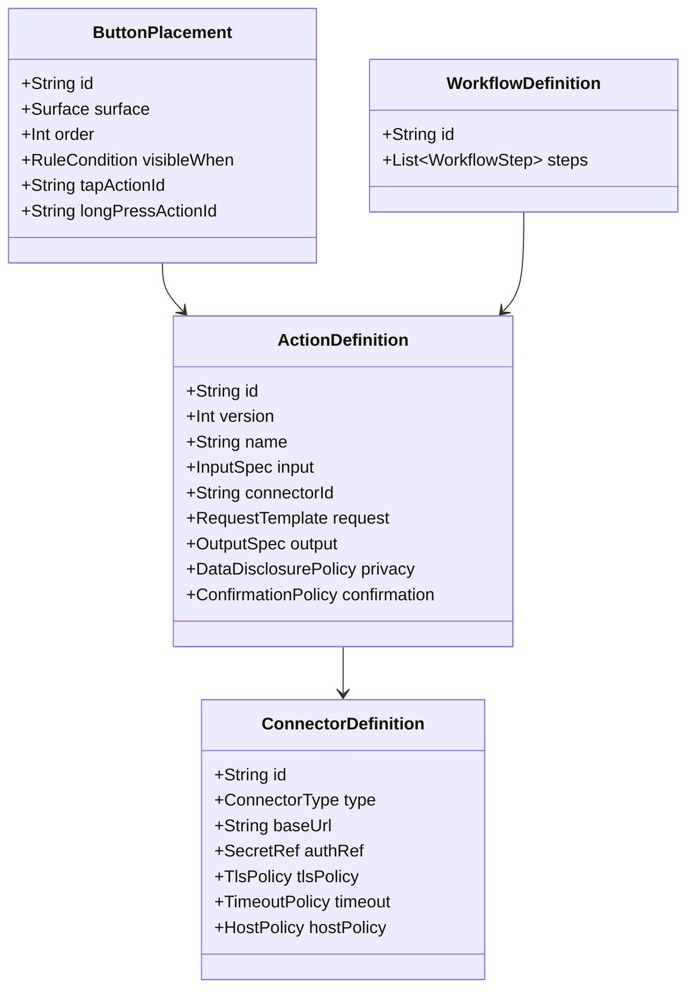

# OpenTypeless Action Protocol v1

> 文档版本：1.0  
> 生成日期：2026-08-12  
> 适用仓库：`dengxuezhao/opentypeless`  
> 代码基线：`main@67be488dcd2e9f36520618f9f644f97c3ec02b98`  
> 目标读者：产品负责人、Android/IME 工程师、语音与模型工程师、安全工程师、测试工程师，以及 Codex / Claude Code 等编码代理  
> 状态：**拟议目标方案（Proposed Target Architecture）**；涉及键盘底座、许可证和 Rime 集成的不可逆决策，必须先完成 ADR 技术验证

## 1. 协议目标

Action Protocol 用于支持以下能力：

- 用户在键盘工具栏自定义按钮；
- 从选区、最近语音、剪贴板或手动输入获取内容；
- 将内容发送到本地、家庭 LAN、云端或 Android Intent 连接器；
- 从 Docker/HTTP/WebSocket 服务接收结构化结果；
- 只执行经过白名单限制的文本操作；
- 结果返回时重新验证原输入目标；
- 明确数据披露、鉴权、超时、取消、审计和错误。

关键抽象：

> **Docker 是部署方式，Connector 才是连接抽象；按钮是 Placement，实际能力是 Action。**

---

## 2. 非目标

协议不支持：

- 远端下发任意脚本；
- 远端执行 Shell；
- 远端选择任意 Android Intent；
- 远端注入 KeyEvent；
- Accessibility 自动点击；
- 自动点击第三方 App 的发送按钮；
- 访问任意文件路径；
- 读取完整屏幕；
- 默认读取剪贴板；
- 直接操作 `InputConnection`；
- 服务端永久获得麦克风；
- 无版本约束的任意 JSON。

---

## 3. 领域模型



---

## 4. Connector

### 4.1 ConnectorDefinition

```kotlin
data class ConnectorDefinition(
    val id: String,
    val schemaVersion: Int,
    val displayName: String,
    val type: ConnectorType,
    val baseUrl: String?,
    val auth: AuthConfig,
    val timeout: TimeoutConfig,
    val tlsPolicy: TlsPolicy,
    val hostPolicy: HostPolicy,
    val responseLimits: ResponseLimits,
    val enabled: Boolean,
)
```

### 4.2 ConnectorType

```text
HTTP_JSON
WEBSOCKET_JSON
OPENAI_COMPATIBLE
ANDROID_INTENT_ALLOWLISTED
LOCAL_BUILTIN
```

v1 必须先实现 `HTTP_JSON`。其他类型后续复用同一 Action 模型。

### 4.3 AuthConfig

```kotlin
sealed interface AuthConfig {
    data object None : AuthConfig
    data class Bearer(val secretRef: String) : AuthConfig
    data class Header(val name: String, val secretRef: String) : AuthConfig
    data class Basic(val username: String, val passwordSecretRef: String) : AuthConfig
    data class HmacSha256(
        val secretRef: String,
        val keyId: String?,
        val timestampHeader: String,
        val signatureHeader: String,
    ) : AuthConfig
}
```

Secret 只能通过 `secretRef` 引用 Android Keystore 管理的数据，不得写入导出的 Connector JSON。

### 4.4 HostPolicy

```kotlin
data class HostPolicy(
    val allowedHosts: Set<String>,
    val allowLoopback: Boolean,
    val allowPrivateNetwork: Boolean,
    val allowPublicNetwork: Boolean,
    val allowRedirects: Boolean = false,
    val maxRedirects: Int = 0,
)
```

规则：

- URL 规范化后再校验；
- DNS 解析前后都要防 SSRF；
- 公网必须 HTTPS；
- LAN 明文 HTTP 仅在用户明确启用且无 Bearer/API Key 时允许；
- Loopback 可允许明文，但仍需响应限制；
- 默认拒绝重定向；
- 不允许服务端通过重定向绕过 Host 白名单。

---

## 5. Action

### 5.1 ActionDefinition

```kotlin
data class ActionDefinition(
    val id: String,
    val schemaVersion: Int,
    val displayName: String,
    val description: String,
    val icon: IconRef,
    val input: InputSpec,
    val connectorId: String,
    val request: RequestTemplate,
    val output: OutputSpec,
    val disclosure: DataDisclosurePolicy,
    val confirmation: ConfirmationPolicy,
    val errorPolicy: ErrorPolicy,
    val availability: RuleCondition,
    val enabled: Boolean,
)
```

### 5.2 InputSpec

```kotlin
data class InputSpec(
    val primarySource: InputSource,
    val fallbackSources: List<InputSource>,
    val includeAppId: Boolean,
    val includeFieldKind: Boolean,
    val includeLocale: Boolean,
    val contextBeforeCodePoints: Int,
    val contextAfterCodePoints: Int,
    val includePersonalTerms: Boolean,
    val requireNonEmptyText: Boolean,
    val maxInputCodePoints: Int,
)
```

`InputSource`：

```text
SELECTION
CURRENT_COMPOSITION
LAST_VOICE_RAW
LAST_VOICE_FINAL
LAST_COMMIT
CLIPBOARD
MANUAL_INPUT
EMPTY
```

默认不允许 `CLIPBOARD` 作为隐式 fallback。

### 5.3 OutputSpec

```kotlin
data class OutputSpec(
    val defaultDisposition: OutputDisposition,
    val requirePreview: Boolean,
    val allowedOperations: Set<OperationType>,
    val maxOutputCodePoints: Int,
    val preserveMarkdown: Boolean,
    val allowEmptyOutput: Boolean,
)
```

`OutputDisposition`：

```text
PREVIEW_ONLY
INSERT_AT_CURSOR
REPLACE_SELECTION
REPLACE_LAST_COMMIT
COPY_TO_CLIPBOARD
OPEN_RESULT_PANEL
```

---

## 6. Placement

```kotlin
data class ButtonPlacement(
    val id: String,
    val schemaVersion: Int,
    val actionId: String,
    val surface: Surface,
    val order: Int,
    val visibility: RuleCondition,
    val tapBehavior: TriggerBehavior,
    val longPressBehavior: TriggerBehavior?,
)
```

`Surface`：

```text
IME_TOOLBAR
CANDIDATE_BAR_OVERFLOW
VOICE_RESULT_ROW
SELECTION_CONTEXT
MANAGEMENT_SHORTCUT
```

可见性条件可以引用：

- App；
- FieldKind；
- 是否有选区；
- 是否敏感；
- 当前输入引擎；
- 当前语言；
- 网络状态；
- Connector 健康；
- 用户会话临时开关。

---

## 7. Workflow

### 7.1 允许的步骤

```text
INPUT
TEMPLATE
LOCAL_TRANSFORM
HTTP_REQUEST
JSONPATH_EXTRACT
REGEX_EXTRACT
CONDITION
USER_CONFIRMATION
OUTPUT_MAP
```

### 7.2 禁止的步骤

```text
SHELL
JAVASCRIPT
PYTHON
ARBITRARY_INTENT
FILE_SYSTEM
ACCESSIBILITY_ACTION
DYNAMIC_CODE
```

复杂逻辑应部署在用户自己的 Docker 中。

---

## 8. HTTP API

### 8.1 Endpoint

```text
POST /v1/actions/execute
Content-Type: application/json
Accept: application/json
```

可选能力探测：

```text
GET /v1/capabilities
GET /v1/health
```

### 8.2 Request

```json
{
  "protocol": "opentypeless.action.v1",
  "request_id": "5d40c0d8-2a55-4d9a-b89e-2e20f12ea61c",
  "action_id": "rewrite_formal",
  "action_version": 1,
  "created_at": "2026-08-12T08:30:00Z",
  "input": {
    "text": "这个方案现在看起来还有一些问题",
    "source": "selection",
    "content_type": "text/plain"
  },
  "context": {
    "app_id": "com.tencent.mm",
    "field_kind": "LONG_TEXT",
    "locale": "zh-CN",
    "target_language": null,
    "selection_present": true
  },
  "capabilities": [
    "preview",
    "replace_selection",
    "insert_text",
    "copy_to_clipboard"
  ],
  "client": {
    "name": "OpenTypeless Android",
    "version": "0.5.0",
    "protocol_version": 1
  }
}
```

### 8.3 Request 字段

| 字段 | 必须 | 说明 |
|---|---:|---|
| `protocol` | 是 | 固定 `opentypeless.action.v1` |
| `request_id` | 是 | UUID；幂等和取消 |
| `action_id` | 是 | 本地 Action ID |
| `action_version` | 是 | Action 定义版本 |
| `created_at` | 是 | UTC ISO-8601 |
| `input.text` | 视 Action | 已按最大长度限制 |
| `input.source` | 是 | 数据来源 |
| `input.content_type` | 是 | v1 只允许有限文本类型 |
| `context.app_id` | 可选 | 由披露策略决定 |
| `context.field_kind` | 可选 | 不包含原始 `EditorInfo` |
| `context.locale` | 可选 | BCP-47 |
| `capabilities` | 是 | 客户端允许的输出能力 |
| `client` | 是 | 兼容性诊断 |

服务器不得把缺少的上下文字段视为错误，除非 Action 契约明确要求。

---

## 9. Response

### 9.1 成功响应

```json
{
  "protocol": "opentypeless.action.v1",
  "request_id": "5d40c0d8-2a55-4d9a-b89e-2e20f12ea61c",
  "status": "ok",
  "display": {
    "title": "正式表达",
    "preview": "该方案目前仍存在若干需要解决的问题。",
    "notices": []
  },
  "operations": [
    {
      "type": "replace_selection",
      "text": "该方案目前仍存在若干需要解决的问题。"
    }
  ],
  "metadata": {
    "model": "self-hosted",
    "duration_ms": 438
  }
}
```

### 9.2 服务器建议与客户端权限

服务器返回的 `operations` 只是建议。客户端必须依次校验：

1. operation type 在请求 capability 中；
2. Action 的 `allowedOperations` 允许；
3. 当前字段策略允许；
4. 当前 EditorSession 仍有效；
5. 输出长度、字符和内容类型合法；
6. 是否需要预览；
7. 用户确认策略；
8. EditorTransaction 验证。

### 9.3 错误响应

```json
{
  "protocol": "opentypeless.action.v1",
  "request_id": "5d40c0d8-2a55-4d9a-b89e-2e20f12ea61c",
  "status": "error",
  "error": {
    "code": "UPSTREAM_TIMEOUT",
    "message": "Knowledge service did not respond in time",
    "retryable": true,
    "retry_after_ms": 3000
  }
}
```

服务器 message 不能直接作为 Toast 原样展示。客户端将 code 映射为本地化文案，并把服务正文限制在诊断详情。

---

## 10. 允许的 EditorOperation

### 10.1 `insert_text`

```json
{
  "type": "insert_text",
  "text": "要插入的文字"
}
```

### 10.2 `replace_selection`

```json
{
  "type": "replace_selection",
  "text": "替换后的文字"
}
```

服务端不提供选区坐标；客户端使用已绑定 Session 的选区。

### 10.3 `replace_last_commit`

```json
{
  "type": "replace_last_commit",
  "text": "替换最近一次提交"
}
```

只有本地仍存在可验证 `commitId` 时允许。

### 10.4 `copy_to_clipboard`

```json
{
  "type": "copy_to_clipboard",
  "text": "复制内容",
  "sensitive": false
}
```

敏感内容默认不写系统剪贴板；可写 App 内结果面板。

### 10.5 `show_result`

```json
{
  "type": "show_result",
  "title": "查询结果",
  "text": "仅显示，不写输入框"
}
```

### 10.6 v1 明确禁止

- `send_enter`
- `press_key`
- `launch_url`
- `launch_intent`
- `click`
- `accessibility`
- `execute`
- `file_write`
- `clipboard_read`
- `start_recording`

以后新增操作必须升级协议或 capability，并新增威胁模型和契约测试。

---

## 11. JSON Schema：请求

以下为精简的规范性 Schema；实际仓库应保存独立 JSON 文件并由测试加载。

```json
{
  "$schema": "https://json-schema.org/draft/2020-12/schema",
  "$id": "https://opentypeless.local/schema/action-request-v1.json",
  "type": "object",
  "additionalProperties": false,
  "required": [
    "protocol",
    "request_id",
    "action_id",
    "action_version",
    "created_at",
    "input",
    "context",
    "capabilities",
    "client"
  ],
  "properties": {
    "protocol": {
      "const": "opentypeless.action.v1"
    },
    "request_id": {
      "type": "string",
      "format": "uuid"
    },
    "action_id": {
      "type": "string",
      "minLength": 1,
      "maxLength": 120,
      "pattern": "^[A-Za-z0-9._-]+$"
    },
    "action_version": {
      "type": "integer",
      "minimum": 1,
      "maximum": 2147483647
    },
    "created_at": {
      "type": "string",
      "format": "date-time"
    },
    "input": {
      "type": "object",
      "additionalProperties": false,
      "required": ["text", "source", "content_type"],
      "properties": {
        "text": {
          "type": "string",
          "maxLength": 40000
        },
        "source": {
          "enum": [
            "selection",
            "current_composition",
            "last_voice_raw",
            "last_voice_final",
            "last_commit",
            "clipboard",
            "manual_input",
            "empty"
          ]
        },
        "content_type": {
          "enum": [
            "text/plain",
            "text/markdown"
          ]
        }
      }
    },
    "context": {
      "type": "object",
      "additionalProperties": false,
      "properties": {
        "app_id": {
          "type": ["string", "null"],
          "maxLength": 200
        },
        "field_kind": {
          "type": ["string", "null"],
          "maxLength": 40
        },
        "locale": {
          "type": ["string", "null"],
          "maxLength": 40
        },
        "target_language": {
          "type": ["string", "null"],
          "maxLength": 80
        },
        "selection_present": {
          "type": "boolean"
        }
      }
    },
    "capabilities": {
      "type": "array",
      "maxItems": 16,
      "uniqueItems": true,
      "items": {
        "enum": [
          "preview",
          "insert_text",
          "replace_selection",
          "replace_last_commit",
          "copy_to_clipboard",
          "show_result"
        ]
      }
    },
    "client": {
      "type": "object",
      "additionalProperties": false,
      "required": ["name", "version", "protocol_version"],
      "properties": {
        "name": {
          "type": "string",
          "maxLength": 80
        },
        "version": {
          "type": "string",
          "maxLength": 40
        },
        "protocol_version": {
          "const": 1
        }
      }
    }
  }
}
```

---

## 12. JSON Schema：响应

```json
{
  "$schema": "https://json-schema.org/draft/2020-12/schema",
  "$id": "https://opentypeless.local/schema/action-response-v1.json",
  "oneOf": [
    {
      "type": "object",
      "additionalProperties": false,
      "required": [
        "protocol",
        "request_id",
        "status",
        "display",
        "operations",
        "metadata"
      ],
      "properties": {
        "protocol": {
          "const": "opentypeless.action.v1"
        },
        "request_id": {
          "type": "string",
          "format": "uuid"
        },
        "status": {
          "const": "ok"
        },
        "display": {
          "type": "object",
          "additionalProperties": false,
          "required": ["title", "preview", "notices"],
          "properties": {
            "title": {
              "type": "string",
              "maxLength": 120
            },
            "preview": {
              "type": "string",
              "maxLength": 40000
            },
            "notices": {
              "type": "array",
              "maxItems": 20,
              "items": {
                "type": "string",
                "maxLength": 240
              }
            }
          }
        },
        "operations": {
          "type": "array",
          "maxItems": 8,
          "items": {
            "$ref": "#/$defs/operation"
          }
        },
        "metadata": {
          "type": "object",
          "maxProperties": 20
        }
      }
    },
    {
      "type": "object",
      "additionalProperties": false,
      "required": [
        "protocol",
        "request_id",
        "status",
        "error"
      ],
      "properties": {
        "protocol": {
          "const": "opentypeless.action.v1"
        },
        "request_id": {
          "type": "string",
          "format": "uuid"
        },
        "status": {
          "const": "error"
        },
        "error": {
          "type": "object",
          "additionalProperties": false,
          "required": [
            "code",
            "message",
            "retryable"
          ],
          "properties": {
            "code": {
              "type": "string",
              "minLength": 1,
              "maxLength": 80,
              "pattern": "^[A-Z0-9_]+$"
            },
            "message": {
              "type": "string",
              "maxLength": 500
            },
            "retryable": {
              "type": "boolean"
            },
            "retry_after_ms": {
              "type": ["integer", "null"],
              "minimum": 0,
              "maximum": 86400000
            }
          }
        }
      }
    }
  ],
  "$defs": {
    "operation": {
      "oneOf": [
        {
          "type": "object",
          "additionalProperties": false,
          "required": ["type", "text"],
          "properties": {
            "type": {
              "enum": [
                "insert_text",
                "replace_selection",
                "replace_last_commit"
              ]
            },
            "text": {
              "type": "string",
              "maxLength": 40000
            }
          }
        },
        {
          "type": "object",
          "additionalProperties": false,
          "required": ["type", "text", "sensitive"],
          "properties": {
            "type": {
              "const": "copy_to_clipboard"
            },
            "text": {
              "type": "string",
              "maxLength": 40000
            },
            "sensitive": {
              "type": "boolean"
            }
          }
        },
        {
          "type": "object",
          "additionalProperties": false,
          "required": ["type", "title", "text"],
          "properties": {
            "type": {
              "const": "show_result"
            },
            "title": {
              "type": "string",
              "maxLength": 120
            },
            "text": {
              "type": "string",
              "maxLength": 40000
            }
          }
        }
      ]
    }
  }
}
```

---

## 13. Streaming Action

v1.1 可选 WebSocket/SSE，不影响 v1 HTTP 终态协议。

事件：

```json
{
  "protocol": "opentypeless.action.stream.v1",
  "request_id": "...",
  "sequence": 1,
  "type": "progress",
  "message": "正在检索知识库"
}
```

```json
{
  "protocol": "opentypeless.action.stream.v1",
  "request_id": "...",
  "sequence": 2,
  "type": "preview_delta",
  "text": "第一部分结果"
}
```

```json
{
  "protocol": "opentypeless.action.stream.v1",
  "request_id": "...",
  "sequence": 3,
  "type": "final",
  "response": {
    "...": "完整 ActionResponse"
  }
}
```

限制：

- delta 只能更新结果面板，不能直接修改编辑器；
- 只有 final 可以生成 EditorOperation；
- sequence 单调；
- 终态后忽略事件；
- 总响应大小仍有限制；
- 用户取消后客户端关闭连接并丢弃后续事件。

---

## 14. 数据披露策略

```kotlin
data class DataDisclosurePolicy(
    val allowText: Boolean,
    val allowAppId: Boolean,
    val allowFieldKind: Boolean,
    val allowContextBefore: Boolean,
    val allowContextAfter: Boolean,
    val allowClipboard: Boolean,
    val allowPersonalTerms: Boolean,
    val sensitiveFieldBehavior: SensitiveBehavior,
    val firstUseConfirmation: Boolean,
    val everyUseConfirmation: Boolean,
)
```

Runtime 生成不可变 `DisclosurePlan`：

```kotlin
data class DisclosurePlan(
    val fields: List<DisclosedField>,
    val destination: DestinationDescriptor,
    val privacyClass: PrivacyClass,
    val requiresConfirmation: Boolean,
    val denialReason: String?,
)
```

UI 必须由 `DisclosurePlan` 渲染，不能自己猜测。

---

## 15. 错误分类

客户端领域错误：

```text
ACTION_NOT_FOUND
ACTION_DISABLED
CONNECTOR_NOT_FOUND
CONNECTOR_DISABLED
INPUT_EMPTY
INPUT_TOO_LARGE
SENSITIVE_FIELD_BLOCKED
DISCLOSURE_DENIED
HOST_NOT_ALLOWED
TLS_REQUIRED
AUTH_MISSING
DNS_REBINDING_BLOCKED
NETWORK_UNAVAILABLE
NETWORK_TIMEOUT
HTTP_ERROR
RESPONSE_TOO_LARGE
RESPONSE_INVALID_JSON
RESPONSE_SCHEMA_INVALID
REQUEST_ID_MISMATCH
OPERATION_NOT_ALLOWED
OUTPUT_TOO_LARGE
TARGET_CHANGED
USER_CANCELLED
RATE_LIMITED
SERVER_ERROR
INTERNAL_ERROR
```

错误决定：

- 是否重试；
- 是否可以换 Connector；
- 是否可以保存结果；
- 是否修改输入框；
- 是否显示隐私警告；
- 是否记录熔断。

---

## 16. 超时、重试和幂等

### 16.1 超时

分别配置：

- connect timeout；
- read timeout；
- write timeout；
- total timeout。

总超时必须有上限。输入法不能无限等待。

### 16.2 重试

只对满足以下条件的请求自动重试：

- Action 声明为幂等；
- 没有收到完整响应；
- 错误属于网络瞬时错误；
- 用户未取消；
- Session 是否有效不影响网络完成，但影响最终写入。

不自动重试：

- 401/403；
- 参数错误；
- 响应 Schema 错；
- 非幂等业务动作；
- 服务已经返回操作；
- 用户取消。

### 16.3 Request ID

服务应缓存短期 `request_id` 结果，避免客户端网络重试产生重复副作用。

---

## 17. 取消

可选 endpoint：

```text
POST /v1/actions/{request_id}/cancel
```

取消是尽力而为。无论服务端是否成功取消：

- 客户端立即停止展示运行态；
- 不再应用任何后续结果；
- 记录 `USER_CANCELLED`；
- 不触发备用 Connector；
- 不把已返回的半成品写入编辑器。

---

## 18. Docker 参考部署

### 18.1 docker-compose

```yaml
services:
  opentypeless-actions:
    image: example/opentypeless-actions:1.0
    restart: unless-stopped
    environment:
      ACTION_TOKEN_FILE: /run/secrets/action_token
    secrets:
      - action_token
    ports:
      - "8443:8443"
    read_only: true
    tmpfs:
      - /tmp
    security_opt:
      - no-new-privileges:true
    cap_drop:
      - ALL

secrets:
  action_token:
    file: ./secrets/action_token.txt
```

### 18.2 服务伪代码

```python
from fastapi import FastAPI, Header, HTTPException
from pydantic import BaseModel

app = FastAPI()

@app.get("/v1/health")
def health():
    return {"status": "ok"}

@app.post("/v1/actions/execute")
def execute(request: ActionRequest, authorization: str = Header(default="")):
    verify_token(authorization)
    if request.protocol != "opentypeless.action.v1":
        raise HTTPException(400, "unsupported protocol")

    result = dispatch_allowlisted_action(
        action_id=request.action_id,
        text=request.input.text,
        context=request.context,
    )

    return {
        "protocol": "opentypeless.action.v1",
        "request_id": request.request_id,
        "status": "ok",
        "display": {
            "title": result.title,
            "preview": result.text,
            "notices": []
        },
        "operations": [{
            "type": "replace_selection",
            "text": result.text
        }],
        "metadata": {}
    }
```

服务端仍应只注册允许的 `action_id`，不能把 Action ID 拼成 Shell 命令。

---

## 19. 导入导出格式

Connector 导出时：

```json
{
  "format": "opentypeless_connectors",
  "version": 1,
  "connectors": [
    {
      "id": "home-server",
      "schema_version": 1,
      "display_name": "家庭服务器",
      "type": "HTTP_JSON",
      "base_url": "https://192.168.10.8:8443",
      "auth": {
        "type": "bearer",
        "secret_ref": null
      }
    }
  ]
}
```

Secret 不导出。导入后 Connector 显示“需要重新配置凭据”。

Action 和 Placement 可独立导出，引用不存在 Connector 时进入禁用状态，不允许隐式绑定同名服务。

---

## 20. 契约测试向量

至少包含：

1. 正常 replace_selection；
2. request ID 不一致；
3. 未知 operation；
4. operation 不在 capability；
5. 多余 JSON 字段；
6. 超长 input；
7. 超长 response；
8. 嵌套深度攻击；
9. 重复 JSON key；
10. 非 UTF-8；
11. 重定向到公网；
12. DNS rebinding；
13. TLS 证书错误；
14. LAN HTTP + Bearer；
15. 401；
16. 429 + retry_after；
17. 超时；
18. 取消后迟到响应；
19. Session 目标变化；
20. 敏感字段；
21. Action 非幂等重试；
22. Clipboard 未授权；
23. response 注入新 operation 名；
24. 空输出；
25. Markdown 输出；
26. 服务端错误正文含敏感信息；
27. HMAC 时间漂移；
28. Connector Secret 缺失；
29. Feature Flag 关闭；
30. 导入引用缺失 Connector。

---

## 21. v1 完成定义

- HTTP_JSON Connector 可用；
- Secret 使用 Keystore 引用；
- Host/TLS/重定向限制通过；
- Action/Placement 可创建、编辑、禁用、导入、导出；
- 执行前生成数据披露；
- 敏感字段硬阻断；
- 响应通过 JSON Schema；
- 只支持白名单 Operation；
- 默认预览；
- EditorSession 失效时不写入；
- 取消后迟到结果不生效；
- 审计默认不存正文；
- 所有 30 个契约测试通过；
- Docker 示例服务能完成选区改写；
- 协议向后兼容策略记录在 ADR。
