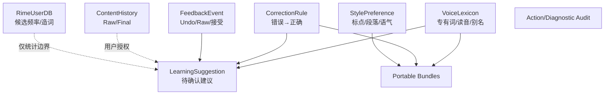
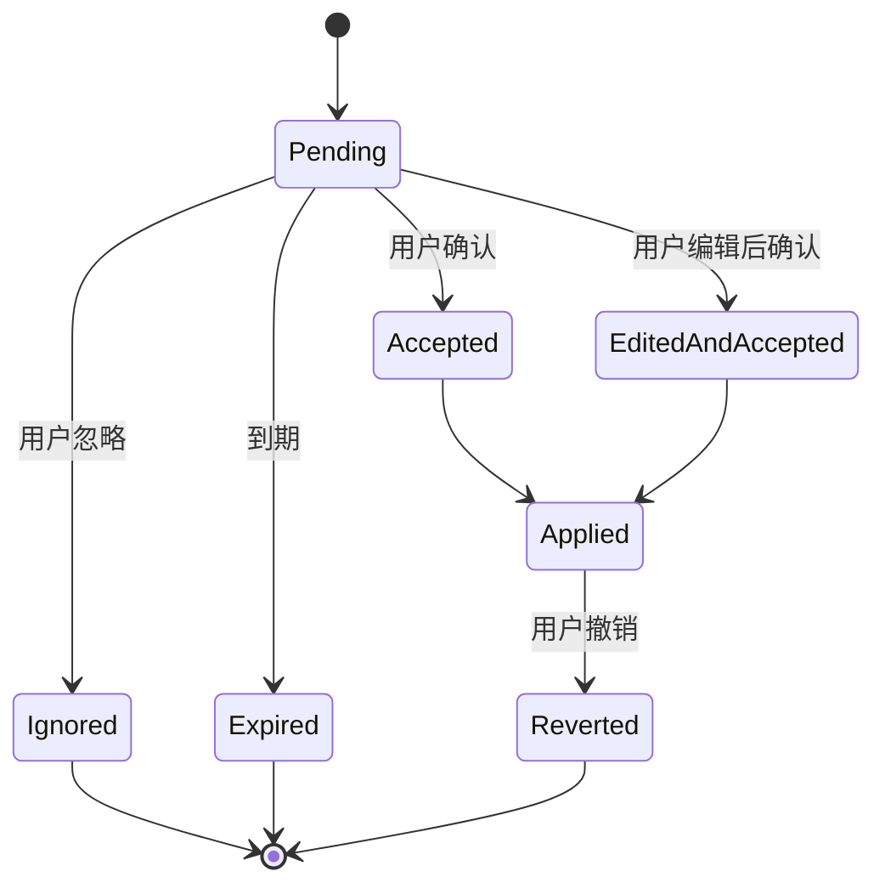
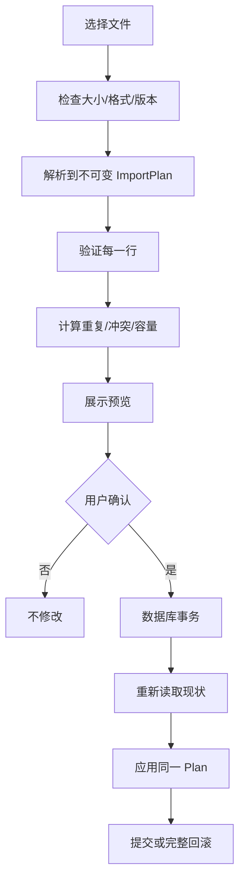

# OpenTypeless 数据、个性化与学习设计

> 文档版本：1.0  
> 生成日期：2026-08-12  
> 适用仓库：`dengxuezhao/opentypeless`  
> 代码基线：`main@67be488dcd2e9f36520618f9f644f97c3ec02b98`  
> 目标读者：产品负责人、Android/IME 工程师、语音与模型工程师、安全工程师、测试工程师，以及 Codex / Claude Code 等编码代理  
> 状态：**拟议目标方案（Proposed Target Architecture）**；涉及键盘底座、许可证和 Rime 集成的不可逆决策，必须先完成 ADR 技术验证

## 1. 设计目标

本设计要解决当前“学习和记忆”概念过宽的问题。目标不是让系统尽可能多地记住用户，而是建立一套：

- 可解释；
- 可审计；
- 可迁移；
- 可撤销；
- 默认本地；
- 不污染输入质量；
- 能与 Rime 共存；
- 能跨 Android/桌面共享语义

的数据体系。

核心原则：

> **历史不是记忆，词频不是纠正规则，风格偏好不是专有词典，Rime UserDB 也不是语音 ASR Prompt。**

---

## 2. 数据域划分



---

## 3. VoiceLexicon

### 3.1 用途

用于提高：

- ASR Prompt；
- Android biasing strings；
- 动态 keyterms；
- 确定性后处理；
- 事实保护；
- 用户可见词典。

### 3.2 模型

```kotlin
data class VoiceLexiconEntry(
    val id: String,
    val canonical: String,
    val normalizedKey: String,
    val pronunciations: List<Pronunciation>,
    val aliases: List<String>,
    val appScope: Scope,
    val language: String?,
    val enabled: Boolean,
    val source: EntrySource,
    val acceptedCount: Int,
    val rejectedCount: Int,
    val lastUsedAt: Instant?,
    val createdAt: Instant,
    val updatedAt: Instant,
)
```

### 3.3 Scope

```kotlin
sealed interface Scope {
    data object Global : Scope
    data class App(val packageName: String) : Scope
    data class AppGroup(val groupId: String) : Scope
}
```

暂不支持“某个具体输入框永久 Scope”，因为 fieldId 通常不稳定。字段类型属于规则条件，不属于词典 identity。

### 3.4 Pronunciation

```kotlin
data class Pronunciation(
    val value: String,
    val system: PronunciationSystem,
    val locale: String?,
)
```

支持：

- 拼音；
- 自定义口语读音；
- IPA 作为远期；
- Provider-specific phoneme 仅存扩展字段，不作为核心格式。

### 3.5 匹配原则

- Unicode NFKC；
- 拉丁字符按完整 token；
- 中文允许精确子串；
- 长规则优先；
- 同一 span 的明确 CorrectionRule 优先于 alias；
- 非级联；
- 每次输入替换数量有上限；
- App Scope 优先于 Global；
- 规则冲突可诊断。

---

## 4. CorrectionRule

### 4.1 用途

只保存稳定且明确的：

```text
常见错误形式 → 用户确认的正确形式
```

不是保存整段风格改写。

### 4.2 模型

```kotlin
data class CorrectionRule(
    val id: String,
    val pattern: String,
    val replacement: String,
    val normalizedPattern: String,
    val matchMode: MatchMode,
    val scope: Scope,
    val enabled: Boolean,
    val source: EntrySource,
    val acceptedCount: Int,
    val rejectedCount: Int,
    val lastMatchedAt: Instant?,
    val createdAt: Instant,
    val updatedAt: Instant,
)
```

`MatchMode`：

```text
EXACT_TOKEN
EXACT_PHRASE
CASE_INSENSITIVE_TOKEN
REGEX_SAFE_SUBSET
```

v1 默认不允许用户任意 Java Regex，防止灾难性回溯。若提供正则，只允许受限语法或使用 RE2/J。

### 4.3 创建规则

来源：

- 用户手工创建；
- Teach 确认；
- 学习建议确认；
- 导入。

不得来源于：

- 一次普通 AI 改写；
- 未经确认的历史差异；
- 服务器远端直接写入；
- 键盘所有输入的静默分析。

---

## 5. RimeUserDB 边界

### 5.1 Rime 自主管理

Rime UserDB 负责：

- 候选频率；
- 用户造词；
- 方案内学习；
- Schema 相关状态。

OpenTypeless 不应重复实现 Rime 排序器。

### 5.2 可交换信息

允许：

- 用户显式把 Rime 词加入 VoiceLexicon；
- 用户显式把 VoiceLexicon 导出为 Rime 用户词典格式；
- 统计“候选被选择”作为本地反馈；
- 诊断 UserDB 是否可写、是否损坏。

不允许：

- 把全部 Rime UserDB 自动送到云端 ASR；
- 每次键盘输入都写入语音历史；
- 用语音纠正规则直接修改 Rime UserDB 内部文件；
- 在不了解 Schema 语义时统一改词频。

### 5.3 小鹤音形

小鹤音形的码表、辅助码、简码、词库和用户词频属于 Rime 方案域。语音词典只解决“说出来如何识别”，不参与形码编码逻辑。

---

## 6. StylePreference

### 6.1 用途

保存用户明确选择的处理偏好：

- 标点风格；
- 段落长度；
- 是否保留口头语；
- 消息/邮件语气；
- 简繁；
- 中英文空格；
- App 特定写作偏好。

### 6.2 模型

```kotlin
data class StylePreference(
    val id: String,
    val name: String,
    val scope: Scope,
    val punctuationStyle: PunctuationStyle,
    val paragraphPolicy: ParagraphPolicy,
    val fillerWordPolicy: FillerWordPolicy,
    val customInstruction: String?,
    val enabled: Boolean,
)
```

自定义指令有长度上限，并在发送到 LLM 前与安全 System Prompt 分离，防止用户文本或词典变成高权限指令。

---

## 7. ContentHistory

### 7.1 历史不是学习来源的默认入口

历史用于：

- 查看 Raw/Final；
- 重新插入；
- Raw 恢复；
- Teach；
- 诊断；
- 可选重识别。

默认关闭。启用时必须选择保留期限或数量。

### 7.2 模型

```kotlin
data class HistoryEntry(
    val id: String,
    val createdAt: Instant,
    val appPackage: String?,
    val fieldKind: FieldKind,
    val mode: ProcessingMode,
    val providerId: String,
    val routeId: String,
    val rawCiphertext: ByteArray,
    val deterministicCiphertext: ByteArray,
    val finalCiphertext: ByteArray,
    val durationMs: Long,
    val firstPartialLatencyMs: Long?,
    val finalLatencyMs: Long?,
    val aiAccepted: Boolean,
    val commitId: String?,
)
```

### 7.3 音频

音频历史是独立开关：

- 默认不保存；
- 与文本历史分开授权；
- 有明确保留期限；
- 加密；
- 不进入 Android 系统备份；
- 可逐条删除；
- 删除后清理文件和数据库引用；
- 诊断包默认不包含。

---

## 8. FeedbackEvent

### 8.1 事件模型

```kotlin
data class FeedbackEvent(
    val id: String,
    val type: FeedbackType,
    val objectType: FeedbackObjectType,
    val objectId: String?,
    val appPackage: String?,
    val fieldKind: FieldKind?,
    val createdAt: Instant,
    val metadata: Map<String, String>,
)
```

### 8.2 事件类型

```text
VOICE_COMMIT_ACCEPTED
VOICE_RAW_RESTORED
VOICE_UNDONE
CORRECTION_TAUGHT
CORRECTION_REJECTED
LEXICON_USED
LEXICON_REJECTED
RIME_CANDIDATE_SELECTED
RIME_WORD_FORGOTTEN
ACTION_RESULT_APPLIED
ACTION_RESULT_DISMISSED
PROCESSING_MODE_OVERRIDDEN
```

事件默认不存完整正文。需要差异学习时，保存经过加密、短期、最小跨度的候选片段。

### 8.3 反馈语义

| 操作 | 含义 |
|---|---|
| Raw 恢复 | 拒绝后处理结果，不一定拒绝 ASR |
| Undo | 拒绝最近一次编辑提交，原因未知 |
| Teach | 明确确认一条错误→正确 |
| 候选选择 | 对 Rime 候选的正反馈 |
| 忘词 | Rime 负反馈 |
| Action dismiss | 不一定表示结果错误，可能只是不用 |

学习算法不得把不同事件混为一个“负反馈”。

### 8.4 Teach 来源与确认边界（VOC-008）

Teach 的 Raw、Final、App scope 与 Field kind 必须来自当前成功 transaction 同栈返回的 exact
`CommitRecord`，或来自已经持久化并重新读取的 `HistoryEntry`。Service 中为 legacy Undo/Raw 复制的正文、
任意 Intent extra、公开构造的 receipt/record，以及事后 `latest/last` 查询都不能成为 Teach authority。
optional History 只补充历史 ID 等元数据，不得覆盖同栈 record 的正文或 scope。

只有 `VOICE`、`learningAllowed=true`、Raw transcript 存在且 committed text 非空时才显示并创建 Teach
draft。敏感提交不生成 record；no-learning record 只可在进程内短期用于 Undo/Raw，绝不进入 Teach、History、
Feedback、Suggestion、个性化、持久化或导出。旧回退 route 没有 exact record 时必须隐藏 Teach，不能从复制
字段重建纠正对。

---

## 9. LearningSuggestion

### 9.1 模型

```kotlin
data class LearningSuggestion(
    val id: String,
    val type: SuggestionType,
    val proposedPayload: EncryptedPayload,
    val evidenceSummary: EvidenceSummary,
    val confidence: Double,
    val scopeProposal: Scope,
    val status: SuggestionStatus,
    val expiresAt: Instant,
    val createdAt: Instant,
)
```

### 9.2 SuggestionType

```text
ADD_VOICE_TERM
ADD_CORRECTION_RULE
CHANGE_APP_MODE
DISABLE_AI_FOR_APP
ENABLE_CONTEXT_FOR_APP
ADD_RIME_WORD_TO_VOICE
```

### 9.3 产生条件

示例：纠正规则建议

- 同一 normalized pattern；
- 相同 replacement；
- 至少多次独立会话；
- 不是 LLM 大幅重写；
- span 长度小于阈值；
- 没有规则冲突；
- 不在敏感字段；
- 用户未明确忽略；
- 证据仍在本地。

### 9.4 生命周期



---

## 10. 差异提取

### 10.1 当前简单前后缀差异的不足

仅找公共前缀和后缀会在以下情况生成过宽规则：

- 多处修改；
- 插入或删除；
- 标点与词语同时变化；
- LLM 改写整句；
- 中文无空格边界。

### 10.2 新方案

1. 对 Raw 和用户最终文本做 grapheme-aware diff；
2. 生成多个 edit span；
3. 分类：
   - 单替换；
   - 插入；
   - 删除；
   - 多跨度；
   - 大改写；
4. 只有“单替换 + 小跨度 + 稳定重复”可自动生成建议；
5. 多跨度进入差异编辑器；
6. 大改写不建议学习；
7. 保存前做未来命中模拟。

### 10.3 命中模拟

展示：

```text
规则：思源比记 → 思源笔记

将影响最近样例：
1. “打开思源比记” → “打开思源笔记”
2. “思源比记插件” → “思源笔记插件”

未发现冲突。
```

---

## 11. 排序与评分

### 11.1 词典入 Prompt 的排序

建议：

```text
score =
  app_scope_boost
+ log1p(accepted_count)
- rejection_penalty
+ recency_decay
+ field_relevance
+ language_match
```

其中：

- App Scope 命中最高；
- 近期使用有衰减；
- rejection 不能无限负；
- 不根据完整正文做 embedding 排序作为默认；
- 最大 Prompt 词条数量和字符数有硬上限。

### 11.2 确定性后处理

确定性规则不使用概率排序决定是否修改。评分只决定：

- 哪些词送入有限 ASR Prompt；
- 学习建议展示顺序；
- 候选词典管理排序。

---

## 12. 数据库建议

### 12.1 表

```text
voice_lexicon
voice_pronunciation
voice_alias
correction_rule
style_preference
history_entry
feedback_event
learning_suggestion
action_definition
connector_definition
button_placement
action_audit
diagnostic_event
schema_migration
```

Rime 数据独立，不放入主 SQLite。

### 12.2 voice_lexicon

```sql
CREATE TABLE voice_lexicon (
  id TEXT PRIMARY KEY,
  canonical TEXT NOT NULL,
  normalized_key TEXT NOT NULL,
  scope_type TEXT NOT NULL,
  scope_value TEXT NOT NULL DEFAULT '',
  language TEXT,
  enabled INTEGER NOT NULL,
  source TEXT NOT NULL,
  accepted_count INTEGER NOT NULL DEFAULT 0,
  rejected_count INTEGER NOT NULL DEFAULT 0,
  last_used_at INTEGER,
  created_at INTEGER NOT NULL,
  updated_at INTEGER NOT NULL,
  UNIQUE(normalized_key, scope_type, scope_value)
);
```

### 12.3 correction_rule

```sql
CREATE TABLE correction_rule (
  id TEXT PRIMARY KEY,
  pattern TEXT NOT NULL,
  replacement TEXT NOT NULL,
  normalized_pattern TEXT NOT NULL,
  match_mode TEXT NOT NULL,
  scope_type TEXT NOT NULL,
  scope_value TEXT NOT NULL DEFAULT '',
  enabled INTEGER NOT NULL,
  source TEXT NOT NULL,
  accepted_count INTEGER NOT NULL DEFAULT 0,
  rejected_count INTEGER NOT NULL DEFAULT 0,
  last_matched_at INTEGER,
  created_at INTEGER NOT NULL,
  updated_at INTEGER NOT NULL,
  UNIQUE(
    normalized_pattern,
    replacement,
    match_mode,
    scope_type,
    scope_value
  )
);
```

### 12.4 feedback_event

只保存最小元数据：

```sql
CREATE TABLE feedback_event (
  id TEXT PRIMARY KEY,
  event_type TEXT NOT NULL,
  object_type TEXT NOT NULL,
  object_id TEXT,
  app_package TEXT,
  field_kind TEXT,
  metadata_json TEXT NOT NULL DEFAULT '{}',
  created_at INTEGER NOT NULL
);
```

metadata 进入前必须经过字段白名单，禁止任意正文塞入。

---

## 13. 加密与删除

### 13.1 密钥分离

至少分离：

- Provider Secret Key；
- History Text Key；
- History Audio Key；
- Suggestion Evidence Key；
- Export Bundle Key（用户密码派生）。

一个密钥泄漏不应解开所有数据。

### 13.2 删除

- SQLite `secure_delete=ON`；
- WAL checkpoint/truncate；
- 文件先删除引用再物理删除；
- 清除全部数据时轮换相关密钥；
- 删除 Secret 时销毁 Keystore alias；
- 清除模型不影响词典；
- 清除历史不影响规则；
- 清除学习建议不影响已确认词典。

### 13.3 “清除所有数据”页面

按域展示，而非一个模糊按钮：

```text
语音词典：126 项
纠正规则：48 项
Rime 用户数据：12.4 MB
文本历史：320 条
音频历史：0 条
动作执行记录：72 条
模型：324 MB
Provider 凭据：3 个
```

---

## 14. 导入导出

### 14.1 通用 Envelope

```json
{
  "format": "opentypeless_bundle",
  "version": 1,
  "created_at": "2026-08-12T08:30:00Z",
  "source": {
    "platform": "android",
    "app_version": "0.5.0"
  },
  "sections": {
    "voice_lexicon": {
      "version": 2,
      "items": []
    },
    "correction_rules": {
      "version": 2,
      "items": []
    },
    "style_preferences": {
      "version": 1,
      "items": []
    },
    "actions": {
      "version": 1,
      "items": []
    }
  }
}
```

### 14.2 导入流程



### 14.3 Secret

Secret 永不进入普通导出。未来可支持：

- 用户密码加密的独立 Secret Bundle；
- Argon2id；
- AEAD；
- 明确风险提示；
- 不和词典普通导出混在一起。

---

## 15. 跨端同步长期方案

### 15.1 共享什么

Android 与桌面共享：

- VoiceLexicon；
- CorrectionRule；
- StylePreference；
- Provider 非密钥配置；
- Action/Connector 非密钥配置；
- Placement 的平台无关部分；
- 协议版本。

不共享：

- `InputConnection` 概念；
- Android App package 与桌面进程 ID 的直接等价；
- Rime UserDB 原始文件，除非使用 Rime 自己同步方案；
- 未加密历史；
- 临时 Session；
- 设备模型状态。

### 15.2 Scope 映射

跨端 Scope 使用：

```json
{
  "type": "application",
  "platform": "android",
  "identifier": "com.tencent.mm",
  "semantic_group": "chat"
}
```

桌面端可选择把 `semantic_group=chat` 应用于微信桌面版，但不能自动假设包名等价。

### 15.3 同步冲突

采用基于对象 ID、更新时间和 tombstone 的合并：

- 同对象不同修改：提示或保留双版本；
- 删除使用 tombstone；
- 不按整个数据库 Last Write Wins；
- CorrectionRule identity 冲突时不静默覆盖；
- Secret 永不通过普通同步通道。

---

## 16. 数据保留策略

| 数据 | 默认 | 可配置 |
|---|---|---|
| VoiceLexicon | 持久 | 手动删除 |
| CorrectionRule | 持久 | 手动删除 |
| Rime UserDB | 持久 | 清空/备份 |
| StylePreference | 持久 | 手动删除 |
| Text History | 关闭 | 7/30/90 天或条数 |
| Audio History | 关闭 | 短期天数 |
| FeedbackEvent | 本地有限 | 30/90 天 |
| LearningSuggestion | 到期清理 | 30 天 |
| ActionAudit | 元数据有限 | 30/90 天 |
| DiagnosticEvent | 环形 | 最大条数/时间 |

---

## 17. 隐私模式行为

遇到：

- 密码字段；
- `IME_FLAG_NO_PERSONALIZED_LEARNING`；
- 用户无痕模式；
- App 规则强制隐私；

系统：

- 不写 History；
- 不写 Feedback；
- 不更新 useCount；
- 不生成 Suggestion；
- 不采集上下文；
- 不展示剪贴板；
- 已确认 VoiceLexicon 可按策略用于本地识别，但不被修改；
- Rime 的学习行为按其隐私开关关闭；
- Action 默认隐藏。

---

## 18. 数据质量测试

必须覆盖：

- NFKC；
- emoji/grapheme；
- 全角半角；
- 中英文混排；
- 合并字符；
- 超长词条；
- 大量 alias；
- 重复导入；
- identity 冲突；
- App Scope 大小写；
- 事务中断；
- WAL 中旧明文迁移；
- 加密密钥丢失；
- 数据库损坏；
- Schema 降级；
- 多设备冲突；
- Rime 数据目录不可写；
- 多跨度差异；
- 正则复杂度；
- 学习建议过期；
- 清除后不可读取；
- 备份中不含历史和 Secret。

---

## 19. 完成定义

- 所有数据域有独立模型和 UI；
- 历史不再被称为永久记忆；
- Rime UserDB 与语音规则物理隔离；
- Teach 只保存用户确认的最小规则；
- 多跨度和大改写不自动生成规则；
- 学习建议可忽略、过期和撤销；
- 数据保留可配置；
- 所有导入先预览再事务提交；
- Secret 不进入普通导出；
- 敏感字段不产生历史、反馈和建议；
- 清除操作可验证；
- Android/桌面 Bundle 有版本和兼容测试。

---

## 20. KSP-012 Rime 资源包与用户数据隔离

ADR-0012 冻结未来本地资源包格式 `opentypeless.rime-resource-manifest` v1，但 KSP-012 不建立当前 runtime
authority。manifest 是 closed-world 来源/文件/依赖清单：必须包含包身份和版本、source URL/revision、作者/权利人、
license/NOTICE/usage basis、trust/distribution scope、compatible librime、selected schemas，以及每个文件的规范化
path、size、SHA-256、role。未知/重复字段或版本、清单外文件、缺文件、依赖不闭合和哈希不符均拒绝；字段、数组、
文件、总大小、YAML 深度/alias 和 archive expansion 均须有硬上限。

资源包、Rime UserDB、OpenTypeless 个人词典、纠正规则和历史是独立数据域。真实资源只能由用户显式本地导入并
保留在 app-private storage；不自动变成永久规则，不进入 UserDB 备份、通用导出、跨端同步、设备迁移、诊断、
日志、反馈、快照或 CI。`RIM-011` 必须保持这种分离，不能用“导出 Rime”重新打包或分享真实资源。未验证包的
声明只能显示为 `USER_PROVIDED_UNVERIFIED` / `LOCAL_ONLY`，不得因用户自填 license 而升级。

OpenTypeless 自造的 `SYNTHETIC_TEST_ONLY` 最小 Schema 可作为测试 fixture，但不得包含或推导真实小鹤布局、
形码、词库、候选或文档；其 UserDB 测试数据也必须是人工合成且与真实用户数据隔离。

---

## 21. RIM-003 资源安装状态

生产 reader 现接受 manifest v1，但资源包和 UserDB 仍是两个独立域。资源包固定写入 app-private no-backup
`rime_resources/current/shared`，部署期 `user` 目录不等于 RIM-007 的持久学习授权；RIM-003 不导出、同步、迁移或备份
任何所选资源。staging、rollback 与 incoming archive 都是事务临时态，成功后只保留 current，失败后删除 staging 并
恢复旧 current。

设置页只显示 bounded manifest 元数据、schema/file 数量和总字节，不显示词表正文。清除会删除 current、rollback 与
遗留 staging；导入中断、坏包或空间不足不得改写当前方案。manifest format/version 的兼容边界见
`docs/COMPATIBILITY.md`，任何 v2 或持久目录变化必须另做迁移与兼容任务。

---

## 22. RIM-007 本地 UserDB 与恢复点

`rime_user_data_v1/current` 是 Rime 学习数据的唯一产品目录，独立于导入资源、部署缓存、OpenTypeless 词典、语音规则
和历史。候选选择只有在 native 同步、关闭和 bounded checkpoint 全部成功后才可提交给 editor；因此设备进程被杀时，
已确认提交要么已有完整 recovery point，要么 fail closed 为零 editor write。

checkpoint 只复制根目录 `*.userdb`，不复制 Schema、generated cache、日志或测试正文。恢复最多一次并做 readback；清空
同时删除 current/checkpoint/事务临时态。该 recovery point 不是导出、云备份、跨设备同步或长期格式承诺，设置页也不
显示候选/词条正文。敏感与 no-learning 字段仍不能创建 Rime interaction 或 UserDB 写入。
