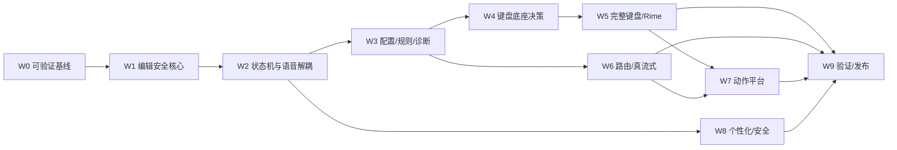

# OpenTypeless 开发任务优先级与实施清单

> 文档版本：1.0  
> 生成日期：2026-08-12  
> 适用仓库：`dengxuezhao/opentypeless`  
> 代码基线：`main@67be488dcd2e9f36520618f9f644f97c3ec02b98`  
> 目标读者：产品负责人、Android/IME 工程师、语音与模型工程师、安全工程师、测试工程师，以及 Codex / Claude Code 等编码代理  
> 状态：**拟议目标方案（Proposed Target Architecture）**；涉及键盘底座、许可证和 Rime 集成的不可逆决策，必须先完成 ADR 技术验证

## 1. 使用规则

本清单将长期方案拆成可独立审查的任务。每次实现只选择一个任务 ID，必要时带上其直接依赖；禁止把一个 Wave 当作一个“大任务”一次性完成。

### 优先级

| 级别 | 含义 |
|---|---|
| P0 | 安全、数据正确性、构建门禁或关键路径，后续功能不得绕过 |
| P1 | 达到优秀可用产品所需 |
| P2 | 增强能力，可在核心稳定后执行 |

### 规模

| 级别 | 含义 |
|---|---|
| XS | 单一小改动，几乎无接口影响 |
| S | 一个清晰组件或测试 |
| M | 一个垂直切片，包含实现和测试 |
| L | 跨若干组件，但仍应保持单一目标 |
| XL | 必须先再拆子任务，不能直接交给编码代理 |

规模不是工期承诺，只用于控制 PR 复杂度。任何 `L/XL` 任务开始前都应在 Issue 中进一步拆分。

### 状态

```text
TODO
IN_PROGRESS
BLOCKED
REVIEW
DONE
DEFERRED
```

---

## 2. 严格顺序与阶段门禁



### Gate 0：可开发

- `main` CI 绿灯；
- 最新验收报告对应当前 commit；
- 根目录 `AGENTS.md` 生效；
- Test Host 可运行。

### Gate 1：可安全扩展

- 所有编辑器写入经过 EditorTransaction；
- 语音 partial/final、Undo、Raw 已迁移；
- 切 App/字段竞态测试为 0 误写；
- CompositionCoordinator 接管语音组合。

### Gate 2：可选择键盘底座

- 新配置域和诊断可用；
- 两条底座完成相同垂直切片；
- 性能、功能、许可证和上游成本有证据；
- ADR 标记 Accepted。

### Gate 3：可进入 Beta

- 完整 QWERTY；
- Rime/小鹤基本可用；
- RecognitionRouter；
- 至少一条真流式路线；
- Action Protocol v1；
- 密码字段和隐私测试通过。

### Gate 4：可发布 1.0

- 全部 P0 完成；
- P1 未完成项明确不影响承诺；
- 小米 15/HyperOS 认证；
- 升级、签名、SBOM、校验和；
- 无 P0/P1 已知缺陷。

---

## 3. 可并行工作

只有在接口已冻结后才能并行：

- `UI-*` 可与 `DIA-*` 并行，但依赖相同 Config/Resolver；
- `KSP-*` 的两个底座 Spike 可并行；
- `REC-*` Provider Adapter 可并行，但统一事件模型先完成；
- `ACT-*` UI 可在 ActionRuntime 接口冻结后并行；
- `DAT-*` 学习 UI 可在数据模型和建议状态机完成后并行；
- 测试用例设计可以提前，但不能声称通过未实现功能。

不得并行：

- 两套组件同时直接提交 `InputConnection`；
- 新旧语音引擎同时写入；
- 数据迁移和数据模型仍反复变化时做正式同步；
- 键盘底座未决时大量写底座特定业务逻辑。

---

## 4. 任务清单


## W0 可验证基线
| ID | P | 规模 | 任务 | 依赖 | 交付物 | 验证/验收 | 状态 |
|---|---|---|---|---|---|---|---|
| `BLD-001` | P0 | S | 修复 aapt2 依赖校验元数据 | — | 更新 `android/gradle/verification-metadata.xml`，保留严格校验 | 干净 CI 中 `processDebugResources` 通过；报告中的 aapt2 哈希与 Google 仓库实际产物一致 | DONE |
| `BLD-002` | P0 | S | 固化 Android SDK/Build Tools 安装 | BLD-001 | CI 明确安装 Platform 35、Build Tools 35.x 和所需 emulator image | 无依赖 runner 预装版本的漂移；本地构建说明一致 | DONE |
| `BLD-003` | P0 | S | 更新过时 GitHub Actions | BLD-001 | 升级 setup-java 等 Action，并继续固定到可信版本/commit | CI 无弃用警告；权限最小化 | DONE |
| `BLD-004` | P0 | S | 拆分 Android CI 日志与测试报告 | BLD-001 | Unit、Lint、Assemble、Instrumentation 独立 step 并上传报告 | 失败能定位到具体阶段；测试 XML 与 Lint 报告可下载 | DONE |
| `BLD-005` | P0 | M | 建立干净构建脚本 | BLD-001 | `scripts/verify_android.sh` 或等价脚本执行哈希、test、lint、assemble | 本地与 CI 使用同一命令；脚本非交互、失败即退出 | DONE |
| `BLD-006` | P0 | S | 生成最新基线验收报告 | BLD-001..005 | 以 `67be488` 或修复后的新 SHA 重新记录实际测试、APK、已知限制 | 报告不引用旧工作树结果；所有数字可由命令复现 | DONE |
| `BLD-007` | P0 | S | 配置 main 分支保护门禁 | BLD-004 | Required checks、禁止强推、PR 审查规则说明 | 无法在红 CI 下合并；发布 Tag 只来自受保护分支 | DONE |
| `BLD-008` | P0 | S | 建立架构契约测试包 | BLD-005 | 创建 `architecture` 测试入口和 package/module 依赖约束 | 能阻止 UI/Provider 直接依赖未来的 InputConnection 写接口 | DONE |
| `BLD-009` | P1 | S | 增加代码规模与复杂度基线 | BLD-005 | 记录关键类行数、方法复杂度、APK 大小、测试数量 | CI 生成趋势；不把指标作为机械失败条件 | DONE |
| `BLD-010` | P0 | M | 建立 IME 测试宿主 App 骨架 | BLD-005 | 独立 debug test-host，包含多类输入框和选区操作 | 可从 Instrumentation 自动切换字段并验证文本 | DONE |
| `BLD-011` | P0 | XS | 修复 AndroidTest 严格依赖校验缺失的 Coroutines BOM POM | BLD-005 | 为 CI instrumentation 实际解析到的 `kotlinx-coroutines-bom:1.6.4` POM 补充独立核对的 SHA-256，保持 strict verification | clean CI 的 API 26/33/35/36 instrumentation 配置解析通过；不得使用 lenient/off 或替换依赖 | DONE |
| `DOC-001` | P0 | S | 把规范包纳入仓库 docs | — | 提交本规范并建立索引 | 根中英文 README/AGENTS 可发现；16 文件索引与本地链接验证通过 | DONE |
| `DOC-002` | P0 | S | 建立 ADR 目录和模板 | DOC-001 | `docs/adr/`、状态、背景、选择、后果、验证 | ADR 生命周期、模板、索引、4/4 负向门禁与根入口验证通过 | DONE |
| `DOC-003` | P1 | S | 建立变更日志与兼容表 | DOC-001 | Android/desktop/config/protocol/schema 兼容矩阵 | 每个协议或数据版本变更可追踪 | DONE |
| `DOC-004` | P0 | S | 提交根目录 AGENTS.md | DOC-001 | 定义编码代理禁止事项、测试命令和交付格式 | Codex/Claude 执行任务前可自动读取 | DONE |

**BLD-002 完成说明（2026-08-14，`DONE`）：** GitHub Actions 现以全局常量固定 Android Platform 35、
Build Tools 35.0.0、`google_apis` 与 `x86_64`，`check-android` 和 API 26/33/35/36 emulator job 都先用
`sdkmanager` 显式安装并回读所需 package；设备 job 还在 runner 启动前安装并核对精确
`system-images;android-<api>;google_apis;x86_64` package path，不再依赖 runner 预装 SDK/image。
新增 fail-closed 本地 verifier 与 3/3 fault-injection 测试，并接入 `scripts/verify_android.sh`；根中英文
README 同步固定本地安装命令。Google 官方仓库 XML 实际包含 Platform/Build Tools 与四个 image 坐标；
标准 strict verify 和空白 `GRADLE_USER_HOME` verify 均为 187 tasks `BUILD SUCCESSFUL`。当前工作树未推送，
因此该提交的远端 GitHub Actions run 为 **NOT RUN**；本任务只完成可审查的 CI wiring/package pinning，
不冒充远端执行，也不夹带 BLD-003 Action 升级或 BLD-004 report 拆分。

**BLD-011 完成说明（2026-08-19，`DONE`）：** PR 99 的 CI run `32151719766` 在 API 26/33/35/36
instrumentation 阶段均因 `org.jetbrains.kotlinx:kotlinx-coroutines-bom:1.6.4` 的 POM 未登记而被严格
dependency verification 拒绝；本地 `:app:mergeDebugNativeLibs` 与已有缓存下的
`:test-host:connectedDebugAndroidTest` 不能触发该缺失配置，后者实际完成 20 项（8 项跳过、0 失败）。
从 Maven Central 读取的 POM SHA-256 为
`ab2614855fba66aa8a42514dbe3d5a884315ffe1ed63f5932e710a8006245ce1`，与本地缓存字节一致；现已只补入
`android/gradle/verification-metadata.xml`，未关闭校验、未改版本、未加依赖。远端修复后的 CI 尚未运行，
因此 clean CI 通过仍记为 **NOT RUN**，不冒充 PASS。

**BLD-003 完成说明（2026-08-14，`DONE`）：** 全部 13 个 workflow、51 个远程 `uses:` 已改为
官方 tag 解析出的 40 位 immutable commit；21 个 action surface 由 fail-closed allowlist 维护。核心升级包括
checkout v7.0.1、setup-java v5.7.0、setup-node v7.0.0、upload-artifact v7.0.1、CodeQL v4.37.7、
setup-android v4.0.1、setup-gradle v6.3.0、labeler v7.0.0、stale v11.0.0 与 Tauri action v1.0.0；
`dtolnay/rust-toolchain`、SignPath、emulator-runner 已是官方当前 commit，保持精确 SHA。所有 checkout
显式 `persist-credentials: false`；`pull_request_target` workflow 禁止 checkout；CodeQL 补齐
`contents: read`，并拒绝 `write-all`、`read-all`、`id-token: write`、`actions: write` 与未审计 action。
新增 verifier 与 3/3 fault-injection，root verifier 总计 11/11；标准/空缓存 strict verify 都为 187 tasks
`BUILD SUCCESSFUL`。空缓存首轮仅在 Gradle wrapper 下载阶段超时，原配置重试后通过。当前工作树未推送，
远端 GitHub Actions 为 **NOT RUN**；不夹带 BLD-004 job/report 改造。

**BLD-004 完成说明（2026-08-14，`DONE`）：** `check-android` 已拆为 preflight、Unit/Architecture、Lint、
Assemble 四个命名 step；API 26/33/35/36 matrix 使用同一脚本的 instrumentation stage。默认
`scripts/verify_android.sh` 仍执行一键全量 strict verify，CI 只通过其五个显式 stage 入口调用，不形成第二套
构建命令。Unit XML/HTML、Lint HTML/XML/SARIF、五个 APK 与每个 API 独立的 Instrumentation 输出均使用
固定 `upload-artifact` SHA；失败时报告 step 仍以 `always()` 执行，缺报告只告警，APK 缺失则 fail closed，
保留期固定 14 天。新增 fail-closed topology verifier 与 3/3 fault-injection，并把根 verifier 14/14 接入
preflight。实际 staged Unit 67 tasks、Lint 24 tasks、Assemble 164 tasks 均 `BUILD SUCCESSFUL`；默认一键
verify 仍为 187 tasks（183 executed / 4 up-to-date）`BUILD SUCCESSFUL`。本地已验证 123 个 JVM XML、
Lint HTML/XML 与五个 APK 被 artifact glob 命中。远端 workflow 因工作树未推送仍为 **NOT RUN**；小米
Instrumentation 生成了失败报告，但 Test Host 首次安装被 HyperOS `INSTALL_FAILED_USER_RESTRICTED` 拒绝，
主 App 首个 `AppPickerInstrumentedTest` 也在真机停滞，均未冒充 PASS，留后续设备验收定位。

**BLD-006 完成说明（2026-08-14，`DONE`）：** 新增
`docs/2026-08-14-android-baseline-acceptance.md`，记录精确 HEAD、排除报告自身的全候选内容 SHA-256、
构建环境、格式/模型版本、实际自动化计数、五个 APK 与 Sherpa AAR 哈希、远端 CI 状态及小米 10 Ultra
失败证据。报告明确区分本地 **PASS**、远端/设备 **NOT RUN** 与设备 **FAIL**：本地 canonical verify 为
187 tasks、app JVM 777/777、source architecture 95/95、compiled architecture 94/94、variants 2/2；
GitHub-hosted run 因未推送为 NOT RUN；Test Host 被 HyperOS `INSTALL_FAILED_USER_RESTRICTED` 拒绝，主 App
82 项 instrumentation 在首项 started 后停滞，0/82 不冒充通过。当前共享工作树不是不可变 commit，release
APK 也未签名，因此报告结论为 **CONDITIONAL / NOT RELEASE-READY**；BLD-006 的交付是可复现且诚实的当前
基线，不代表发布门槛或整个产品 Backlog 已完成。

**BLD-007 完成说明（2026-08-14，`DONE`）：** 已在远端
`dengxuezhao/opentypeless` 对 `main` 实际启用保护并独立回读：管理员同样受保护、strict required checks 共
15 项、必须经 PR、dismiss stale review、要求线性历史与解决对话，强推和分支删除均禁用。仓库当前只有唯一
管理员协作者，为避免不可恢复自锁，required approval 数为 0；这不允许直接 push，也不能绕过 required checks。
期望策略固化在 `.github/main-branch-protection.json`，本地/远端 fail-closed verifier 与 6 个 fault-injection
测试已接入 preflight。Release 与 Windows SignPath workflow 在任何构建/签名前都 checkout 输入 tag、fetch
`origin/main` 并验证 tag commit 是 main 历史祖先；真实 main tag `v1.1.53` PASS，off-main tag `v0.1.28`
稳定拒绝。远端保护设置已生效；本地新增 workflow 尚未推送，故新的 release gate 远端执行仍为 NOT RUN。

**BLD-009 完成说明（2026-08-14，`DONE`）：** 新增 deterministic、`advisory_only=true` 的工程趋势
采集器，记录 7 个关键 Java source 的物理/非空行数、matched method 数与复杂度 proxy 热点，解析 Gradle JUnit
XML 与 source test declarations，并对五个精确 APK 记录 bytes/SHA-256 或显式 unavailable。复杂度定义为清除
注释/字符串后的 decision-token proxy，不冒充正式 cyclomatic complexity，也不设置数值失败阈值。当前基线为
123 XML suites / 871 tests（0 failure/error/skipped）、Android JVM 871、Instrumentation 85、Python 197 个
声明；最大热点为 4,154 行 `OpenTypelessImeService` / `updateMicrophone` proxy 64。CI 在 Assemble 后调用同一
`scripts/verify_android.sh metrics`，并以 fail-if-missing、14 天保留上传 `android-engineering-metrics`；数值漂移
本身不失败。采集器 3/3 单测、CI topology 3/3 与 root 26/26 PASS；基线详见
`docs/2026-08-14-engineering-metrics-baseline.md`。

**DOC-001 完成说明（2026-08-13，`DONE`）：** `docs/opentypeless_specs/` 已包含 16 个 UTF-8 Markdown
文件；`00_README.md` 为其余 15 个文件提供可点击索引，根 `README.md`、`README_zh.md` 与 `AGENTS.md`
均指向该唯一入口。根代理工作流中的 README 与 Backlog 路径已改为仓库内可解析的 canonical path，不再依赖
不存在的根 `00_README.md`。新增 `scripts/verify_docs.py`，离线验证三个根入口、16 个 regular spec files、
本地相对链接与 FULL_SPEC 内部 anchor，并拒绝缺失入口、断链、越界/绝对路径、symlink 和无效 UTF-8；脚本
单测 4/4、真实仓库验证与 `py_compile` 均 PASS。ADR 目录/模板、兼容表和根 AGENTS 的完整独立验收仍分别留
给 DOC-002、DOC-003、DOC-004。

**DOC-002 完成说明（2026-08-13，`DONE`）：** 新增 `docs/adr/README.md` 与
`docs/adr/0000-template.md`，冻结四位单调 ID、kebab 文件名、Proposed/Accepted/Rejected/Deprecated/
Superseded 生命周期，以及 Status、Background、Decision、Consequences、Validation 五个必需章节。
`09_ADR_RESEARCH.md` 中 ADR-001..012 明确保留为历史调研快照，不在本任务静默迁移；新决策从独立 ADR-0001
开始。根中英文 README、根 AGENTS 与规范包入口均可发现 ADR 索引，且根代理规则要求许可证、危险权限、
持久格式、Secret/网络边界、不可逆迁移、editor authority、键盘底座或 Feature Flag 删除条件在实施前引用
`Accepted` ADR。新增 `verify_adrs.py` 及 4/4 单测，覆盖完整记录、非法状态/缺章节、ID/标题/索引漂移、
symlink 与 Accepted placeholder validation；真实仓库验证 PASS，当前独立 ADR 数为 0。

**DOC-003 完成说明（2026-08-14，`DONE`）：** 新增根 `CHANGELOG.md` 与
`docs/COMPATIBILITY.md`，以 23 行机器可读矩阵记录 Android `0.3.0+3`、desktop `1.2.0`、平台边界、
Android/desktop 配置、SQLite、journal、trace、跨端词典、credential、prompt 与协议 authority。矩阵明确
区分 exact migration、bounded legacy reader、`legacy-unversioned`、外部无版本协议和 spec-only Action v1，
不把 App SemVer 或旧 tag 冒充 schema 兼容。新增 fail-closed verifier 锁定 18 个生产 version constant、
四处 desktop version 对齐、Android API matrix、根发现链接与 changelog ID，并拒绝漏表的新常量、静默给
desktop config/history 加版本、未记录的 runtime bump 或把 Action spec 当已实现；4/4 fault-injection 与
root 30/30 PASS，已接入 canonical preflight。本任务不修改任何 runtime 格式，也不伪造历史 release 记录。

**DOC-004 完成说明（2026-08-14，`DONE`）：** 根目录 `AGENTS.md` 已作为 regular UTF-8 contract
独立验收：12 个章节、canonical spec/Backlog/ADR preflight、单 task ID、git/CI 检查、编辑器/隐私/依赖/
数据禁令、Android/设备测试命令、PASS/FAIL/NOT RUN 证据分类、Task Report/Rollback/Git 字段和 BLOCKED
停机条件均由 fail-closed verifier 锁定。根 contract 与规范包 contract 的全部“不得”禁令逐行一致；根文件使用
repository-root path，规范包副本保留 package-relative path。新增 3/3 fault-injection，覆盖路径/顺序、安全禁令、
测试命令、NOT RUN、Rollback 与 blocker 漂移；root verifier 合计 23/23 PASS，并接入 canonical preflight。
本任务不创建 DOC-003 兼容矩阵，也不改 Android runtime。

## W1 编辑安全核心
| ID | P | 规模 | 任务 | 依赖 | 交付物 | 验证/验收 | 状态 |
|---|---|---|---|---|---|---|---|
| `EDT-001` | P0 | S | 定义 EditorSessionSnapshot | BLD-008 | 不可变领域模型、字段长度限制和哈希工具接口 | 纯 JVM 单测覆盖 null、敏感字段、Unicode 和边界 | DONE |
| `EDT-002` | P0 | S | 定义 InputConnectionRegistry | EDT-001 | 以进程内 token 隔离 Android InputConnection | 领域模块无法直接引用 InputConnection；token 失效测试通过 | DONE |
| `EDT-003` | P0 | M | 实现 EditorSessionManager Adapter | EDT-001..002 | 包装现有 epoch、包名、fieldId、选区和指纹逻辑 | 现有 IME 行为不变；切 App/字段生成新 epoch | DONE |
| `EDT-004` | P0 | S | 定义 EditorOperation sealed model | EDT-001 | SetComposition、Commit、Insert、ReplaceSelection、Delete、EditorAction | 序列化仅限需要跨边界的类型；无任意方法名 | DONE |
| `EDT-005` | P0 | S | 定义 EditorTransactionResult | EDT-004 | 零字段 Applied、TargetChanged、Rejected、RolledBack、RollbackFailed 与无正文失败分类 | 所有失败可分类且不依赖异常文案；不前置 CommitRecord | DONE |
| `EDT-006` | P0 | M | 实现 SessionValidator | EDT-003 | 集中验证 epoch、connection、field、selection、fingerprint、sensitive | 旧/迟到 Session 全部拒绝；理由可诊断 | DONE |
| `EDT-007` | P0 | M | 实现 EditorTransactionManager 基础 | EDT-004..006 | owner-thread 应用 Insert/Delete/EditorAction；双重完整校验、exact scoped connection 与 balanced batch | JVM/Instrumentation 覆盖成功、拒绝、竞态和异常；架构门禁锁定唯一 mutator surface | DONE |
| `EDT-008` | P0 | M | 实现安全 ReplaceSelection | EDT-007 | 验证 expected range 和 selected text hash 后替换；selected-origin exact-ID recovery | 选区改变时原文保持不变；Host Undo/Raw 恢复正反向选区 | DONE |
| `EDT-009` | P0 | M | 实现 Composition 操作 | EDT-007 | 未接线的 session-bound set/finish primitive；owner/revision high-water 与失败 poison | 旧 revision、跨 owner、活动期普通写均拒绝；empty Set、敏感零正文和异常 fail closed 已覆盖 | DONE |
| `EDT-010` | P0 | M | 实现 CommitRecord 与原子 receipt/ledger seam | EDT-007..009 | 记录来源、原选区、插入文本、Raw、Session 和 commitId；事务内生成并返回关联 envelope | 不持久化敏感正文；构造边界测试通过；禁止事后查询 latest commit | DONE |
| `EDT-011` | P0 | M | 迁移 Undo 到 CommitRecord | EDT-010 | 现有 Undo 通过统一事务回滚 | 继续输入/切字段/文本变化后不错误撤销 | DONE |
| `EDT-012` | P0 | M | 迁移 Raw Restore 到 CommitRecord | EDT-010 | 只替换可验证的最近语音提交 | 目标或文本变化时转入结果面板/提示 | DONE |
| `EDT-013` | P0 | M | 实现事务回滚路径 | EDT-008..010 | 删除成功但提交失败时恢复原文本/选区 | 模拟 InputConnection 拒绝；区分 RolledBack/RollbackFailed | DONE |
| `EDT-014` | P0 | S | 围绕既有 OperationSource 加入脱敏审计元数据 | EDT-004 | 操作来源进入审计 envelope；不改 EDT-004 构造契约 | 审计不存正文，能追踪操作来源 | DONE |
| `EDT-015` | P0 | M | 禁止非事务编辑器写入 | EDT-007 | source + compiled 双门禁限制全部 editor writer 与间接 IME helper；legacy inventory 只减不增 | CI self-gate、恶意夹具与 Debug/Release production scan 能抓到新增违规调用 | DONE |
| `EDT-016` | P0 | M | 将现有普通按键迁移到事务 | EDT-007 | 空格、标点、删除、回车和当前最小键盘均经 narrow Host façade 生成 LATIN Operation | JVM/真实 Editable/双门禁覆盖；legacy ordinary-key writer inventory 已收缩 | DONE |
| `EDT-017` | P0 | L | 将现有语音 partial/final 迁移到事务 | EDT-009..012 | VoicePipeline Listener 不再自行提交编辑器；同一 SessionManager 复用唯一长寿命 ETM，Feature Flag 新旧互斥 | 切 App、移动光标、迟到 partial、Final 后较大 revision partial 全通过；无 guard/poison 多实例分裂 | DONE |
| `EDT-018` | P1 | S | 编辑核心性能基准 | EDT-007..017 | Session 捕获、校验、按键事务的 microbenchmark | 相对旧路径无不可接受回归，结果记录 | TODO |

**EDT-008 完成说明（2026-08-13，Host core `DONE`）：** 已实现并验证 package-confined 的
安全 `ReplaceSelection` host primitive：expected range/hash 与 live 绝对选区和完整 selected plaintext
双阶段复核，敏感字段零 evidence/ID/batch/write，正反向、空替换、Unicode/上限、hostile input、
selection/authority ABA、begin race 和 false/异常 fail-closed 均有覆盖；Insert/Replace 共用既有唯一
`commitText` sink，writer inventory 仍为七条。只有非敏感 `VOICE` / `ACTION` 的 true-success 可产生保留
noncollapsed origin 的同栈 receipt；false/异常不发布 record。selected-origin Undo/Raw 已通过 exact-ID
single-slot、full-span/live-selection proof 与 `COMMITTED → ORIGINAL → UNDO/RAW` two-stage recovery
接通，正反向选区均不新增 `setSelection` 或 framework writer edge；第一步未确认时不开始第二个 target
mutator，第二步失败也不重试 target，只有 EDT-013 在精确 `ORIGINAL` basis 上允许一次 Final restore。
EDT-017 已用按会话冻结的 Feature Flag 将 production 默认 voice route 接入唯一长寿命 ETM，并使 legacy /
external composing writer 与新路径互斥；EDT-008 的 Host core 现已成为默认 route 的 selection transaction
能力。旧 writer 仅保留在显式 rollback flag 分支，不得与事务路径双写。

**EDT-011 完成说明（2026-08-13，`DONE`）：** 已实现并验证 collapsed/selected-origin、
exact-ID CommitRecord Undo 的 package-confined host primitive，含最长 40,000 code points 全文 suffix
证明、batch 后二次 authority/evidence 校验、折叠单次 code-point delete、selected two-stage 恢复、失败
撤销与普通 `apply(UNDO)` 绕过
门禁。EDT-017 已让默认 voice final 在同一事务栈产出 receipt，并只把 opaque exact commit ID 交给 UI；
Undo façade 再经同一 Manager/ETM 与 ledger proof 执行。`LastVoiceCommit/guardedReplace` 与
`SessionUndoLedger` 只保留在冻结的 rollback flag 分支，事务失败不会回退旧 writer。

**EDT-012 完成说明（2026-08-13，`DONE`）：** 已实现并验证 collapsed/selected-origin、
exact-ID `VOICE` CommitRecord Raw Restore 的 package-confined host primitive。它以 live absolute
selection 和 authority bracket 完成双 `COMMITTED` proof，删除 Final 后先证明 `ORIGINAL` 才插入 Raw，
再以完整 `RAW` proof 判定终态；两段正文各支持最多 40,000 code points / 80,000 UTF-16 units，且
delete/insert 均要求 true ack 与相应 proof 同时成立；第一步 false/异常不开始 Raw target，第二步失败不
重试 Raw，只能交给 EDT-013 的 exact `ORIGINAL` 安全恢复判定。普通 `apply(RAW_RESTORE)` 被拒绝，敏感
字段零 evidence，两个 target mutator 复用既有 dispatcher，writer inventory 仍为七条 edge。
EDT-017 已把默认 voice receipt 与 Raw UI 接入 exact-ID façade；Raw replacement 只能从同一 ledger record
读取，UI/Service 不提供正文授权参数。`LastVoiceCommit/guardedReplace` 与 `SessionUndoLedger` 只保留在
冻结的 rollback flag 分支，默认事务路径不会失败后回退。

**EDT-013 完成说明（2026-08-13，Host core `DONE`）：** exact-ID selected-origin Undo 与 Raw Restore 的
第二个 target 写失败后，只有 owner-bound one-shot `ORIGINAL → ORIGINAL` proof 精确绑定同一 owner、
epoch/token、authority revision、connection、live absolute selection、完整正文关系与 original context，
才允许从同一 ledger record 取 committed Final 并经既有 dispatcher 尝试一次恢复。restore 必须 true ack
且完整 `COMMITTED` proof 成立才返回 `RolledBack` 并保留 exact slot 供显式重试；unsafe basis 固定为
`RESTORE_TEXT/NOT_SAFE_TO_ATTEMPT`，false/异常或终态无法证明均为精确 `RollbackFailed` 并撤销 slot。
门禁锁定唯一 `RolledBack` constructor caller、7 条 prepare 与 5 条 validate edge，framework writer
inventory 仍为七条；未新增 `setSelection`、权限、组件、依赖、持久化或正文诊断。EDT-017 已完成默认
production voice receipt 与 Undo/Raw UI 接线；该 recovery 仍仅服务 exact-ID 事务，不能扩为普通重试器。

**EDT-014 完成说明（2026-08-13，`DONE`）：** 新增不可变 `EditorTransactionAudit`，精确记录既有
六值 `OperationSource`、七值 `EditorOperationKind` 与调用方收到的同一无正文
`EditorTransactionResult`，不修改 EDT-004 operation 构造器。exact `EditorTransactionManager` 在普通
receipt、Undo 与 Raw 的每个稳定终态返回前恰好投递一次；package-confined `AuditSink` 异常与重入均不能
覆盖结果或产生额外写入。envelope 不含正文、Session、selection、fingerprint、commit ID、receipt、
timestamp、Android capability、Throwable 或执行回调，也不序列化、不持久化、不联网。source/compiled
门禁锁定唯一构造者、唯一 sink caller、七种 kind 映射和 Debug/Release 精确调用边；framework writer
inventory 保持七条。production 默认 sink 为 no-op，未来 DiagnosticStore/导出/UI 仍属于 DIA 任务。

**EDT-015 完成说明（2026-08-13，`DONE`）：** source gate 与 Debug/Release compiled gate 已组成
fail-closed 双边界，覆盖直接 `InputConnection` mutator、会间接写 editor 的 `InputMethodService` helper、
method reference、反射/方法句柄、生成代码、Kotlin、wrapper、lambda、类型擦除与 capability transfer。
exact ETM framework writer inventory 仍为七条；现有 transitional legacy writers 继续以 owner/descriptor/
opcode/count 精确登记，任何扩张或漂移均失败，只能由 EDT-016/017 在迁移时收缩。CI wiring self-gate 锁定
workflow 直接入口、strict dependency verification、production source scan、`:architecture-gate:check`、
Debug/Release exports 与 Gradle `check` 依赖。EDT-015 不迁移 ordinary-key/voice runtime writers，也不改变
EditorOperation、权限、组件、依赖、持久化、网络或日志；这些边界仍分别属于 EDT-016/017。

**EDT-016 完成说明（2026-08-13，`DONE`）：** 当前最小键盘的空格、标点、删除与回车已从 Service
direct writer 迁到 manager-owned ETM。折叠与非折叠 selection 分别生成 Insert/Delete 或 exact
ReplaceSelection；回车只执行 allowlisted semantic action，否则插入换行，旧 KeyEvent/直接 writer 不再作为
fallback。fresh snapshot、双 authority/evidence、absolute selection、敏感零正文、active composition 拒绝和
事务失败零补写均有 JVM/真实 Editable 覆盖。source/compiled gate 锁定窄 KeyboardHost、exact façade/caller/
transaction edges，并只收缩 legacy ordinary-key inventory；ETM framework writer 仍七条。EDT-017 已完成
voice、Undo/Raw 与全局 writer 的按会话互斥切换；完整 QWERTY/Rime 仍属于 KBD/RIM 任务。

**EDT-017 完成说明（2026-08-13，`DONE`）：** 新增默认开启、每个 voice capture 只读取一次的
`VoiceEditorTransactionConfig`，使 legacy 与 transaction writer 在整个 session 内互斥且无失败 fallback。
V1 `VoiceCompositionSession` 与 V2 `EditorProjection` 的 production callback 都先进入 capability-free、
generation-bound 的 `VoiceTransactionSession`：partial 只按严格递增 revision 调用 SetComposition；Final 在
post 前 terminalize，丢弃全部 late partial，并在 processed Final 与最后 partial 不同时先 Set、fresh recapture、
再 Commit。选区 partial 仅 preview，取消、错误、切字段/应用、finish/close 均 fail closed。

唯一长寿命 `EditorSessionManager` 提供六个不泄露 `InputConnection` 的 voice façade；成功 Final 的同栈
receipt 只提取 opaque commit ID，Undo/Raw 随后仍需 exact ledger 与 live proof。source/compiled gate 锁定
capability-free session、default-on/frozen flag、六个 façade、十条 Service→Manager 精确调用边和 Debug/Release
一致性；ETM framework writer inventory 保持七条。app JVM **638/638**、source **76/76**、compiled gate
**64/64**、production variants **2/2**、API36 emulator 定向 **27/27** 均 PASS；strict 全量 187 tasks PASS。
小米 10 Ultra 因系统安装限制 `INSTALL_FAILED_USER_RESTRICTED` 未能落包，真机 Instrumentation 明确
`NOT RUN`，不以模拟器结果冒充。

## W2 状态机与语音解耦
| ID | P | 规模 | 任务 | 依赖 | 交付物 | 验证/验收 | 状态 |
|---|---|---|---|---|---|---|---|
| `CMP-001` | P0 | S | 围绕既有 CompositionOwner 定义 CompositionState | EDT-009 | 九个 sealed immutable variant 固定 owner；正 generation 与 composition revision 不变量 | 精确 variant/component/owner 矩阵与非法边界 JVM 测试 7/7；非法双 owner 状态不可构造 | DONE |
| `CMP-002` | P0 | M | 实现 CompositionCoordinator | CMP-001 | 申请、更新、提交、取消、抢占接口 | 纯 JVM 状态机测试覆盖所有转移 | DONE |
| `CMP-003` | P0 | S | 定义冲突策略配置 | CMP-002 | Rime→Voice、Voice→Key、Action→Voice 等明确策略 | 默认策略写入产品文案和测试 | DONE |
| `CMP-004` | P0 | M | 接入当前 Voice composition | CMP-002, EDT-017 | partial 由 Coordinator 获得 VOICE owner | 取消/Final/错误均释放 owner | DONE |
| `CMP-005` | P0 | M | 处理键盘打断语音 | CMP-003..004 | 按冻结配置提交可见 partial 或取消，重新捕获 Session | two-phase release 后键仅写一次；late partial 拒绝、Final 单次 claim；JVM/gate/小米定向运行通过 | DONE |
| `CMP-006` | P0 | M | 处理输入框生命周期取消 | CMP-004 | onStart/FinishInput、finish view、window hidden、destroy、screen off 统一 cancel | cancel-only；迟到回调拒绝；JVM/gate/小米 Android Runtime 通过 | DONE |
| `VOC-001` | P0 | S | 定义 VoiceController 接口 | CMP-004 | start/stop/cancel/state/events，不暴露 UI/数据库 | 旧 VoicePipeline 由唯一 Adapter 实现；三类生产调用方均经 Controller，JVM/source/compiled/full verify 通过 | DONE |
| `VOC-002` | P0 | M | 抽取 AudioCapture 接口 | VOC-001 | 把 AudioRecorder/RecordingSession 包装为纯语音采集边界 | VAD、停止、取消、上限回归通过 | DONE |
| `VOC-003` | P0 | M | 抽取 TextProcessingPipeline | VOC-001 | 确定性、命令、LLM、Integrity 分阶段接口 | 四阶段接口已接现有终态流程；等价、失败分类、脱敏与 source/compiled/full verify 通过 | DONE |
| `VOC-004` | P0 | M | 抽取 VoiceResult/Provenance | VOC-003 | Raw、deterministic、candidate、final 和 stage provenance | 单一不可变 VoiceResult 已接 Raw/事实保护/历史；模型、门禁与 full verify 通过 | DONE |
| `VOC-005` | P0 | M | 把个性化从 VoicePipeline 移出 | VOC-003 | PersonalizedTextProcessor 作为独立 Stage | 独立 stage、失败策略、exact edges 与 663 JVM 回归通过 | DONE |
| `VOC-006` | P0 | M | 把 LLM 和 Integrity 从 VoicePipeline 移出 | VOC-003 | OptionalLlmStage/IntegrityGuardStage | 双 stage、失败语义、exact edges 与 669 JVM 回归通过 | DONE |
| `VOC-007` | P0 | M | 缩小 VoicePipeline 为兼容 Facade | VOC-002..006 | 旧调用方通过新组件运行，Facade 只编排 | 165 行 Facade、唯一 runtime 委托、678 JVM 回归与 source/compiled/full verify 通过 | DONE |
| `VOC-008` | P0 | M | 迁移 Teach 入口 | EDT-010, VOC-004 | Teach 只从同栈 CommitRecord 或已持久化 HistoryEntry 读取差异 | 敏感/no-learning 不可用；JVM、source/compiled gate、Debug/Release 与小米定向测试通过 | DONE |
| `VOC-009` | P1 | S | 统一语音状态本地化模型 | VOC-001 | Preparing/Listening/Partial/Finalizing/Processing/Error | UI 不解析英文内部 message | TODO |
| `VOC-010` | P1 | M | 外部 RecognitionService 与 IME 状态隔离 | VOC-001 | 每个 Binder 调用独立 Session/Scope | 外部会话不覆盖 IME composition | TODO |
| `VOC-011` | P0 | S | 旧语音路径 Feature Flag | VOC-007 | canonical `voice_engine_v2` 同步迁移/切换；每 session 冻结且新旧互斥 | Debug/真机 A/B、legacy-key 迁移、生产同步回滚与 source/compiled gate 通过 | DONE |
| `VOC-012` | P0 | L | 删除遗留直接提交路径 | VOC-011, EDT-015 | 新路径稳定后移除旧 InputConnection 写逻辑 | 静态门禁和完整回归通过 | TODO |

**CMP-003 完成说明（2026-08-13，`DONE`）：** 新增纯领域 immutable
`CompositionConflictPolicy`，以三个闭合配置值覆盖 Rime→Voice、visible Voice partial→Key 与
Action→Voice，并把 Latin/Rime→Action、Voice 无 partial/Finalizing 的安全行为固定为完整矩阵。默认策略为
提交 Rime、提交可见 voice partial、释放 Action owner 并把 displaced result 留在结果面板；用户可选择取消
Rime/Voice 或丢弃 Action result。四个 `Decision` 只包含 CMP-002 `ReleaseDirective` 与结果面板元数据，
不是 release proof/editor authority。纯 JVM policy 6/6、Composition 域合计 30/30、app JVM 644/644、source
76/76、compiled 64/64、Debug/Release 2/2 与 strict 187 tasks 均 PASS。真实 Coordinator↔ETM release、
当前 Voice direct-owner 接线由 CMP-004 完成；键盘抢占、Rime/Action 接线与设置存储/UI 仍分别属于
CMP-005、RIM/ACT 后续任务和 CFG/UI。

**CMP-004 完成说明（2026-08-13，`DONE`）：** EDT-017 默认 transaction Voice route 现在只从
Service-owned 唯一 `CompositionCoordinator` 的 exact Idle observation 获取 VOICE owner；capability-free
`VoiceTransactionSession` 绑定该 observation，并把 ready、严格递增 partial revision、Finalizing、物理
commit/cancel 与 Idle release 串成单一路径。Final、取消和错误只有在 Manager/ETM typed result 明确证明
composition 已完成时才释放 owner；不确定 cleanup 保持 VOICE fail-closed，只有 editor lifecycle 撤销旧
lease 后才能安全释放。source/compiled gate 锁定唯一 Coordinator、唯一 bridge 与 exact 调用边，ETM writer
inventory 仍为七条。键盘抢占策略、Rime/Action preemption 与统一 lock/window lifecycle 取消分别保留给
CMP-005、RIM/ACT 后续任务和 CMP-006。

**CMP-005 完成说明（2026-08-14，`DONE`）：** transaction Voice route 的具体内容键现在先经
`CompositionConflictPolicy` 冻结 Voice→Key decision，再由同一 capability-free `VoiceTransactionSession`
执行 exact `beginPreempt/finishPreempt` handshake。Preparing/Listening 取消；可见 partial 按默认配置提交，
也可由已冻结的 cancel 配置清空；等待 Final 时只把迟到结果送到结果面板/可恢复草稿。物理提交/取消仍只经
Manager/ETM，成功 release 后重新捕获 Session 再执行一次键盘 façade；不确定结果保持 pending 并拒绝键，
editor lifecycle 撤销旧 lease 后才释放。late partial 在 begin 后全部拒绝，正常 Final 与 detached Final 都是
单次 claim。opaque preemption 不持有正文或 editor capability，source/compiled gate 锁定 shape、caller、
两阶段 edge 与生产调用次数，ETM framework writer inventory 仍为七条。设置持久化/UI、Rime/Action 抢占和
switch-key 仍分别属于 CFG/UI 和后续 RIM/ACT 任务。

**CMP-005 体验修复（2026-08-19）：** 键盘打断 Finalizing Voice 时不再把迟到 Final 转成强制处理的恢复项；
已显示 partial 仍按冻结策略提交或取消，随后只执行一次键盘事件。加密恢复能力退到“⋮”菜单，不再占据主状态、
禁用普通按键或阻止下一次录音；用户主动开始新录音时显式替换旧恢复项。插入/放弃菜单操作改为单次执行。
Session、target/fingerprint、`UNCERTAIN` fail-closed 与唯一 ETM writer 均保持不变。
最终 app/architecture JVM、Release lint、Debug/Release/AndroidTest assemble 均 PASS；API35 arm64 模拟器
`VoiceEditorTransactionSessionInstrumentedTest` 4/4 PASS，最终 3 个产品 APK 与 2 个测试 APK 资源扫描 0 违规。

**CMP-006 完成说明（2026-08-14，`DONE`）：** Service 的 start/finish input、finish view、window hidden、
destroy 与动态 non-exported `ACTION_SCREEN_OFF` receiver 现在全部进入同一个 cancel-only 边界。边界先
terminalize 并移除 active/detached target，再调用 exact `VoiceController.cancel()`；所有排队 route/state/
ready/transcript/result/error 都按 target identity + terminal gate 丢弃，不再等待后台 Final。receiver 注册失败
时 Voice 启动 fail closed，destroy 注销 receiver 并立即关闭资源；只允许非敏感、非选区的已验证 partial 进入
既有加密 recovery draft。source/compiled gate 锁定 shape、五个 lifecycle callsite、receiver method-reference、
register/unregister/cancel 精确边并拒绝旧 deferred-finalization gate；清理不确定时 restart guard 保持到真实
editor-session rotation，绝不在 screen-off/window hide 时提前释放 owner。ETM framework writer inventory
仍为七条。app JVM 781/781、source 96/96、compiled 95/95、Debug/Release 2/2、strict 187 tasks 与小米定向 Android
Runtime 3/3 均 PASS。真实默认 IME + 麦克风的系统熄屏 E2E 仍归 TST-002/TST-010，不影响本任务的 wiring
和 fail-closed DoD。

**VOC-001 完成说明（2026-08-13，`DONE`）：** 新增 data-only `VoiceController`，精确冻结
`start/stop/cancel/state/events` 与四个兼容状态；`VoicePipelineAdapter` 是旧 pipeline 四个核心方法的唯一
production caller。IME Service、Voice Lab 和标准 RecognitionService engine 均持有一个 Controller 并经
Adapter 启动、停止、取消或读取状态；恢复、显式丢弃 checkpoint、预热、attribution 与 shutdown 保持为旧
lifecycle API，未扩入接口。app JVM 649/649、source 77/77、compiled 67/67、Debug/Release 2/2 与 strict
187 tasks 均 PASS。VOC-001 本身不抽取 AudioCapture/文本处理 stage，也不完成 VOC-009 状态本地化；
AudioCapture 已由下述 VOC-002 完成，状态仍留 VOC-009，文本 stage 由 VOC-003 切片完成。

**VOC-003 完成说明（2026-08-13，`DONE`）：** 新增 capability-free `TextProcessingPipeline` 与
package-private final `StagedTextProcessingPipeline`，精确接通 deterministic、local command、optional LLM
和 Integrity 四个阶段；dispatcher 各持一个 stage，`VoicePipeline.finishTranscription` 保持原有处理顺序、
cancellation/generation、普通 Exact fallback、选区 fail-closed 与事实保护语义。content-bearing request 的
`toString()` 固定脱敏，且 source/compiled 门禁禁止其流向 Provider/UI/Adapter、数据库或 editor capability。
新增 JVM 3/3、app JVM 652/652、source 78/78、compiled 69/69、Debug/Release 2/2 与 strict 187 tasks 均
PASS。VOC-003 不实现 TextArtifact/provenance，也不迁移个性化、LLM/Integrity 实现或缩减兼容 Facade；分别
留给 VOC-004、VOC-005、VOC-006 与 VOC-007。

**VOC-004 完成说明（2026-08-13，`DONE`）：** 新增 immutable `VoiceResult` 与 content-free
`StageProvenance`，把 Raw、deterministic、candidate、final 和六阶段闭集 disposition 收敛为唯一终态对象。
`DictationResult` 不再拥有重复正文或 AI accepted boolean；兼容访问器全部委托 `VoiceResult`。Integrity 使用
的 exact candidate、transaction Raw、Voice Lab/RecognitionService final、recovery diagnostics 与加密 History
均从同一对象取值，既有 History schema/加密、网络、权限和 editor writer 不变。模型 JVM 6/6、app JVM
658/658、source 79/79、compiled 71/71、Debug/Release 2/2 与 strict 187 tasks 均 PASS。stage 实现迁移、
AudioCapture 已由 VOC-002 完成；Facade 缩减仍属于 VOC-007。

**VOC-005 完成说明（2026-08-13，`DONE`）：** 新增 package-confined final
`DeterministicPersonalizationStage`，把 `PersonalizedTextProcessor.apply`、普通插入
`PRESERVE_INPUT` 的 20,000-code-point 有界原文回退和选区 `PROPAGATE` fail-closed 语义完整移出
`VoicePipeline`。Pipeline 只构造该 stage，VOC-003 dispatcher 的两次 deterministic 顺序、matched term/correction
IDs、command/LLM/Integrity 输入和 VOC-004 provenance 均保持不变。stage JVM 5/5、processor 11/11、app JVM
663/663、source 80/80、compiled 72/72、Debug/Release 2/2 与 fresh-cache strict 187 tasks 均 PASS。VOC-005
没有迁移 LLM/Integrity、AudioCapture 或缩减 Facade；前两项已由 VOC-006/VOC-002 完成，Facade 留 VOC-007。

**VOC-006 完成说明（2026-08-13，`DONE`）：** 新增 package-confined final
`OpenAiOptionalLlmStage` 与 `TranscriptIntegrityGuardStage`，把 system/user Prompt 组装、共享 client 的 LLM
completion 和事实保护校验移出 `VoicePipeline`。前者继续复用同一个 `OpenAiCompatibleClient` 与 cancellation，
后者保持无字段；两者均不吞异常或自行 fallback。普通处理失败继续回退 deterministic Exact，选区失败继续保留
原文。stage JVM 3/3 + 3/3、app JVM 669/669、source 81/81、compiled 73/73、Debug/Release 2/2 与 fresh-cache
strict 187 tasks 均 PASS。VOC-006 没有抽取 AudioCapture 或缩减 Facade；前者已由 VOC-002 完成，后者留 VOC-007。

**VOC-002 完成说明（2026-08-13，`DONE`）：** 新增 exact `AudioCapture` 与唯一
`AndroidAudioCapture` adapter，把 package-confined `AudioRecorder`/`RecordingSession`、opaque owner-bound
Session、batch/stream PCM、attribution、stop/cancel 收敛为纯采集边界。`VoicePipeline`、本地 Speech Core v2
与 Paraformer 均已迁移，继续共用既有 VAD、静音裁剪、manual endpointing 和 5..540 秒上限；无网络、文本处理、
editor 或持久化能力进入接口。Audio/VAD JVM 27/27、app JVM 675/675、source 83/83、compiled 75/75、
Debug/Release 2/2 与 fresh-cache strict 187 tasks 均 PASS；3 个新增 AndroidTest 已编译但小米安装仍受
`INSTALL_FAILED_USER_RESTRICTED` 阻止，设备执行为 NOT RUN。VOC-002 不缩减兼容 Facade，仍留 VOC-007。

**VOC-007 完成说明（2026-08-13，`DONE`）：** 将原 1,741 行 `VoicePipeline` 实现移动到 1,727 行、
package-private final 的 `VoicePipelineRuntime`，public final 兼容 Facade 仅 165 行、只持有一个 private final
runtime，并对历史 constructor、生命周期与 pure compatibility seam 做 21 条一对一委托。Adapter 与旧调用方
表面不变，VOC-002..006 的行为与 exact owner edges 迁到 runtime；Facade 不再持有 capture、network、文本处理、
executor、recovery-store 或 editor capability。Facade JVM 3/3、Voice 状态 24/24、app JVM 678/678、source
84/84、compiled 77/77、Debug/Release 2/2 与 fresh-cache strict 187 tasks 均 PASS。新增 AndroidTest 1 case 已
编译；小米安装仍受 `INSTALL_FAILED_USER_RESTRICTED` 阻止，设备执行为 NOT RUN。

**VOC-008 完成说明（2026-08-15，`DONE`）：** Teach 入口现只接受成功 transaction 同栈返回的 exact
`CommitRecord`，或已经持久化并重新读取的 `HistoryEntry`。`LastVoiceCommit` 只保留一个 final
`teachRecord` 引用；legacy 复制的 Raw/Final/package 字段不再授权或填充 Teach。IME 菜单统一经
`TeachCorrectionResolver.isEligible` 校验 VOICE、learning permission、Raw presence 与非空 committed text，
并由唯一 `HistoryActivity.createTeachIntent(Context, CommitRecord, long)` factory 创建 draft。legacy/
rollback route 没有 exact record 时隐藏 Teach；敏感和 no-learning 均不可用。app JVM 783/783、Teach resolver
5/5、source 97/97、compiled gate 96/96、Debug/Release 2/2 与 fresh-cache strict 187 tasks 均 PASS；小米
10 Ultra exact Activity recreation Instrumentation 1/1 PASS。没有新增 dependency、权限、component、网络、
持久格式、editor writer 或正文日志。

**VOC-011 完成说明（2026-08-15，`DONE`）：** 将 EDT-017 既有默认 transaction writer 开关正式命名为
canonical `voice_engine_v2`，保留 process-local store，并同步迁移旧 `enabled` 值。canonical/legacy 冲突
时 canonical 优先，旧键删除；迁移失败不改变本次已读 route，显式切换使用同步 `commit()` 并拒绝 async
`apply()`。两入口进程内同步串行，IME 仍只在 capture 时读取一次并冻结整个 session，失败不跨 writer
fallback。source 98/98、compiled gate 96/96、Debug/Release 2/2、AndroidTest compile 与小米 10 Ultra
canonical/default/A-B/legacy migration 定向 1/1、fresh-cache strict 187 tasks 均 PASS。VOC-012 才删除
legacy writer，REL-004 再定义 Flag 删除条件。

**CFG-001 完成说明（2026-08-13，`DONE`）：** 新增纯 Java sealed `ProviderConfig`，只允许
ASR/LLM/Connector 三种 final record，以及 exact Kind 的 opaque `SecretRef`。ID、Unicode 文本、Endpoint、
HTTP/HTTPS、Secret kind/transport 与 redacted diagnostics 均在构造期 fail closed；不接线、不迁移旧
`AppSettings`，也不实现 SecretStore。ADR-0001 已 Accepted；模型 JVM 12/12、app JVM 690/690、source
85/85、compiled 78/78、Debug/Release 2/2 与 fresh-cache strict 187 tasks 均 PASS。最终 APK 在小米 10
Ultra 上的一次安装仍被 `INSTALL_FAILED_USER_RESTRICTED` 阻止，设备执行为 NOT RUN。

**CFG-002 完成说明（2026-08-13，`DONE`）：** 新增纯 Java immutable `RecognitionRoute` family，冻结
1..8 step、唯一 provider、retry/fallback 终态、19 个 Failure、10 个 Capability、显式 per-step privacy、route
floor、降级确认、认证失败确认与有界防御性复制；所有诊断脱敏，且不接线、不执行网络、不迁移旧 diagnostics
route。ADR-0002 已 Accepted；模型 JVM 12/12、app JVM 702/702、source 86/86、compiled 79/79、
Debug/Release 2/2 与 fresh-cache strict 187 tasks 均 PASS。最终 APK 在小米 10 Ultra 上的一次安装仍被
`INSTALL_FAILED_USER_RESTRICTED` 阻止，设备执行为 NOT RUN。

**CFG-003 完成说明（2026-08-13，`DONE`）：** 新增纯 Java sealed `OverrideValue<T>`，以 singleton
Inherit/Disabled 与 non-null Value 精确保留空字符串和 `false`；新增 format v1、无 I/O、长度有界、脱敏的
generic JSON/DB codec seam，未知/矛盾输入 fail closed。没有创建表、读取/迁移旧设置、实现 resolver 或 UI。
ADR-0003 已 Accepted；模型/codec JVM 13/13、app JVM 715/715、source 87/87、compiled 80/80、
Debug/Release 2/2 与 fresh-cache strict 187 tasks 均 PASS。最终 APK 在小米 10 Ultra 上的一次安装仍被
`INSTALL_FAILED_USER_RESTRICTED` 阻止，设备执行为 NOT RUN。

**CFG-005 完成说明（2026-08-13，`DONE`）：** 新增唯一纯 Java `EffectiveProfileResolver` 与 immutable
`EffectiveProfile`，逐叶冻结 hard safety > Session > Field > App > Global > Provider default，保留 Disabled、显式
`false`、exact package/FieldKind、source 与稳定 explanation。敏感字段整组禁用 voice/context/history/action，并固定
processing=`EXACT`；Provider default 禁止 Inherit，App/Field 规则有界复制且 duplicate fail closed。任务不读取或
迁移旧设置、不接线 UI/production、不执行 registry cross-check。ADR-0005 已 Accepted；Resolver JVM 11/11、app
JVM 735/735、source 89/89、compiled 82/82、Debug/Release 2/2 与 standard/fresh-cache strict 187 tasks 均 PASS。
小米 10 Ultra 已成功安装最终 app APK；AndroidTest APK 仍被 `INSTALL_FAILED_USER_RESTRICTED` 拒绝，且本任务无
设备专用 adapter/用例，因此真机模型执行为 NOT RUN。

**CFG-006 完成说明（2026-08-14，`DONE`）：** 已实现 actual Android 0.2
`AppSettings` → `GlobalConfig` format-1 shadow 的 package-confined 幂等迁移：同一旧 SharedPreferences 文件、
一次同步 commit、version/source revision/backup marker、五条 backend route 映射、`VERBATIM→EXACT`、显式布尔
三态、旧 key 保留、Secret/Provider metadata 不复制，以及 unknown/partial/corrupt/commit/readback fail-closed。
`SettingsRepository` 在 load、显式读取与 save 前校验，正常 save/recovery 同 transaction 重建 projection；shadow
不启用 runtime authority。迁移 JVM 8/8、app JVM 743/743、source 90/90、compiled 84/84、Debug/Release 2/2、
fresh-cache strict 187 tasks 均 PASS；API36 模拟器和小米 10 Ultra Android 13/API33 的真实 SharedPreferences
instrumentation 均 1/1 PASS。小米通过系统可见的 Shell 来源授权页安装相同 SHA-256 的 AndroidTest APK，未
关闭 package verification 或绕过系统限制。ADR-0006 已 Accepted；shadow 仍不成为 runtime authority。

**CFG-007 完成说明（2026-08-14，`DONE`）：** 已实现 actual Android 0.2 `AppProfile` → format-1
`AppRule` 的 package-confined 幂等 shadow 迁移。旧 mode 精确映射为显式三态值，`sendContext=false` 保持
`Value(false)`；target language/custom instructions 只留在 legacy backup。无 source revision 时按 bounded
source 重算 canonical projection，相同 projection 零写；repository save/delete 用一次同步 commit 同时更新
legacy source 与 target，unknown/partial/corrupt/commit/readback 均 fail closed。迁移 JVM 9/9、app JVM
752/752、source 91/91、compiled 86/86、Debug/Release 2/2、fresh-cache strict 187 tasks 均 PASS；API36 模拟器
与小米 10 Ultra Android 13/API33 的真实 SharedPreferences instrumentation 均 2/2 PASS。ADR-0007 已
Accepted；shadow 仍不成为 runtime authority，CFG-011 transaction 保留该 consumer source。

**CFG-008 完成说明（2026-08-14，`DONE`）：** 已实现 bounded final `SecretStore`，以 exact Kind 的 opaque
`SecretRef` 支持 create/use/rotate/delete；新明文仅进入可清零的 `char[]`/UTF-8 buffer，读取只存在于同步
callback。Android 0.2 三个 legacy ciphertext 槽在同一个 Keystore-backed store 中形成 format-1 幂等 shadow，
source 保留，绑定只能由 `SettingsRepository` save/recovery exact bridge 刷新。unknown/partial/corrupt、上限、
collision、Key/commit/readback/callback failure 均 fail closed，Bundle/序列化/日志/网络/导出和外部 caller 由
source/compiled 双门禁拒绝。Secret Store JVM 8/8、app JVM 760/760、source 92/92、compiled 88/88、
Debug/Release 2/2、standard/fresh-cache strict 187 tasks 均 PASS；API36 模拟器和小米 10 Ultra Android 13/API33
真实 Keystore instrumentation 均 2/2 PASS。ADR-0008 已 Accepted。CFG-011 transaction 保留 legacy
`AppSettings` String production runtime authority；本任务不接线 Provider/Connector/UI，也不删除 rollback source。

**CFG-009 完成说明（2026-08-14，`DONE`）：** 已实现 Android-free bounded `AppPickerModel`、current-user
`LauncherApps` 目录与可搜索/带图标 Picker；普通路径只保存用户选中的 exact package，高级包名入口默认隐藏。
应用不声明 `QUERY_ALL_PACKAGES`，目录不持久化、不联网、不进日志/诊断/导出；缺少可见 launcher activity 的包仍可
由用户显式使用高级入口。model JVM 6/6、app JVM 766/766、source 93/93、compiled 90/90、Debug/Release 2/2、
standard/fresh-cache strict 187 tasks 与 API36 模拟器 App Picker instrumentation 2/2 均 PASS；小米 10 Ultra
catalog/icon/permission 1/1 PASS，UI case 因 HyperOS 测试启动限制 NOT RUN。ADR-0009 已 Accepted；CFG-011
transaction 保留既有 AppProfile storage authority。

**CFG-010 完成说明（2026-08-14，`DONE`）：** 已实现 Android-free final `RuleExplanationModel`，直接从
`EffectiveProfile` 投影 keyboard、voice route、processing、send context、history、action set 六个 terminal
resolved value，并原样保留各自 `RuleSource` 与 `ResolutionExplanation`。Disabled、identifier、processing 与
boolean 是闭集展示值；固定 precedence 只作覆盖链说明，不读取配置、不调用 Resolver、不重算优先级，也不成为
runtime authority。model JVM 7/7、app JVM 773/773、source 94/94、compiled 92/92、Debug/Release 2/2、standard/
fresh-cache strict 187 tasks 均 PASS；纯 JVM model 无 Android adapter/设备行为，未以 assemble 或既有设备结果冒充
instrumentation。规则 precedence 继续由 ADR-0005 管理；实际页面渲染留 UI-002/DIA-003。

**CFG-011 完成说明（2026-08-14，`DONE`）：** 已把现有 `SettingsRepository.save()` 收敛为 package-confined
write-ahead journal transaction：journal durable readback 后才写 Secret 与 settings，committed 和 restored 路径都
精确验证 settings/revision、CFG-006 projection、legacy ciphertext 与 CFG-008 opaque ref identity，再清 journal。
rollback 不再为 retired binding 分配新 ID；进程中断、unknown/partial/corrupt、commit/readback/clear failure 均
fail closed 并保留可幂等恢复的 journal。app JVM 777/777、source 95/95、compiled 94/94、Debug/Release 2/2、
standard strict 187 tasks 与 fresh-cache strict 187 tasks 均 PASS；API36 模拟器和小米 10 Ultra Android 13/API33 的
真实 process-recovery instrumentation 均 1/1 PASS。ADR-0010 已 Accepted。该任务保留 legacy source，不宣称
Android 多文件 native atomicity，也不冒充 AppProfile/Provider consumer 已全部迁移。

## W3 配置、规则与诊断
| ID | P | 规模 | 任务 | 依赖 | 交付物 | 验证/验收 | 状态 |
|---|---|---|---|---|---|---|---|
| `CFG-001` | P0 | S | 定义 ProviderConfig 分域模型 | DOC-002 | ASR/LLM/Connector 非密钥配置与 SecretRef 分离 | 纯 JVM 验证长度、URL、ID | DONE |
| `CFG-002` | P0 | S | 定义 RecognitionRoute 模型 | CFG-001 | 多 step、fallback error、privacy floor、capability | 非法空路线/隐私矛盾被拒绝 | DONE |
| `CFG-003` | P0 | S | 实现 OverrideValue 三态 | — | Inherit/Disabled/Value 通用模型 | JSON/DB 往返不丢语义 | DONE |
| `CFG-004` | P0 | M | 定义 GlobalConfig/AppRule/FieldRule | CFG-001..003 | 配置分域和版本号 | 同一概念不再通过空字符串表达 | DONE |
| `CFG-005` | P0 | M | 实现 EffectiveProfileResolver | CFG-004 | 硬规则>会话>字段>App>全局>Provider | 每个 resolved value 带来源；表驱动测试 | DONE |
| `CFG-006` | P0 | M | 旧 AppSettings 到新配置迁移 | CFG-004 | 幂等迁移并保留旧备份标记 | 从 0.2 实际数据库/SharedPreferences 升级测试 | DONE |
| `CFG-007` | P0 | M | 旧 AppProfile 到三态规则迁移 | CFG-003..006 | 显式解释旧 sendContext=false 的兼容选择 | 迁移前后有效配置快照测试 | DONE |
| `CFG-008` | P0 | S | 实现 SecretRef Store | CFG-001 | Provider/Connector 密钥只保存 opaque ref | 旋转/Bundle/导出均无明文 | DONE |
| `CFG-009` | P1 | M | 实现 App Picker | CFG-004 | 安装应用列表、搜索、图标、包名高级入口 | 不要求常规用户手填包名 | DONE |
| `CFG-010` | P1 | M | 实现规则解释器 UI model | CFG-005 | 展示值、来源、硬规则和覆盖链 | 与 Resolver 共用数据，不重复算优先级 | DONE |
| `CFG-011` | P0 | M | 设置存储事务与迁移回滚 | CFG-006..008 | 配置和 Secret 变更原子语义 | 保存失败不产生半配置 | DONE |
| `UI-001` | P1 | M | 引入 Kotlin Android 与 Compose 管理端基础 | BLD-005 | 仅管理 Activity 使用 Compose Material 3 | 现有 IME 不因 Compose 依赖增加明显常驻内存 | TODO |
| `UI-002` | P1 | M | 实现新首页状态卡 | UI-001, CFG-005 | IME、键盘方案、语音路线、模型、服务、最近问题 | 关键状态首屏可见，TalkBack/2.0 字体通过 | TODO |
| `UI-003` | P1 | L | 按信息架构拆设置导航 | UI-001, CFG-004 | 输入/自动化/我的/诊断页面 | 旧长页功能全部有映射，无重复凭据字段 | TODO |
| `DIA-001` | P0 | S | 定义 DiagnosticEvent | VOC-009 | 状态、错误类、耗时、Provider/Route、无正文 | 日志 Redactor 单测 | TODO |
| `DIA-002` | P0 | M | 实现有界诊断环形存储 | DIA-001 | 数量/时间限制，默认不持久正文 | 清除、滚动淘汰和进程恢复测试 | TODO |
| `DIA-003` | P1 | M | 实现当前有效策略诊断 | CFG-005, DIA-001 | 显示 App/字段/route/mode/context 来源 | 与实际运行路径一致 | TODO |
| `DIA-004` | P1 | M | 实现脱敏诊断导出 | DIA-002..003 | 设备、版本、状态、错误、模型哈希、配置结构 | 自动测试确认无 Key/正文/词典/剪贴板 | TODO |
| `DIA-005` | P1 | S | Provider 健康快照 | CFG-001 | 最后 probe、能力、延迟、错误 | 不在 IME 热路径主动频繁探测 | TODO |
| `DIA-006` | P1 | M | 实现用户级降级详情 | DIA-001, CFG-002 | 首选/实际/原因/隐私变化 | 每次降级均可追溯 | TODO |

## W4 键盘底座技术决策
| ID | P | 规模 | 任务 | 依赖 | 交付物 | 验证/验收 | 状态 |
|---|---|---|---|---|---|---|---|
| `KSP-001` | P0 | S | 建立 ADR-Keyboard-Base | DOC-002 | 定义评分权重、许可证边界、上游策略 | ADR-0011 已建立；最终 safety evidence 后为 Accepted | DONE |
| `KSP-002` | P0 | M | FlorisBoard 最小可构建验证 | KSP-001 | 固定 upstream SHA、构建说明、最小 APK | arm64/x86_64 构建和安装通过 | DONE |
| `KSP-003` | P0 | M | Floris/Dictate 键盘垂直切片 | KSP-002 | QWERTY、候选、工具栏插入和 OpenTypeless Voice Adapter | 按键、partial、final、Undo 可运行 | DONE |
| `KSP-004` | P0 | M | librime Android Adapter 验证 | KSP-002 | 固定 librime、JNI、测试 Schema、preedit/candidates | 进程重启、候选选择和 UserDB 可用 | DONE |
| `KSP-005` | P0 | M | fcitx5-android 最小可构建验证 | KSP-001 | 固定 upstream SHA、Rime plugin、构建说明 | arm64/x86_64 构建和安装通过 | DONE |
| `KSP-006` | P0 | M | fcitx5 垂直切片接入 Voice | KSP-005 | QWERTY/Rime/Voice/Undo 统一流程 | EditorTransaction 门禁不被绕过 | DONE |
| `KSP-007` | P0 | S | 许可证合规分析 | KSP-002..006 | Apache/BSD/LGPL/GPL 边界、NOTICE、可替换链接要求 | 路线 A 条件可接受并已对 Debug 候选移除未知资源/补 provenance；路线 B 实包 GPL/LGPL 边界已记录 | DONE |
| `KSP-008` | P0 | M | 两路线性能基准 | KSP-003..006 | 冷启动、首帧、按键 P95、候选、内存、APK | 同设备同脚本可复现 | DONE |
| `KSP-009` | P0 | M | 两路线功能矩阵 | KSP-003..006 | 字段布局、横屏、TalkBack、主题、剪贴板、Rime、上游同步 | Route-A 功能、strict Release、restricted editor/privacy gates 与双 ABI 12/12 均有最终证据 | DONE |
| `KSP-010` | P0 | S | 选择目标底座并接受 ADR | KSP-007..009 | 明确首选、备用、版本和 fork/upstream 策略 | restricted Route-A license/source/editor/privacy/strict/replay/双 ABI PASS；ADR-0011 Accepted，whole artifact 仍 NOT SELECTED | DONE |
| `KSP-011` | P1 | S | 建立 upstream 同步脚本/说明 | KSP-010 | remote、patch queue、冲突检查和版权保留 | 受限源码队列从固定官方上游双重放、tree/report/版权一致，恶意 fixture 44/44 | DONE |
| `KSP-012` | P0 | S | 锁定小鹤资源许可证策略 | KSP-010 | Accepted ADR-0012；固定官方来源/许可、zero-bundle、manifest v1 与仅本地用户导入合同 | 工作树/trusted queue/replay/11 个 exact APK 的真实资源与 GPL Schema 为 0；未来 variant/AAB/export/backup/CI 继续 fail closed；未受信包保持 `USER_PROVIDED_UNVERIFIED` / `LOCAL_ONLY` | DONE |

**KSP-001 完成说明（2026-08-14，`DONE`）：** [ADR-0011](../adr/0011-keyboard-base-evaluation.md)
冻结路线 A（Floris 风格 Shell + 自有 librime Adapter）与路线 B（fcitx5-android + Rime plugin）的共同硬门、
七维 100 分矩阵、固定 upstream commit/submodule/digest、有限 patch queue 与 clean replay 策略。官方仓库许可声明
只作为候选边界输入；ADR 明确保持 `Proposed`，未选择或引入任何底座代码。KSP-002 已在隔离目录完成路线 A 的
固定源码双 ABI 构建/安装基线；KSP-003 已完成路线 A 的隔离垂直切片，KSP-004 已完成独立 librime Adapter、
测试 Schema、候选与 UserDB 重启验证，KSP-005 已完成路线 B 主程序/Rime plugin 的双 ABI 构建安装，KSP-006
已完成路线 B 的隔离 editor 垂直切片；KSP-007/008/009 已完成许可、同设备性能与功能矩阵实证。此段记录
KSP-001 完成时的历史状态；KSP-010 已在最终 safety evidence 后关闭并使 ADR-0011 成为 `Accepted`。

**KSP-002 完成说明（2026-08-14，`DONE`）：** 固定 FlorisBoard `v0.5.2` commit
`2e82060251897226c0739b9f52d1d051b02305fb` 与 JetPref source commit
`d6e12dda6517345dacc3682aa476a8448a71c34b`，在仓库外隔离目录用 strict verification + offline clean build
完成 145/145 tasks。最小 Debug APK SHA-256 为
`7a40a44800ed1fa898f626a76560c334d9c03a3450bea2ba37c7d82f0bdcd5d2`，只含 `arm64-v8a`/`x86_64`；
小米 10 Ultra/API33 arm64-v8a 与 API26 x86_64 guest 的首次/覆盖安装均 PASS。未提交第三方源码/APK、未切默认
IME、未接 OpenTypeless runtime；证据见
[KSP-002 验收报告](../2026-08-14-ksp-002-florisboard-build-validation.md)。

**KSP-003 完成说明（2026-08-14，`DONE`）：** 在同一固定 FlorisBoard commit 的仓库外隔离副本中，QWERTY、
candidate completion、toolbar `InsertText` 与 deterministic Voice `partial → partial → final → exact-ID Undo`
全部接入真实 OpenTypeless `EditorSessionManager` / `EditorTransactionManager`。strict AndroidTest compile 与
offline assemble 均 PASS；小米 10 Ultra/API33 定向 instrumentation 在首次与无人值守覆盖安装后均 3/3 PASS。
候选源码/APK 未进入产品树，默认 IME 未切换，真实 ASR、librime、性能和许可证仍未验收；ADR-0011 保持
`Proposed`。证据见 [KSP-003 验收报告](../2026-08-14-ksp-003-floris-dictate-slice-validation.md)。

**KSP-004 完成说明（2026-08-14，`DONE`）：** 固定 librime `1.17.0` commit
`33e78140250125871856cdc5b42ddc6a5fcd3cd4`、recursive gitlink 与 Boost `1.89.0` archive SHA-256，在仓库外
用 NDK26/API26 clean-build `arm64-v8a`/`x86_64` runtime 和无 editor capability 的 JNI adapter。合成
`ni → 甲/乙` Schema 在 API35 arm64 emulator 与小米 10 Ultra/API33 都完成基础 2/2、seed 1/1、fresh-process
restart 1/1；重启后 UserDB 把“乙”排到静态首选“甲”之前。fresh Gradle home strict build 59/59 tasks PASS。
第三方源码/runtime/Schema/APK 未进入产品树，ADR-0011 仍为 `Proposed`。证据见
[KSP-004 验收报告](../2026-08-14-ksp-004-librime-android-adapter-validation.md)。

**KSP-005 完成说明（2026-08-14，`DONE`）：** 固定 fcitx5-android `0.1.3` source commit
`048f581c652367567b8ee5c28c5163b805288895`、source archive SHA-256 与全部 22 个 recursive gitlink，在仓库外
隔离 SDK/cache 中 clean-build 主程序和官方 Rime plugin 的 `arm64-v8a` / `x86_64` APK。343 tasks PASS；
API35 arm64 emulator 与 API26 x86_64 guest 都完成两包实际安装、安装后原 APK 哈希回读、ABI/版本、plugin
manifest 与主界面启动验证。小米 API33 额外验证 arm64 主包；plugin 首装用户确认未完成，记 `NOT RUN`。
第三方源码/APK 未进入产品树、默认 IME 未切换；Voice/Undo/EditorTransaction 在后续 KSP-006 隔离验证，仍未
接入生产。ADR-0011 仍为 `Proposed`。证据见
[KSP-005 验收报告](../2026-08-14-ksp-005-fcitx5-android-build-validation.md)。

**KSP-006 完成说明（2026-08-14，`DONE`）：** 在同一固定 fcitx5-android source commit 的仓库外副本中，
virtual QWERTY、官方 Rime plugin actual preedit/candidate/commit、deterministic Voice partial/final 与 exact-ID Undo
全部经一个长寿命 OpenTypeless transaction manager。adapter/bridge 字节码零 editor writer，Rime 空 preedit、新旧
QWERTY 与 Voice 路径均 fail closed、无失败 fallback；`EditorTransactionManager` 仍精确 7 条 writer edge。
双 ABI clean build 409 tasks、JVM 5/5、API35 arm64 actual Rime instrumentation 4/4、host Lint 和静态门禁均
PASS。小米 API33 因 ADB USB interface 未重新枚举而 `NOT RUN`；第三方源码/runtime/APK 未进入产品树，默认
IME 未切换，完整 App Lint 的 269 errors/83 warnings 与许可/性能/功能矩阵仍由后续任务关闭。证据见
[KSP-006 验收报告](../2026-08-14-ksp-006-fcitx5-voice-slice-validation.md)。

**KSP-007 完成说明（2026-08-14，`DONE`）：** 按 KSP-002..006 的固定源码和最终 APK/ELF 实物完成许可证
分析。路线 A 的 FlorisBoard/JetPref 为 Apache-2.0，自建 librime 及静态依赖可选择 BSD/MIT/BSL/Apache
许可分支，因而在完整 NOTICE/SBOM、内置语言资源与 KSP-012 资源来源门禁下条件可接受。路线 B 不能按
“仅 LGPL”发布：主 APK 实际包含 GPL-2.0-or-later `pinyin.lua`，Rime plugin 的 `librime.so` 实际静态包含
GPL-3.0-only octagram，且 prebuilt 目录本身不含完整对应源码/许可材料。路线 B 只有明确接受 GPL/LGPL 分发，
或从固定源码移除 GPL payload 后 clean rebuild，并提供修改源码、构建、重链接/替换和离线许可材料，才可进入
release candidate。HeliBoard/Trime/未选 GPL plugins 仍只可作行为参考。ADR-0011 保持 `Proposed`，KSP-010
仍是唯一底座选择门槛。证据见
[KSP-007 合规分析](../2026-08-14-ksp-007-license-compliance-analysis.md)。

2026-08-16 addendum 又对最新 Route-A Debug 候选移除 `han.sqlite3`/Han pack 和来源未闭的
`assets/ime/dict/data.json`，让 Latin correction/suggestion/glide 在无已许可词数据时 fail closed，并让旧 Han ID
回退；同时打包 CLDR v45 Unicode License v3、记录 patch/native provenance。final 89-file patch 为
10,214,294 bytes、SHA-256
`a04c5fecdadadc49e5f67e09495de6f71219cb02b5e974a80bd9d8fe1d2985a5`，fresh apply/check 后 tree
`d99747a43f3c8dcc2a9c70de1f789cce6948af30` exact。source-first 脚本校验 clean fixed source，重建/strip 两 ABI
librime/JNI 并回填 `jniLibs`；四 native 输出与 APK entries 同哈希、host path/GPL marker 为零。candidate/replay
225/225 assets exact；strict-offline 两端各 **209 tasks PASS**、JVM **7/7 PASS**，main/test APK 均逐字节同。
主 APK 为 39,136,901 bytes、SHA-256
`24f43dc77e387bf251cab2c61edaf980e0e73aa3c9420e95fe21e3bbc2c9edd7`；AndroidTest 为 592,323 bytes、
SHA-256 `66dd631d44a5a0255e04305ca4a8fa25bc1a015d5f92e4f84ce393c527301091`。该补证不引入真实小鹤资源，
也不替代正式 release NOTICE/SBOM/source acquisition。

**KSP-008 完成说明（2026-08-14，`DONE`）：** 在小米 10 Ultra/API33 上用同一可重复脚本、固定 arm64
artifact 和交替顺序完成四个 instrumentation case 与两路线各 10 次 Activity cold launch。路线 A/B QWERTY
P95 为 5.649/5.708 ms，均通过 `<50 ms`；候选 P95 为 0.392/6.150 ms，均通过 `<80 ms`，但路线 A 仅为
两候选合成 Schema/JNI proxy，不能与路线 B actual Rime 词库直接评分。Activity initial-display P95 为
437/1,128 ms，post-launch PSS 为 78,573/139,111 KB，APK 分发 proxy 为 67,298,265/68,705,139 bytes；
路线 B 首次安装后的第一轮 Rime engine init 另观测到 9.727 s，已有数据 fresh-process 为 0.752 s。设备温度
前后均 38.4°C，默认 IME、自动熄屏、充电常亮和用户配置未改变；设备序列号与临时路径未写入证据。该结果只
关闭性能基准，不选择底座；ADR-0011 仍为 `Proposed`，KSP-010 与正式 `TST-008` 仍是硬门。证据见
[KSP-008 基准报告](../2026-08-14-ksp-008-keyboard-performance-benchmark.md) 与
[脱敏原始样本](../benchmarks/ksp-008-xiaomi-10-ultra.json)。

**KSP-009 完成说明（2026-08-15，`DONE`）：** 在同一台小米 10 Ultra/API33 上完成两路线字段布局、横屏、
TalkBack/Accessibility tree、主题、剪贴板表面、Rime 与上游补丁重放矩阵。两路线基础字段与横屏均可用；路线 A
的 email/URI 专用键和剪贴板默认值更符合隐私预期，严格探测发现 1 个无描述的 screen-reader action。路线 B
actual official Rime preedit/candidate/commit 与 QWERTY 共用唯一
transaction writer，主题/剪贴板入口可达；email/URI 专用程度较弱、剪贴板历史默认开启，且有 5 个未描述的
clickable subtree。两路线 disposable clean replay 均为 49 个文件并通过 `git apply --check`/实际 apply。测试未读写
剪贴板正文或密码，原默认 IME、无障碍服务、旋转/熄屏设置均已恢复。

重开 follow-up 又从 fixed upstream tar SHA-256
`ba279c66ad4800b8b6242758e734a2f5852d6c1775cb54a538a497b595215594` 生成同一 Route-A 候选；68-file patch
为 48,057,658 bytes，SHA-256 `722797d55cac50abd61415522588b8acc2a5e8331a5ff4e2d9a499ba867de388`，
apply-check、实际 apply 与 exact-tree comparison 均 PASS。strict-offline clean Debug/AndroidTest **189 tasks PASS**；
final main/test APK SHA-256 为 `65ada3dd1222dcbf0e0f4b85826c494dff5eb55528039d3a6c651188988ffd54` /
`690d8cf3fa2b876bd62c5d7f407b095d1fdf4294fb2f2e00adc76fff3eb42b16`。API35 arm64 emulator 与小米
`be4e2015` 各通过同一核心 suite **6/6**，并各通过 seed **1/1**、force-stop、fresh-process restart **1/1**，覆盖
actual Rime preedit/candidate/select、QWERTY/Voice/Undo 和 app-switch late-event 零误写。最终 APK 的
`han.sqlite3`、Han pack、SQLite/DB、Lua、octagram/GPL marker 扫描为零，因此 Route-A 共同功能门已闭；但
`assets/ime/dict/data.json` 的来源/许可/NOTICE 与 native source closure 仍未闭，Release assemble 也因 strict
offline cache 缺 `com.android.tools.lint:lint-gradle:31.12.0` 而 FAIL。该结果不选择底座；ADR-0011 仍为
`Proposed`，KSP-010 仍为 `IN PROGRESS`。证据见
[KSP-009 功能矩阵](../2026-08-15-ksp-009-keyboard-function-matrix.md) 与
[脱敏原始证据](../benchmarks/ksp-009-xiaomi-10-ultra.json)。

冻结 addendum main/test APK 随后在 Xiaomi 10 Ultra/API33 与 API35 arm64 emulator 均安装成功，并各通过 core **6/6**、Latin resource
**3/3**、Rime seed **1/1** 和独立 fresh-process restart **1/1**；两端命令均 exit 0，小米默认 IME 仍为
`com.flypy.input/PangIME.Android.InputService`。此前 Apple Silicon 软件模拟在 17:05 后仍未启动 package
service；这是已被本次 KSP-009 新 x86 run 取代的历史失败。
strict Release build 109 tasks 后在 `generateReleaseLintModel` 因 material-color-utilities/backhandler 两个 POM
缺可信校验项而 **FAIL**，没有 Release APK，也未绕过 verification。

KSP-009 Release closure 保留上述首次失败为历史发现，并对最终暴露的 29 个 release-only artifacts 逐项用官方
repository bytes/checksum sidecar 认证；final verification metadata SHA-256 为
`6f72a35928022190b243866d17faff1097a895ae14d5938a3ca4048e953ead38`，strict verification 未放宽。final 89-file
patch 10,227,983 bytes、SHA-256 `81bf81420a4f2ce40461163514f59f583dbe33c0d54d72da8efba7aa4017f9f3`，
fresh apply/check 后 tree `001b727d3c6e2cb8b4a2b50fdb12bb9ca6c6a443` exact。candidate/fresh replay strict
Release 分别 2m55s/262 tasks 与 2m44s/262 tasks **PASS**；unsigned Release APK 逐字节同，17,758,708 bytes、
SHA-256 `243020c76caaf6f6577f5f14a20a02050a15883ac4ab3dafc919ec2381b94df9`。Release 225/225 expected assets +
2 baseline profiles、8 native entries、四个 source-built Rime SO 映射及 forbidden marker 零均通过；manifest
`minSdk 26`/`targetSdk 36` 且无 `INTERNET`。因此 strict Release 当前为 PASS。

同一 final main/test APK 随后在 disposable official API26 `default/x86_64` rev1 guest 实际安装 `Success`；exact
core **6/6**、Latin **3/3**、seed **1/1**、显式 force-stop main+test 与 fresh restart **1/1** 均 PASS。最终回读
确认 x86_64/API26、boot complete、package service 与两个 package paths；`adb emu kill` 后 process/port 消失，
AVD 副本可恢复地移入 Trash。Rosetta + software TCG 的长启动/安装耗时不用于性能评分。至此 KSP-009 follow-up
的 strict Release 与 x86 动态实物门均闭合。

**KSP-010 初审说明（2026-08-16，当时 `IN PROGRESS`）：** 产品负责人确认 Route-A restricted Shell source
boundary + OpenTypeless/self-built librime adapter contract 的方向，并拒绝当前路线 B GPL 载荷。Route A 的
license/source inventory、strict Release、arm64/x86 动态与 selected-path actual Rime/QWERTY/Voice/Undo/app-switch
共同切片为 PASS。早期 72/100 已由 rubric-correct **80/100** 工作表取代：同一 artifact 已满足 synthetic test
Schema/candidate/UserDB/restart，Rime readiness 应为 5/5；该分数不授权真实小鹤或 production RIM，且不能覆盖
硬门。

独立审计发现 whole candidate 仍有两个 P0：production source 的六类 mutator regex 至少命中 32 个已审计调用点
（排除 2 个 `commitText` 方法声明），另有 selection writer surface、5 个 `InputConnection` 文件；普通 Shell
key/QuickAction 仍走 legacy writer，adapter QWERTY 测试不覆盖真实 dispatch；
merged manifest 又保留 `allowBackup=true`、IME/词典 backup、profileable、SpellChecker、URI/content/SEND import、
launcher alias、copy-to-clipboard、`POST_NOTIFICATIONS`、queries 与额外 exported surface。未来 restricted boundary
尚无 buildable artifact，不能作为 PASS。ADR-0011 保持 `Proposed`，KSP-010 不得标记 `DONE`，KBD-001 不得开工。

下一 KSP-009 safety follow-up 必须以同一 buildable flavor/module 关闭 editor/privacy：所有真实 key/Rime/Voice/
Undo/QuickAction 只经 one ETM，legacy capability 为零，source+compiled Debug/Release gate 与 old/new no-fallback Flag
spy 通过；`allowBackup=false`、UserDB/学习/历史/Secret 全域排除、上述 App surfaces 为零，Debug/Release merged
manifest gate、strict clean Debug/Release 及 arm64/x86 动态矩阵均通过。真实小鹤仍由 KSP-012 阻塞，只允许用户
显式导入。进展与缺口见
[KSP-010 决策报告](../2026-08-15-ksp-010-keyboard-base-decision.md)。

**KSP-009 safety follow-up / KSP-010 完成说明（2026-08-16，`DONE`）：** 独立
`:route-a-safety-eval` 不依赖 `:app`；真实 View Latin/Rime/Voice/Undo/QuickAction 只经互斥、无 fallback 的单一
Route-A。非 editor-host writer/`InputConnection` capability 为零，唯一 editor-host enclave 内精确 7 条 ETM
writer edge；source 与 Debug/Release whole-APK compiled gates 还拒绝反射、dynamic loader、Unsafe、native/JNI
委托、non-host→host façade/type/edge 扩张、spoof 及 source/dependency/package 漂移。

同一 merged manifest 为 `allowBackup=false`，base 5 个敏感域和 cloud/device-transfer 各 9 个域全部排除，仅一个
受 `BIND_INPUT_METHOD` 保护的 exported evaluation service。architecture Python **30/30**、manifest Python
**23/23**、JVM Debug/Release 各 **23/23**；clean strict **216 tasks PASS**。123-file final3 patch SHA-256
`13a0073967cc8fe9e61fe31ffc46b3110ef9e60cb629faa5ba172d33d79a38b0` fresh replay tree exact，strict
**216 tasks PASS**，三 APK 与 merged manifests byte-identical。Debug/Test/unsigned Release SHA-256 为
`072873267bf817043bb022eced1a885ec28d6452ac93cf4f48347894430ad1d9` /
`fd8f3db9c42b82969961c39c1ff88a6be5c461371ee6e3b4b9da0292796161a1` /
`75a618a8a78c7ffdcc4d9d3319c5d7d859f3625999a6256b9105375f2c0d247d`。

小米 API33 与 API26 x86_64 exact class 均 **OK (12 tests)**、0 failure、instrumentation code -1、runner RC 0。
x86 streamed install 的 `Broken pipe` RC 1 作为历史失败保留；no-streaming main/test 安装 `Success` RC 0 后，
guest/PID/ports/temp AVD 已清理且小米 PangIME/emulator-5554 未变。最终红队裁决 residual P0/P1=0、GO。
因此 KSP-009 safety follow-up 与 KSP-010 为 `DONE`、ADR-0011 为 `Accepted`；KBD-001 在该裁决时仍为 `TODO`，现已
由独立任务完成。
这不等于完整 APP、系统选中 IME E2E、正式签名 Release 或真实小鹤；KSP-010 本身不关闭后续门。KSP-011 与
KSP-012 已由下节各自独立关闭；SEC/TST/REL 仍保持开放。

**KSP-011 完成说明（2026-08-16，`DONE`）：** 维护输入不再使用历史 10,501,449-byte `final3`
binary evidence patch；该补丁会携带 generated SO、whole-App 非选定路径及已删除未证资源的可逆 preimage，仅保留仓库外
证据 digest。新队列由 3 个 source-text patch 构成，共 1,028,979 bytes、77 个声明路径，严格限制在 build wiring、
`opentypeless-editor-host/**`、独立 `route-a-safety-eval/**` 与两项 trusted manifest gate；`app/**`、binary、DB、
archive、model、gitlink、symlink/executable/mode/rename/copy 均 fail closed。

固定 official Git identity 为 Floris commit `2e82060251897226c0739b9f52d1d051b02305fb` / tree
`f1da19f9887f353ada940787387674aad7ab80cd`；固定 codeload archive 为 20,748,703 bytes / SHA-256
`ba279c66ad4800b8b6242758e734a2f5852d6c1775cb54a538a497b595215594`。归档含 896 个 regular files，其中 3 个
upstream-tracked `.idea` 文件也命中 `.gitignore`；初次普通 add 漏文件的 893-file tree 已拒绝，accepted replay 强制全量
建 index，base tree `5a911de0dc2242f146b3cfcc47c2b8b1dc90f7e5`。3 步 tree 链最终为
`179eca9923d2e93af0acdadde454d901d58bf8c0` / 972 files，两个不同 temp path 的 `.git`-free export、index manifest
与 report 逐字节一致；report SHA-256 `8504ce9934898dd16e910bc162e5e95450e724b5dc8ebe3049f76b429c7a711c`。
trusted stdlib verifier/恶意 fixture **44/44 PASS**；Gradle 与设备为本任务 **NOT RUN**。这只关闭 fixed-upstream replay
机制，不实现 KBD-001、不构建 native、不授权真实小鹤；真实升级/冲突处理仍由 REL-009 执行一次。

**KSP-012 完成说明（2026-08-16，`DONE`）：** [ADR-0012](../adr/0012-xiaohe-resource-distribution-policy.md)
区分小鹤双拼布局、Rime 官方 GPL `double_pinyin_flypy` 双拼 Schema 与完整小鹤音形码表/词库；固定 Rime 官方
commit/tree/blob 和直接依赖，并记录对 Flypy 官方公开首页/about/download/sitemap/帮助入口的审阅范围。在该公开
范围未发现允许 OpenTypeless 复制、转换、随包或下游再分发完整小鹤音形资源的明确授权；这不是法律意见，也不
排除私下协议。

Route A 因此对真实小鹤资源及 GPL Schema/依赖闭包采用 zero-bundle。KSP-012 已实际验证工作树/trusted patch
queue、KSP-011 replay 与 11 个 exact APK 为 0；完整 Git history、AAB、export/backup 与 CI cache 未在本任务扫描，
仍是未来产物的强制 fail-closed surface，不得写成已验收。未来只能由用户经本地文件选择器显式导入
closed-world `opentypeless.rime-resource-manifest` v1 包；禁止 auto download/update/export/backup/log，自报许可不
构成权利证明，未受信包固定显示 `USER_PROVIDED_UNVERIFIED` / `LOCAL_ONLY`。仓库只允许不含任何真实小鹤数据的
OpenTypeless 自造 `SYNTHETIC_TEST_ONLY` fixture。KSP-012 不实现 RIM-003/008/011；这些任务以及 KBD/REL 均保持
`TODO`。未来随包必须由 superseding Accepted ADR 记录书面授权，或负责人明确接受并完成 GPL 全部义务。证据见
[KSP-012 报告](../2026-08-16-ksp-012-xiaohe-resource-policy.md)。

## W5 完整键盘与 Rime
| ID | P | 规模 | 任务 | 依赖 | 交付物 | 验证/验收 | 状态 |
|---|---|---|---|---|---|---|---|
| `KBD-001` | P0 | M | 接入目标键盘 Shell | KSP-010 | InputMethodService 使用目标底座，旧语音键盘 Feature Flag 保留 | 仅在 ADR Accepted 后；真实 key/QuickAction 全经 one ETM，Flag 互斥无 fallback，Debug/Release writer/IC 与 merged-manifest negative gates PASS | DONE |
| `KBD-002` | P0 | M | 实现基础 QWERTY 字母层 | KBD-001, EDT-016 | 字母、Shift、Caps、删除、空格、回车 | 所有写入走 EditorTransaction | DONE |
| `KBD-003` | P0 | M | 数字与符号层 | KBD-002 | 123、符号分页、长按符号 | 布局快照和输入测试 | DONE |
| `KBD-004` | P0 | M | 字段专用布局 | KBD-002..003 | URL、邮箱、电话、数字、日期、密码 | test-host 所有 inputType 自动切布局 | DONE |
| `KBD-005` | P1 | M | 按键震动/声音/长按 | KBD-002 | 用户配置、系统设置和无障碍 | 关闭后无输出；长按不误触普通点击 | DONE |
| `KBD-006` | P0 | M | 键盘工具栏容器 | KBD-001 | 固定按钮、overflow、Placement 插槽 | 48dp 触控、横屏适配 | DONE |
| `KBD-007` | P0 | M | 候选栏统一模型 | KBD-001, CMP-002 | CandidatePage/selection/paging，不依赖具体引擎 | Latin/Rime 可复用 | DONE |
| `KBD-008` | P1 | M | 输入法切换和语言切换 | KBD-002 | next IME、subtype/engine 切换 | OEM/HyperOS 可用 | DONE |
| `KBD-009` | P1 | M | 横屏和尺寸配置 | KBD-002 | 高度、边距、横屏压缩 | 小米15横竖屏无截断 | IN_PROGRESS |
| `KBD-010` | P1 | L | Emoji 面板 | KBD-001 | 分类、最近使用、敏感字段策略 | 不阻塞 IME 热路径 | TODO |
| `KBD-011` | P1 | L | 剪贴板面板 | KBD-001, SEC-005 | 权限/Android 版本、保留、敏感字段隐藏 | 默认不静默上传/记录 | TODO |
| `KBD-012` | P2 | L | 单手/紧凑模式 | KBD-002 | 左右/居中、尺寸 | 触控与横屏测试 | TODO |
| `KBD-013` | P2 | L | 光标手势 | KBD-002 | 空格滑动、删除滑动可配置 | 不与按住说话冲突 | TODO |
| `KBD-014` | P2 | XL | 滑行输入评估与接入 | KBD-002, KSP-010 | 复用底座或单独引擎 | 无词典时不承诺；性能/隐私通过 | TODO |
| `RIM-001` | P0 | S | 定义 RimeInputEngine Adapter | KSP-010, CMP-002 | activate/deactivate/process/snapshot/candidate 接口 | 领域层不依赖 JNI 具体类 | DONE |
| `RIM-002` | P0 | M | Rime 运行时固定与校验 | RIM-001 | 版本、ABI、哈希、NOTICE | 干净构建和 native load 测试 | DONE |
| `RIM-003` | P0 | M | Schema staging/deploy | RIM-002 | 导入、大小/路径校验、原子部署 | 坏 Schema 不破坏当前可用方案 | DONE |
| `RIM-004` | P0 | M | 按键与 preedit | RIM-001..003 | process key、preedit 映射为 Composition | Unicode/退格/中英切换 | DONE |
| `RIM-005` | P0 | M | 候选分页与选择 | RIM-004, KBD-007 | CandidatePage、翻页、序号选择 | 候选选择只提交一次 | DONE |
| `RIM-006` | P0 | M | Schema 切换与 Option | RIM-003..005 | 方案列表、简繁、标点等选项 | 状态可恢复 | DONE |
| `RIM-007` | P0 | M | UserDB 生命周期 | RIM-003 | 写入、同步点、备份、恢复、清空 | 进程杀死后不损坏 | DONE |
| `RIM-008` | P0 | M | 小鹤音形测试 Schema | RIM-003, KSP-012 | 合法可分发或用户导入测试包 | 指定编码/候选验收语料通过 | DONE |
| `RIM-009` | P0 | M | Rime 与 Voice 冲突策略 | RIM-004, CMP-003 | 组合时启动语音的提交/取消流程 | 无双 composition、无丢字 | DONE |
| `RIM-010` | P1 | M | Rime 诊断页 | RIM-003..007, DIA-001 | 版本、Schema、部署、UserDB、错误 | 不暴露用户词内容到诊断包 | TODO |
| `RIM-011` | P1 | M | Rime 导入导出 | RIM-007 | Schema 与用户数据分离 | 预览、容量、回滚 | TODO |
| `RIM-012` | P1 | M | 物理键盘支持 | RIM-004 | KeyEvent、快捷键、候选序号 | 软键盘/物理键盘状态一致 | TODO |

**RIM-003 完成说明（2026-08-16，`DONE`）：** 设置页现提供显式 SAF 本地导入、bounded closed-world manifest/ZIP/YAML
校验、no-backup copy-once staging、librime 1.17.0 dry deploy、同目录原子 current/rollback 与清除。未验证包固定
`USER_PROVIDED_UNVERIFIED` / `LOCAL_ONLY`，不自动下载、更新、导出或备份。clean strict graph 191 tasks PASS；最终
product/test APK 扫描为真实小鹤 0、violations 0；API35 emulator 与 Xiaomi 10 Ultra/API33 均以最终 Debug/Test 通过
3/3。RIM-003 不激活产品 Rime typing，RIM-004/005 仍是下一个人可用 P0。

**RIM-004 完成说明（2026-08-16，`DONE`）：** 产品 IME 只在存在已验证本地包时注册 Rime 引擎；按键、退格、
activation/deactivation 与 preedit 均携带 editor generation 和 coordination revision，并经唯一 ETM/Composition 路径。
最终 clean strict graph 186 tasks PASS，Debug/Release JVM 各 1029/1029，preflight 120 script + 217 architecture tests PASS。
最终 Debug/Test 在 API35 emulator 与 Xiaomi 10 Ultra/API33 各通过 actual librime `n -> ni -> backspace` 和 exact-target
ETM 1/1；模拟器 system-selected IME 外部真实触摸另通过 Latin `a`、切中文、`an -> ani -> an`。小米 ADB 触摸在聚焦
普通字段前即被 HyperOS 拒绝，故不虚构系统触摸 PASS；默认 PangIME 已恢复。RIM-005 候选选择仍是下一个个人可用 P0。

**RIM-005 完成说明（2026-08-16，`DONE`）：** `CandidatePage` 现以 5 项一页投影 native 有界候选快照，翻页和点击
同时绑定 editor generation、page revision、candidate ID、index 与 expected text。一次合法点击只调用一次 native select，
并经同一 Rime composition/ETM 完成一次提交；重复、旧页、目标漂移或策略变化均零写。最终 clean graph 186 tasks PASS，
Debug/Release JVM 各 1032/1032，preflight 120 script + 221 architecture tests PASS。API35 emulator 与 Xiaomi 10 Ultra/API33
的 actual librime 和 system-selected IME 候选契约各 1/1 PASS；模拟器外部真实触控 `ni -> 下一页 -> 庚`，宿主读回精确
`庚`。合成包与 active state 已清除，小米默认 PangIME 已恢复。下一项个人可用 P0 为 RIM-006。

**RIM-006 完成说明（2026-08-16，`DONE`）：** 设置页现列出 active local package 的已安装 Schema，并持久化
selected Schema、简化输出、ASCII 标点和全角三项闭合选项；未知/移除 Schema 自动修复到首个已安装项，互斥标点模式
fail closed。librime option 经 JNI 写后读回，session 重建时恢复。最终双 ABI source-first native build、186-task clean graph、
120 script + 224 architecture preflight 与 37/37 resource gate 均 PASS；同一最终 Debug/Test 在 Xiaomi 10 Ultra/API33 与
API35 arm64 emulator 各通过 actual-librime Schema/option/restart 1/1。真实小鹤仍 zero-bundle；下一项个人可用 P0 为
RIM-007。

**RIM-007 完成说明（2026-08-16，`DONE`）：** UserDB 已从资源和生成缓存中物理分离到 versioned no-backup
目录；native select 后先完成 terminal synchronize/close，再创建本地原子 recovery checkpoint，最后才允许 editor
delivery。启动损坏只恢复一次；文件数/单文件/总量/深度有界，symlink/special file fail closed。设置页提供独立的状态、
恢复与清空，不上传、不导出、不进入系统备份。最终 clean graph 186 tasks PASS，Debug/Release JVM 各 1044/1044，
preflight 120 script + 235 architecture tests PASS；同一最终 Debug/Test 在 Xiaomi 10 Ultra/API33 与 API35 arm64
emulator 各通过 seed、force-stop、fresh restart/restore/clear 1+1。下一项个人可用 P0 为 RIM-008。

**RIM-008 完成说明（2026-08-16，`DONE`）：** 用户提供了官方取得、仅限本人本地使用的小鹤音形 4.2 Rime 包；
导入器将其固定为 `USER_PROVIDED_UNVERIFIED` / `LOCAL_ONLY`，真实资源只进入 Xiaomi 的 app-private no-backup
目录，repo/Debug/Release/AndroidTest 仍为真实小鹤 0。真机 SAF 导入/dry deploy PASS；同一输入框连续两次独立
四键 case 均显示并提交预期首选，切换输入框与 force-stop/restart 测试宿主后仍可使用。过程中发现并修复 Rime
会话从 revision 1 重启而被 ETM stale-event 高水位拒绝的问题；安全高水位保留，新会话改用单调 revision。完整
翻页、造词、简繁与标点 golden 仍属于 `TST-005`，不扩写为本任务已完成。

**RIM-008 个人可用回归补充（2026-08-17）：** 真机报告的固定四码不顶屏，根因为 adapter 读取 post-commit
snapshot 却未消费 librime pending commit；现已将其映射为同一 bounded `CommitReady`。Rime composition 下的 Space
也已改为选择当前页精确首候选，而非被字母过滤器拒绝。用户本地包上的 actual-librime hash case 1/1 与 system-selected
IME 真实触控 2/2 PASS；真实资源仍只在 app-private no-backup 目录，repo 与三个最终 APK 均为 real Xiaohè=0。

**RIM-009 完成说明（2026-08-16，`DONE`）：** Voice 启动前先按冻结策略释放 exact Rime owner；默认提交当前可见
Rime composition，显式 cancel 分支先清空同一 revision，再结束同一 target。pending key/candidate、release 拒绝或不确定
均不启动 Voice、不重捕获当前光标。最终 clean graph 186 tasks PASS，Debug/Release JVM 各 1049/1049，preflight
120 script + 244 architecture tests PASS；同一最终 Debug/Test 在 Xiaomi 10 Ultra/API33 与 API35 arm64 emulator 各通过
Rime commit/cancel、唯一 Voice hand-off 及既有 editor/Voice 回归 **32/32**。默认输入法保持 PangIME/LatinIME。

**KBD-001 完成说明（2026-08-16，`DONE`）：** 产品 `OpenTypelessImeService` 现只在 `onCreate` 读取一次
`keyboard_shell_route_a`，并通过闭合 `KeyboardShellSelector` 创建 Route-A 或 legacy voice 二者之一；selected factory
失败时不 fallback，单个 service lifetime 不会跨路由或双写。Route-A frame 只持有 toolbar/composition/key/extension
四个 View 插槽，不持有 `InputConnection`、Editor manager、native/network/reflection authority；已有真实按键回调继续经
现有 keyboard façade 和唯一 ETM。

缺省路由为 Route A；旧 `enabled` alias 仅做一次同步迁移，rollback 写入同步落盘并要求 IME process restart。Debug/
Release merged-manifest gate 固定现有产品权限/组件并拒绝 whole Floris App surface，`allowBackup=false` 且 cloud/device
transfer 九域均 deny-all。完整 preflight、954 JVM、Debug/Release compiled architecture、lint/assemble 均 PASS；同一
Debug/Test APK 在 API35 ARM64 emulator 与 Xiaomi 10 Ultra 各 **3/3 PASS**。模拟器另经系统真实选中 IME 验证
`mInputShown=true`、served `SearchView` connection 与 Route-A runtime flag；随后恢复 LatinIME。小米仅安装/测试，默认
输入法前后均为 PangIME。基础字母、符号、字段布局、toolbar placement、候选和 Rime 分别仍由 KBD-002/003/004/006/
007 与 RIM 任务负责，本任务不宣称完整键盘。

**KBD-002 完成说明（2026-08-16，`DONE`）：** Route-A Shell 现包含四行 ASCII QWERTY、单次 Shift、400ms
双击 Caps Lock、删除、点击空格/按住说话、语义 Enter 与现有键盘切换控件。View 层不持有
`InputConnection` 或 editor/network/native/reflection authority，每个写意图只调用一次既有 keyboard façade
并继续经唯一 ETM。

完整 preflight 与 clean unit 最终为 128 architecture、959/959 app JVM、113/113 compiled-gate JVM、Debug/
Release compiled 2/2 PASS；strict Debug/unsigned Release/AndroidTest + `lintRelease` 115 tasks PASS。最终同一
Debug/Test APK 在 API35 ARM64 emulator 与 Xiaomi 10 Ultra 各 **4/4 PASS**。模拟器另以系统真实
选中 OpenTypeless 对 Test Host 输入，精确得到 `abcD ` 且 `mInputShown=true`；后恢复 LatinIME。
小米默认输入法全程仍为 PangIME。KBD-003/004/006 仍是个人可用 P0，本任务不宣称已是完整输入法。

**KBD-003 完成说明（2026-08-16，`DONE`）：** 现有四行 Route-A View 新增闭合的字母、第一页数字/常用
符号、第二页扩展符号三态；`123`/`ABC` 与 `2/2`/`1/2` 显式切换，每个 ASCII 字母有一个固定长按
替代字符且长按消费手势，不重复普通字母。所有字符串仍只经 KBD-002 单一 callback 和既有 ETM。

7/7 hostile source fixtures、7/7 Android View 在 API35 ARM64 emulator 与 Xiaomi 10 Ultra 均 PASS；clean
app JVM 961/961、architecture gate 113/113、Debug/Release compiled 2/2、strict assemble/lint 115 tasks PASS。
最终系统选中 IME 对真实 Test Host 字段写入精确 `1@?[1`：末尾 `1` 仅由长按 `q` 产生；后恢复
LatinIME，小米默认仍为 PangIME。字段自动布局与 toolbar 仍属于 KBD-004/006。

**KBD-004 完成说明（2026-08-16，`DONE`）：** 新增闭合 field profile，邮箱/URL 提供直达符号，电话、
数字、日期使用专用数字面板，密码分类优先且不会启用 Voice。`onStartInput` 只把 metadata 映射为 View 状态；
所有输出继续经 KBD-002 单一 callback 与唯一 ETM。

7/7 hostile fixtures、10/10 Android View 与系统 Test Host 1/1 在 API35 ARM64 emulator 和 Xiaomi 10 Ultra
均 PASS。模拟器由 OpenTypeless 覆盖六类；小米前五类由 OpenTypeless 覆盖，密码字段由系统精确切换到 MIUI
安全键盘。clean app JVM 963/963、compiled gate 2/2、strict app/test-host assemble/lint 173 tasks PASS。
最终两机默认输入法分别恢复 LatinIME/PangIME。toolbar 仍属于 KBD-006。

**KBD-006 完成说明（2026-08-16，`DONE`）：** Route-A toolbar 现为 capability-free 的状态、两主按钮与单一
overflow 三段容器。模式和持续听写固定在两个 64dp primary slot，More 是 48dp overflow anchor；Undo 等低频项
只进入既有 More menu，不再挤压固定按钮。第三主按钮、重复/非法 Placement、无标签或不可点击 View 均 fail closed。

8/8 hostile fixtures、5/5 Android View 与系统选中 Test Host 1/1 在 API35 ARM64 emulator 和 Xiaomi 10 Ultra
均 PASS；直接 View 保持精确 48dp，系统 accessibility 坐标只容忍 OEM 合成造成的 1px 边界取整。clean app JVM
963/963、architecture gate 113/113、Debug/Release compiled 2/2、strict app/test-host assemble/lint 173-task graph
PASS。最终两机默认输入法分别恢复 LatinIME/PangIME。Action 配置、候选与 Rime 仍属于后续任务。

**KBD-007 完成说明（2026-08-16，`DONE`）：** 新的 immutable `CandidatePage` 为 Latin/Rime 共用 producer、
generation、page revision、稳定 candidate ID/expected text 与分页方向；单页最多 16 项、总页数最多 128、单候选
最多 256 code points。Route-A composition slot 现接入一个默认空且横向滚动的 48dp 候选栏；序号与内容描述可读，
旧页/清空/禁用 callback 不再生效，敏感字段转换破坏性移除候选正文。

8/8 hostile fixtures、JVM 6/6、两机 View 6/6、clean app JVM 994/994、architecture gate 114/114、Debug/Release
compiled 2/2 和 strict 191-task graph 全 PASS。KBD-007 不绑定候选引擎且不提交文字；Latin suggestion 与 Rime
preedit/candidate/选择提交仍由 RIM-001/004/005 和后续 Latin 任务负责。

**KBD-008 完成说明（2026-08-16，`DONE`）：** 短按切换键先请求平台 next IME；API 26/27、平台拒绝或 OEM
不提供直接 next 时，稳定回退到系统输入法选择器；长按始终直接打开选择器。纯 Java engine selector 只允许
`LATIN/RIME`，产品启动为 Latin-only，第二引擎未注册时 EN/中文键保持隐藏，不能伪装 Rime 已可用。

9/9 hostile fixtures、switching JVM 10/10、两机 View 11/11、clean app JVM 1004/1004、architecture 114/114、
compiled 2/2 和 strict 191-task graph 全 PASS。Xiaomi 10 Ultra 上短按 picker fallback、选择 PangIME 后系统默认值变化、
长按 picker 均实测 PASS；结束时小米恢复 PangIME，模拟器保持 LatinIME。Rime 注册仍由 RIM-001..005 负责。

**KBD-009 进行中说明（2026-08-19，个人竖屏尺寸切片）：** QWERTY 字母行主键统一为 50dp 高，横向按键
间距收紧为 1dp，字母键帽由 18sp 调整为设计规范下限 22sp；保留第二行缩进、第三行 Shift/Delete 比例和底部
功能键权重，目标是接近用户小鹤音形键盘的紧凑几何和字符占比。此切片不宣称已经完成小米 15 横屏无截断验收；
横屏压缩和全设备矩阵仍待后续验证。

**KBD-009 UI 跟进（2026-08-20，小米 10 Ultra）：** Route-A 语音/QWERTY 双页改用工具栏内单一模式按钮，移除
占高的双 Tab 和未启用扩展留白；麦克风、键盘切换、更多操作改为居中矢量图标，并统一面板、键帽、按压态的对比度
与圆角。语音状态只在语音页展示，返回 QWERTY 时不再让旧的识别错误占据输入工具栏。该跟进不改变 Voice、Rime、
EditorTransaction 或隐私策略，不宣称完成小米 15 横屏验收。

**KBD-009 UI 跟进（2026-08-21，小米 10 Ultra）：** 图标按钮改为由按钮背景 Drawable 统一绘制底色与图标，按实际
触控矩形计算图标中心，避开 MIUI 对空文字 Button compound drawable 的偏位/漏绘；AndroidTest 对 96x48px 模式按钮
的语音/键盘两态中心坐标做确定性断言。深色与浅色面板采用 XIME 官方截图启发的紫灰层级，语音页采用 Typeless 官方
Android 截图启发的“点击说话”提示与 148x56dp 横向麦克风胶囊；仅借鉴视觉层级，不复制第三方代码或图片资源。最终
Debug APK 已覆盖安装到小米 10 Ultra，语音页与 QWERTY 页真机截图确认麦克风、模式切换和更多图标均显示且居中。
该跟进不改变 Voice、Rime、EditorTransaction、权限、网络、持久格式或隐私策略；小米 15 横屏验收仍未完成。

**RIM-001 完成说明（2026-08-16，`DONE`）：** 新的纯 Java `RimeInputEngine` 与
`RimeEngineSnapshot` 定义 activate/deactivate/process/snapshot/candidate page/selection 的闭合请求与结果；每项异步
请求携带 editor generation 与 coordination revision，preedit/candidate/commit 有界且诊断脱敏。契约不依赖 Android、
JNI、editor、network、storage 或 reflection，也没有生产 runtime 接线。

hostile 9/9、契约 JVM 8/8、完整 architecture Python 202/202、app JVM 1012/1012、compiled gate 114/114 与 strict
191-task graph 全 PASS。设备测试因该任务没有可执行 runtime 明确 NOT RUN；真正 native load、Schema、preedit 与候选
提交仍分别属于 RIM-002..005，当前产品继续 Latin-only。

**RIM-002 完成说明（2026-08-16，`DONE`）：** librime 1.17.0 与 JNI adapter 以精确
arm64-v8a/x86_64 哈希封装为无 assets 的本地 AAR，Gradle、NOTICE、KSP-012 repository/product
白名单与 hostile architecture gate 均 fail closed。标准 strict offline clean `all` 为 191 tasks
（187 executed / 4 up-to-date），全量 Python/JVM/compiled/manifest/lint 与五 APK 资源扫描 PASS；
精确 clean Debug/Test 在小米 10 Ultra API 33 和 emulator API 35 各完成 load/init/version/finalize
`OK (1 test)`，小米默认 PangIME 未变。当前机器未重装旧 NDK/CMake，因此没有冒充本轮重新
native compile；双 ABI 字节与已 source-first 构建且跑过 x86_64 动态矩阵的 KSP-009 产物一致。
Schema、部署、preedit、候选和产品激活仍由 RIM-003..005 负责。

## W6 识别路由与真流式
| ID | P | 规模 | 任务 | 依赖 | 交付物 | 验证/验收 | 状态 |
|---|---|---|---|---|---|---|---|
| `REC-001` | P0 | S | 定义 ProviderDescriptor/Capabilities | CFG-001 | 流式、partial、endpoint、prompt、bias、隐私等级等 | 能力不能按名称猜测 | DONE |
| `REC-002` | P0 | S | 定义 RecognitionEvent | REC-001 | Preparing/Ready/SpeechStarted/Partial/Endpoint/Final/Failure/Cancelled | sequence/终态不变量测试 | DONE |
| `REC-003` | P0 | M | 实现 ProviderRegistry | REC-001 | 按 ID 注册、启用、probe | 未知/禁用 Provider 分类错误 | DONE |
| `REC-004` | P0 | M | Android System Provider Adapter | REC-002..003 | 包装现有 SystemSpeechRecognizer | 主线程、destroy、stop 后终态契约通过 | DONE |
| `REC-005` | P0 | M | OpenAI Compatible Upload Provider | REC-002..003 | 迁移现有 client、取消、大小限制 | MockWebServer 契约通过 | DONE |
| `REC-006` | P0 | M | SenseVoice Final Provider | REC-002..003 | 现有 LocalOfflineRecognizer 适配 | 模型缺失/低内存/损坏分类 | DONE |
| `REC-007` | P1 | M | PrefixReplay Preview Provider | REC-002, REC-006 | 把当前 750ms 前缀重识别封装 | capability 明确非 streaming；性能有界 | DONE |
| `REC-008` | P0 | S | 统一 FailureClass | REC-004..006 | 权限、OEM、网络、认证、配额、协议、取消等 | 所有旧错误有稳定映射 | DONE |
| `REC-009` | P0 | L | 实现 RecognitionRouter | CFG-002, REC-003, REC-008 | 按 route、capability、privacy 和 error 决策 | 表驱动 fallback 测试 | DONE |
| `REC-010` | P0 | M | 实现隐私降级确认 | REC-009, CFG-005 | 本地→LAN/云端按预授权或本次确认 | 取消不降级 | DONE |
| `REC-011` | P0 | M | 实现 Provider 熔断 | REC-009 | 连续失败、半开、恢复 | No Match/用户取消不计入熔断 | DONE |
| `REC-012` | P1 | M | 统一能力探测/语言模型下载 | REC-004 | API33/34 generation-safe probe/download | Activity 生命周期和 OEM 回调测试 | DONE |
| `REC-013` | P1 | M | 标准 RecognitionService 路由配置 | REC-009, VOC-010 | 独立 route 或明确能力限制 | 不再与 IME 全局后端产生误导 | TODO |
| `STR-001` | P0 | S | 定义流式 ASR Wire Event | REC-002 | WebSocket/SSE event schema、sequence、final | JSON Schema 契约 | DONE |
| `STR-002` | P0 | M | 实现 WebSocket Streaming Provider | STR-001, REC-003 | 连接、音频帧、partial/final、取消、重连限制 | Fake server chaos 测试 | DONE |
| `STR-003` | P0 | M | 接入自托管 Qwen3-ASR Adapter | STR-002 | Docker/vLLM 服务协议适配，能力探测 | 中文/英文/混说固定样例 | DONE |
| `STR-004` | P0 | L | 本地真流式模型候选基准 | REC-001 | sherpa-onnx streaming 候选的 CER/MER/延迟/内存 | 不凭模型宣传直接集成 | DONE |
| `STR-005` | P0 | L | 接入选定本地流式 Provider | STR-004 | Android arm64/x86_64、模型下载、实时事件 | 首个 partial、长句、取消、空音频 | DONE |
| `STR-006` | P0 | M | 双阶段 Streaming + Finalizer | REC-006, STR-005 | 流式 partial + SenseVoice/服务 final | final 原位替换且经事实保护 | DONE |
| `STR-007` | P1 | M | 动态热词/Prompt Adapter | REC-001, CFG-005 | 按 capability 发送有限词条 | 不支持 Provider 不收到伪字段 | TODO |
| `STR-008` | P1 | M | Endpoint/Smart Turn | STR-002 or STR-005 | 模型 endpoint 或本地 VAD 策略 | 短停顿不误停、长静音结束 | TODO |
| `STR-009` | P1 | M | 流式性能与电量采集 | STR-005..008 | 首字、final、CPU、PSS、电量 | 诊断只记录元数据 | TODO |
| `STR-010` | P0 | M | 迁移 VoiceController 到 Router | REC-009, STR-002/005 | 现有后端和新流式统一 | 旧四路线全部回归 | DONE |

**REC-001 完成说明（2026-08-15，`DONE`）：** 新增 bounded、diagnostic-redacted 的
`ProviderDescriptor`，并把旧五字段能力模型扩为十个 feature flag、显式 `PrivacyClass`、bounded duration 与
closed immutable `AudioFormat` set。五个 built-in `RecognitionBackend` 使用 exhaustive enum bridge 逐项声明，
不存在名称推断；构造器拒绝 streaming/keyterm/on-device/privacy/upload 矛盾。专项 JVM 8/8、全量 app JVM
789/789、source architecture 99/99、compiled gate 97/97、Debug/Release production gate 2/2、fresh strict
Android verification 187 tasks 以及小米 10 Ultra 当前 APK instrumentation 均通过。REC-001 不夹带
Registry、probe、Router 或 Provider 网络接线；这些从 REC-003 起继续。

**REC-002 完成说明（2026-08-15，`DONE`）：** 新增 exact eight-variant sealed `RecognitionEvent`、bounded
presence-only `RecognitionMetadata` 与 synchronized O(1) `RecognitionEventValidator`。事件绑定 opaque
`SessionId` 和正数 sequence，Partial revision 只能精确引用上一条 accepted Partial，Final/Failure/Cancelled
闭合终态且终态后不再推进；正文、UTF-16 boundary、metadata 均有硬上限，所有 diagnostics 脱敏。专项 JVM
10/10、全量 app JVM 799/799、source architecture 100/100、compiled gate 98/98、Debug/Release production gate
2/2、fresh strict Android verification 187 tasks / 897 XML tests，以及小米 10 Ultra 当前 APK full runner 85/85
均通过。REC-002 只完成领域事件与 sequence/terminal gate，不接 Provider callback、Registry、probe、Router、
网络、音频或编辑器；这些从 REC-003/004 起按各自任务继续。

**REC-003 完成说明（2026-08-15，`DONE`）：** 新增 process-local、package-confined、最多 32 项的
`ProviderRegistry`，exact ID duplicate/capacity 均拒绝且不覆盖。注册/启停/lookup 同步；probe callback 在锁外
执行，并以 entry identity + non-wrapping generation lease 在返回后复核 enabled 状态和 exact declared
capabilities，disable→enable ABA、null/异常 callback 与 capability drift 全部 fail closed。专项 JVM 8/8、全量
app JVM 807/807、source architecture 101/101、compiled gate 99/99、Debug/Release production gate 2/2、fresh
strict Android verification 187 tasks / 906 XML tests、小米 10 Ultra app runner 85/85 与 Test Host 4/4 均通过。
REC-003 不夹带 Adapter、网络/音频、Router、health/circuit breaker 或 editor；这些从 REC-004/008/009/011
继续。

**REC-004 完成说明（2026-08-15，`DONE`）：** 新增 package-confined generic `RecognitionProvider` 与唯一 final
`AndroidSystemRecognitionProvider`，以 bounded least-authority StartRequest 包装 SYSTEM_DEFAULT/
SYSTEM_ON_DEVICE 的既有 `SystemSpeechRecognizer`。单 active Session、主线程 start/stop/cancel/destroy、REC-002
事件 sequence/终态、late callback drop、终态引用清理和稳定错误映射均已闭环。专项 JVM 11/11、全量 app JVM
818/818、source architecture 102/102、compiled gate 100/100、Debug/Release production gate 2/2、fresh strict
Android verification 187 tasks / 918 XML tests、小米 10 Ultra app runner 86/86 与 Test Host 4/4 均通过。
REC-004 不迁移 legacy VoicePipeline、不实现其他 Provider、Router、health/circuit breaker 或统一错误；这些继续留给
REC-005..012。

**REC-005 完成说明（2026-08-15，`DONE`）：** 新增 package-confined final
`OpenAiCompatibleUploadProvider`，以一次性 1..32 MiB WAV StartRequest、单 bounded worker、单 active Session 和
REC-002 Preparing/Ready/Endpoint/Final/Failure/Cancelled 终态包装既有 client。client 增加 2 MiB response、20,000-code-point
transcript、chunk cancellation、redirect rejection 与十类 content-free RequestFailure；SecretRef 仅通过同步 `char[]` lease
进入 exact upload 调用栈，terminal 后 copied audio 清零且正文/callback 引用释放。专项 JVM 21/21、全量 app JVM 830/830、
source architecture 103/103、compiled gate 101/101、Debug/Release production gate 2/2、fresh strict Android verification
187 tasks / 931 XML tests均通过；小米 10 Ultra app runner `OK (87 tests)`，REC-005 定向 1/1，Test Host `OK (4 tests)`。
REC-005 不迁移 legacy VoicePipeline、不实现 Router、fallback/circuit breaker、统一 FailureClass 或配置迁移；这些继续留给
REC-008..011。

2026-08-16 回归复核发现 oversized STT prompt 曾在连接已打开后才被拒绝；现已把 model/language/prompt
全部校验前移到 `open()` 之前。定向 MockWebServer 用例与后续干净 959/959 JVM、Debug/Release compiled
architecture 2/2 均 PASS；REC-005 仍为 `DONE`，不扩大网络路由范围。

**REC-006 完成说明（2026-08-15，`DONE`）：** 新增 package-confined final `SenseVoiceFinalProvider`，以一次性
44..18,000,000 bytes WAV StartRequest、单 worker、单 active Session 和 REC-002 Preparing/Ready/Final/Failure/Cancelled
终态包装既有 private-process `LocalOfflineRecognitionClient`。`LocalOfflineRecognizer` 增加 LOW_MEMORY、UNSUPPORTED_ABI、
SYSTEM_UNAVAILABLE 的稳定 device support seam；模型 MISSING/CORRUPT 分别映射 `MODEL_MISSING`/`PROTOCOL_ERROR`，client
result 增加 well-formed UTF-16 与 20,000-code-point 上限。专项 JVM 13/13、全量 app JVM 841/841、source architecture
104/104、compiled gate 102/102、Debug/Release production gate 2/2、fresh strict Android verification 187 tasks / 943 XML
tests均通过；小米 10 Ultra REC-006 定向 1/1、app runner `OK (88 tests)`。设备无受校验的离线模型/WAV，production
`MODEL_MISSING` probe 已实跑，真实 SenseVoice decode 为 NOT RUN。REC-006 不迁移 legacy VoicePipeline/Router，不实现
prefix replay、统一 FailureClass、fallback 或模型安装 v2；这些留给 REC-007..010 与 SEC-007。

**REC-008 完成说明（2026-08-15，`DONE`）：** 新增唯一 package-confined `RecognitionFailureMapper`，把 Android
System/OEM、OpenAI-compatible upload、SenseVoice/PrefixReplay local availability/runtime 与 legacy pipeline 收敛到
ADR-0002 的 19 个稳定 FailureClass。raw OEM/provider/transport/legacy message 不进入结果、日志或 diagnostics；
`RecognitionFailure` 同时保留 Android compatibility code 与稳定 class，并对 bounded message/toString 脱敏。专项六组 JVM
**48/48**、全量 app JVM **858/858**、source architecture **106/106**、compiled gate **104/104**、Debug/Release production
gate **2/2**、fresh strict Android verification **187 tasks / 962 XML tests** 均 PASS；小米 10 Ultra 最终 APK 定向
**1/1**、app full runner `OK (90 tests)`，5 项固定模型/官方 WAV 条件用例为 assumption skip。REC-008 不实现
RecognitionRouter、retry/fallback、隐私降级确认、熔断或生产 Provider 切换；这些继续留给 REC-009..011。

**REC-009 完成说明（2026-08-15，`DONE`）：** 新增 package-confined final `RecognitionRouter` 与 REC-003
`ProviderRegistry` 的 opaque exact route lease。Router 用 identity/generation-bound Attempt 执行有限 start/retry/fallback/
terminal 决策，每次重新核对 enabled canonical descriptor、十项 capability 与 exact privacy；terminal failure、foreign/stale token、
disable→enable ABA、descriptor drift 与 generation exhaustion 全部 fail closed。需确认的 route 只进入 pending 并返回脱敏
ConfirmationRequest，REC-010 前没有 approve/resume。Router/Registry 专项 JVM **18/18**、全量 app JVM **868/868**、source
architecture **107/107**、compiled gate **105/105**、Debug/Release production gate **2/2**、fresh strict Android verification
**187 tasks / 973 XML tests** 均 PASS；小米 10 Ultra 最终 app full runner **90/90**、0 failed/ignored。REC-009 不执行
Provider、不接生产 VoicePipeline、不实现隐私确认、熔断、EffectiveProfile/敏感字段或配置迁移；这些继续留给 REC-010/011 与
后续接线任务。

**REC-010 完成说明（2026-08-15，`DONE`）：** Router 现在绑定 CFG-005 exact `EffectiveProfile` 与 profile-identity-bound
`PrivacyAuthorization`。Disabled/敏感 route 在 registry 前拒绝，route mismatch fail closed；预授权只能覆盖明确的最大隐私等级，
`REQUIRE_BEFORE_USE` 总是要求本次确认。approve 只接受 exact pending identity 并复用其中原始 registry lease，取消、foreign/
stale/replay、disable→enable ABA 与 generation exhaustion 均不降级。Router 专项 JVM **14/14**、全量 app JVM **873/873**、
source architecture **107/107**、compiled gate **105/105**、Debug/Release production gate **2/2**、fresh strict Android
verification **187 tasks / 978 XML tests** 均 PASS；小米 10 Ultra app runner **90/90**、Test Host **4/4**。REC-010 只完成
package-confined confirmation decision seam，不实现 UI/持久化、Provider execution、circuit breaker 或生产 VoicePipeline/
VoiceController 迁移；这些继续留给 REC-011 与后续接线任务。

**REC-011 完成说明（2026-08-15，`DONE`）：** 新增可跨 Router 共享的 package-confined final
`ProviderCircuitBreaker`：最多 32 个 canonical descriptor identity、连续 3 次 health failure、30 秒 open window、单一 owner/entry/epoch
绑定 half-open probe；success/NO_MATCH/SPEECH_TIMEOUT 恢复，用户取消、目标变化、权限和不支持语言不累计。permit one-shot，route lease
ABA 时 abandon 并重新开路；时钟、deadline 与 generation 溢出 fail closed。Breaker/Router 专项 JVM **24/24**、全量 app JVM
**883/883**、source architecture **108/108**、compiled gate **106/106**、Debug/Release production gate **2/2**、fresh strict
Android verification **187 tasks / 989 XML tests** 均 PASS；小米 10 Ultra REC-011 定向 **1/1**、app full runner
`OK (91 tests)`、Test Host `OK (4 tests)`。REC-011 不执行 Provider、不接生产 VoicePipeline/VoiceController、不新增 UI、网络、
权限、配置或持久化；这些仍由后续接线任务完成。

**STR-001 完成说明（2026-08-15，`DONE`）：** 新增 package-confined
`opentypeless.streaming.v1` codec 与 Draft 2020-12 JSON Schema，严格一对一映射 REC-002 八种事件，并以 session-bound
Stream 复用既有 sequence/revision/terminal validator。未知 version/type/field、null、coercion、trailing data、畸形 UTF-16、
oversize、foreign Session、sequence/revision drift 和 post-terminal event 全部 fail closed；所有诊断脱敏。专项 JVM **7/7**、
全量 app JVM **902/902**、source architecture **110/110**、compiled gate **108/108**、Debug/Release production gate **2/2**、
fresh strict Android verification **189 tasks / 1010 XML tests** 与小米 10 Ultra Android runtime **2/2** 均 PASS。STR-001
不创建 WebSocket/SSE client、Provider、音频 frame、重连、路由或 Feature Flag；这些从 STR-002 起继续。

**STR-002 完成说明（2026-08-15，`DONE`）：** 新增单 active Session、package-confined final
`WebSocketStreamingProvider` 与窄 `StreamingRecognitionWebSocketClient`。PCM 单帧 **64 KiB**、Session 总量
**17,280,000 bytes**、outgoing queue **256 KiB**；frame 复制后发送并清零，redirect/SSL redirect/OkHttp retry 全关闭，ready/finish
timeout 固定 10/15 秒。Provider 只在零 server event、零 accepted audio、未 stop 时允许一次 reconnect，所有事件经 STR-001 Stream 与
REC-002 validator，失败统一为 content-free REC-008 FailureClass。专项 JVM **13/13**、全量 app JVM **915/915**、source architecture
**111/111**、compiled gate **109/109**、Debug/Release production gate **2/2**、fresh strict Android verification
**189 tasks / 1024 XML tests** 均 PASS；小米 10 Ultra 最终 APK 定向 instrumentation **2/2 PASS**。STR-002 不接生产
VoiceController/Router，不新增权限、配置、持久化或 Feature Flag；DisclosurePlan、敏感字段/EffectiveProfile 绑定和生产网络激活留给 STR-010。

**STR-003 完成说明（2026-08-15，`DONE`）：** 新增 package-confined final `Qwen3AsrVllmClient` 与
`Qwen3AsrVllmProvider`，按 vLLM speech-to-text `/v1/models` 与 `/v1/realtime` 协议完成 exact model capability probe、
session update、bounded PCM append/commit、partial/final/error 映射；中文、英文、混说固定样例均由 MockWebServer/fake backend 验证。
probe 256 KiB/128 models/depth 16，realtime JSON 524,288 UTF-16 units，PCM frame 64 KiB、queue 256 KiB、transcript
20,000 code points，redirect/retry 全关闭且 credential 只走同步 `char[]` lease。专项 JVM **10/10**、source architecture
**112/112**、compiled gate **110/110**、Debug/Release production gate **2/2**、fresh strict Android verification
**189 tasks / 1035 XML tests** 均 PASS；emulator 与小米 10 Ultra 最终 APK 定向 instrumentation 各 **2/2 PASS**。STR-003
不注册 production Router/VoiceController，不新增权限、UI、配置或持久化；真实 Qwen3-ASR/vLLM 服务、模型与准确率测试为 **NOT RUN**，
生产网络激活和用户音频路径仍留 STR-010。

**STR-004 完成说明（2026-08-15，`DONE`）：** exact revision-pinned INT8 Streaming Paraformer 候选的 200 条公开
ASCEND/FLEURS screening 为 Mandarin CER **0.1248**、English WER **0.4018**、mixed MER **0.2288**、partial coverage
**0.955**、processing RTF p50/p95 **0.0425/0.0565**；accuracy/RTF 来自 macOS arm64，不冒充手机测量。小米 10 Ultra
Android 13/API33 用 upstream public 10.053 秒 WAV 跑一次 fresh process 与五次 warm session：cold first partial **2.803s**，
warm first partial p50/p95 **1.327/1.333s**，warm stop-to-final p50/p95 **102/266ms**，fresh/warm peak PSS
**343,013/334,024 KiB**。runner/tool **5/5 PASS**，source **112/112**、compiled **110/110**、Debug/Release **2/2**、
fresh strict **189 tasks / 1035 XML tests** 与小米 exact-class **1/1 PASS**。该候选仅进入 STR-005 作为可替换、非 authoritative
first pass；不注册生产 Provider/Router/VoiceController，不录音、不提交模型/WAV，不新增权限、配置、UI、持久化或 Feature Flag。

**STR-005 完成说明（2026-08-15，`DONE`）：** 新增 package-confined final `LocalStreamingProvider`，把 STR-004 选定的
exact revision INT8 Streaming Paraformer 接到既有 app-private atomic model store/download seam 与 `:local_stream` process。
Provider 单 active/一次性 Session，Ready 后才接收 PCM，Partial revision 单调，Final/NoMatch/Failure/Cancelled 单终态；PCM frame
64 KiB、queue 256 KiB、总量 17,280,000 bytes，frame copy 后清零，ready/finish timeout 30/35 秒。专项 JVM **9/9**、
source architecture **113/113**、compiled gate **111/111**、Debug/Release production gate **2/2**、fresh strict
**189 tasks / 1045 XML tests** 均 PASS；小米 10 Ultra 对 exact public WAV 的真实 private-process Provider instrumentation **2/2 PASS**。
arm64 已动态验收；x86_64 AAR/APK packaging 与支持判定通过，但本机无 x86_64 Android runtime，动态执行为 **NOT RUN**。
Provider 未注册 production Router/VoiceController，不录音、不新增权限、配置、UI、持久化或 Feature Flag；final authority 留 STR-006，
生产激活与用户音频路径留 STR-010。

**STR-006 完成说明（2026-08-15，`DONE`）：** 新增 package-confined final `TwoStageStreamingProvider`，在同一有界 Session
中以 `LocalStreamingProvider` 发出 Ready/Partial 预览，以 `SenseVoiceFinalProvider` 产生唯一 authoritative Final；streaming child
失败只降级 final-only，final 必须通过 `TranscriptIntegrityGuard`，unsafe/异常回退最后安全 preview。PCM frame 64 KiB、总量
17,280,000 bytes、一次性 StartRequest、单 active、单 worker，PCM/WAV 与 child/session/sink 在终态清零/释放。child cancel/close
移到 composite lock 外，确定性双线程测试证明 cancel 不会因 child callback 形成锁序死锁。

专项 JVM **10/10**、source architecture **114/114**、compiled gate **112/112**、Debug/Release production gate **2/2** PASS；标准与
fresh isolated `GRADLE_USER_HOME` strict verification 均为 **189 tasks / 1056 XML tests / 5 APKs PASS**。小米 10 Ultra 对 pinned
upstream public WAV 的 exact-class instrumentation **2/2 PASS**，另以 androidTest-only pinned import bridge 经 production model
verifier/atomic store 完成 SenseVoice model install **1/1 PASS**。设备直接下载 pinned 模型因 Hugging Face IPv6 443 timeout **FAIL**，
不冒充 downloader PASS；Mac 下载与设备端文件 SHA-256 均精确匹配。该 Provider 仍未注册 production Router/VoiceController，未录音、
未新增权限、配置、UI、持久化或 Feature Flag；真实用户音频和生产 route 留 STR-010，x86_64 动态 runtime 仍为 **NOT RUN**。

**STR-010 完成说明（2026-08-15，`DONE`）：** 新增 public final `RecognitionRouterVoiceController` 与 whole-controller
`RecognitionRouterVoiceConfig`。Service、Voice Lab 和标准 RecognitionService engine 三个生产入口都在构造期冻结 Router bridge 或同一个
既有 `VoicePipelineAdapter`，默认开关 `recognition_router_v1` 开启且不允许 session 内双路径。每次 start 先解析 exact
`EffectiveProfile`，敏感字段在 delegate/麦克风之前拒绝，再为五个既有 backend 注册 canonical descriptor 并取得一个
identity/generation-bound Router Attempt；只有 exact `AttemptReady` 才启动 compatibility executor，Router reject、熔断、stale/late event、
descriptor/probe 漂移均无 fallback 或第二次 start。

专项 JVM **6/6**、app JVM **950/950**、source architecture **115/115**、compiled gate **113/113**、Debug/Release production gate
**2/2**、fresh isolated strict verification **189 tasks / 1063 XML tests / 5 APKs PASS**。最终 clean Debug/AndroidTest APK 在 emulator-5554
与小米 10 Ultra `be4e2015` 覆盖安装后，`RecognitionRouterVoiceConfigInstrumentedTest` 均 **1/1 PASS**；小米默认 IME、10 分钟熄屏和
无限锁后延迟保持不变。该 instrumentation 只验证真实 preferences/default-on/单路径选择，不启动麦克风或外部 Provider。现有
`VoicePipelineAdapter` 仍是 compatibility execution binding；没有新增 endpoint、Secret、网络目的地、权限、schema 或持久化，不能把
generic Provider primitive 的直接用户音频 E2E 写成已完成。

## W7 动作与 Docker 平台
| ID | P | 规模 | 任务 | 依赖 | 交付物 | 验证/验收 | 状态 |
|---|---|---|---|---|---|---|---|
| `ACT-001` | P0 | S | 定义 ConnectorDefinition | CFG-001 | HTTP_JSON、AuthRef、Host/TLS/timeout/limits | 无 Secret 明文 | TODO |
| `ACT-002` | P0 | S | 定义 ActionDefinition | ACT-001 | Input/Request/Output/Disclosure/Confirmation | 格式版本化 | TODO |
| `ACT-003` | P0 | S | 定义 ButtonPlacement | ACT-002, KBD-006 | surface、order、visibility、tap/long press | 同 Action 可多处放置 | TODO |
| `ACT-004` | P0 | S | 定义 Action Request/Response Schema | ACT-002 | 按 Protocol v1 保存 JSON Schema | Schema 自动测试加载 | TODO |
| `ACT-005` | P0 | M | 实现 Connector SecretStore 集成 | ACT-001, CFG-008 | Bearer/Header/Basic/HMAC ref | 导入导出无 Secret | TODO |
| `ACT-006` | P0 | M | 实现 URL/Host/TLS 校验 | ACT-001 | 公网 HTTPS、LAN、loopback、redirect、SSRF | 安全文档网络矩阵通过 | TODO |
| `ACT-007` | P0 | M | 实现 HTTP_JSON Connector | ACT-004..006 | 请求、取消、timeout、response limit | MockWebServer 全错误矩阵 | TODO |
| `ACT-008` | P0 | M | 实现 InputResolver | ACT-002, EDT-003 | selection/last voice/last commit/manual 等 | Clipboard 不是隐式 fallback | TODO |
| `ACT-009` | P0 | M | 实现 DisclosurePlan | ACT-008, CFG-005 | 逐字段数据披露和目的地 | 敏感字段拒绝 | TODO |
| `ACT-010` | P0 | L | 实现 ActionRuntime | ACT-004, ACT-007..009 | 执行、取消、验证、映射 Operation | 服务端无 InputConnection 能力 | TODO |
| `ACT-011` | P0 | M | 实现响应 Operation 白名单 | ACT-010, EDT-004 | 只支持 protocol v1 定义操作 | 未知/send_enter/intent 等全部拒绝 | TODO |
| `ACT-012` | P0 | M | 实现 Action Preview | ACT-010, CMP-002 | ACTION_PREVIEW owner 和结果面板 | 目标变化不自动写入 | TODO |
| `ACT-013` | P0 | M | Action → EditorTransaction | ACT-011..012, EDT-007 | Insert/Replace/Copy/ShowResult 受策略应用 | 所有竞态测试通过 | TODO |
| `ACT-014` | P1 | M | 动作工具栏渲染 | ACT-003, KBD-006 | 排序、overflow、条件可见 | 密码字段自动隐藏 | TODO |
| `ACT-015` | P1 | L | Connector 管理 UI | ACT-001, UI-003 | 创建、测试、编辑、禁用、Secret 状态 | 2.0 字体/TalkBack | TODO |
| `ACT-016` | P1 | L | Action 编辑 UI | ACT-002, UI-003 | 输入来源、模板、输出、披露、确认 | 非法配置即时校验 | TODO |
| `ACT-017` | P1 | M | Placement 拖动编辑 | ACT-003, ACT-014 | 工具栏预览和 App 条件 | 顺序持久化 | TODO |
| `ACT-018` | P1 | M | Action AuditStore | ACT-010, DIA-001 | ID、耗时、状态、字符数，无正文 | 隐私检查 | TODO |
| `ACT-019` | P1 | M | 导入导出 | ACT-001..003 | Connector/Action/Placement 版本化，Secret 为空 | 预览、冲突、事务 | TODO |
| `ACT-020` | P1 | M | Docker 参考服务 | ACT-004, ACT-007 | 最小 FastAPI/容器/health/execute 示例 | 端到端 replace selection 测试 | TODO |
| `ACT-021` | P2 | L | 声明式 Workflow v1 | ACT-010 | template/http/jsonpath/condition/confirm/output | 无脚本执行能力 | TODO |
| `ACT-022` | P1 | M | Streaming Action 结果面板 | ACT-010 | progress/preview delta/final | 只有 final 可产生 Operation | TODO |

## W8 个性化与安全加固
| ID | P | 规模 | 任务 | 依赖 | 交付物 | 验证/验收 | 状态 |
|---|---|---|---|---|---|---|---|
| `DAT-001` | P0 | S | 定义 VoiceLexicon v2 | CFG-004 | UUID、scope、pronunciation、aliases、反馈字段 | 旧 PersonalTerm 可迁移 | TODO |
| `DAT-002` | P0 | S | 定义 CorrectionRule v2 | DAT-001 | matchMode、scope、来源、反馈 | 旧规则可迁移 | TODO |
| `DAT-003` | P0 | M | 数据迁移与影子表 | DAT-001..002 | SQLite schema 升级、去重、回滚 | 0.2 数据 fixture 升级 | TODO |
| `DAT-004` | P0 | M | 实现 FeedbackEvent | EDT-010, DAT-003 | Raw/Undo/Teach/候选/Action 语义分离 | 默认无正文 | TODO |
| `DAT-005` | P1 | L | grapheme-aware 差异提取 | DAT-004 | 单替换/插入/删除/多跨度/大改写分类 | 中英/emoji/标点测试 | TODO |
| `DAT-006` | P1 | M | 学习建议生成器 | DAT-004..005 | 重复纠正形成 Pending 建议 | 不在敏感/no-learning 生成 | TODO |
| `DAT-007` | P1 | M | 规则冲突与命中模拟 | DAT-002, DAT-005 | 保存前展示影响样例 | 长规则/Scope 优先一致 | TODO |
| `DAT-008` | P1 | L | 学习建议 UI | DAT-006..007, UI-003 | 接受/编辑/忽略/撤销/过期 | 文案不宣称黑箱已学会 | TODO |
| `DAT-009` | P1 | M | Rime→Voice 显式词条桥接 | RIM-007, DAT-001 | 用户选择词条加入语音词典 | 不批量静默上传 UserDB | TODO |
| `DAT-010` | P1 | M | 通用 Bundle v1 | DAT-001..003, ACT-019 | 词典/规则/Style/Action 分 section 版本 | Secret/History 默认不含 | TODO |
| `SEC-001` | P0 | S | 实现 PrivacyPolicyEngine | CFG-005 | 敏感、no-learning、无痕、App 规则硬约束 | UI 开关不能绕过 | DONE |
| `SEC-002` | P0 | M | 敏感字段扩展分类 | SEC-001 | 密码、OTP、支付、身份启发式只收紧 | test-host 矩阵 | DONE |
| `SEC-003` | P0 | M | 网络 SSRF/DNS rebinding 防护 | ACT-006 | 解析前后 IP 校验 | 本地恶意 DNS 测试 | TODO |
| `SEC-004` | P0 | M | 统一日志 Redactor | DIA-001 | Header、URL、Key、正文、词典脱敏 | property-based 测试 | TODO |
| `SEC-005` | P0 | S | 敏感字段工具栏策略 | SEC-001, KBD-006 | 隐藏语音/Action/剪贴板/Teach | 进入/退出字段状态恢复 | DONE |
| `SEC-006` | P0 | M | 分域加密密钥 | CFG-008, DAT-003 | Secret/History/Suggestion 分离 | Keystore invalidation 测试 | TODO |
| `SEC-007` | P0 | M | 模型 Manifest 与原子安装 v2 | REC-006 | 逐文件 hash、大小、来源、license | Zip Slip/损坏/回滚测试 | TODO |
| `SEC-008` | P0 | M | RecognitionService 调用者安全 | REC-013 | 白名单、权限、attribution、限流、配额 | 恶意 caller Instrumentation | TODO |
| `SEC-009` | P1 | M | 诊断包隐私审计 | DIA-004, SEC-004 | 自动扫描敏感模式 | 真实配置 fixture 无泄漏 | TODO |
| `SEC-010` | P1 | S | 生成 SBOM 与许可清单 | KSP-010, REC-006 | Gradle/native/model/schema 依赖 | CI 检查漂移 | TODO |

SEC-001 已完成纯策略权威：七项闭合 capability 按敏感、no-learning、无痕、App 最大值、CFG-005 解析终值与
UI 选择的固定顺序取交集；UI 不能恢复上层拒绝。12/12 JVM、8/8 hostile source、Debug/Release compiled gate
与完整 preflight/unit 均 PASS。它不包含字段分类和 toolbar/runtime 接线。

SEC-002 已完成 bounded、fail-closed 的密码/OTP/支付/身份字段分类和 Android no-learning 单独状态。9/9 JVM、
9/9 hostile source、完整 preflight/unit/strict build 与 API35 ARM64 emulator、Xiaomi 10 Ultra 的 Test Host
selected-IME 矩阵均 PASS；两机原默认输入法均已恢复。

SEC-005 已把上述分类投影为 deny-only toolbar state：敏感字段隐藏两个 Voice 控件并移除 Teach，no-learning
移除 Teach，普通字段恢复；未来 Action/clipboard 控件只能消费同一闭合拒绝位，不能自行重算。9/9 hostile source、
app JVM/View、clean strict build、最终资源扫描及 emulator/Xiaomi selected-system-IME 进入/退出矩阵均 PASS，
两机原默认输入法均已恢复。

## W9 验证、性能与发布
| ID | P | 规模 | 任务 | 依赖 | 交付物 | 验证/验收 | 状态 |
|---|---|---|---|---|---|---|---|
| `TST-001` | P0 | M | 完善 IME test-host 字段矩阵 | BLD-010, KBD-004 | 所有 inputType、选区、动态字段、WebView/Compose/EditText | Instrumentation 可编排 | PARTIAL |
| `TST-002` | P0 | L | Editor race 测试套件 | EDT-017, CMP-006 | 切 App/字段/光标/选区/迟到事件/进程恢复 | 误写次数必须 0 | DONE |
| `TST-003` | P0 | M | Provider contract suite | REC-002..009 | 所有 Provider 复用相同生命周期和终态测试 | 新增 Provider 必须通过 | TODO |
| `TST-004` | P0 | M | Action protocol fuzz/contract | ACT-004..013 | 畸形 JSON、超长、未知操作、重定向、取消 | 协议文档 30+ 向量通过 | TODO |
| `TST-005` | P0 | M | Rime 回归语料 | RIM-008 | 小鹤编码、候选、翻页、造词、简繁、标点 | 固定 golden 结果 | BLOCKED |
| `TST-006` | P0 | M | ASR benchmark harness v2 | STR-003..006 | CER/WER/MER、专名、partial/final 延迟 | 公开集和盲测集分离 | TODO |
| `TST-007` | P1 | M | 电量/CPU/PSS benchmark | STR-009, KBD-002 | 键盘空闲、打字、流式、Final、模型释放 | 统一设备脚本 | TODO |
| `TST-008` | P1 | M | Macrobenchmark 冷启动/首帧 | KBD-001, UI-002 | IME 显示、管理端启动 | 基线和阈值记录 | TODO |
| `TST-009` | P0 | M | 无障碍自动与手工矩阵 | UI-003, KBD-006 | TalkBack、48dp、2.0 字体、减少动画、高对比 | 无关键阻断 | TODO |
| `TST-010` | P0 | M | 小米 15/HyperOS 专项脚本 | TST-001..009 | 麦克风、系统语音、分屏、小窗、锁屏、微信/飞书等 | 完整手工报告 | TODO |
| `TST-011` | P1 | M | OEM 设备矩阵 | TST-010 | 至少 Pixel/AOSP、Samsung/OneUI、Xiaomi/HyperOS 等 | 记录能力差异，不做无证据统一结论 | TODO |
| `TST-012` | P0 | M | 旧版本升级测试 | CFG-006, DAT-003 | 0.2→当前，带/不带历史、模型、词典 | 无丢数据、无明文残留 | TODO |
| `TST-013` | P0 | S | 发布门禁聚合脚本 | BLD-005, TST-002..012 | 一条命令生成 pass/fail 清单 | 缺少真机证据时明确失败/未验证 | TODO |

TST-001 的个人可用 P0 子集已完成：F01–F21、F23–F24 的平台 `EditText`、选区/无选区、动态字段、RTL 与
`WebView contenteditable` 在 API35 ARM64 emulator 和 Xiaomi 10 Ultra 各通过 4/4；相同 clean APK 的
selected-system-IME 字段策略各通过 2/2，默认输入法均恢复。F22 Compose `TextField` 明确延期到仍为 TODO 的
`UI-001`，因此原始全量任务保持 PARTIAL，不以额外测试依赖冒充完成。

TST-002 已把规范 R01–R20 固定为闭合自动化矩阵，并逐项绑定现有实际 JVM/Instrumentation assertion；缺场景、方法或
关键断言会由 preflight fail closed。最终 120 script + 247 architecture tests PASS，且同一最终 APK 在 Xiaomi 10
Ultra/API33 与 API35 arm64 emulator 各通过 editor/Voice 32/32 和 Test Host 字段切换 4/4，误写为 0。该任务不外推
为 Xiaomi 15 全认证、网络故障手测或 Release 签名。

TST-005 保持 `BLOCKED`：RIM-008 已用用户本地包完成个人可用的最小真实 case、连续输入、字段切换与宿主重启，
但尚无可提交的完整 plaintext golden corpus，翻页、造词、简繁和标点矩阵仍为 `NOT RUN`。共享 CI 继续只用
synthetic fixture；未来完整语料也只能在用户本地运行并只记录 case ID/count/hash。
| `REL-001` | P0 | S | 版本与协议兼容策略 | DOC-003 | App/config/db/action/ASR event 独立版本 | 破坏性变化规则明确 | TODO |
| `REL-002` | P0 | M | 正式 Android 签名流程 | BLD-005 | CI Secret、fail closed、apksigner verify | 无 Secret 不产生发布件 | TODO |
| `REL-003` | P0 | S | 发布校验和与 provenance | REL-002 | SHA-256、commit、构建环境、SBOM | 用户可验证 | TODO |
| `REL-004` | P0 | M | Feature Flag 发布/回滚清单 | VOC-011, KBD-001 | 每个大功能开关、默认值、删除条件 | 出现 P0 可回到旧路径 | TODO |
| `REL-005` | P0 | M | 数据库迁移回滚演练 | TST-012 | 备份、失败恢复、不可降级说明 | 模拟中断不丢数据 | TODO |
| `REL-006` | P1 | S | Release Notes 与隐私变化模板 | REL-001 | 模型/Provider/数据字段/权限变化 | 用户可理解 | TODO |
| `REL-007` | P1 | M | 模型和 Schema 发布清单 | SEC-007, KSP-012 | 来源、哈希、许可证、基准、回滚 | 缺一不可发布 | TODO |
| `REL-008` | P0 | M | 1.0 候选验收报告 | TST-013, REL-002..007 | 精确 commit、产物、测试、真机、已知限制 | 报告所有结论可追溯 | TODO |
| `REL-009` | P1 | S | 上游同步策略执行验证 | KSP-011 | 从 upstream 更新一次并处理冲突 | 不丢版权/NOTICE/安全补丁 | TODO |
| `REL-010` | P1 | M | 桌面端协议兼容烟测 | DAT-010, ACT-019 | 词典/动作 Bundle 在 Android/桌面往返 | 平台特有字段保留且老版本可忽略 | TODO |

---

## 5. 关键路径

推荐按以下 ID 顺序推进首条关键路径：

```text
BLD-001 → BLD-005 → BLD-010
→ EDT-001 → EDT-003 → EDT-004 → EDT-006 → EDT-007
→ EDT-009 → EDT-010 → EDT-011/012 → EDT-017
→ CMP-001 → CMP-002 → CMP-004
→ VOC-001 → VOC-003 → VOC-007
→ CFG-001 → CFG-004 → CFG-005 → CFG-006
→ KSP-001 → KSP-002/005 → KSP-003/004/006 → KSP-007/008/009 → KSP-010
→ KBD-001 → KBD-002 → KBD-006 → KBD-007
→ RIM-001 → RIM-003 → RIM-004 → RIM-005 → RIM-008
→ REC-001 → REC-002 → REC-003 → REC-008 → REC-009
→ STR-001 → STR-002/005 → STR-006
→ ACT-001 → ACT-002 → ACT-004 → ACT-007 → ACT-010 → ACT-013
→ TST-002/003/004/005/006 → TST-010 → TST-013
→ REL-002 → REL-003 → REL-008
```

---

## 6. 每个任务的 Definition of Done

一个任务只有同时满足以下条件才是 DONE：

1. 交付物存在且只覆盖任务目标；
2. 关联单元/契约/Instrumentation 测试已添加；
3. 实际执行测试命令并记录结果；
4. 没有降低隐私、安全和 dependency verification；
5. 没有新增未版本化的持久格式；
6. 没有新增直接 `InputConnection` 写入；
7. 错误使用领域分类，不依赖服务端文案；
8. UI 具备中英文资源和基本无障碍；
9. 新网络数据在隐私文档和 DisclosurePlan 中体现；
10. 新依赖已记录许可证和版本；
11. 对应文档/ADR/Backlog 状态更新；
12. 没有将明显后续任务夹带进当前 PR。

---

## 7. PR 大小控制

出现以下任一情况，任务必须继续拆分：

- 修改超过 3 个核心领域；
- 同时修改数据格式、UI 和网络协议；
- 同时引入键盘底座和迁移语音；
- 无法在 PR 描述中用一句话说明回滚方式；
- 测试需要依赖多个未合并分支；
- 变更让旧 Feature Flag 无法回退；
- L/XL 任务没有独立子任务；
- 审查者无法在单次审查中验证安全不变量。

---

## 8. 缺陷优先级

| 级别 | 示例 | 处理 |
|---|---|---|
| P0 | 写入错误输入框、敏感字段联网、数据丢失、Key 泄漏 | 阻止合并/发布 |
| P1 | IME 崩溃、主流程不可用、Rime 数据损坏、Undo 错误 | Beta/发布阻断 |
| P2 | 某 OEM 降级提示错误、非核心布局问题 | 进入近期修复 |
| P3 | 文案、动画、边缘视觉 | 正常排期 |

安全和数据正确性问题不因复现概率低而自动降级。

---

## 9. 编码代理任务指令示例

```text
任务：EDT-008 安全 ReplaceSelection

必须读取：
- AGENTS.md
- 02_ARCHITECTURE_DEVELOPMENT.md 第 6–8 节
- 06_SECURITY_PRIVACY.md 第 5 节
- 08_TEST_VALIDATION.md 的 Editor race 部分

约束：
- 不实现 EDT-009 或后续 Composition。
- 不修改产品 UI。
- 不放宽现有 EditorTargetGuard。
- 所有失败映射到 EditorTransactionResult。
- 先写选区改变、文本哈希不匹配、InputConnection 拒绝测试。

交付：
- 代码
- 测试
- 实际命令与结果
- 风险与回滚
- Backlog 状态更新
```
