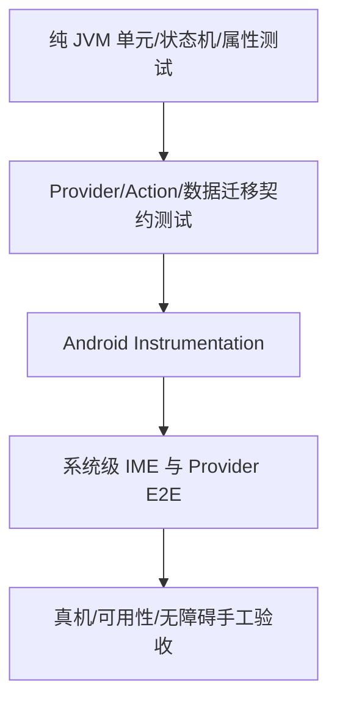

# OpenTypeless 测试、验证与验收规范

> 文档版本：1.0  
> 生成日期：2026-08-12  
> 适用仓库：`dengxuezhao/opentypeless`  
> 代码基线：`main@67be488dcd2e9f36520618f9f644f97c3ec02b98`  
> 目标读者：产品负责人、Android/IME 工程师、语音与模型工程师、安全工程师、测试工程师，以及 Codex / Claude Code 等编码代理  
> 状态：**拟议目标方案（Proposed Target Architecture）**；涉及键盘底座、许可证和 Rime 集成的不可逆决策，必须先完成 ADR 技术验证

## 1. 测试目标

OpenTypeless 的测试重点不是“方法覆盖率达到多少”，而是验证以下不变量：

1. 任何迟到、重复或乱序异步结果都不能写入错误输入目标；
2. 敏感字段不录音、不联网、不学习、不留存；
3. 普通键盘、Rime、语音和 Action 不会争用同一 Composition；
4. Provider 失败时降级符合用户配置和隐私规则；
5. Raw、Undo、Teach 不会作用于已经变化的文本；
6. 配置、词典、Rime 数据和历史升级不丢失；
7. IME 热路径不被网络、数据库或模型加载阻塞；
8. 外部输入、服务器响应和导入文件有严格边界；
9. 产品宣称有可复现的基准支撑；
10. 小米 15/HyperOS 具备完整实机证据。

---

## 2. 测试金字塔



建议原则：

- 领域不变量尽量在纯 JVM 验证；
- Android 行为在 Instrumentation 验证；
- OEM 差异必须真机；
- 模型质量用固定基准；
- 视觉和 TalkBack 需要自动 + 手工；
- CI 不依赖真实付费 API Key。

---

## 3. 测试项目结构

```text
android/
├── core-editor/src/test/
├── core-policy/src/test/
├── core-processing/src/test/
├── core-actions/src/test/
├── provider-*/src/test/
├── app/src/androidTest/
├── ime-host/src/androidTest/
├── test-host-app/
├── benchmark/
│   ├── macrobenchmark/
│   ├── asr/
│   ├── rime/
│   └── power/
└── test-fixtures/
    ├── editor/
    ├── network/
    ├── migrations/
    ├── action-protocol/
    └── public-audio/
```

真实 Secret、用户音频、个人词典和私有 Schema 不得进入仓库。

---

## 4. Test Host App

### 4.1 目的

第三方 App 行为不可完全控制，因此建立专用 Test Host，稳定复现：

- `EditText`；
- Compose `TextField`；
- WebView contenteditable；
- 动态创建/销毁字段；
- 同一 Activity 多字段；
- 选区；
- 光标移动；
- inputType 切换；
- IME Action；
- no-personalized-learning；
- 横竖屏；
- 进程重建。

### 4.2 字段矩阵

| ID | 类型 | 关键验证 |
|---|---|---|
| F01 | 普通文本 | QWERTY、语音、Action |
| F02 | 短消息 | Auto→Smart |
| F03 | 长文本 | 分段、长语音 |
| F04 | Person Name | Auto→Exact |
| F05 | Search | Exact、Search Action |
| F06 | URL | `.com`/符号布局、Exact |
| F07 | Email | `@`、Exact |
| F08 | Phone | 数字布局 |
| F09 | Number | 数字布局、无 LLM |
| F10 | DateTime | 专用布局 |
| F11 | Text Password | 隐私模式 |
| F12 | Visible Password | 隐私模式 |
| F13 | Number Password | 隐私模式 |
| F14 | OTP 模拟 | 收紧策略 |
| F15 | 选区文本 | Action/语音编辑 |
| F16 | 无选区 | ReplaceSelection 拒绝 |
| F17 | `NO_PERSONALIZED_LEARNING` | 不写历史/反馈 |
| F18 | 多行 | Enter 行为 |
| F19 | 单行 Done | Editor Action |
| F20 | 同 App 两字段 | editor epoch |
| F21 | 动态 fieldId | Session 重建 |
| F22 | Compose TextField | selection/composition |
| F23 | WebView | 兼容性 |
| F24 | RTL | 基本输入和布局 |

### 4.3 BLD-002 Android SDK package pinning 验收

- `android/scripts/test_verify_android_sdk_pinning.py` **3/3 PASS**；连同既有 Android scripts 测试为
  **6/6 PASS**。恶意夹具覆盖 compile SDK/build-tools 常量漂移、package path 漂移、App/Test Host
  `compileSdk`/`targetSdk` 漂移、emulator target/API matrix 漂移、advisory install 以及本地门禁被移除；
- `android/scripts/verify_android_sdk_pinning.py --repo-root .` **PASS**，并已由
  `scripts/verify_android.sh` 在 Gradle 前 fail closed。CI 的 `check-android` 明确安装并回读
  `platforms;android-35` 与 `build-tools;35.0.0`；API 26/33/35/36 job 另安装并以
  `sdkmanager --list_installed` 核对相应 `system-images;android-<api>;google_apis;x86_64`；
- `.github/workflows/ci.yml` 通过 Ruby YAML parser；Google 官方 `repository2-3.xml` 实际包含 Platform 35
  与 Build Tools 35.0.0，官方 `google_apis/sys-img2-3.xml` 实际包含四个 system-image package path；本机
  SDK 也存在 Platform 35 与 Build Tools 35.0.0；
- 标准 strict `scripts/verify_android.sh` **BUILD SUCCESSFUL**（55s，187 tasks：183 executed / 4
  up-to-date）；新建空白 `GRADLE_USER_HOME` 再跑 **BUILD SUCCESSFUL**（3m24s，同为 183/4）。最终
  app JVM **777/777 PASS**，compiled architecture **94/94 PASS**，source architecture **95/95 PASS**，
  Debug/Release production variants **2/2 PASS**，`lintRelease`、Debug/Release 与 AndroidTest assemble
  均 PASS；
- 最终 app-debug SHA-256 为
  `dd5543d598c356d16bcbd5fffcb43d7de100845a484e54b7344341d74c91f9a3`，app androidTest 为
  `5a088c6eff660d5366d5043fbc589532715bd6a2c3c8e451d11edbc7fb623ee0`，unsigned release 为
  `dea8683974f73978d68cddb45c092d416b2c862018688b608582151c08441f4f`；
- 当前 `80d2049...` 没有 GitHub Actions run，远端 workflow execution 为 **NOT RUN — 工作树未推送**。
  BLD-002 不改变 Android runtime，因此 emulator/小米行为测试 **NOT RUN — not applicable**；本节不把
  YAML/assemble 冒充远端 CI 或设备 PASS。package path 固定消除了 runner preinstall authority；仓库端
  package revision/hash 仍由 Google SDK repository 提供，不虚构 artifact-level reproducibility。

### 4.4 BLD-003 GitHub Actions 供应链验收

- `scripts/test_verify_github_actions_pinning.py` **3/3 PASS**；与 docs/ADR verifier 合计 root scripts
  **11/11 PASS**。恶意夹具覆盖可变 tag、未知 action、SHA/版本注释漂移、checkout token 驻留、
  `pull_request_target` checkout、root write 扩权、`id-token: write` 与本地门禁移除；
- `scripts/verify_github_actions_pinning.py --repo-root .` **PASS**：13 个 workflow 中 51 个远程
  `uses:` 均为完整 40 位 SHA，精确落入 21 个审计 surface；所有 checkout 为
  `persist-credentials: false`，CodeQL 的 root 权限精确为 `contents: read` +
  `security-events: write`，未出现 `write-all`/`read-all`/`id-token: write`/`actions: write`；
- 所有候选 tag 通过各 action 官方 GitHub repository 解析为当前 commit。Tauri action v1.0.0 的官方
  `action.yml` 读回确认现有 `tagName`、`releaseName`、`releaseBody`、`releaseDraft`、`prerelease` 与
  `args` inputs 仍兼容 Tauri 2.11；`dtolnay/rust-toolchain` 当前 SHA 与官方 `stable` head 一致。13 个
  workflow 全部通过 Ruby YAML parser；
- 标准 strict `scripts/verify_android.sh` **BUILD SUCCESSFUL**（57s，187 tasks：183 executed / 4
  up-to-date）。空缓存首轮在下载官方 Gradle 8.11.1 wrapper 时 10s read timeout，尚未进入 Gradle task；
  保持同一缓存与 strict 配置重试后 **BUILD SUCCESSFUL**（4m45s，183/4）。app JVM **777/777**、
  source architecture **95/95**、compiled architecture **94/94**、Debug/Release variants **2/2**、
  `lintRelease` 与三类 assemble 均 PASS；
- APK 哈希与 BLD-002 保持一致：debug
  `dd5543d598c356d16bcbd5fffcb43d7de100845a484e54b7344341d74c91f9a3`、androidTest
  `5a088c6eff660d5366d5043fbc589532715bd6a2c3c8e451d11edbc7fb623ee0`、unsigned release
  `dea8683974f73978d68cddb45c092d416b2c862018688b608582151c08441f4f`；
- 当前工作树未推送，升级后的 GitHub-hosted workflow **NOT RUN**，不能用 YAML/本地 build 冒充远端
  action 执行；Android runtime 未改变，emulator/小米行为测试 **NOT RUN — not applicable**。远端 action
  验证将在发布分支实际运行时由 BLD-004/BLD-006 收集报告，本任务不拆 job 或生成新 artifact。

### 4.5 BLD-004 Android CI 阶段与报告验收

- `scripts/test_verify_android_ci_reporting.py` **3/3 PASS**，覆盖精确 stage 拆分、instrumentation 入口、
  本地 dispatcher、Unit/Lint/Instrumentation `always()`、matrix artifact 唯一命名、APK 缺失 fail closed 与
  本地门禁移除；根目录 docs/ADR/Action/CI verifier 合计 **14/14 PASS**，且已接入 preflight；
- `scripts/verify_android_ci_reporting.py --repo-root .` **PASS**：`check-android` 精确执行 preflight、
  Unit/Architecture、Lint、Assemble，设备 matrix 精确执行 instrumentation；四个 artifact family 分别为
  Unit XML/HTML、Lint HTML/XML/SARIF、全部 APK、按 API 唯一命名的 Instrumentation results/reports，
  retention 14 天。报告在失败时仍上传，缺失报告只告警，APK 缺失报错；
- CI 同款 staged 实跑全部成功：Unit/Architecture **16s、67 tasks**，Lint **27s、24 tasks**，Assemble
  **35s、164 tasks**。默认无参数一键 strict verify 回归 **BUILD SUCCESSFUL**（56s，187 tasks：183
  executed / 4 up-to-date）；app JVM XML 为 **777/777 PASS**，compiled architecture **94/94 PASS**，
  source architecture **95/95 PASS**，Debug/Release variants **2/2 PASS**；
- 本地产物核验实际命中 123 个 JVM XML、Unit HTML 报告、Lint HTML/XML 与五个 APK。APK SHA-256：app
  debug `dd5543d598c356d16bcbd5fffcb43d7de100845a484e54b7344341d74c91f9a3`、app androidTest
  `5a088c6eff660d5366d5043fbc589532715bd6a2c3c8e451d11edbc7fb623ee0`、unsigned release
  `dea8683974f73978d68cddb45c092d416b2c862018688b608582151c08441f4f`、Test Host debug
  `8903e723776793115977612132d97006f0d32f3a8f01eb1a373639b6213bc8b7`、Test Host androidTest
  `7d9f5df75047aacf2b7654818e35796f3df397f9dcc2b1ae6b991fda2eebf882`；
- GitHub-hosted workflow **NOT RUN — 工作树未推送**。小米 M2007J1SC/API 33 的 stage 实际启动并生成
  `androidTest-results`/HTML artifact 输入，但 Test Host 首次 USB 安装被
  `INSTALL_FAILED_USER_RESTRICTED` 拒绝；主 App 82 项的首个
  `AppPickerInstrumentedTest.pickerSearchSelectsAnInstalledAppAndAdvancedEntrySurvivesRotation` 停在 started
  状态。该设备结果为 **FAIL/NOT RUN**，不把报告生成、APK 安装或 0/82 冒充测试通过；远端 emulator
  matrix 仍待实际推送后执行。

### 4.6 BLD-006 当前基线报告验收

- `docs/2026-08-14-android-baseline-acceptance.md` 绑定 repository HEAD 与排除报告自身的 deterministic
  candidate-content SHA-256；当前 100 条 dirty/untracked status、932 个候选文件因此不会被旧 HEAD 静默掩盖，
  也不会复用 2026-08-09 历史报告中的测试数字；
- 报告中的自动化数字均来自本轮实际命令：root verifier **14/14**、app JVM **777/777**、source
  architecture **95/95**、compiled architecture **94/94**、Debug/Release variants **2/2**、canonical
  strict verify **187 tasks（183 executed / 4 up-to-date）**。Unit 67 tasks、Lint 24 tasks、Assemble
  164 tasks 均单独 PASS；五个 APK 与 Sherpa AAR 逐项记录 SHA-256；
- `gh run list --commit <HEAD>` 返回空，因此 GitHub-hosted workflow 明确为 **NOT RUN**。小米 10 Ultra
  M2007J1SC/API 33 的 ADB 身份和无密码唤醒进入桌面已验证；Test Host 安装被 HyperOS
  `INSTALL_FAILED_USER_RESTRICTED` 拒绝，主 App 82 项 runner 在首个 AppPicker 测试 started 后停滞，结果为
  **FAIL / 0 of 82 completed**。报告只保存设备 serial 的 SHA-256，不保存原值；
- unsigned release、dirty worktree、远端 CI 未运行、Xiaomi/emulator 矩阵未绿及未完成 Backlog 均列为 release
  blocker。报告决策固定为 **CONDITIONAL / NOT RELEASE-READY**；BLD-006 `DONE` 只表示最新基线报告可复现，
  不表示 App 已发布或完整测试完成。

### 4.7 BLD-007 main 保护与 Release 来源验收

- GitHub REST 实际回读 `dengxuezhao/opentypeless/main` 为 `protected=true`：15 个 context 全部 strict，包含
  Android build、API 26/33/35/36 device matrix、frontend、offline ASR、四平台 Rust、audit、CodeQL、typos
  与 PR title；`enforce_admins=true`、linear history 与 conversation resolution 开启，force push/delete 关闭；
- 必须经 PR 且 stale review 会撤销。当前仅一名管理员协作者，approval count 固定为 0，避免唯一维护者永久
  自锁；管理员仍不能直接 push 或绕过红 CI。新增 `.github/main-branch-protection.json` 是审计策略，不替代
  远端读回；`verify_github_branch_protection.py --repository dengxuezhao/opentypeless` 实际 PASS；
- branch-protection 与 release-source 两套 fault-injection 各 **3/3 PASS**；合并既有 verifier 后 root scripts
  **20/20 PASS**。负例覆盖 strict/context/admin/force/delete 放宽、CI topology/release/local gate 移除、缺失/
  非法 tag，以及 tag 来自 main 之外的提交；
- Release 与 Windows SignPath 都新增 `verify-release-source` 前置 job。真实 `v1.1.53` 解析为 main 历史 commit
  `b0062ac...` 并 PASS；真实 off-main `v0.1.28` 返回 exit 1。release dispatch/build checkout 精确输入 tag，
  不能用任意 branch 内容配合法外 tag 发布；
- 全部 workflow YAML parse、Action pinning 21 surfaces 与 scoped diff-check PASS。保护设置为远端实际 PASS；
  新 workflow 尚未推送，GitHub-hosted Release execution 为 **NOT RUN**，不能以本地 ancestry 测试冒充。

### 4.8 BLD-009 工程趋势基线验收

- `collect_engineering_metrics.py` 输出 schema 1、`advisory_only=true` 的 deterministic JSON；7 个 key source
  记录 bytes、lines、nonblank、matched methods、max/top complexity proxy，五个 APK 记录 availability、bytes、
  SHA-256，JUnit XML 与 source test declarations 分开统计；
- complexity proxy 精确定义为去除注释/字符串后的 `1 + if/for/while/case/catch/ternary/boolean` token，明确
  不冒充正式 cyclomatic complexity。缺 build artifact 记录 unavailable；不存在任何“超过阈值即失败”规则；
- 当前真实产物生成 JSON SHA-256
  `4efa265bf6b60bff2cbde10d7572cbe4f40cb540393087b4766656a343802ce6`：123 XML suites、871 tests、
  0 failures/errors/skipped；source inventory 为 JVM 871、Instrumentation 85、Python 197。App debug/release
  unsigned 分别为 56,298,223 / 54,620,300 bytes，五个 APK SHA 与 BLD-006 基线一致；
- `test_collect_engineering_metrics.py` **3/3 PASS**，覆盖 deterministic complexity、XML/APK 聚合及 missing
  artifact；CI reporting 负例同时锁生成 step、同一 dispatcher 和 fail-if-missing artifact。root scripts
  **26/26 PASS**，`scripts/verify_android.sh metrics` 实跑生成 7 sources / 871 XML tests / 5 APKs；
- `check-android` Assemble 后上传独立 `android-engineering-metrics`，保留 14 天。远端 workflow 尚未推送，
  artifact upload 为 **NOT RUN**；本地 JSON 与基线 Markdown 已实际生成/核对，不冒充 CI trend history。

### 4.9 BLD-010 交付与严格依赖验证闭环

- `:test-host` 已作为独立、仅 Debug 的 Android application module 注册，不进入生产 App；骨架包含
  普通、短消息、多行、人名、搜索、密码和动态字段；
- Instrumentation contract 源码覆盖字段切换后文本独立、选区、动态字段创建/选中/销毁以及代表性
  `inputType`；完整 verify 已成功编译并组装宿主 Debug APK 和 Debug AndroidTest APK；
- 以全新空白目录作为 `GRADLE_USER_HOME` 执行仓库 `scripts/verify_android.sh`，完整返回 PASS。
  该次实际执行 Python/架构静态检查、Sherpa AAR 校验，以及 Gradle `clean`、
  `:architecture-gate:check`、`testDebugUnitTest`、`lintRelease`、`assembleDebug`、
  `assembleRelease`、`assembleDebugAndroidTest`；空缓存保证结果不依赖已下载产物或旧的
  Gradle dependency cache；Gradle 最终摘要为 `BUILD SUCCESSFUL`、187 tasks；
- 干净验证暴露的 metadata 缺口通过对应 Maven Central 产物的 checksum 核验后补齐：

| 产物 | SHA-256 | 核验来源 |
|---|---|---|
| `org.jetbrains.kotlin:kotlin-stdlib:1.9.21` JAR | `3b479313ab6caea4e5e25d3dee8ca80c302c89ba73e1af4dafaa100f6ef9296a` | Maven Central |
| `org.jetbrains.kotlin:kotlin-stdlib:1.9.21` Gradle module metadata | `d3019f7f0d71924ce47298c9cc46af0245f75219719b35c5915fbcc7e7a69395` | Maven Central |
| `org.junit:junit-bom:5.9.2` Gradle module metadata | `ab137ba5a8e32c9b066bf9126a1c76dd5614b724ba5c0b02549772b5e9f4cf1f` | Maven Central |
| `org.junit:junit-bom:5.10.2` Gradle module metadata | `de23b114b3e4119a8fe6eb17bed5a3852816698bace67071579d6d927ebb080a` | Maven Central |

`verification-metadata.xml` 仍保持 `<verify-metadata>true>`，Gradle 运行仍显式使用
`--dependency-verification=strict`；本闭环没有关闭、降级或绕过 dependency verification。本次全新
`GRADLE_USER_HOME` verify 未执行 `connectedDebugAndroidTest`，因此这份证据是干净构建、JVM/架构测试、
lint 与 APK 组装 PASS，不冒充为该次设备 Instrumentation 通过。

### 4.10 DOC-001 规范包入口与链接验收

- `docs/opentypeless_specs/00_README.md` 对规范包其余 15 个 Markdown 文件均提供可点击相对链接；根
  `README.md`、`README_zh.md` 与 `AGENTS.md` 均指向该 canonical index，且根代理 preflight 明确读取
  `docs/opentypeless_specs/00_README.md` 与 `07_IMPLEMENTATION_BACKLOG.md`；
- `python3 scripts/test_verify_docs.py -v` **4/4 PASS**：正例覆盖完整入口/索引，负例证明缺少 canonical
  entrypoint、断开的本地链接、绝对/越界路径、symlink 与无效 UTF-8 会稳定失败；
- `./scripts/verify_docs.py` **PASS**：实际输出 `documentation validation passed: 3 entrypoints, 16
  specification files`。验证范围包含 UTF-8 regular-file/symlink 边界、规范文件全集、索引完整性、本地链接
  不越出仓库、目标存在及 FULL_SPEC 内部 Markdown anchor；外部网页可用性不由离线仓库门禁冒充；
- `python3 -m py_compile scripts/verify_docs.py scripts/test_verify_docs.py` 与 scoped/full
  `git diff --check` PASS。DOC-001 只建立规范包与仓库入口，不创建 DOC-002 ADR 目录、不建立 DOC-003
  兼容表，也不把本次路径修正冒充 DOC-004 根代理规范的独立完成验收。

### 4.11 DOC-002 ADR 生命周期与模板验收

- `docs/adr/README.md` 冻结 ID/文件名、五种状态、创建/接受/替代流程与不可逆决策门禁；
  `0000-template.md` 具备非空 `Status`、`Background`、`Decision`、`Consequences`、`Validation`，并补充
  Rollback/References。历史 ADR-001..012 仍留在 `09_ADR_RESEARCH.md`，未伪造迁移；
- `python3 scripts/test_verify_adrs.py -v` **4/4 PASS**：正例为 indexed Accepted ADR；负例覆盖非法状态、
  缺失 Consequences、文件名/标题 ID 不一致、未索引记录、symlink 与 Accepted placeholder validation；
- `./scripts/verify_adrs.py` **PASS**：实际输出 `ADR validation passed: template + index, 0 standalone
  decision(s)`。0 表示尚无 DOC-002 之后的新决策，不表示历史调研快照丢失；
- `./scripts/verify_docs.py` 与既有文档单测 **4/4 PASS**，新增 ADR 相对链接均存在且不越出仓库；四个脚本
  `py_compile`、FULL_SPEC 12/12 镜像、Manifest 15/15 和 full `git diff --check` 均 PASS；
- 本任务没有创建产品/许可证/配置 ADR，也没有夹带 DOC-003 兼容矩阵或 CFG-001 模型。纯文档/门禁变更不涉及
  Android runtime，因此 Gradle、模拟器和小米真机测试均 **NOT RUN — not applicable**。

### 4.12 DOC-004 根代理契约验收

- 根目录 `AGENTS.md` 是 regular UTF-8 file，具备 12 个固定章节；按序要求读取根契约、canonical spec index、
  task design、canonical Backlog、ADR，再检查 git/CI，并限制为一个 task ID。根文件使用 repository-root path，
  规范包内 `AGENTS.md` 保持 package-relative path，两者的全部“不得”安全禁令逐行一致；
- `verify_agents.py` 锁定 canonical entrypoints、preflight 顺序、所有安全禁令、六条 Android 验证命令、
  PASS/FAIL/NOT RUN 证据分类、Task Report/Rollback/Git 字段及 fail-closed BLOCKED 条件；缺文件、symlink、
  非 UTF-8 或任一契约漂移均退出非零；
- `test_verify_agents.py` **3/3 PASS**，负例覆盖路径/顺序、安全禁令、测试命令、NOT RUN、Rollback 和 blocker
  policy 漂移；合并现有 root verifier 后 **23/23 PASS**。直接 gate 与 canonical Android preflight 均执行；
- DOC-004 不修改产品代码、权限、依赖、数据格式或 runtime，Gradle/设备行为测试 **NOT RUN — not applicable**；
  不把本任务冒充 DOC-003 兼容矩阵完成。

### 4.13 DOC-003 变更日志与兼容矩阵验收

- 根 `CHANGELOG.md` 保留单一 `Unreleased`，以 `COMPAT-BASELINE-2026-08-14` 关联当前候选；明确它不是
  release tag，也不把历史 tag 反向填成未经证明的兼容承诺。根中英文 README 与规范包索引都可发现 changelog
  和 `docs/COMPATIBILITY.md`；
- 兼容矩阵精确 23 行，覆盖 Android/desktop runtime、Android API 26/35 边界、GlobalConfig/OverrideValue、
  legacy config/profile/secret migration、Personalization SQLite v4、两个加密 journal、EngineTrace、editor
  fingerprint frame、desktop config/history、scene/mapping/credential/capability/prompt、跨端 dictionary v1、
  Action v1 spec-only 与 Paraformer 外部无版本协议；每行都写明 read/upgrade、write、authority 和 change ID；
- `test_verify_compatibility.py` **4/4 PASS**：正例核对真实跨平台 authority；负例覆盖 Android/desktop 版本漂移、
  changelog ID 丢失、漏表的新 version constant、矩阵缺行/placeholder、Action spec 被生产代码引用，以及
  desktop unversioned config/history 被静默版本化；
- `verify_compatibility.py` **PASS**：实际输出 `23 matrix rows, 18 version authorities`。合并 root verifier 后
  **30/30 PASS**，canonical preflight 直接调用该 gate；FULL 12/12、Manifest 15/15、相对链接与 diff-check
  必须同时通过；
- DOC-003 只建立追踪与 fail-closed source gate，没有修改、迁移或写入任何用户数据。Gradle runtime、模拟器和
  小米真机测试 **NOT RUN — not applicable**，不能以文档门禁冒充旧版本升级测试或签名发布证据。

---

## 5. EditorSession/Transaction 单元测试

### 5.1 Session

- epoch 单调；
- connection token 变化；
- null EditorInfo；
- packageName 变化；
- fieldId 变化；
- inputType 变化；
- sensitive 变化；
- selection 变化；
- before fingerprint 变化；
- after fingerprint 变化；
- selected text hash；
- Unicode grapheme；
- 长上下文截断；
- no-learning；
- process recreation。

SessionValidator 还必须覆盖：

- 字段级比较忽略 capture time 和正文，只比较 typed fingerprint；
- 成功路径 live authority 恰好 pre/post 各一次，evidence 恰好一次且绑定 exact connection；
- 所有 preflight 失败和双方敏感路径的正文 evidence 调用次数为零；
- 同一 InputConnection 重新 start、selection A→B→A、postflight connection/metadata/security
  变化均拒绝，并返回稳定 `TargetChangeReason`；
- collapsed selection 的 unavailable selected text 规范化为空，非折叠 selected unavailable、
  before/after unavailable、超限、畸形或异常均 fail closed；
- identity lease 仅 owner-thread 一次性使用；off-owner 尝试不消费，首次 owner 尝试无论成功
  或失败都终态；lease 不强持有 InputConnection，也不被当作写授权；
- hostile CharSequence、EditorInfo 与 InputConnection 的正文、异常 message 和 toString 不进入
  result、异常、日志或诊断。

### 5.2 Operation

- Insert；
- Delete code point，不拆 surrogate pair；
- ReplaceSelection；
- SetComposition revision；
- CommitComposition owner + expectedRevision；
- PerformEditorAction 语义枚举与 LATIN/RIME 来源限制；
- 不支持 operation；
- 空文本；
- 超长文本；
- control character；
- batch edit 开始/结束。

EDT-007 基础事务专项覆盖（其当时的三种 mutator 基线）：

- 只接受 Insert/Delete/EditorAction；Replace 与 CommitRecord 相关未来 operation 在
  `beginBatchEdit()` 前拒绝且零内容写入；Composition 由下述 EDT-009 窄扩展单独覆盖；
- owner-thread 正常执行，off-owner 与重入 fail fast；初次完整校验、begin 后二次完整校验、
  exact connection identity 复核、唯一 mutator 和 `finally` 中恰好一次 end 的调用顺序固定；
- `beginBatchEdit()` 返回 false 或抛异常时零 mutator 且不调用 end；begin 成功后切 App、切字段、
  restart input、选区或 fingerprint 变化时零 mutator，并结束原 connection 的 batch；
- Insert 精确调用 `commitText(text, 1)`，Delete 按 code point 调用
  `deleteSurroundingTextInCodePoints(n, 0)`，六种语义 Action 只映射到对应白名单 action ID；
- 敏感字段仅允许 LATIN/RIME，本地操作在初次、二次和失败分类时正文 getter 均为零；云端来源
  在 batch 前拒绝；
- mutator false/异常时，目标 postcondition 精确成立才为 Applied；有界原窗口仍匹配但无法
  证明全文原状时必须为 `RollbackFailed(OUTCOME_UNCONFIRMED)`，Action/敏感字段也不得猜测成功；
- JVM fake 覆盖 begin/end/写入的 false 与异常、竞态和脱敏；Instrumentation 使用
  `BaseInputConnection` 覆盖真实 Editable、emoji code point 删除、Action、restart/field switch
  和 hostile exception；
- 源码与编译产物架构门禁同时确认 manager 为 package-confined 单一能力边界、无
  `InputConnection` 字段/返回/转交；EDT-007 三个内容 mutator 与 EDT-009 两个 composition
  mutator 都只能位于 exact `invokeMutator(InputConnection, EditorOperation)`，不允许 KeyEvent、
  overload、wrapper、method reference、helper、nested/伪同名类或 capability erasure 绕过。

EDT-009 Composition primitive 专项覆盖：

- guard 只在初次完整验证后绑定 `(epoch, connection token)`；新 session 重置状态，失效目标不重置；
- Idle/同 owner Set、跨 owner 拒绝、per-owner 严格递增 high-water、Commit 精确 owner + revision、
  Commit 后保留 high-water，以及 empty Set 仍持有逻辑 owner；
- 活动 composition 阻止 Insert/Delete/EditorAction；每次 Set/Commit 都保持双重完整校验、exact
  connection 和 balanced batch，真实 `BaseInputConnection` 在 Set 后以 fresh snapshot finish；
- set/finish 的 false、异常、先变更后 false 和先变更后异常都返回准确的原始失败，并以
  `VERIFY_EDITOR_STATE(OUTCOME_UNCONFIRMED)` fail closed；poison 后同 session 不再写，新 session
  才恢复；
- 敏感字段 LATIN/RIME Set/Commit 与失败路径正文 evidence/getter 为零，VOICE/ACTION 在 batch 前
  拒绝；所有结果和 hostile exception 均不含正文；
- targeted JVM `EditorTransactionManagerTest` 为 15/15 PASS；AndroidTest compile 与 assemble
  PASS；`emulator-5554` 定向 Instrumentation 为 9/9 PASS，覆盖真实 composing span、fresh
  snapshot finish、异常 poison 和敏感零正文；
- source architecture tests 为 54/54 PASS；compiled gate JUnit 为 43/43 PASS；Debug/Release
  production gate 为 2/2 PASS，并精确计数 manager 的 7 条允许写边；
- 小米 M2007J1SC（Android 13）为 **NOT RUN**：MIUI 以
  `INSTALL_FAILED_USER_RESTRICTED: Install canceled by user` 阻止测试 APK 安装，不得写成真机通过。

这些证据只验收 EDT-009 未接线 primitive，不代表 legacy composition 已迁移。EDT-017/CMP 集成
测试必须证明同一 `EditorSessionManager` 只有一个长寿命 `EditorTransactionManager`、Feature
Flag 新旧 writer 互斥；还必须用 generation/terminal-state 用例覆盖 Final 后数值更大的 late
partial，因为 revision high-water 本身不能拒绝该事件。

EDT-010 CommitRecord / atomic receipt-ledger 专项覆盖：

- `Applied` 继续为零字段；`TransactionReceipt` 精确闭合为
  `Committed(Applied, CommitRecord)` / `WithoutCommit(result)`，同栈关联不依赖任何 mutable
  latest slot；CommitRecord/Request/Receipt 与原结果模型 JVM 测试分别为 8/8、3/3、4/4、9/9，
  合计 24/24 PASS；
- Host JVM 测试中 `CommitLedgerTest`、`EditorSessionManagerTest`、
  `EditorTransactionManagerTest` 分别为 8/8、37/37、35/35，合计 80/80 PASS；连同领域模型总计
  104/104 PASS；
- 覆盖不透明 ID 在 begin/mutator 前预留、生成器异常/非法 ID 零写、只允许 VOICE/ACTION、敏感
  请求零 ID 且零正文 evidence、no-learning 短期 record、Raw voice-only、同栈 exact receipt、固定
  单槽 exact-ID resolve/consume、无 latest API、owner-thread、单槽替换/撤销与 start/finish/close
  lifecycle；production commitId 的进程 generation 前缀 + UUID 不透明 source 不含正文/hash；
- 覆盖事务中 lifecycle 重入仍返回 exact 同栈 receipt、但 pending 清理后 ledger 为空；普通成功
  输入撤销旧 record，pre-mutator rejection 不误删；非 Applied 不发布，mutate-then-false 仅在 exact
  intended state 成立时发布，cleanup 失败不覆盖 receipt；applying/revoke-pending 时
  resolve/consume 必须为空；
- SetComposition 自身零 record；首个 eligible VOICE/ACTION Set 冻结 origin，后续成功 partial 更新
  latest text/revision，exact final 才生成 record；owner/revision mismatch、false/异常、poison 与新
  session 恢复均有覆盖；empty final 的 record-required 请求以 `COMMIT_RECORD_UNAVAILABLE` 在 ID
  分配和 finish mutator 前拒绝，且 pending lifecycle 窗口内旧 ID 的 resolve/consume 都返回 empty；
- source architecture tests 为 58/58 PASS；compiled gate JUnit 为 48/48 PASS；Debug/Release
  production gate 为 2/2 PASS，门禁锁定同一 `EditorSessionManager` 的唯一长寿命
  `EditorTransactionManager`、same-stack receipt、固定单槽和禁止 latest lookup；
- EDT-010 Android Instrumentation 为 **NOT RUN**：本任务没有执行新的 EDT-010 instrumentation。
  已有 EDT-009 emulator 9/9 只证明 composition primitive，不能冒充 EDT-010 设备证据。

当前 production 接线证据仍只覆盖 collapsed Insert 与 exact CommitComposition；EDT-008 的完成状态专指
package-confined Host core。非折叠 Replace receipt、selected-origin exact-ID Undo/Raw 已实现，但 service
仍是 shadow consumer。exact-ID resolve 不是写授权，所有恢复仍须完整复验 Session、live absolute
selection、context 与 `COMMITTED_TEXT` fingerprint；不得把 Host 证据描述成 production/E2E 已接通。

EDT-008 safe ReplaceSelection + selected-origin recovery 专项证据（2026-08-13）：

- 当前 app JVM 全量 **624/624 PASS**；其中 `EditorTransactionManagerTest` 66/66、
  `EditorSessionManagerTest` 37/37、`CommitLedgerTest` 8/8，三类 host regression 合计 **111/111 PASS**。
  Replace 覆盖 expected range/hash、live absolute selection/full selected text、正反向、空 replacement、
  emoji、40,000 个非 BMP replacement、4,000 code-point selected、cursor overflow、hostile/lying
  `CharSequence`、initial/batch 后 race、selection/authority ABA、敏感零 evidence/ID/write、active/poison
  composition、ordinary Undo/Raw 绕过、receipt 与 no-learning；
- selected-origin recovery 覆盖 `VOICE`/`ACTION` Undo、`VOICE` Raw Restore、正反向 origin、exact-ID
  single consume、完整 `COMMITTED → ORIGINAL → UNDO/RAW` proof、4,000 个非 BMP original selected text、
  错误插入与周期性 suffix。第一步未确认时不开始第二个 target mutator；第二步失败也不重试 target，
  只有 EDT-013 在 exact `ORIGINAL` basis 上允许一次 verified Final restore。移动 selection 或有界上下文
  相同不能伪造成功；折叠 Undo/Raw 既有用例保持通过；
- false/异常 Replace 的 periodic suffix 歧义、40,000 code-point 中部同长篡改与 delayed callback 均有
  deterministic 用例；任何 false/异常都 `RollbackFailed` 且 `WithoutCommit`。one-shot transition 的
  replay、foreign owner、+2/ABA 也被直接测试；
- source architecture suite **68/68 PASS** 且 production scan PASS；compiled gate **57/57 PASS**；
  Debug/Release production variants **2/2 PASS**。门禁锁定 Replace model/policy、CurrentEvidence absolute
  selection、Replace/RawTransition owner binding/one-shot/caller、dispatcher CFG、共享唯一 sink 与 exact
  edge counts；ETM framework writer inventory 仍精确为七条；
- 以全新 `GRADLE_USER_HOME` 和 strict dependency verification 执行 `scripts/verify_android.sh`：
  **BUILD SUCCESSFUL**，2m22s，187 tasks（184 executed / 3 up-to-date），包括 clean、全 JVM、compiled
  architecture、`lintRelease`、Debug/Release 与 AndroidTest assemble。最终 APK SHA-256：app-debug
  `72e9b14186165588274c22605dbc9ff44103d38c639f56e891e0990597fc7689`，androidTest
  `1ffab34a38f80134bf3fec6194346ebd0cd3621c3a20e62148f0b317cc8bbbc9`；
- `medium_phone` API 36 emulator 安装本次重建 APK 后，定向
  `EditorTransactionManagerInstrumentedTest`：**23/23 PASS**；同一 runner 全量：
  **OK (66 tests)**，其中 5 项因可选离线模型/流式能力前置条件未满足而 assumption-skipped，0 failure。
  真实 `BaseInputConnection + Editable` 覆盖正向/反向/空/emoji Replace、live mismatch，以及
  selected-origin receipt → exact Undo/Raw、verified rollback、slot consume 与 lifecycle；
- 小米 10 Ultra `be4e2015`（M2007J1SC、Android 13/API33、HyperOS OS1.0.4.0.TJJCNXM）在线但处于
  Dozing/锁屏；本次 app APK 的 `adb install -r` 以 exit 1、
  `INSTALL_FAILED_USER_RESTRICTED: Install canceled by user` 失败。test APK 安装、runner 与
  Instrumentation 均 **NOT RUN**；未唤醒或绕过锁屏，也未切换 IME。

上述证据使 EDT-008 package-confined Host core 与门禁达到 `DONE`。当时 production service 仍为 shadow
consumer；后续 EDT-017 已用按会话冻结的 writer flag 完成默认 route 接线与 legacy composition 互斥。
小米真机 EDT-008 instrumentation 仍明确为 NOT RUN，不由后续模拟器结果替代。

EDT-011 exact-ID Undo host primitive 累计证据（2026-08-13）：

- Host JVM 定向：`EditorTransactionManagerTest` 66/66、`EditorSessionManagerTest` 37/37、
  `CommitLedgerTest` 8/8，合计 **111/111 PASS**。覆盖 collapsed/selected-origin、
  exact/foreign/forged/replaced ID、单次 consume、
  普通 `ReplaceLastCommit` 与 `DeleteBeforeCursor(..., UNDO)` 绕过拒绝、选区/epoch/connection/authority
  ABA、同坐标正文与 original context 篡改、begin/end/delete false/异常、no-learning、敏感零 evidence、
  off-owner 与异常脱敏；
- 完整 span 边界同时覆盖 1,200 UTF-16 units，以及精确 40,000 个非 BMP code points（80,000
  UTF-16 units、request before=80,800、delete=40,000 code points）。中部等长篡改和短读一个字符均
  `SURROUNDING_TEXT_CHANGED`、零 delete；hostile `CharSequence.length()` 谎报后 materialize 超限归
  `EVIDENCE_UNAVAILABLE`；
- source architecture suite **68/68 PASS** 且 production scan PASS；compiled gate **57/57 PASS**，
  Debug/Release production variants **2/2 PASS**。门禁锁定 exact façade、evidence host scope、ledger
  caller、普通 Undo authority denial，并让普通与 Undo 共用一个 `beginBatch` 及既有 delete dispatcher；
  ETM compiled writer inventory 仍精确为七条 edge，legacy `SessionUndoLedger` inventory 未伪造收缩；
- 当前 `EditorTransactionManagerInstrumentedTest` 共 23 个用例；`medium_phone` API36 实跑
  **23/23 PASS**，完整 runner **OK (66 tests)**，其中 5 项 assumption-skipped、0 failure。真实
  `BaseInputConnection + Editable` 覆盖 emoji code-point Undo、同坐标/长文本篡改、敏感零正文、
  lifecycle revoke、selected-origin 恢复与第二个 target 失败后的 verified Final rollback；
- 当前 clean strict 全量为 **624/624 JVM PASS**，187 tasks（184 executed / 3 up-to-date，2m22s）
  `BUILD SUCCESSFUL`。小米 10 Ultra 仍因锁屏下安装被
  `INSTALL_FAILED_USER_RESTRICTED` 拒绝，真机 Instrumentation **NOT RUN**。

上述证据完成 EDT-011 的 Host proof。后续 EDT-017 已让默认 production voice final 同栈产生 receipt，
UI 只保存 opaque exact ID，并由唯一 Manager/ETM 调用该 Undo façade；legacy `SessionUndoLedger` 只留在
冻结 rollback flag 分支且不得 fallback。因此 EDT-011 当前为 `DONE`。

EDT-012 exact-ID Raw Restore host primitive 累计证据（2026-08-13）：

- Host JVM 定向：`EditorTransactionManagerTest` 66/66、`EditorSessionManagerTest` 37/37、
  `CommitLedgerTest` 8/8，合计 **111/111 PASS**。覆盖 exact/foreign ID、Raw absent/equal、`ACTION`、
  collapsed/selected origin、普通 `apply(RAW_RESTORE)` 绕过拒绝、live absolute selection、authority/lifecycle
  变化、单槽 consume/revoke/retain、敏感零 evidence、no-learning、off-owner 与异常脱敏；
- 状态机用例固定验证双 `COMMITTED` proof → delete Final → `ORIGINAL` proof → insert Raw → `RAW`
  终态 proof。delete/insert 必须 true ack 与完整 readback 同时成立；第一步 false/异常、true-no-op、
  错误变更均 fail closed 且不开始 Raw target，第二步失败不重试 Raw。完整 span 覆盖超过 800-unit 窗口的中部篡改，以及
  40,000 个非 BMP Raw code points
  （80,000 UTF-16 units）。第二步失败只有在精确 `ORIGINAL` basis 上才进入 EDT-013 的一次性 Final
  restore；不安全或无法验证时不执行恢复；
- source architecture suite **68/68 PASS** 且 production scan PASS；compiled gate **57/57 PASS**，
  Debug/Release production variants **2/2 PASS**。门禁锁定 package-confined exact-ID façade、三态 proof、
  evidence/ledger caller、普通 Raw authority denial，并确认普通、Undo 与 Raw 复用既有 dispatcher；ETM
  compiled writer inventory 仍精确为七条 edge，legacy writer inventory 未伪造收缩；
- 当前 clean strict 全量为 **624/624 JVM PASS**，187 tasks `BUILD SUCCESSFUL`；Debug/Release、
  lint 与 AndroidTest assemble 均 PASS。`medium_phone` API36 定向 ETM **23/23 PASS**，完整 runner
  **OK (66 tests)**（5 项 assumption-skipped、0 failure），含 selected-origin Raw Restore 与 verified
  Final rollback 的真实 Editable 验证；
- 小米 10 Ultra `be4e2015`（M2007J1SC、Android 13/API 33、HyperOS OS1.0.4.0.TJJCNXM）在线但处于
  Dozing/锁屏；app APK 的 `adb install -r` 以 exit 1、
  `INSTALL_FAILED_USER_RESTRICTED: Install canceled by user` 失败。test APK 安装、runner 与
  Instrumentation 均 **NOT RUN**；未绕过锁屏，也未切换 IME。

上述证据完成 EDT-012 的 Host proof。后续 EDT-017 已把默认 production voice receipt 与 Raw Restore UI
接入 exact-ID façade；`LastVoiceCommit/guardedReplace` 与 legacy `SessionUndoLedger` 仅留在冻结 rollback
flag 分支，事务失败不得回退。因此 EDT-012 当前为 `DONE`。

EDT-013 verified transaction rollback Host core 专项证据（2026-08-13）：

- `EditorTransactionManagerTest` **66/66 PASS**，app JVM 全量 **624/624 PASS**。新增 deterministic 用例覆盖
  Raw 与 selected-origin Undo 的第二个 target 写 false/异常、true-no-op、错误正文、safe basis 不成立、
  restore false/异常/终态失效，以及恢复成功后 `RolledBack` 保留 exact slot 并允许同一安全目标显式重试；
- 只有 exact `ORIGINAL → ORIGINAL` proof 成立才执行一次 ledger-bound Final restore；restore true 且完整
  `COMMITTED` proof 成立才返回 `RolledBack`。unsafe basis 固定为
  `ROLLBACK/RESTORE_TEXT/NOT_SAFE_TO_ATTEMPT`；restore false/异常固定为
  `RESTORE_TEXT/EDITOR_REJECTED|RUNTIME_FAILURE`；true 但终态无法确认或失效固定为
  `VERIFY_EDITOR_STATE/OUTCOME_UNCONFIRMED|TARGET_INVALIDATED`。所有 `RollbackFailed` 均撤销 slot，
  `RolledBack` 保留 exact slot；
- source architecture suite **68/68 PASS** 且 production scan PASS；compiled gate **57/57 PASS**；
  Debug/Release production variants **2/2 PASS**。门禁锁定 7 条 `prepareRawTransition`、5 条
  `validateRawTransitionState` 调用和唯一允许由 `restoreCommittedAndClassify` 构造的 `RolledBack`；ETM
  framework writer inventory 仍精确为七条，没有新增 `setSelection` 或第八条 writer edge；
- 以全新 `GRADLE_USER_HOME`、strict dependency verification 执行 `scripts/verify_android.sh`：
  **BUILD SUCCESSFUL**，2m22s，187 tasks（184 executed / 3 up-to-date）；`lintRelease`、Debug/Release、
  AndroidTest assemble 均 PASS。最终 APK SHA-256：app-debug
  `72e9b14186165588274c22605dbc9ff44103d38c639f56e891e0990597fc7689`，androidTest
  `1ffab34a38f80134bf3fec6194346ebd0cd3621c3a20e62148f0b317cc8bbbc9`；
- `medium_phone` API36 emulator 定向新增 rollback 用例 **1/1 PASS**，完整
  `EditorTransactionManagerInstrumentedTest` **23/23 PASS**；同一 app runner 为 **OK (66 tests)**，其中
  5 项因可选离线模型/流式能力前置条件未满足而 assumption-skipped，0 failure。真实
  `BaseInputConnection + Editable` 证明 Raw 与 selected-origin Undo 均可恢复 ledger-bound Final、返回
  `RolledBack`、保留 exact slot 并安全重试；
- 小米 10 Ultra `be4e2015`（M2007J1SC、Android 13/API33、HyperOS OS1.0.4.0.TJJCNXM）在线但处于
  Dozing/锁屏；对上述最终 app-debug APK 执行 `adb install -r` 以 exit 1、
  `INSTALL_FAILED_USER_RESTRICTED: Install canceled by user` 失败。test APK 安装、runner 与
  Instrumentation 均 **NOT RUN**；未唤醒、解锁、绕过用户限制或切换 IME。

上述证据使 EDT-013 package-confined rollback core 与门禁达到 `DONE`。后续 EDT-017 已完成默认
production voice receipt、Undo/Raw UI 与新旧 writer 互斥接线；rollback core 仍仅用于 exact-ID 事务，
不得被普通 operation 当作重试器。模拟器 PASS 仍不得冒充小米真机执行。

EDT-008/011/012/013 小米真机累计复验（2026-08-15）：

- 小米 10 Ultra `be4e2015`（M2007J1SC/cas、Android 13/API33、HyperOS OS1.0、build
  `V816.0.4.0.TJJCNXM`）上，最终 app-debug 与 androidTest APK 均以 unattended overlay 方式安装
  **PASS**。对应 SHA-256 分别为
  `bf343282ca7843d3726b337133b186c572d7c7f6fa33cd1fd9044dee469367c7` 与
  `c6e99b4a44650b79bbb635e802914f6bde4502d1b6a4d68a53fc191fe0e37b82`；
- 定向 `EditorTransactionManagerInstrumentedTest` 为 **26/26 PASS**，0 failure。真实
  `BaseInputConnection + Editable` 覆盖正向/反向/空/emoji Replace、selected-origin receipt 的 exact
  Undo/Raw、verified rollback、完整长窗口篡改、敏感零正文 evidence、slot consume 与 lifecycle revoke；
- 同一构建、同一设备上的 app instrumentation 全量为 **OK (85 tests)**，其中 5 项可选离线模型/
  官方音频场景因外部前置资产或能力未提供而 assumption-skipped，0 failure；
- HyperOS 后台 Activity 门禁 `MIUIOP(10021)` 仅在 UI instrumentation 期间对 target/test package
  临时设为 `allow`，结束后均恢复为 `ignore`。默认 IME 未切换；最终设备恢复
  `mWakefulness=Dozing`、keyguard `showing=false`、10 分钟自动熄屏、插电不常亮且自动锁延迟保持最大值。

该累计真机复验以当前最终构建取代上方 2026-08-13 分任务快照中的小米 `NOT RUN`；历史失败仍保留以说明
当时的 HyperOS 安装/锁屏边界。它补齐 EDT-008/011/012/013 的 Android 13 OEM 设备证据，不改变各任务
既有契约、writer inventory、Feature Flag 或完成状态。

EDT-014 content-free transaction audit envelope 专项证据（2026-08-13）：

- `EditorTransactionAuditTest` **3/3 PASS**，`EditorTransactionManagerTest` **69/69 PASS**，app JVM 全量
  **630/630 PASS**。用例穷举六种 source、七种 kind 与五类 result，验证 exact record shape、result
  identity、null/反射/serialization 边界；普通 apply/receipt、Undo、Raw、early TargetChanged、敏感拒绝、
  hostile sink 与 sink reentry 均为每个稳定 result 恰好一条 audit，且正文/Raw/commit ID 不进入 envelope；
- source architecture suite **70/70 PASS** 且 production scan PASS；compiled gate **60/60 PASS**；
  Debug/Release production variants **2/2 PASS**。恶意夹具覆盖正文/Throwable 字段、enum 漂移、外部构造、
  constructor method reference、audit 存储、错误 sink caller 与缺失生产 edge；framework writer inventory
  仍精确为七条；
- 使用隔离的新 `GRADLE_USER_HOME` 和 strict dependency verification 执行
  `scripts/verify_android.sh`。首轮在 Maven Central 下载 `kotlin-stdlib-jdk8:1.9.10` 时因远端 TLS handshake
  中断而 FAIL；未放宽校验，使用同一隔离缓存重试后 **BUILD SUCCESSFUL**，1m26s，187 tasks
  （184 executed / 3 up-to-date）。`lintRelease`、Debug/Release、AndroidTest assemble 均 PASS。最终 APK
  SHA-256：app-debug `87bbbef57477ec683df961b01e34957598f65cf6010acda2181b68a6a702c529`，
  androidTest `661d786d11f4bd4759d7ca272d58949f70388b1cd338060e325d118509960654`，
  unsigned Release `9ec56b151f0f37bc5271c504e187471cc5ead4d690b13736e912890e2fd30d9c`；
- `medium_phone` Android 16/API36 emulator 上完整
  `EditorTransactionManagerInstrumentedTest` **24/24 PASS**，新增真实 `BaseInputConnection + Editable`
  audit 用例验证 receipt/Undo result identity、source/kind 与敏感零正文；同一 app runner 为
  **OK (67 tests)**：62 PASS、5 assumption-skipped、0 failure、0 error；
- 小米 10 Ultra `be4e2015`（M2007J1SC、Android 13/API33、HyperOS OS1.0、build
  V816.0.4.0.TJJCNXM）在线但 Dozing/锁屏。对上述 app-debug 执行 exact-serial `adb install -r` 以 exit 1、
  `INSTALL_FAILED_USER_RESTRICTED: Install canceled by user` 失败；test APK 安装、runner 与
  Instrumentation 均 **NOT RUN**。未唤醒、解锁、绕过用户限制或切换 IME。

上述证据使 EDT-014 envelope/Host sink 与双门禁达到 `DONE`。当前 production sink 为 no-op，本任务没有
写日志、持久化、联网或导出；模拟器 PASS 不得冒充小米真机执行结果，未来 DIA 接线须单独验收 retention
和 redaction。

EDT-015 fail-closed editor writer gate 专项证据（2026-08-13）：

- CI wiring self-gate PASS；source architecture suite **74/74 PASS** 且 production scan PASS；compiled
  gate **61/61 PASS**；Debug/Release production variants **2/2 PASS**。恶意夹具覆盖全部八个
  `InputMethodService` 间接 editor helper、继承裸调用、method reference、缺失/降级 CI 入口、source scan、
  strict dependency verification、compiled check、release variant/export 与 Gradle `check` 依赖；
- app JVM 全量 **630/630 PASS**，其中 `EditorTransactionManagerTest` **69/69 PASS**；framework writer
  inventory 仍精确为七条。source/compiled exact legacy inventories没有扩张，任何新增 owner、sink、
  descriptor、opcode 或 count 漂移均由故障注入用例拒绝；
- 三次只含已校验 Gradle wrapper distribution 的隔离缓存尝试均保持 strict，但分别在远端 TLS 下载
  `okhttp:4.12.0`、`org.jetbrains:annotations:23.0.0` 与 `commons-codec:1.10` 时失败；没有改为 lenient/off。
  随后使用本机既有依赖缓存执行同一 clean strict `scripts/verify_android.sh`，以
  **BUILD SUCCESSFUL** 结束，52s，187 tasks（183 executed / 4 up-to-date）；`lintRelease`、Debug/Release、
  AndroidTest assemble 与 compiled architecture 2 variants 均 PASS；
- 最终 APK SHA-256：app-debug
  `87bbbef57477ec683df961b01e34957598f65cf6010acda2181b68a6a702c529`，androidTest
  `661d786d11f4bd4759d7ca272d58949f70388b1cd338060e325d118509960654`，unsigned Release
  `9ec56b151f0f37bc5271c504e187471cc5ead4d690b13736e912890e2fd30d9c`；
- `medium_phone` Android 16/API36 emulator 上完整
  `EditorTransactionManagerInstrumentedTest` **24/24 PASS**；同一 app runner 为 **OK (67 tests)**：
  62 PASS、5 assumption-skipped（缺少可选离线模型/音频 fixture）、0 failure、0 error；
- 小米 10 Ultra `be4e2015`（M2007J1SC、Android 13/API33、HyperOS OS1.0、build
  V816.0.4.0.TJJCNXM）在线但处于 Dozing/锁屏。对最终 app-debug 执行一次 exact-serial
  `adb install -r`，exit 1：`INSTALL_FAILED_USER_RESTRICTED: Install canceled by user`；应用未落包，test APK、
  runner 与 Instrumentation 均 **NOT RUN**。未唤醒、解锁、绕过用户限制或切换 IME；
- `gh run list --commit 80d20496c4eb59e4f27281becfa8a32021212e53` 返回空数组，故当前 HEAD 没有可引用的
  GitHub Actions run；本节只把实际本地 strict run 与 CI wiring fault-injection 记为证据。

上述证据使 EDT-015 的双门禁、exact shrinking inventory 与 CI wiring 达到 `DONE`。本任务没有修改运行时
writer，也不宣称 EDT-016/017 的 legacy 迁移或小米真机 instrumentation 已完成；模拟器 PASS 不得冒充
小米真机结果。

EDT-016 ordinary-key transaction migration 专项证据（2026-08-13）：

- app JVM 全量 **633/633 PASS**，其中 `EditorTransactionManagerTest` **72/72 PASS**。新增聚合矩阵覆盖
  折叠文本/空格/标点、正反向选区 Replace、折叠与选区删除、emoji code-point 删除、六种 allowlisted
  editor action、无 action/`IME_FLAG_NO_ENTER_ACTION` 换行、敏感零正文、active/poison composition、
  ordinary UNDO/RAW 绕过拒绝与事务失败零 legacy fallback；
- source architecture suite **75/75 PASS** 且 production scan PASS；compiled gate **62/62 PASS**，
  Debug/Release production variants **2/2 PASS**。故障注入覆盖 KeyboardHost shape/scope/capability、wrong
  caller、三 façade exact descriptor、缺失 ESM→ETM transaction edge 与恢复 legacy `sendEnter`/KeyEvent；
  Service legacy ordinary-key commit/delete/action/KeyEvent inventory 已收缩，ETM framework writer inventory
  仍精确七条；
- clean `scripts/verify_android.sh` 在 strict dependency verification 下 **BUILD SUCCESSFUL**：50s，
  187 tasks（184 executed / 3 up-to-date）。`lintRelease`、Debug/Release、AndroidTest assemble、CI self-gate、
  ASR AAR hash、Python/benchmark 与 compiled architecture check 均 PASS；
- 最终 APK SHA-256：app-debug
  `c57d272d2ffe2f5dd39f70d82ddbc77fa1cca9ca04d7f1fe5bab1dd68e68e698`，androidTest
  `cd7c99a741dbaf384aacd13a5116cc3f5b798b98956adef496ec3165807d8cbc`，unsigned Release
  `b25b7f1ae6f6a385a3601370bc312d6cd46a11e6d7b7aa917e524bd784d01530`；
- `medium_phone` Android 16/API36 emulator 上定向
  `EditorTransactionManagerInstrumentedTest` **25/25 PASS**，含新增 public keyboard façade 的真实
  `BaseInputConnection + Editable` 选区替换、emoji 删除、semantic action 与敏感零 plaintext getter；同一
  app runner **OK (68 tests)**：63 PASS、5 assumption-skipped（缺少可选模型/音频 fixture）、0 failure、
  0 error；
- 小米 10 Ultra `be4e2015`（M2007J1SC、Android 13/API33、HyperOS OS1.0、build
  V816.0.4.0.TJJCNXM）在线但 Dozing/锁屏。对上述 app-debug 的 exact-serial `adb install -r` 以 exit 1、
  `INSTALL_FAILED_USER_RESTRICTED: Install canceled by user` 失败；test APK 安装、runner 与
  Instrumentation 均 **NOT RUN**。未唤醒、解锁、绕过用户限制或切换 IME；
- `gh run list --commit 80d20496c4eb59e4f27281becfa8a32021212e53` 无 run，因此当前 HEAD 没有可引用的
  GitHub Actions 结果；本节只记录实际本地与 emulator 证据。

上述证据使 EDT-016 当前 ordinary-key runtime migration 达到 `DONE`。后续 EDT-017 已把默认 voice、
Undo/Raw 路径切到同一 Manager-owned ETM；旧 direct writer 仅在冻结 rollback flag 分支中由 exact
transitional inventory 登记。完整 QWERTY/Rime 与真实跨 App IME UI 验收不在 EDT-016；emulator PASS
仍不得冒充小米真机执行。

EDT-017 voice partial/final transaction migration 专项证据（2026-08-13）：

- app JVM 全量 **638/638 PASS**（101 个 XML suite），其中 `EditorTransactionManagerTest` **73/73**、
  `VoiceEditorTransactionSessionTest` **4/4**。矩阵覆盖默认 transaction/显式 legacy flag 的会话冻结、V1/V2
  单路投递、generation/sequence/revision、Final terminalization、迟到与更大 revision partial 丢弃、bounded
  callback queue、processed Final 二次 Set + fresh recapture、选区 preview、取消/错误/lifecycle、receipt exact
  ID、Undo/Raw 与 transaction failure 零 legacy fallback；
- source architecture suite **76/76 PASS** 且 production scan PASS；compiled gate **64/64 PASS**；
  Debug/Release production variants **2/2 PASS**。门禁锁定 capability-free `VoiceTransactionSession`、默认开启且
  每 session 冻结的 config、六个 Manager voice façade、十条 Service→Manager 精确边、V1/V2 transaction
  early-return 与 legacy session 的互斥构造。ETM framework writer inventory 仍精确为七条；
- 使用隔离 `GRADLE_USER_HOME=/tmp/opentypeless-edt017-gradle.LOUnau`、JDK 17 与 strict dependency
  verification 执行官方 `scripts/verify_android.sh`。最初冷缓存尝试分别因 Maven Central TLS handshake 在
  `asm-analysis`、OkHttp/Kotlin stdlib、MockWebServer POM 与 `kotlin-reflect` 下载处中断；没有关闭、降级或
  放宽 dependency verification。缓存预热后，最终单次官方脚本 **BUILD SUCCESSFUL**：56s，187 tasks
  （183 executed / 4 up-to-date），覆盖 clean、source/Python/benchmark/ASR verification、compiled gate、
  全 JVM、`lintRelease`、Debug/Release 与 AndroidTest assemble；
- 最终 SHA-256：app-debug
  `c4b5a7361e0bd5737d8d99984ae141886a84b10ee9cd98eadc2646c6f336b343`，app androidTest
  `654c914e55dc566f3ef99ccef30b08035565d03ff217dd3c8c70c13f34a30870`，unsigned Release
  `5cdb7966f82123520365d1c7bf6652230f75e4771c4982c962aa1f5acc205c9c`，test-host debug
  `8903e723776793115977612132d97006f0d32f3a8f01eb1a373639b6213bc8b7`，test-host androidTest
  `7d9f5df75047aacf2b7654818e35796f3df397f9dcc2b1ae6b991fda2eebf882`；
- `medium_phone` Android 16/API36 emulator 安装最终 APK 后，定向运行
  `EditorTransactionManagerInstrumentedTest,VoiceEditorTransactionConfigInstrumentedTest`：
  **OK (27 tests)**，exit 0，0 failure/0 error；真实 `BaseInputConnection + Editable` 验证 public voice façade，
  config 测试验证默认开启、显式关闭与 capture 后冻结。测试后已正常关闭 emulator；
- 小米 10 Ultra `be4e2015`（M2007J1SC/cas、Android 13/API33、HyperOS OS1.0、build
  V816.0.4.0.TJJCNXM）可由 adb 读取，但处于 Dozing/锁屏。第一次 exact-serial `adb install -r` 失败后，仅
  发送 `KEYCODE_WAKEUP` 唤醒屏幕、不解锁或绕过系统设置，再试仍以 exit 1、
  `INSTALL_FAILED_USER_RESTRICTED: Install canceled by user` 失败；随后用 `KEYCODE_SLEEP` 恢复 Dozing。
  app/test APK 均未落包，runner 与 Instrumentation **NOT RUN**，也未切换默认 IME；
- `gh run list --commit 80d20496c4eb59e4f27281becfa8a32021212e53` 无 run，因此当前 HEAD 没有可引用的
  GitHub Actions 结果；本节只记录实际本地 strict run 与 emulator 证据。

上述证据使 EDT-017 的默认 production voice transaction route、新旧 writer 会话级互斥、receipt→Undo/Raw
接线与双门禁达到 `DONE`；EDT-011/012 也随 production 接线完成而达到 `DONE`。旧 writer 仍作为显式
rollback flag 分支保留，不能与 transaction route 同时执行或在失败后接管。小米真机因设备侧安装限制仍为
`NOT RUN`，不得以 API36 emulator 结果冒充；解除锁屏/USB 安装限制后需重跑最终 APK 的 exact-class 与
真 IME 场景。

### 5.3 TransactionResult

- sealed family 精确为 Applied、TargetChanged、Rejected、RolledBack、RollbackFailed；
- Applied 零字段，且不引用 CommitRecord、commitId、Optional 或正文；
- TargetChangeReason、RejectionReason、Failure phase/step/kind 全枚举闭合；
- phase × step 完整矩阵，非法组合不可构造；
- NOT_SAFE_TO_ATTEMPT 只允许 rollback restore step；
- RolledBack 只接受 APPLY original failure；
- RollbackFailed 只接受 APPLY original + ROLLBACK failure；
- null 全拒绝，value equality/hashCode 稳定；
- 反射确认无 String、Throwable、Android、序列化或任意执行 capability；
- hostile exception message 不进入 result、异常、日志或 toString。

### 5.4 Outcome 与回滚

使用 FakeInputConnection 注入：

- delete 返回 false；
- commit 返回 false；
- setSelection 返回 false；
- begin/end 异常；
- 第一步成功第二步失败；
- rollback 成功；
- rollback 失败；
- connection 抛 RuntimeException。

结果矩阵：

- 尚未调用内容 mutator 的策略/能力/预条件拒绝 → Rejected；
- mutator 返回 false 或抛异常，但目标 postcondition 精确成立 → Applied；
- mutator 返回 false 或抛异常，且完整原始 editor state 被精确证明 → RolledBack；
- partial write 后完整恢复并验证 → RolledBack；
- 目标、原始状态均无法证明，或回滚不安全/失败/无法验证 → RollbackFailed；
- endBatchEdit 异常不覆盖已确定结果，也不触发新的猜测性写入。

EDT-007 只持有有界窗口证据且不执行恢复；原 selected/before/after/context fingerprint 再次
匹配仍不足以证明 mutator 没有修改窗口外正文，因此该情况必须是
`RollbackFailed(OUTCOME_UNCONFIRMED)`。EDT-013 只在 exact-ID two-stage recovery 已证明精确
`ORIGINAL` 后尝试一次 ledger-bound Final restore，并且只有 restore true 与完整 `COMMITTED` proof
同时成立才把原始失败归为 `RolledBack`；普通 EDT-007 outcome 不继承该例外。

验收：

- 原文本不被部分破坏；
- 结果分类准确；
- 不吞异常；
- 诊断不含正文。

---

## 6. 并发与竞态矩阵

| 场景 | 开始状态 | 竞态 | 期望 |
|---|---|---|---|
| R01 | VoiceListening | 切到另一 App | 取消/结果面板，不写入 |
| R02 | VoicePartial | 同 App 切字段 | 旧 composition 清理，不写新字段 |
| R03 | VoiceFinalizing | 用户输入字符 | Final 因指纹变化不覆盖新字符 |
| R04 | ActionRunning | 移动光标 | 返回只预览 |
| R05 | ActionRunning | 选区文本改变但坐标相同 | hash 不符，拒绝 |
| R06 | RimeComposing | 启动语音 | 按冲突策略提交/取消 Rime |
| R07 | VoicePartial | 按删除 | 明确策略，无双 owner |
| R08 | VoiceFinal | 收到旧 Partial | 丢弃 |
| R09 | Cancelled | 收到 Final | 丢弃 |
| R10 | Provider A failure | 用户取消 | 不切 Provider B |
| R11 | IME hidden | Provider callback | 不写入 |
| R12 | Lock screen | 正在录音 | 立即停止 |
| R13 | Process killed | 恢复 App | 不恢复编辑事务 |
| R14 | Undo | 文本已被第三方 App 改 | 拒绝 |
| R15 | Raw | 最近提交不是语音 | 隐藏/拒绝 |
| R16 | Teach | no-learning field | 禁止 |
| R17 | ActionPreview | 切 App | 结果保留面板，不写入 |
| R18 | Rime candidate | Voice Final 同时到 | 只有持有 owner 的操作成功 |
| R19 | System recognizer busy | 重试 | 最多一次重建 |
| R20 | Route fallback | 新 editor epoch | 整条会话取消 |

这 20 个场景必须自动化；小米真机再做手工复验。

---

## 7. CompositionCoordinator 测试

CMP-001 CompositionState 领域模型专项验收：

- `CompositionStateTest` 最新 JUnit XML 为 7/7 PASS（0 skipped、0 failures、0 errors），穷举九个
  sealed record variant、精确 component 名称/顺序/primitive type、固定 owner 映射、完整正 `long`
  generation/revision 边界、`VoiceFinalizing.latestRevision >= 0` 与不可变值语义；
- `Idle` 固定 `NONE` / generation 0；`ActionRunning` 为正 generation 但 owner 仍是 `NONE`，只有
  `ActionPreview` 持有 `ACTION_PREVIEW`；所有 Voice 阶段固定 `VOICE`，Latin/Rime 固定各自 owner；
- 模型没有正文、Session snapshot、选区、hash、Android 或序列化能力；构造器不接受 owner，阶段
  与 owner 漂移或非法双 owner 不可构造；

CMP-002 `CompositionCoordinator` 专项验收：

- `CompositionCoordinatorTest` 最新 JUnit XML 为 17/17 PASS（0 skipped、0 failures、0 errors）；
  连同 `CompositionStateTest` 为纯 JVM 24/24 PASS；
- 九个状态的申请、Latin/Rime revision 与精确提交、Voice 无 partial/多 partial/Finalizing/迟到事件、
  ActionRunning/ActionPreview、八个 active variant 取消与 Idle 幂等取消全部通过；
- 由 Coordinator 签发且不可构造的 `Observation` 使用对象身份做 exact CAS，覆盖外来 token、stale
  token、Idle ABA、owner/state/revision 拒绝、generation/version 耗尽和并发 exact acquire 只有一个赢家；
- two-phase preemption 覆盖全部 active phase 的 directive 白名单、pending 全普通转移 fail closed、成功证明后
  才发布新 owner、`PROVEN_UNCHANGED` 不消耗 generation、`UNCERTAIN` 保持 pending，以及外来/重用 ticket 拒绝；
- 闭合 Acquisition/ReleaseDirective/ReleaseResolution、私有 token 构造器与所有公开转移入口的
  `synchronized` 线性化边界均已验证；诊断输出无正文，模型不持有 Android、`InputConnection`、
  `EditorOperation` 或序列化能力；
- 同一次验证的 source architecture tests 为 58/58 PASS，compiled gate JUnit 为 48/48 PASS，
  Debug/Release production variant 为 2/2 PASS。

已通过的核心状态转移：

```text
Idle + LatinKey -> LatinComposing
Idle + RimeKey -> RimeComposing
Idle + VoiceStart -> VoicePreparing
VoicePreparing + Ready -> VoiceListening
VoiceListening + Partial(1) -> VoicePartial
VoicePartial + Partial(2) -> VoicePartial revision=2
VoicePartial + Partial(1) -> ignore
VoicePartial + Stop -> VoiceFinalizing
VoiceFinalizing + Final -> Idle
VoiceFinalizing + Error -> Idle
Any + Cancel -> Idle
```

CMP-002 只验收纯领域转移和抢占 proof handshake。真实释放、唯一 ETM bridge、Voice 接线、UI State
同步与生命周期恢复仍属于 CMP-004 及
后续任务。CMP-002 Android Instrumentation 为 **NOT RUN**：交付物是无 Android 依赖的纯 JVM 领域机制，
且 Backlog 验收项不要求设备测试。

CMP-003 `CompositionConflictPolicy` 专项验收（2026-08-13）：

- `CompositionConflictPolicyTest` **6/6 PASS**；连同 `CompositionStateTest` 7/7 与
  `CompositionCoordinatorTest` 17/17，纯 Composition 域为 **30/30 PASS**；app JVM 全量
  **644/644 PASS**（102 个 XML suite，0 skipped/failure/error）；
- 默认矩阵精确为：Rime→Voice commit、Latin→Voice commit、Voice Preparing/Listening→Key cancel、
  visible VoicePartial→Key commit、VoiceFinalizing→Key 处理按键并把 late Final 转结果面板、Action→Voice
  cancel owner + preserve result panel、Latin/Rime→Action commit + fresh recapture。三个配置 enum 的全部
  2×2×2 组合均映射到四个闭合 `Decision`；错误 state/null 在产生意图前拒绝；
- 反射测试锁定 record component 名称/顺序/type、全部 enum value、ReleaseDirective 映射、无 String/
  CharSequence/Throwable/InputConnection/EditorOperation 字段、非 Serializable/Parcelable。策略与 decision
  均不构成 release proof；CMP-004 仍必须完成 two-phase ETM handshake；
- source architecture suite **76/76 PASS** 且 production scan PASS；compiled gate **64/64 PASS**，
  Debug/Release production variants **2/2 PASS**。generic editor-domain gate 确认新增 policy binary 无 Android、
  serialization 或 editor capability；ETM framework writer inventory 仍精确七条；
- 使用 JDK 17、`GRADLE_USER_HOME=/tmp/opentypeless-edt017-gradle.LOUnau` 与 strict dependency
  verification 执行官方 `scripts/verify_android.sh`：**BUILD SUCCESSFUL**，51s，187 tasks
  （184 executed / 3 up-to-date），覆盖 clean、全 JVM、source/compiled architecture、`lintRelease`、
  Debug/Release 与 AndroidTest assemble。最终 app-debug SHA-256 为
  `6a84490922b0e05e3d953af87f89850588a801ef1afe409c18fc839d2d96f757`；
- Android Instrumentation 与小米真机测试对 CMP-003 为 **NOT RUN — pure JVM policy has no Android/runtime
  adapter in this task**。这不等同于 CMP-004/005 的真实抢占、键盘不丢字或小米 IME 验收；小米设备当前仍
  因 `INSTALL_FAILED_USER_RESTRICTED` 无法安装最终 APK。

上述证据使 CMP-003 领域配置、默认产品文案与边界测试达到 `DONE`。本任务未实现设置 UI/持久化、Rime
Adapter、Voice/Action release 或 Coordinator 接线，不得把 policy decision 直接当成 `PROVEN_RELEASED`。

CMP-004 当前 Voice composition 接线专项验收（2026-08-13）：

- `VoiceEditorTransactionSessionTest` **6/6 PASS**，覆盖 exact Idle acquire、Preparing→Listening、严格递增
  partial revision、迟到/重复 partial、Finalizing→Idle、取消/错误保存后的 release、lifecycle revoke、同一
  Coordinator 第二 owner 拒绝、revision overflow 与 redacted state；`CompositionStateTest` 7/7、
  `CompositionCoordinatorTest` 17/17、`CompositionConflictPolicyTest` 6/6 继续为纯 Composition 域
  **30/30 PASS**；app JVM 全量 **646/646 PASS**（102 个 XML suite，0 skipped/failure/error）；
- source architecture suite **76/76 PASS** 且 production scan PASS；compiled gate **65/65 PASS**，
  Debug/Release production variants **2/2 PASS**。新增门禁要求 Service 恰有一个 private final Coordinator、
  Voice session 恰有 owner-bound observation 与七条 exact Coordinator method edge，并拒绝 Provider/UI/adapter
  存储或调用 observation；EDT framework writer inventory 仍精确七条；
- service 调用图证明：录音 session 在创建 transaction writer 前 acquire；ready callback 推进 Listening；
  partial 先推进 Coordinator revision 后调用唯一 ETM；Final、取消与错误只在 typed Manager/ETM success 后
  complete/cancel。cleanup 不确定时 session 与 VOICE owner 保留，第二 acquire fail closed；Manager lifecycle
  revoke 后才允许安全释放；
- Android Instrumentation 对 CMP-004 的真实语音采集/Provider callback 为 **NOT RUN**：现有 deterministic
  Instrumentation 没有可注入的 VoicePipeline/录音端到端 driver；本任务没有把 JVM/compiled call graph
  冒充设备语音执行；
- 使用 JDK 17、既有 strict dependency metadata 与 `GRADLE_USER_HOME=/tmp/opentypeless-edt017-gradle.LOUnau`
  执行官方 `scripts/verify_android.sh`：**BUILD SUCCESSFUL**，52s，187 tasks（184 executed / 3 up-to-date），
  覆盖 clean、全 JVM、source/compiled architecture、`lintRelease`、Debug/Release 与 AndroidTest assemble。
  最终 app-debug SHA-256 为
  `c44120488f8a1e0910e34bc7179dcca08ed85148266959883a91e16fb6def3e7`；
- 小米 10 Ultra `be4e2015`（M2007J1SC、Android 13/API33、HyperOS OS1.0.4.0.TJJCNXM）在线但仍为
  `mWakefulness=Dozing`。对上述最终 app-debug 执行一次显式 serial 安装，exit 1，原始结果为
  `INSTALL_FAILED_USER_RESTRICTED: Install canceled by user`；androidTest APK、runner 与 CMP-004 真机
  Instrumentation 均 **NOT RUN**。未唤醒/解锁设备、未绕过用户安装限制、未切换默认 IME。

上述证据完成 CMP-004 的当前 Voice direct-owner 接线；紧随其后的 CMP-005 专项关闭键盘打断，Rime/Action
接线及统一 window/lock 录音生命周期仍分别属于 RIM/ACT 后续任务和 CMP-006。

CMP-005 键盘打断 Voice 专项验收（2026-08-14）：

- `VoiceEditorTransactionSessionTest` **10/10 PASS**：新增 deterministic Preparing cancel、visible partial 默认
  commit/自定义 cancel、VoiceFinalizing late-result route、单次 Final claim、成功键/失败键 LATIN release 及
  `UNCERTAIN` lifecycle revoke；app JVM 全量 **781/781 PASS**（122 个 XML suite，0 skipped/failure/error）；
- source architecture suite **95/95 PASS** 且 production scan PASS；compiled gate **94/94 PASS**，
  Debug/Release production variants **2/2 PASS**。门禁冻结唯一 policy、opaque text-free
  `KeyboardPreemption`、exact begin/finish ticket、Manager release caller、fresh Session capture 与键盘 completion
  edge；ETM framework writer inventory 仍精确七条；恶意 ticket plaintext/shape 漂移和额外 Coordinator caller
  会 fail closed；
- 使用 JDK 17、strict dependency verification 与 fresh
  `GRADLE_USER_HOME=/tmp/opentypeless-cmp005-gradle.PrQUNM` 执行官方 `scripts/verify_android.sh all`：
  **BUILD SUCCESSFUL**，1m03s，187 tasks（183 executed / 4 up-to-date），875 个 JVM/compiled XML 测试、
  0 skipped/failure/error，并完成 Release lint、Debug/Release、app/test-host AndroidTest assemble；
- 小米 10 Ultra（M2007J1SC、Android 13/API33、HyperOS OS1.0.4.0.TJJCNXM；设备关联 SHA-256
  `632b0245195ea6204547f6e9b5fcbd699d5a7350250daecbd5f39c200bb12cd7`）保持自动熄屏、无密码自动锁，
  Dozing 状态下主 APK、AndroidTest APK 与第二次同签名主 APK 覆盖安装均 **Success**；定向
  `VoiceEditorTransactionSessionInstrumentedTest` **2/2 PASS**（最终重建包 0.029s）。本次未切换默认 IME、未录制真实
  音频、未注入系统 UI 按键，因此该 2/2 是 Android Runtime 的 Coordinator/session 证据，不冒充完整人工
  IME 交互；
- 最终 app-debug SHA-256 为
  `a455a9d5f4bcfd54699464426a73dcfca74ef6c2bb8b9c51081a81a10964adc6`；新增 AndroidTest 后的测试 APK
  SHA-256 为 `64998d7ae7ac7b7bd5f1753768ee180df35a36e597d1305064b3e9f6443d9db4`。

上述证据完成具体键盘事件对当前 transaction Voice 的安全打断与单次归属。设置持久化/UI、Rime/Action
抢占和 switch-key 不在 CMP-005 内，分别保留给 CFG/UI 与后续 RIM/ACT 任务。

CMP-006 输入框生命周期统一取消专项验收（2026-08-14）：

- `VoicePipelineStateTest` **23/23 PASS**，覆盖 target 被替换或 terminal 后 route/state/ready/transcript/result/
  error 全部拒绝，以及 lifecycle 必须调用 `cancel()` 而不是 `stop()`；`VoiceEditorTransactionSessionTest`
  **10/10 PASS** 继续覆盖 owner/revision/terminal 与 lifecycle revoke；新增纯策略用例证明 cleanup uncertain
  会持续阻止 restart，后续 clean cancel 不会清 guard，只有 editor-session rotation 解锁。app JVM全量
  **781/781 PASS**
  （122 个 XML suite，0 skipped/failure/error）；
- source architecture suite **96/96 PASS** 且 production scan PASS；compiled gate **95/95 PASS**，
  Debug/Release production variants **2/2 PASS**。恶意 fixture 把 screen-off receiver 改为可漂移 shape 或把
  lifecycle cancel 改成 `stop()` 时会触发 `CMP006_LIFECYCLE_SHAPE/CMP006_EXACT_EDGE`；五个 lifecycle
  callback、receiver method-reference、register/unregister 与 `VoiceController.cancel` 调用次数均被锁定，ETM
  framework writer inventory 仍精确七条；
- 使用 JDK 17、strict dependency verification 与只预置 wrapper 发行包、其余缓存为空的
  `GRADLE_USER_HOME=/tmp/opentypeless-cmp006-fresh.wHOOCy` 执行官方 `scripts/verify_android.sh all`：
  前两次完全空缓存尝试仅在下载 Gradle 8.11.1 发行包时发生 10 秒网络 timeout、未进入 Gradle task；未放宽
  校验。使用仓库 `distributionSha256Sum` 已固定的本机 wrapper 发行包、从空依赖缓存完成首轮后，最终 exact
  candidate clean rerun **BUILD SUCCESSFUL**，55s，187 tasks（184 executed / 3 up-to-date），876 个
  JVM/compiled XML 测试、0 skipped/failure/error，并完成 Release lint、Debug/Release 与 app/test-host
  AndroidTest assemble；
- 小米 10 Ultra（M2007J1SC、Android 13/API33、HyperOS OS1.0.4.0.TJJCNXM；设备关联 SHA-256
  `632b0245195ea6204547f6e9b5fcbd699d5a7350250daecbd5f39c200bb12cd7`）在 Dozing 状态下对 clean 产物
  覆盖安装主 APK 与 AndroidTest APK均 **Success**；`VoiceEditorTransactionSessionInstrumentedTest`
  **3/3 PASS**（0.037s），其中 screen-off receiver 对 `ACTION_SCREEN_OFF` 恰取消一次并忽略无关/null action。
  该用例直接运行真实 Android `BroadcastReceiver`/framework 类型，但未切换默认 IME、未录制真实音频、未以
  系统电源键驱动完整 Service，因此不冒充系统 IME 锁屏录音 E2E；
- 最终 app-debug SHA-256 为
  `03d21497e49d88cbc5d6706aa066cc6261e32303635db681ed47a2e8fc9fa409`；app AndroidTest 为
  `64baba34787850e1cb3dc9578f98b44a6e664b14b16238a15cc14cb484ef1ccb`；release unsigned 为
  `df213d860bfe5e6e2941d0a609be7a1c2a945bb309a101eeb810ae0482594fb0`。

上述证据完成 CMP-006 的 production lifecycle cancel wiring、迟到 callback 隔离与 Android Runtime receiver
验证。真实录音、默认 IME、系统锁屏/熄屏广播的端到端矩阵仍由 TST-002/TST-010 执行。

VOC-001 VoiceController 兼容边界专项验收（2026-08-13）：

- `VoiceControllerTest` **3/3 PASS**：反射冻结 controller/events/state 精确表面并拒绝 UI、数据库、editor 与
  lifecycle capability；四个旧状态逐一映射；route/ready/beginning/transcript/result/error 全事件按顺序透传且
  保持 payload identity。app JVM 全量 **649/649 PASS**（103 个 XML suite，0 skipped/failure/error）；
- source architecture suite **77/77 PASS** 且 production scan PASS；compiled gate **67/67 PASS**，
  Debug/Release production variants **2/2 PASS**。新增门禁要求 `VoiceController`/`Events`/`State` 与 Adapter
  binary 存在且形状精确，旧 pipeline 的 start/stopRecording/cancel/state 只能由 Adapter 调用，IME、Voice Lab
  与 RecognitionService engine 各有唯一 controller/adapter construction edge；
- 三个 production 调用方的 start/stop/cancel/state 核心路径均经 Controller。旧 pipeline 直调只剩 recover
  listener、checkpoint discard/ack、prewarm、recording attribution 与 shutdown 等明确非 controller 生命周期
  能力；本任务未改变持久化、网络、权限、识别结果或 editor writer inventory；
- 使用 JDK 17、strict dependency verification 与任务专用
  `GRADLE_USER_HOME=/tmp/opentypeless-voc001-gradle.fZHWgE` 首次运行官方
  `scripts/verify_android.sh` 时，Maven Central 下载 `mockwebserver-4.12.0.jar` 发生 TLS handshake 终止，
  **FAIL** 于 109 tasks；未放宽验证。保持相同 strict 配置重试后 **BUILD SUCCESSFUL**，2m05s，187 tasks
  （184 executed / 3 up-to-date），覆盖 clean、全 JVM、source/compiled architecture、`lintRelease`、
  Debug/Release 与 AndroidTest assemble；
- 最终 app-debug SHA-256 为
  `36179b79c51ab1d33ee0410445fcebc26c1e0b5998220ab3114db3c3a6e54ced`；app androidTest 为
  `654c914e55dc566f3ef99ccef30b08035565d03ff217dd3c8c70c13f34a30870`；release unsigned 为
  `7d4032542b4bafa7a4128bcd3abb87da320969ece8cb89760ef4767953087c1c`；
- 小米 10 Ultra `be4e2015`（M2007J1SC、Android 13/API33、HyperOS OS1.0、`mWakefulness=Dozing`）在线。
  对上述最终 app-debug 执行一次显式 serial 安装，exit 1：
  `INSTALL_FAILED_USER_RESTRICTED: Install canceled by user`。因此 VOC-001 的设备安装、runner 与
  Instrumentation 均 **NOT RUN**；未唤醒/解锁设备、未绕过用户限制、未切换默认 IME。

上述证据完成 VOC-001 的 Phase-1 控制边界；AudioCapture 已由 VOC-002 完成，兼容 Facade 缩减和统一
本地化状态仍分别属于 VOC-007 与 VOC-009，TextProcessingPipeline 由下述 VOC-003 切片完成。

VOC-003 TextProcessingPipeline 四阶段边界专项验收（2026-08-13）：

- `TextProcessingPipelineTest` **3/3 PASS**：反射冻结 exact interface/nested type 表面与固定脱敏 request，
  逐阶段验证参数、返回值、cancellation 和异常 identity，并对确定性处理、local command 与 Integrity 的现有
  样例做旧实现等价比较；`VoicePipelineStateTest` **24/24 PASS**。app JVM 全量 **652/652 PASS**（104 个
  XML suite，0 skipped/failure/error）；
- source architecture suite **78/78 PASS** 且 production scan PASS；compiled gate **69/69 PASS**，
  Debug/Release production variants **2/2 PASS**。门禁冻结 interface/record/stage/dispatcher 精确形状、request
  脱敏、唯一 VoicePipeline owner、单一 constructor edge，以及 terminal flow 中 deterministic 两次、command/
  optional LLM/Integrity 各一次的 exact bytecode edge；editor writer inventory 未变化；
- 现有 `VoicePipeline.finishTranscription` 已全部经四阶段 dispatcher 编排，同时保持普通输入 Exact fallback、
  选区失败保留原文、generation/cancellation 与 Integrity disposition。无新增 dependency、权限、网络 endpoint、
  持久字段、正文日志或 editor write；TextArtifact/provenance 和 stage 实现迁移明确留给 VOC-004/005/006；
- 使用任务专用全新 `GRADLE_USER_HOME=/tmp/opentypeless-voc003-gradle.7zvMel` 与 strict dependency
  verification 运行官方 `scripts/verify_android.sh`。第一次在下载 Gradle 8.11.1 distribution 时 10 秒读取
  超时；第二次已通过 source/JVM/compiled 但 Maven Central 下载 `kotlin-reflect:2.1.0` 时 TLS handshake
  终止，**FAIL** 于 118 tasks；均未放宽校验。第三次保持同一隔离缓存与 strict 配置，最终
  **BUILD SUCCESSFUL**，1m01s，187 tasks（184 executed / 3 up-to-date），覆盖 clean、全 JVM、
  `architecture-gate:check`、`lintRelease`、Debug/Release 与 AndroidTest assemble；
- 最终 app-debug SHA-256 为
  `caed0908220e8e36d64f52bd7127ad35dd567faf83b3795a6454a3fd12cd078b`；app androidTest 为
  `654c914e55dc566f3ef99ccef30b08035565d03ff217dd3c8c70c13f34a30870`；release unsigned 为
  `8bc267d3baf6e004d5f2ba7e29f9d7723a8898cd4a65cd52a6409af63cbfb41e`；
- 小米 10 Ultra `be4e2015`（M2007J1SC、Android 13/API33、HyperOS OS1.0、`mWakefulness=Dozing`）在线。
  对最终 app-debug 执行一次显式 serial 安装，exit 1：
  `INSTALL_FAILED_USER_RESTRICTED: Install canceled by user`。因此 VOC-003 的设备安装、runner 与
  Instrumentation 均 **NOT RUN**；未唤醒/解锁设备、未绕过用户限制、未切换默认 IME。

上述证据完成 VOC-003 已接线的四阶段处理边界；本任务不把编译完成误报为设备执行，也不把它等同于
VOC-004 provenance、VOC-005/006 独立 stage 实现或 VOC-007 Facade 缩减。

VOC-004 VoiceResult/Provenance 统一终态专项验收（2026-08-13）：

- `VoiceResultTest` **6/6 PASS**：冻结四个正文阶段和 provenance 的 exact record/component/enum 表面，覆盖
  command、LLM accepted、Integrity rejected、LLM failure、recovery、20,000 个非 BMP code points、畸形
  UTF-16、immutable copy、兼容委托、AI accepted 派生和 `toString()`/serialization 隐私边界；
- app JVM 全量 **658/658 PASS**（105 个 XML suite，0 skipped/failure/error）；source architecture suite
  **79/79 PASS** 且 production scan PASS；compiled gate **71/71 PASS**，Debug/Release production variants
  **2/2 PASS**。恶意 fixture 覆盖正文 provenance、Android/editor/serialization capability、非脱敏 result、
  外部构造、旧字符串 envelope、consumer 绕过、缺失 binary 与 exact edge 漂移；
- `VoicePipeline` 的正常终态精确构造一次 processed artifact，两条 recovery 终态各构造一次 recovered artifact；
  `DictationResult` 只持有一个 `VoiceResult`。Integrity candidate、transaction Raw、Voice Lab、标准
  RecognitionService、recovery diagnostics 与 encrypted History 的 Raw/Final 均从该对象读取。无新增
  dependency、权限、网络 endpoint、持久字段、正文日志或 editor write；History schema/加密不变；
- 使用全新任务缓存 `GRADLE_USER_HOME=/tmp/opentypeless-voc004-gradle.3ksHcZ` 与 strict dependency
  verification 运行官方 `scripts/verify_android.sh`，一次完成并 **BUILD SUCCESSFUL**，2m35s，187 tasks
  （184 executed / 3 up-to-date），覆盖 clean、全 JVM、`architecture-gate:check`、`lintRelease`、
  Debug/Release 与 AndroidTest assemble；
- 最终 app-debug SHA-256 为
  `f9ecc1c2a4be44b4e21ca2affeb112bfa10e520c1e69699b57aa939759a46d2c`；app androidTest 为
  `654c914e55dc566f3ef99ccef30b08035565d03ff217dd3c8c70c13f34a30870`；release unsigned 为
  `7ee1cc97de91cddf68412301e1f2951ae2287a5a30a5d9e7d7daac8a244973df`；
- 小米 10 Ultra `be4e2015`（M2007J1SC、Android 13/API33、HyperOS OS1.0、`mWakefulness=Dozing`）在线。
  对最终 app-debug 执行一次显式 serial 安装，exit 1：
  `INSTALL_FAILED_USER_RESTRICTED: Install canceled by user`。因此 VOC-004 的设备安装、runner 与
  Instrumentation 均 **NOT RUN**；未唤醒/解锁设备、未绕过用户限制、未切换默认 IME。

上述证据完成 VOC-004 的统一终态数据边界；本任务不把编译完成误报为设备执行，也不迁移 VOC-005/006
stage 实现或提前缩减 VOC-007 Facade。

VOC-005 独立确定性个性化 Stage 专项验收（2026-08-13）：

- `DeterministicPersonalizationStageTest` **5/5 PASS**：冻结 package-confined final/单方法/无 capability 表面，
  覆盖 processor exact 等价与 matched IDs、普通规则爆炸的有界原文回退、20,001 个非 BMP code points 截为
  20,000、选区 `PROPAGATE` 以及 null 边界；`PersonalizedTextProcessorTest` **11/11 PASS**、
  `TextProcessingPipelineTest` **3/3 PASS**、`VoicePipelineStateTest` **24/24 PASS**；
- app JVM 全量 **663/663 PASS**（106 个 XML suite，0 skipped/failure/error）；source architecture suite
  **80/80 PASS** 且 production scan PASS；compiled gate **72/72 PASS**，Debug/Release production variants
  **2/2 PASS**。恶意 fixture 覆盖 public/mutable/capability stage、scope 外引用、Pipeline 直调 processor、缺失
  binary 与 exact constructor/processor edge 漂移；VOC-003 deterministic 两次调用门禁保持生效；
- `VoicePipeline` 已无 `PersonalizedTextProcessor` import/call 或 personalization fail-safe helper，只构造一次
  `DeterministicPersonalizationStage`。无新增 dependency、权限、网络 endpoint、持久字段、正文日志或 editor
  write；LLM/Integrity 与 AudioCapture 已分别由 VOC-006、VOC-002 完成，Facade 留 VOC-007；
- 使用全新任务缓存 `GRADLE_USER_HOME=/tmp/opentypeless-voc005-gradle.WQ7vaE` 与 strict dependency
  verification 运行官方 `scripts/verify_android.sh`，一次完成并 **BUILD SUCCESSFUL**，2m21s，187 tasks
  （184 executed / 3 up-to-date），覆盖 clean、全 JVM、`architecture-gate:check`、`lintRelease`、
  Debug/Release 与 AndroidTest assemble；
- 最终 app-debug SHA-256 为
  `3b763d97157e73995b504355d880473ea830e47e5c42d3656e1a5893ca802718`；app androidTest 为
  `654c914e55dc566f3ef99ccef30b08035565d03ff217dd3c8c70c13f34a30870`；release unsigned 为
  `a365cc850c46ad4bd45484f6d5b84dd3037bf1f366eddabbf8137177486fbd6e`；
- 小米 10 Ultra `be4e2015`（M2007J1SC、Android 13/API33、HyperOS OS1.0、`mWakefulness=Dozing`）在线。
  对最终 app-debug 执行一次显式 serial 安装，exit 1：
  `INSTALL_FAILED_USER_RESTRICTED: Install canceled by user`。因此 VOC-005 的设备安装、runner 与
  Instrumentation 均 **NOT RUN**；未唤醒/解锁设备、未绕过用户限制、未切换默认 IME。

上述证据完成 VOC-005 的确定性个性化实现迁移；本任务不把 AndroidTest assemble 冒充设备执行，也不提前
实现 VOC-006 或缩减 VOC-007 Facade。

VOC-006 独立 Optional LLM / Integrity Stage 专项验收（2026-08-13）：

- `OpenAiOptionalLlmStageTest` **3/3 PASS**：使用真实 `OpenAiCompatibleClient` + `MockWebServer` 证明既有
  system/user Prompt 精确等价、共享 client 只发一次请求、endpoint/Authorization 不变、cancellation 在零请求时
  原样传播，以及 provider failure 不被 stage 吞掉且不泄露响应正文；同时冻结 package-confined final、唯一
  client 字段和 null capability 边界；
- `TranscriptIntegrityGuardStageTest` **3/3 PASS**：对 safe/unsafe/translation 样例逐值等价既有
  `TranscriptIntegrityGuard.validate`，并冻结 package-confined final、无字段和 null request 边界。既有
  `OpenAiCompatibleClientTest` **9/9**、`PromptComposerTest` **8/8**、`TranscriptIntegrityGuardTest` **8/8**、
  `TextProcessingPipelineTest` **3/3**、`VoicePipelineStateTest` **24/24** 均 PASS；
- app JVM 全量 **669/669 PASS**（108 个 XML suite，0 skipped/failure/error）；source architecture suite
  **81/81 PASS** 且 production scan PASS；compiled gate **73/73 PASS**，Debug/Release production variants
  **2/2 PASS**。恶意 fixture 覆盖 public/mutable/capability stage、scope 外引用、Facade 直调、缺失 binary 与
  constructor/Prompt/client/Guard exact edge 漂移；VOC-003 的 dispatcher 次数与 VOC-005 deterministic edge 继续
  生效；
- `VoicePipeline` 只各构造一次 `OpenAiOptionalLlmStage`/`TranscriptIntegrityGuardStage`，已无 LLM
  system/user Prompt、`complete` 或 Integrity `validate` 直调；同一个 client 仍负责 STT 与 stop/cancel，因此既有
  active connection、generation、普通失败 deterministic Exact fallback 和选区失败保留原文均不变。无新增
  dependency、权限、网络 endpoint/请求、持久字段、正文日志或 editor write；
- 使用全新任务缓存 `GRADLE_USER_HOME=/tmp/opentypeless-voc006-gradle.MgSukU` 与 strict dependency
  verification 运行官方 `scripts/verify_android.sh`，一次完成并 **BUILD SUCCESSFUL**，2m35s，187 tasks
  （184 executed / 3 up-to-date），覆盖 clean、全 JVM、`architecture-gate:check`、`lintRelease`、
  Debug/Release 与 AndroidTest assemble；
- 最终 app-debug SHA-256 为
  `4e9a73996c10d6025bddfa0618c24b718f9fc7f8036b0c5e6fbba107a098d007`；app androidTest 为
  `654c914e55dc566f3ef99ccef30b08035565d03ff217dd3c8c70c13f34a30870`；release unsigned 为
  `14f86d66a90fda8dcbc7c50cb232ed11ed5d20835d36cb814994c3bbc9a4aac7`；
- 小米 10 Ultra `be4e2015`（M2007J1SC、Android 13/API33、HyperOS OS1.0、`mWakefulness=Dozing`）在线。
  对最终 app-debug 执行一次显式 serial 安装，exit 1：
  `INSTALL_FAILED_USER_RESTRICTED: Install canceled by user`。因此 VOC-006 的设备安装、runner 与
  Instrumentation 均 **NOT RUN**；未唤醒/解锁设备、未绕过用户限制、未切换默认 IME。

上述证据完成 VOC-006 的 LLM/Integrity 具体实现迁移；本任务不把 AndroidTest assemble 冒充设备执行，也未
夹带随后由 VOC-002 完成的 AudioCapture，且不提前缩减 VOC-007 Facade。

VOC-002 AudioCapture 纯采集边界专项验收（2026-08-13）：

- `AudioCaptureTest` **5/5 PASS**：反射冻结 exact capture-only interface/opaque Session 表面，验证 endpointing、
  owner-bound foreign session 拒绝、stop-before-start 幂等、cancel 支配 stop、null listener/frame consumer 与
  redacted session diagnostics；`AudioRecorderTest` **10/10**、`RecordingSessionTest` **3/3**、
  `AdaptiveVadTest` **9/9**，合计 Audio/VAD **27/27 PASS**，覆盖 ready/beginning exactly-once、空读上限、
  tail-frame stop、cancel interrupt、manual minimum audio、VAD end/no-speech、buffer 与 5..540 秒上下限；
- app JVM 全量 **675/675 PASS**（109 个 XML suite，0 skipped/failure/error）；source architecture suite
  **83/83 PASS** 且 production scan PASS；compiled gate **75/75 PASS**，Debug/Release production variants
  **2/2 PASS**。恶意 fixture 覆盖接口/listener/session/adapter shape 漂移、foreign owner、Provider scope escape、
  raw `AudioRecorder`/`RecordingSession` bypass、缺失 binary 与 exact lifecycle/record/stream edge 漂移；
- `VoicePipeline` 只持有一个 final `AudioCapture`，batch capture、fallback session、stop/cancel 均走该边界；本地
  Speech Core v2 与 Paraformer realtime 各走一次相同 `stream`。低层两类已 package-confined，VAD、静音裁剪、
  endpointing 与 duration 行为未复制。无新增 dependency、权限、网络 endpoint、持久字段、正文日志或 editor
  write，兼容 Facade 缩减仍属于 VOC-007；
- 新增 `AudioCaptureInstrumentedTest` **3 cases COMPILED / NOT RUN**，覆盖 Android Context attribution、opaque
  session、pre-capture stop/cancel 和 duration cap；`compileDebugAndroidTestJavaWithJavac` 与
  `assembleDebugAndroidTest` PASS。没有把编译冒充设备执行；
- 使用全新任务缓存 `GRADLE_USER_HOME=/tmp/opentypeless-voc002-gradle.pry3lz` 与 strict dependency
  verification 运行官方 `scripts/verify_android.sh`，一次完成并 **BUILD SUCCESSFUL**，2m23s，187 tasks
  （184 executed / 3 up-to-date），覆盖 clean、全 JVM、`architecture-gate:check`、`lintRelease`、
  Debug/Release 与 AndroidTest assemble；
- 最终 app-debug SHA-256 为
  `f42cfa7b190c390d03a590586965ed32aca3c7d8e11e2bedd00f83d3249bcabe`；app androidTest 为
  `0a98129ca0b5a025d171fb74f0d8de9a44ae3686559b18cd58c6f03444750fd5`；release unsigned 为
  `a811a794ff185362ed69f6f5395cb28ca2ef75edce416d1411c393c93da21786`；
- 小米 10 Ultra `be4e2015`（M2007J1SC、Android 13/API33、HyperOS OS1.0、`mWakefulness=Dozing`）在线。
  对最终 app-debug 执行一次显式 serial 安装，exit 1：
  `INSTALL_FAILED_USER_RESTRICTED: Install canceled by user`。因此 androidTest APK 安装、runner 与
  `AudioCaptureInstrumentedTest` 真机执行均 **NOT RUN**；未唤醒/解锁设备、未绕过用户限制、未切换默认 IME。

上述证据完成 VOC-002 的纯采集边界与 JVM/架构/构建验收；设备结果诚实保留为 NOT RUN，VOC-007 之前不宣称
`VoicePipeline` 已成为纯编排 Facade。

VOC-007 兼容 Facade 缩减专项验收（2026-08-13）：

- `VoicePipelineFacadeTest` **3/3 PASS**：反射冻结 public final Facade、唯一 private final runtime 字段、
  Context 构造器、历史生命周期和 package-static compatibility seam；`VoicePipelineStateTest` **24/24 PASS**。
  原实现 1,741 行移动到 package-private final `VoicePipelineRuntime` 后，Facade 为 **165 行**，减少约
  **90.5%**；runtime 为 1,727 行，所有生命周期方法均非 public/protected；
- app JVM 全量 **678/678 PASS**（110 个 XML suite，0 skipped/failure/error）；source architecture suite
  **84/84 PASS** 且 production scan PASS；compiled gate **77/77 PASS**，Debug/Release production variants
  **2/2 PASS**。门禁锁定 220 行上限、唯一 runtime 字段、21 条 constructor/lifecycle/static delegate edge、
  runtime package scope 与 VOC-002..006 exact owner edges，并拒绝 Facade capability 膨胀或外部 runtime 引用；
- 新增 `VoicePipelineFacadeInstrumentedTest` **1 case COMPILED / NOT RUN**，覆盖真实 Android Context 构造、
  attribution 委托、IDLE 状态和 shutdown；`compileDebugAndroidTestJavaWithJavac`、
  `assembleDebugAndroidTest` 与完整 strict build PASS，没有把编译冒充设备执行；
- 使用全新任务缓存 `GRADLE_USER_HOME=/tmp/opentypeless-voc007-gradle.eiECaO` 与 strict dependency
  verification 运行官方 `scripts/verify_android.sh`，一次完成并 **BUILD SUCCESSFUL**，2m26s，187 tasks
  （184 executed / 3 up-to-date），覆盖 clean、全 JVM、`architecture-gate:check`、`lintRelease`、
  Debug/Release 与 AndroidTest assemble；
- 最终 app-debug SHA-256 为
  `09cdfe52a9e1bc33f6ba07a50ef7de2dc387f80c13deb18b66e62a865562d569`；app androidTest 为
  `f99bbf7a7d887dbc58c61b00ee3880826e3e3fe95e6dcf9005b3ff68ebfe7e64`；release unsigned 为
  `0f8cd8934e9868a177b847e26bc2a1846c460e8874b2d18e0e761ab55cc041af`；
- 小米 10 Ultra `be4e2015`（M2007J1SC、Android 13/API33、HyperOS OS1.0、`mWakefulness=Dozing`）在线。
  对最终 app-debug 执行一次显式 serial 安装，exit 1：
  `INSTALL_FAILED_USER_RESTRICTED: Install canceled by user`。因此 androidTest APK 安装、runner 与
  `VoicePipelineFacadeInstrumentedTest` 真机执行均 **NOT RUN**；未唤醒/解锁设备、未绕过用户限制、未切换
  默认 IME。

上述证据完成 VOC-007 的兼容表面、显著复杂度缩减和行为回归验收；没有新增 dependency、权限、endpoint、
持久字段、正文日志、Android component 或 editor writer，也没有把设备编译结果报告为真机执行。

VOC-008 Teach CommitRecord 迁移专项验收（2026-08-15）：

- `TeachCorrectionResolverTest` **5/5 PASS**：exact record 覆盖 stale History 正文/scope，History 只保留元数据；
  no-learning、缺 Raw、非 VOICE 或空 committed text 均不可用；Activity legacy persisted-history resolve 保持；
- app JVM 全量 **783/783 PASS**（122 个 XML suite，0 skipped/failure/error）；source architecture suite
  **97/97 PASS** 且 production scan PASS；compiled gate **96/96 PASS**，Debug/Release production variants
  **2/2 PASS**。门禁冻结 final `teachRecord`、factory/resolver shape、唯一 caller 与六条 production edge，
  并以恶意 fixture 拒绝 copied plaintext fallback、Provider/UI factory caller、eligibility 漂移与 binary/edge drift；
- `assembleDebug` 与 `assembleDebugAndroidTest --rerun-tasks` **PASS**（61 tasks executed）。最终 app-debug
  SHA-256 为 `88600be46935306ddfaabf620b60d00cc867dff8ea9cddf5784abd94999cb2a9`；app
  androidTest 为 `373013235d12a16b4fef2dc2a6a6a2fd40a51203c94dc27e275b1b190e1405f1`；release unsigned
  为 `d58a8e4fe495aade9ed130d1d2ea636376643b6136a583c20567f4696f2ea52b`；
- 使用全新任务缓存 `GRADLE_USER_HOME=/tmp/opentypeless-voc008-gradle.noFvwI` 与 strict dependency
  verification 运行官方 `scripts/verify_android.sh`，一次完成并 **BUILD SUCCESSFUL**，2m26s，187 tasks
  （184 executed / 3 up-to-date），覆盖 clean、Python/static checks、全 JVM、`architecture-gate:check`、
  `lintRelease`、Debug/Release 与 AndroidTest assemble；engineering metrics 汇总 879 个 XML tests 与 5 APK；
- 小米 10 Ultra `be4e2015`（M2007J1SC、Android 13/API33、HyperOS OS1.0）上两个 APK 均以 unattended
  overlay 安装成功。首次 Activity 启动被 HyperOS 后台启动确认拦截；用户选择“始终允许”后，
  `ManagementStateInstrumentedTest#teachCorrectionDraftSurvivesActivityRecreation` **1/1 PASS**，
  `OK (1 test)`，46.236s。测试临时调整的 target/test background app-op 已恢复为 `ignore`，进程已清理，
  屏幕恢复 `Dozing` 且 keyguard `showing=false`；
- legacy/rollback route 没有同栈 record 时 `teachRecord=null`，所以 Teach 隐藏而不是从复制字段伪造 record。
  敏感提交不生成 record；no-learning record 只可短期 Undo/Raw，不进入 Teach。没有新增 dependency、权限、
  exported component、网络、持久格式、editor writer 或正文日志。

上述证据完成 VOC-008 的 record provenance、隐私边界、架构门禁、完整 JVM 与真实小米 Activity recreation
验收；它不实现 DAT-004 FeedbackEvent，也不把 legacy copied plaintext 迁成新的持久格式。

VOC-011 `voice_engine_v2` Feature Flag 专项验收（2026-08-15）：

- app JVM 全量 **783/783 PASS**（122 个 XML suite，0 skipped/failure/error）；source architecture suite
  **98/98 PASS** 且 production scan PASS；compiled gate **96/96 PASS**，
  Debug/Release production variants **2/2 PASS**。恶意 fixture 缺少 legacy migration、改用 async `apply()`、
  放宽字段/方法 shape 或漂移 caller/edge 均 fail closed；compiled gate 还锁定 synchronized access、两个
  canonical/legacy read、一次 migration put/remove/commit、一次 rollback put/remove/commit 与零 async apply；
- `assembleDebug` + `assembleDebugAndroidTest --rerun-tasks` **PASS**（61 tasks executed）。app-debug
  SHA-256 为 `bf343282ca7843d3726b337133b186c572d7c7f6fa33cd1fd9044dee469367c7`；app androidTest 为
  `c6e99b4a44650b79bbb635e802914f6bde4502d1b6a4d68a53fc191fe0e37b82`；release unsigned 为
  `24b03d9e5bffc894cb99af8ad6483dc81f667896cb7f03a8f22bfdd591841034`；
- 使用全新任务缓存 `GRADLE_USER_HOME=/tmp/opentypeless-voc011-gradle.IojC63` 与 strict dependency
  verification 运行官方 `scripts/verify_android.sh`，一次完成并 **BUILD SUCCESSFUL**，2m24s，187 tasks
  （184 executed / 3 up-to-date），覆盖 clean、全部 Python/static checks、全 JVM、`architecture-gate:check`、
  `lintRelease`、Debug/Release 与 AndroidTest assemble；engineering metrics 汇总 879 个 XML tests 与 5 APK；
- 小米 10 Ultra `be4e2015` 在 `mWakefulness=Dozing`、keyguard `showing=false` 时 unattended overlay 安装两个
  APK 均成功。`VoiceEditorTransactionConfigInstrumentedTest` **1/1 PASS**，0.019s：验证无键默认 true、
  显式 false/true A/B、旧 `enabled=false` 原值迁移、canonical true 对 legacy false 的优先级与旧键清理，
  finally 同步恢复测试前两键状态；测试后 screen 仍为 Dozing，background app-op 仍为 `ignore`；
- Service→Flag production read 仍精确 1 条且只位于 target capture；writer choice 复制到 immutable target，
  既有 EDT-017 session/generation tests 与 mutual-exclusion gate 继续证明 mid-session toggle 只影响下一次 capture，
  任何 transaction failure 都不会回退 legacy。

上述证据完成 VOC-011 的 canonical flag、旧值兼容、Debug/设备 A/B 与 production rollback seam；VOC-012 前
legacy branch 仍保留，Flag removal condition 由 REL-004 单独决定。

CFG-001 ProviderConfig/SecretRef 分域模型专项验收（2026-08-13）：

- `ProviderConfigTest` **8/8 PASS**、`SecretRefTest` **4/4 PASS**，合计 **12/12**。覆盖 exact sealed/
  record/enum shape，三种 Provider 与 Secret Kind 绑定，ID 1..128、显示名 80、model 256、Endpoint 2,048
  code points 边界，well-formed UTF-16、Unicode surrogate、null/空/控制字符/首尾空白，以及 immutable/
  non-Serializable/value equality；
- Endpoint 正例覆盖 HTTPS、loopback、`.local`、RFC1918/链路本地 IPv4、loopback/ULA/link-local IPv6；
  负例覆盖公网 HTTP、relative/非 HTTP(S)、userinfo/query/fragment、0/越界/空 port、raw/encoded dot
  segment、encoded CRLF、空白与超长 URL。带 SecretRef 的 cleartext LAN 被拒，仅 loopback 可用；缺
  Endpoint 或跨 ASR/LLM/Connector Kind 均构造失败；
- Provider/Endpoint/SecretRef 的 `toString()` 实测不含 provider ID、显示名、model、host/path、完整 URL
  或 opaque ID。测试只使用 `sec_...` dummy opaque reference，不包含真实 API Key、Token、密码或用户正文；
- app JVM 全量 **690/690 PASS**（112 个 XML suite，0 skipped/failure/error）；source architecture suite
  **85/85 PASS** 且 production scan PASS；compiled gate **78/78 PASS**，Debug/Release production variants
  **2/2 PASS**。门禁锁定七个 CFG-001 binary、sealed permits、exact fields/public API、Optional generic
  signatures、无 extra config binary，以及无 Android/serialization/persistence/network execution/
  legacy `AppSettings` edge；恶意 fixture 覆盖开放 interface、raw secret accessor、Serializable、URL 与
  extra credential binary；
- [ADR-0001](../adr/0001-provider-config-secret-boundary.md) 为 **Accepted**；
  `python3 scripts/verify_adrs.py` PASS（1 standalone decision），ADR 生命周期单测 **4/4 PASS**；
- 使用全新任务缓存 `GRADLE_USER_HOME=/tmp/opentypeless-cfg001-gradle.zTTncV` 与 strict dependency
  verification 运行官方 `scripts/verify_android.sh`，一次完成并 **BUILD SUCCESSFUL**，2m23s，187 tasks
  （183 executed / 4 up-to-date），覆盖 clean、全 JVM、`architecture-gate:check`、`lintRelease`、
  Debug/Release 与 AndroidTest assemble；临时缓存随后已删除；
- 最终 app-debug SHA-256 为
  `95a6273f903314bdb311dfde238de4639415718f3347670a6dab9f1d74edcbd8`；app androidTest 为
  `f99bbf7a7d887dbc58c61b00ee3880826e3e3fe95e6dcf9005b3ff68ebfe7e64`；release unsigned 为
  `0f8cd8934e9868a177b847e26bc2a1846c460e8874b2d18e0e761ab55cc041af`；
- 小米 10 Ultra `be4e2015`（M2007J1SC、Android 13/API33、HyperOS OS1.0、`mWakefulness=Dozing`、
  lockscreen showing）在线。对最终 app-debug 执行一次显式 serial 安装，exit 1：
  `INSTALL_FAILED_USER_RESTRICTED: Install canceled by user`。因此 APK 安装、runner 与设备执行均
  **NOT RUN**；未安装第二个 APK，未唤醒/解锁设备、未绕过用户限制、未切换默认 IME。

上述证据完成 CFG-001 的纯领域模型、ADR 与自动化验收。它没有新增 dependency、权限、Android component、
持久字段、网络请求、日志正文或 editor writer；旧 `AppSettings` 明文 Key 的迁移/SecretStore 明确仍属
CFG-006/CFG-008，不能从本任务的 DONE 推断现有凭据已经迁移。

CFG-002 RecognitionRoute 纯领域模型专项验收（2026-08-13）：

- `RecognitionRouteTest` **12/12 PASS**。覆盖 route/step/retry exact record shape，Privacy/Capability/
  Failure/Confirmation exact enum vocabulary，1/8/9 step、空/重复/unreachable/dangling route、ID 1..128、
  retry 1/2 与终态 failure、认证失败确认、privacy floor 与允许/禁止降级、on-device/audio-upload 矛盾、
  defensive immutable copy、redacted diagnostics；
- hostile collection 用例让 List 虚报 size 并无限迭代、让 Set 无限返回同一 Failure，实测分别在第 9 个 step 与
  enum 闭集上界后一项 fail closed，未先执行无界 `copyOf`。模型不包含 Android、Provider、Secret、Endpoint、
  runtime callback、serialization、persistence 或用户正文；
- app JVM 全量 **702/702 PASS**（0 skipped/failure/error）；source architecture suite **86/86 PASS** 且
  production scan PASS；compiled gate **79/79 PASS**，Debug/Release production variants **2/2 PASS**。
  门禁锁定七个 CFG-002 binary、exact fields/public/generic API、bounded copy edges、closed enums、redaction、
  config package closed world，以及无旧 diagnostics route/ProviderConfig/SecretRef/Android/serialization/
  persistence/network execution authority；恶意 fixture 覆盖 open/extra shape、unbounded copy、隐私缺口与旧
  authority 泄漏；
- [ADR-0002](../adr/0002-recognition-route-privacy-contract.md) 为 **Accepted**；
  `python3 scripts/verify_adrs.py` PASS（2 standalone decisions），ADR 生命周期单测 **4/4 PASS**；
- 使用全新任务缓存与 strict dependency verification 运行官方 `scripts/verify_android.sh`，一次完成并
  **BUILD SUCCESSFUL**，2m39s，187 tasks（183 executed / 4 up-to-date），覆盖 clean、全 JVM、
  `architecture-gate:check`、`lintRelease`、Debug/Release 与 AndroidTest assemble；临时缓存随后已删除；
- 最终 app-debug SHA-256 为
  `254e8ee1d6468e2d02018458e99165cf5f0b5f9b1938f16893742e44feb01d7d`；app androidTest 为
  `f99bbf7a7d887dbc58c61b00ee3880826e3e3fe95e6dcf9005b3ff68ebfe7e64`；release unsigned 为
  `0f8cd8934e9868a177b847e26bc2a1846c460e8874b2d18e0e761ab55cc041af`；
- 小米 10 Ultra `be4e2015`（M2007J1SC、Android 13/API33、`mWakefulness=Dozing`、lockscreen showing）在线。
  对最终 app-debug 执行一次显式 serial 安装，exit 1：
  `INSTALL_FAILED_USER_RESTRICTED: Install canceled by user`。因此 APK 安装与设备执行均 **NOT RUN**；未安装
  第二个 APK，未唤醒/解锁设备、未绕过用户限制、未切换默认 IME。CFG-002 没有 Android adapter 或
  task-specific instrumentation，不能把 APK assemble 记作真机模型测试。

上述证据完成 CFG-002 的纯领域模型、ADR 与自动化验收。它没有实现 `RecognitionRouter`、Provider registry、
fallback、网络调用、配置持久化或旧 diagnostics route 迁移；这些边界分别留给 CFG-004/REC-003/REC-009，
不能从本任务的 DONE 推断运行时路由已启用。

CFG-003 OverrideValue 三态与 versioned codec 专项验收（2026-08-13）：

- `OverrideValueTest` **4/4 PASS**、`OverrideValueCodecTest` **9/9 PASS**，合计 **13/13**。覆盖 exact
  sealed/singleton/record shape、generic/value equality、non-Serializable、null、显式空字符串与 `false`；
- canonical JSON exact round-trip 覆盖 Inherit/Disabled/Value，DB row 与 JSON 跨表示往返保持 version、state、
  presence 和 empty payload。未知 version/state、presence 矛盾、number/boolean coercion、null、额外/缺失项、
  尾随数据、nested value、畸形 UTF-16、32,768/4,096 边界、adapter null/throw 均 fail closed；非 Value
  状态不会执行 adapter，model/row/codec/异常不泄露 dummy payload；
- app JVM 全量 **715/715 PASS**（115 个 XML suite，0 skipped/failure/error）；source architecture suite
  **87/87 PASS** 且 production scan PASS；compiled gate **80/80 PASS**，Debug/Release production variants
  **2/2 PASS**。门禁闭合八个 CFG-003 binary、singleton/private construction、generic signatures、factory/
  codec/JSON edges 与 DB row shape，并拒绝 Android、serialization、persistence、network、reflection、Provider、
  Secret、route authority；恶意 fixture 覆盖状态塌缩、开放构造、payload/exception 泄漏和文件 authority；
- [ADR-0003](../adr/0003-override-value-three-state-format.md) 为 **Accepted**；
  `python3 scripts/verify_adrs.py` PASS（3 standalone decisions），ADR 生命周期单测 **4/4 PASS**；
- 使用全新任务缓存 `GRADLE_USER_HOME=/tmp/opentypeless-cfg003-gradle.SNqLlD` 与 strict dependency
  verification 运行官方 `scripts/verify_android.sh`，一次完成并 **BUILD SUCCESSFUL**，2m28s，187 tasks
  （184 executed / 3 up-to-date），覆盖 clean、全 JVM、`architecture-gate:check`、`lintRelease`、
  Debug/Release 与 AndroidTest assemble；
- 最终 app-debug SHA-256 为
  `ccd201e5710401a6cbe81be37a4dc613aa06a598769d601bac8b85142fa1d344`；app androidTest 为
  `f99bbf7a7d887dbc58c61b00ee3880826e3e3fe95e6dcf9005b3ff68ebfe7e64`；release unsigned 为
  `0f8cd8934e9868a177b847e26bc2a1846c460e8874b2d18e0e761ab55cc041af`；
- 小米 10 Ultra `be4e2015`（M2007J1SC、Android 13/API33、HyperOS OS1.0、`mWakefulness=Dozing`、
  lockscreen showing）在线。对最终 app-debug 执行一次显式 serial 安装，exit 1：
  `INSTALL_FAILED_USER_RESTRICTED: Install canceled by user`。因此 APK 安装与设备执行均 **NOT RUN**；未安装
  第二个 APK，未唤醒/解锁设备、未绕过用户限制、未切换默认 IME。CFG-003 没有 Android adapter 或
  task-specific instrumentation，不能把 AndroidTest assemble 记作真机模型测试。

上述证据完成 CFG-003 的三态模型、format v1 no-I/O JSON/DB seam、ADR 与自动化验收。它没有创建 schema、
执行 SQLite/SharedPreferences I/O、迁移旧 AppSettings、定义 GlobalConfig/AppRule/FieldRule、实现 resolver 或
UI；这些边界仍属于 CFG-004/CFG-006/CFG-007，不能从本任务的 DONE 推断配置已在 production 生效。

CFG-004 versioned configuration partitions 专项验收（2026-08-13）：

- `ConfigurationPartitionsTest` **9/9 PASS**。覆盖 11 个 binary 的 exact record/enum/nest/generic shape、format
  version 1、五个 non-null partition、App/Field 五个三态叶子、显式 `false`、ID 1/128/129、packageName
  1..255、FieldKind、raw-erased hostile payload、null、immutability/non-serialization 与 diagnostics redaction；
- `ProcessingMode` 精确为 `AUTO / EXACT / SMART / TRANSLATE`；FieldMatcher 只携带 bounded packageName 与
  FieldKind。模型没有 Android、serialization、Map、I/O、Provider/route/Secret、legacy settings、callback、
  permission、component、网络或 editor writer；旧 `AppSettings`/`AppProfile` 数据未读取、修改或迁移；
- app JVM 全量 **724/724 PASS**（116 个 XML suite，0 skipped/failure/error）；source architecture suite
  **88/88 PASS** 且 production scan PASS；compiled gate **81/81 PASS**，Debug/Release production variants
  **2/2 PASS**。门禁闭合 11 个 CFG-004 binary、exact record/generic/enum surface、constructor validation edge、
  redaction 与无 authority 边界；恶意 fixture 覆盖 vocabulary 漂移、nullable/unbounded Map、Serializable、
  Android Context、legacy AppSettings、Class matcher 与错误 record shape；
- [ADR-0004](../adr/0004-versioned-configuration-partitions.md) 为 **Accepted**；
  `python3 scripts/verify_adrs.py` PASS（4 standalone decisions），ADR 生命周期单测 **4/4 PASS**；
- 使用全新任务缓存 `GRADLE_USER_HOME=/tmp/opentypeless-cfg004-gradle.QH7vkq` 与 strict dependency
  verification 运行官方 `scripts/verify_android.sh`，一次完成并 **BUILD SUCCESSFUL**，2m39s，187 tasks
  （184 executed / 3 up-to-date），覆盖 clean、全 JVM、`architecture-gate:check`、`lintRelease`、
  Debug/Release 与 AndroidTest assemble；
- 最终 app-debug SHA-256 为
  `0c31acc23c4636a7cd802c50eab80465c097f5c6adde064cf153c64b76c2dce4`；app androidTest 为
  `f99bbf7a7d887dbc58c61b00ee3880826e3e3fe95e6dcf9005b3ff68ebfe7e64`；release unsigned 为
  `0f8cd8934e9868a177b847e26bc2a1846c460e8874b2d18e0e761ab55cc041af`；
- 小米 10 Ultra `be4e2015`（M2007J1SC、Android 13/API33、HyperOS OS1.0）在线，保持熄屏
  (`mWakefulness=Dozing`) 且充电不常亮；`screen_off_timeout=600000`、
  `lock_screen_lock_after_timeout=2147483647`、power-button instant-lock 关闭。对最终 app-debug 执行一次显式
  serial 安装，exit 1：`INSTALL_FAILED_USER_RESTRICTED: Install canceled by user`。因此 APK 安装与设备执行均
  **NOT RUN**；未绕过锁屏/用户限制、未切换默认 IME。CFG-004 是纯领域 schema，没有 task-specific
  instrumentation，不能把 AndroidTest assemble 记作真机模型测试。

上述证据完成 CFG-004 的 versioned Global/App/Field value schema、ADR 与自动化验收。它没有实现
EffectiveProfileResolver、Provider registry 检查、配置持久化、旧 AppSettings/AppProfile 迁移或 UI；这些边界
仍属于 CFG-005/006/007，不能从本任务的 DONE 推断新配置已在 production 生效。

CFG-005 EffectiveProfileResolver 专项验收（2026-08-13）：

- `EffectiveProfileResolverTest` **11/11 PASS**。表驱动覆盖六层优先级、每叶 exact source/explanation、Disabled
  终止、显式 `false`、exact package/FieldKind、敏感 hard profile、Provider default terminal、duplicate key、
  256/512 inclusive limit 与超限/endless/hostile collection、defensive copy、raw erased payload、伪造 result、
  non-serialization 和 diagnostic redaction；
- app JVM 全量 **735/735 PASS**（117 个 XML suite，0 skipped/failure/error）；source architecture suite
  **89/89 PASS** 且 production scan PASS；compiled gate **82/82 PASS**，Debug/Release production variants
  **2/2 PASS**。门禁闭合 9 个 CFG-005 binary、exact record/generic/enum/nest/API surface、唯一 terminal-value
  factory owner、五叶 resolver edge、hard-safety edge、rule bounds 与 config package closed world；恶意 fixture
  覆盖 open/raw result、错误 vocabulary、unbounded Map、可泄露 exception、public factory、错误 caller、错误
  precedence、Android/legacy/settings/I/O authority 与额外 binary；
- [ADR-0005](../adr/0005-effective-profile-resolution.md) 为 **Accepted**；
  `python3 scripts/verify_adrs.py` PASS（5 standalone decisions），ADR 生命周期单测 **4/4 PASS**；
- 仓库标准 `scripts/verify_android.sh` 从 clean 开始 **BUILD SUCCESSFUL**，52s，187 tasks（184 executed / 3
  up-to-date），覆盖 Python/架构、ASR AAR 校验、全 JVM、compiled variants、`lintRelease`、Debug/Release 与
  AndroidTest assemble。另用全新临时 `GRADLE_USER_HOME`、strict dependency verification 重跑同一集合，
  **BUILD SUCCESSFUL**，2m42s，187 tasks（183 executed / 4 up-to-date）；临时缓存已安全清除；
- 最终 app-debug SHA-256 为
  `93639ca21914ec4de79dcac630fae8356ece0beb24c44710d50b30c7fae21e3c`；app androidTest 为
  `f99bbf7a7d887dbc58c61b00ee3880826e3e3fe95e6dcf9005b3ff68ebfe7e64`；release unsigned 为
  `0f8cd8934e9868a177b847e26bc2a1846c460e8874b2d18e0e761ab55cc041af`；
- 小米 10 Ultra `be4e2015`（M2007J1SC、Android 13/API33）在线；保持充电不常亮、10 分钟熄屏、自动锁延迟
  最大及 power-button instant-lock 关闭。最终 app-debug 显式 serial 安装 **PASS**，设备上可解析
  `com.opentypeless.android`；随后 androidTest APK 安装被
  `INSTALL_FAILED_USER_RESTRICTED: Install canceled by user` 拒绝，runner 不存在，instrumentation **NOT RUN**。
  未唤醒、解锁或绕过限制，未切换默认 IME。CFG-005 是未接线纯领域 resolver，没有设备专用 adapter 或
  instrumentation，不能把 APK 安装/assemble 冒充真机解析行为测试。

上述证据完成 CFG-005 的唯一解析器、hard safety、来源/解释、输入界限、ADR 与自动化验收。它没有持久化或迁移
旧 `AppSettings`/`AppProfile`，没有验证 Provider/route/action registry，也没有接入 production、设置 UI 或诊断
消费者；这些边界仍属于 CFG-006/007/010 与 REC/SEC 后续任务。

CFG-006 Android 0.2 AppSettings 迁移专项验收（2026-08-14，完成）：

- `LegacyAppSettingsMigrationTest` **8/8 PASS**。覆盖 actual 0.2 key/type fixture、clean defaults、五个 backend ×
  四个 mode 的闭集映射、`false` 三态、重复零写、revision 全量刷新、commit/readback failure、未知/partial/
  错误 target、错误 source 类型、旧 key/Secret sentinel 保留或排除、canonical JSON 与 redacted diagnostics；
- app JVM 全量 **743/743 PASS**（118 个 XML suite，0 skipped/failure/error）；source architecture suite
  **90/90 PASS** 且 production scan PASS；compiled gate **84/84 PASS**，Debug/Release production variants
  **2/2 PASS**。门禁闭合 migration root 与 10 个 nestmate、稳定 failure/exception/store/record/codec shape、
  单一 SharedPreferences 同步 commit、无 apply/clear/remove/第二 store、完整 mapping 与 SettingsRepository
  load/save/recovery exact edges，并用恶意 fixture 验证 Secret/Context/Provider/I/O/外部 caller/部分写入无法绕过；
- [ADR-0006](../adr/0006-legacy-app-settings-global-config-migration.md) 为 **Accepted**；
  `python3 scripts/verify_adrs.py` PASS（6 standalone decisions），ADR 生命周期单测 **4/4 PASS**；
- 标准 Gradle 集合 `testDebugUnitTest + lintRelease + assembleDebug/Release/DebugAndroidTest +
  architecture-gate:check` **BUILD SUCCESSFUL**，18s，124 tasks（23 executed / 101 up-to-date）。全新临时
  `GRADLE_USER_HOME`、strict dependency verification、clean 的 `scripts/verify_android.sh` 也
  **BUILD SUCCESSFUL**，2m38s，187 tasks（183 executed / 4 up-to-date）；
- 最终 app-debug SHA-256 为
  `d8e3dd60ed994f22eca94967428d0fe492230e779822719bdbfeefb9dc7fd8e3`；app androidTest 为
  `25287fb93157503b9947f6bdcd1c922aa90f5ad5dbd014772a31135845295bf7`；release unsigned 为
  `be32a194f5d5e7b54a2bf3ba180589d8e32389c3a310196246b8f34ce32acb1e`；
- API36 `emulator-5554` 已显式安装最终两包并定向执行
  `LegacyAppSettingsMigrationInstrumentedTest`：**1/1 PASS**，证明真实 Android SharedPreferences 的 0.2
  fixture、幂等第二次执行、旧键/backup marker、映射与 Secret 不复制；测试后模拟器已关闭且未保存 snapshot；
- 小米 10 Ultra `be4e2015`（M2007J1SC、Android 13/API33、HyperOS OS1.0）最终 app-debug 与 androidTest
  安装 **PASS**。系统先以 `INSTALL_FAILED_USER_RESTRICTED` 阻止后台首次安装；解锁后通过 HyperOS 可见的
  “是否允许 Shell 安装应用”页面由用户明确点“允许”，未关闭 package verification 或绕过策略。定向执行
  `LegacyAppSettingsMigrationInstrumentedTest` **1/1 PASS**（`Time: 0.04`，`OK (1 test)`）；临时 Download APK
  已由系统安装流程移除，fixture 在测试 `finally` 清空；

上述证据完成 CFG-006 的代码、host/模拟器/小米真机行为、回滚 shadow、隐私边界、ADR 与构建验收。
projection 仍不迁移 AppProfile/Secret、不成为 runtime 配置 authority；这些边界属于 CFG-007/008/011。

CFG-007 Android 0.2 AppProfile 三态规则迁移专项验收（2026-08-14，完成）：

- `LegacyAppProfileMigrationTest` **9/9 PASS**。覆盖 actual 0.2 JSON fixture、四种 mode、显式 true/false、缺失
  默认、100 条上限、重复/错误/超限 source、unknown/partial/corrupt target、source 改写刷新、不可表示字段只留
  legacy backup、commit/readback failure、immutable result，以及迁移前 legacy snapshot 与迁移后 Resolver
  可表示叶子一致；
- app JVM 全量 **752/752 PASS**（119 个 XML suite，0 skipped/failure/error）；source architecture suite
  **91/91 PASS** 且 production scan PASS；compiled gate **86/86 PASS**，Debug/Release production variants
  **2/2 PASS**。门禁闭合 migration root/nestmate、稳定 failure/store/record/codec shape、单一 SharedPreferences
  同步 commit、无 apply/clear/remove/第二 store、完整 mapping 与 repository 五条 exact edge，并用恶意 fixture
  验证 Context/Secret/Provider/file/network/serialization/外部 caller/异步或部分写入无法绕过；
- [ADR-0007](../adr/0007-legacy-app-profile-three-state-rule-migration.md) 为 **Accepted**；
  `python3 scripts/verify_adrs.py` PASS（7 standalone decisions），ADR 生命周期单测 **4/4 PASS**；
- 标准 Gradle 集合 `testDebugUnitTest + lintRelease + assembleDebug/Release/DebugAndroidTest +
  architecture-gate:check` **BUILD SUCCESSFUL**。全新临时 `GRADLE_USER_HOME`、strict dependency verification、
  clean 的 `scripts/verify_android.sh` 也 **BUILD SUCCESSFUL**，2m26s，187 tasks（183 executed / 4 up-to-date）；
- 最终 app-debug SHA-256 为
  `3a8f1da6e2c60dc1dfa0178c801ec56363974a35eac6f617d3f76f08fa10d022`；app androidTest 为
  `c2f6ed3d48130f259acc8c819067141f2101555a9e7be9c07a4ac7971f7d1b78`；release unsigned 为
  `c32999dd7fef0c5c35a9c3bb9e04b5efbbe35a6c105a2536c5552ba05f15bab2`；
- API36 `emulator-5554` 显式安装最终两包并定向执行
  `LegacyAppProfileMigrationInstrumentedTest`：**2/2 PASS**。真实 SharedPreferences 覆盖 actual fixture、幂等
  projection、unmapped backup，以及 repository save/delete 的 source/target 同步；测试后模拟器已关闭且未保存
  snapshot；
- 小米 10 Ultra `be4e2015`（M2007J1SC、Android 13/API33、HyperOS OS1.0）最终两包覆盖安装 **PASS**，
  不需再次安装确认；同一定向 instrumentation **2/2 PASS**（`Time: 0.044`，`OK (2 tests)`）。设备保持
  10 分钟自动熄屏、充电不常亮、自动锁延迟最大与电源键不立即锁定；测试未关闭 package verification、未切换
  默认 IME，fixture 在 `finally` 恢复生产 preferences。

上述证据完成 CFG-007 的代码、host/模拟器/小米真机行为、legacy backup、隐私边界、ADR 与构建验收。
projection 仍是 inert shadow，不验证 route/action registry，也不成为 Resolver、UI 或 runtime rule authority；最终
配置 storage authority 切换仍属于 CFG-011，SecretRef Store 属于 CFG-008。

CFG-008 SecretRef Store 专项验收（2026-08-14，完成）：

- `SecretStoreTest` **8/8 PASS**。覆盖 create/use/rotate/delete、callback 后 buffer 清零、legacy ciphertext
  迁移/保留/刷新/清除与幂等零写、bound authority、Kind/ID/collision、64-entry/4,096-code-point 上限、
  unknown/partial/corrupt/duplicate target、精确 ciphertext/removal readback、oversized decrypt、commit/Key/callback
  failure、异常/toString/serialization/Bundle 脱敏；app JVM 全量 **760/760 PASS**；
- source architecture suite **92/92 PASS** 且 production scan PASS；compiled gate **88/88 PASS**，
  Debug/Release production variants **2/2 PASS**。门禁锁定 11 个 store/Keystore binary、exact public/nest/API/
  field/failure surface、同步 char-buffer use、single SecurePreferences adapter、SettingsRepository migration/save/
  recovery exact edges、legacy bridge caller和无 Android exfiltration/I/O/network/serialization；恶意 fixture 验证
  plaintext/open store、错误 callback/storage/slot/record、外部 bridge/caller 与缺失 production binary 均失败；
- [ADR-0008](../adr/0008-secret-ref-store-and-legacy-credential-shadow.md) 为 **Accepted**；ADR 与规范校验均 PASS。
  标准 `scripts/verify_android.sh` 从 clean 开始 **BUILD SUCCESSFUL**，45s，187 tasks（184 executed / 3
  up-to-date）。全新临时 `GRADLE_USER_HOME`、strict dependency verification 重跑同一集合也
  **BUILD SUCCESSFUL**，2m22s，187 tasks（183 executed / 4 up-to-date）；
- 最终 app-debug SHA-256 为
  `f7f7451e5bbbf8bd7e05d727a053f8b0a72cf93d715fe882ca2d396ed7f9a055`；app androidTest 为
  `c2215014e36f60e6748f4ac06697544b4765467ab25009ceeda1edfa6c90a36a`；release unsigned 为
  `41203976ac821fe74b2df17cd881bca982663f66ed2024acf114e61d0ff2ac43`；
- API36 `medium_phone` emulator 显式安装最终两包并定向执行 `SecretStoreInstrumentedTest`：
  **2/2 PASS**（`Time: 1.036`）。真实 Keystore/SharedPreferences 覆盖 create/use/rotate、ciphertext 不含明文、
  legacy migration/readback/幂等，以及 production `SettingsRepository` save/ref refresh；测试后模拟器已关闭，
  fixture 在 `finally` 恢复 production preferences 并删除隔离 alias；
- 小米 10 Ultra `be4e2015`（M2007J1SC、Android 13/API33、HyperOS OS1.0.4.0.TJJCNXM）保持 10 分钟自动
  熄屏、自动锁延迟最大、电源键不立即锁及充电不常亮；最终两包在熄屏配置下无人值守覆盖安装 **PASS**，同一
  `SecretStoreInstrumentedTest` **2/2 PASS**（`Time: 0.298`）。未关闭 package verification、未切换默认 IME，
  production preferences 由 `finally` 恢复。

上述证据完成 CFG-008 的 bounded SecretRef Store、Android 0.2 encrypted shadow、真实 Keystore、回滚 source、
隐私边界、ADR 与构建验收。CFG-011 transaction 保留 legacy `AppSettings` String production runtime credential authority；
本任务没有接线 Provider/Connector/UI，也没有删除旧 ciphertext source。

CFG-009 App Picker 专项验收（2026-08-14，完成）：

- `AppPickerModelTest` **6/6 PASS**，覆盖 immutable/sorted/deduplicated entry、label/package 大小写不敏感搜索、
  empty label fallback、package/Unicode/control/query/count 上限和脱敏 diagnostics；app JVM 全量 **766/766 PASS**；
- source architecture suite **93/93 PASS** 且 production scan PASS；compiled gate **90/90 PASS**，
  Debug/Release production variants **2/2 PASS**。门禁拒绝 `QUERY_ALL_PACKAGES`、broad PackageManager inventory、
  unbounded/open/serializable model、目录/模型跨层外传、非 exact LauncherApps/catalog/dialog caller、缺失 binary 与
  Debug/Release edge drift；
- `lintRelease`、`assembleDebug` 与 `assembleDebugAndroidTest` 均 PASS。最终 app-debug SHA-256 为
  `231a6b97307efee4894922e46507194ef04e0dee8327471989ee31b60482f3d9`，app androidTest 为
  `2c6478f78423fb4770f52566c595bdcf533fb10a2880ac9d571b5e14a697f2ad`，unsigned release 为
  `47ac325fa45c17b3dee65295a1f354817bb517c6cfd6b56f92e17b1c2f1703a1`。标准 clean strict
  `scripts/verify_android.sh` 47s、187 tasks（184 executed / 3 up-to-date），全新临时 `GRADLE_USER_HOME` 重跑
  2m33s、187 tasks（183 executed / 4 up-to-date），均 `BUILD SUCCESSFUL`；
- API36 `emulator-5554` 显式覆盖安装最终两包并定向执行 `AppPickerInstrumentedTest`：**2/2 PASS**（6.207s）。
  真实 `LauncherApps` 覆盖当前应用、图标与无 broad permission；UI 覆盖搜索、选择、默认隐藏/显式高级包名入口和
  Activity recreation。测试后模拟器已关闭且未保存 snapshot；
- 小米 10 Ultra `be4e2015`（M2007J1SC、Android 13/API33、HyperOS OS1.0.4.0.TJJCNXM）最终两包无人值守覆盖安装
  PASS；catalog/icon/permission 定向 case **1/1 PASS**（0.097s）。UI case 因 HyperOS 拒绝 test runner 启动非
  exported Activity 而 **NOT RUN**；没有把安装、编译或模拟器结果冒充小米 UI PASS。设备已恢复 Dozing，保持
  10 分钟熄屏、自动锁延迟最大、充电不常亮；未切换默认 IME、未关闭 package verification；
- [ADR-0009](../adr/0009-launchable-app-picker-without-broad-package-visibility.md) 为 **Accepted**。Picker 只承诺
  当前 profile 可启动应用，不持久化应用清单；无可见 launcher activity 的 package 使用显式高级入口。CFG-011
  前既有 AppProfile 仍是 storage authority，CFG-010 规则解释器不在本任务范围。

CFG-010 规则解释 UI model 专项验收（2026-08-14，完成）：

- `RuleExplanationModelTest` **7/7 PASS**，app JVM 全量 **773/773 PASS**。测试以实际
  `EffectiveProfileResolver` 产生 mixed-layer 与 sensitive hard-safety profile，逐项核对六个 terminal value、
  source、explanation、稳定 feature 顺序；另覆盖 Disabled 与显式 false 区分、immutable precedence、构造边界与
  所有 diagnostics 脱敏；
- source architecture suite **94/94 PASS** 且 production scan PASS；compiled gate **92/92 PASS**，
  Debug/Release production variants **2/2 PASS**。门禁锁定 exact binary/nest/字段/方法、六个
  `EffectiveProfile` getter edge、闭集 value shape、固定 precedence、Resolver vocabulary scope，并拒绝 Android、
  I/O、serialization、resolver request、priority recomputation、跨层 `ResolvedValue`/`RuleSource` 使用与缺失
  Debug/Release binary；
- 标准 strict `scripts/verify_android.sh` **BUILD SUCCESSFUL**（45s，187 tasks：184 executed / 3 up-to-date）；全新
  临时 `GRADLE_USER_HOME` 再跑 **BUILD SUCCESSFUL**（2m20s，187 tasks：183 executed / 4 up-to-date）。两次均覆盖
  clean JVM、source/compiled architecture、lintRelease、Debug/Release 与 AndroidTest assemble。最终 app-debug
  SHA-256 为 `6960b448d2515dc3b9b609be89e185877db11cd084c44657ef9377ad2755c19a`，app androidTest 为
  `2c6478f78423fb4770f52566c595bdcf533fb10a2880ac9d571b5e14a697f2ad`，unsigned release 为
  `47ac325fa45c17b3dee65295a1f354817bb517c6cfd6b56f92e17b1c2f1703a1`；
- Android instrumentation 与真机行为 **NOT RUN — not applicable to this slice**：交付物是无 Android 依赖、无
  adapter、无 Activity/Fragment 的纯展示 model。本项没有把 assemble、CFG-009 设备证据或其他 instrumentation
  冒充 CFG-010 设备 PASS；实际 Material 3 页面与诊断接线分别留 UI-002/DIA-003；
- `precedence()` 只是不可变展示词汇，所有实际值/来源/解释均复用同一个 resolved `EffectiveProfile`；model 不读取
  设置、不调用 Resolver、不写配置，也不是运行时 authority。该边界继续引用已 Accepted 的
  [ADR-0005](../adr/0005-effective-profile-resolution.md)，无需新增 precedence ADR。

CFG-011 可恢复 settings/Secret transaction 专项验收（2026-08-14，完成）：

- app JVM 全量 **777/777 PASS**。`SettingsSaveTransactionTest` 覆盖 journal→Secret→settings→verify→clear
  顺序、commit/readback failure、rollback exact verification、surviving journal 与幂等 recovery；migration/Secret
  tests 额外证明 read-only projection validation 和 retired legacy binding 的 exact opaque-ID restore；
- source architecture suite **95/95 PASS** 且 production scan PASS；compiled gate **94/94 PASS**，Debug/Release
  production variants **2/2 PASS**。恶意夹具拒绝 public/open transaction、错误 caller、缺失 phase/readback、未脱敏
  recovery state、Secret bridge/identity drift、未授权 migration repair 与缺失 production binary；
- 标准 `scripts/verify_android.sh` **BUILD SUCCESSFUL**（47s，187 tasks：184 executed / 3 up-to-date）；全新临时
  `GRADLE_USER_HOME`、strict dependency verification 再跑 **BUILD SUCCESSFUL**（2m49s，187 tasks：183 executed /
  4 up-to-date）。两次均覆盖 clean JVM、source/compiled architecture、`lintRelease`、Debug/Release 与 AndroidTest
  assemble；
- 最终 app-debug SHA-256 为 `dd5543d598c356d16bcbd5fffcb43d7de100845a484e54b7344341d74c91f9a3`，app
  androidTest 为 `5a088c6eff660d5366d5043fbc589532715bd6a2c3c8e451d11edbc7fb623ee0`，unsigned release 为
  `dea8683974f73978d68cddb45c092d416b2c862018688b608582151c08441f4f`；
- API36 `medium_phone` emulator 显式安装上述最终两包并定向执行
  `SecretStoreInstrumentedTest#pendingJournalRestoresExactSettingsCiphertextAndRetiredRefIdentity`：**1/1 PASS**
  （0.335s），随后关闭且未保存 snapshot；
- 小米 10 Ultra `be4e2015`（M2007J1SC、Android 13/API33、HyperOS OS1.0.4.0.TJJCNXM）在已验证的 10 分钟
  自动熄屏/最大自动锁延迟/充电不常亮配置下，以 `--no-streaming` 无人值守覆盖安装同一最终两包 **PASS**；同一定向
  case **1/1 PASS**（0.086s）。未切换默认 IME、未关闭 package verification，测试 fixture 在 `finally` 恢复
  production preferences；
- [ADR-0010](../adr/0010-recoverable-settings-secret-transaction.md) 为 **Accepted**。证据只证明当前
  `SettingsRepository` 的可恢复跨 store save/recovery；不把两个文件称为平台原子事务，也不把 legacy source 保留
  或 consumer 未切换隐藏为“全配置迁移完成”。

KSP-001 Keyboard Base ADR 专项验收（2026-08-14）：

- [ADR-0011](../adr/0011-keyboard-base-evaluation.md) 已建立并加入正式索引，状态明确为 **Proposed**；它冻结
  Floris 风格 Shell + 自有 librime Adapter 与 fcitx5-android + Rime plugin 两条候选、七维 100 分矩阵、
  许可证/供应链/editor authority/隐私/共同垂直切片五类硬门，以及固定 commit/submodule/digest、有限 patch queue
  和 clean replay 策略；
- 2026-08-14 只读复核 FlorisBoard、fcitx5-android、librime 与 HeliBoard 官方仓库的许可证声明，用于确认候选
  边界；没有下载、复制、构建或引入候选代码，该复核不是法律接受证据，逐文件依赖/资源/Schema 审计仍属于
  KSP-007；
- `python3 scripts/test_verify_adrs.py -v` **4/4 PASS**；`python3 scripts/verify_adrs.py --repo-root .`
  **PASS**（11 个 standalone ADR）；`python3 scripts/verify_docs.py --repo-root .` **PASS**（3 个入口、16 个
  规范文件）；
- Android JVM、assemble、emulator 与真机测试 **NOT RUN — not applicable to this documentation-only slice**。
  KSP-002 已在后续独立任务完成固定 SHA 双 ABI clean build/install，KSP-003/004 已分别完成路线 A editor
  垂直切片与 librime Adapter/UserDB 重启验证；KSP-005..009 的另一候选、性能矩阵、许可审查和同步演练仍
  **NOT RUN**，因此 KSP-010 之前不得把 ADR 转为 `Accepted` 或启动 KBD-001。

KSP-002 FlorisBoard 最小构建专项验收（2026-08-14）：

- 固定 upstream 为 FlorisBoard `v0.5.2` / `2e82060251897226c0739b9f52d1d051b02305fb`，source archive
  SHA-256 `ba279c66ad4800b8b6242758e734a2f5852d6c1775cb54a538a497b595215594`，Apache-2.0 `LICENSE`
  SHA-256 `b7eb0e4356678f0fa7fb53a35c864ec0b3dca6c6602a26c3cb972c13e2041fcf`，无 submodule；JetPref
  snapshot 固定到 signed source commit `d6e12dda6517345dacc3682aa476a8448a71c34b`；
- 仓库外隔离目录生成 verification metadata（SHA-256
  `04b66b271d840649b117bf4112175d53d106c99524cfb206ac7a6d27c5e55d21`），最终
  `clean :app:assembleDebug --dependency-verification strict --offline` **PASS**：`BUILD SUCCESSFUL in 1m 24s`，
  145/145 tasks executed；连续成功构建 APK SHA-256 相同；
- APK `33,716,737` bytes，SHA-256
  `7a40a44800ed1fa898f626a76560c334d9c03a3450bea2ba37c7d82f0bdcd5d2`，version code/name
  `117`/`0.5.2-debug+null`，min/target/compile SDK `26/36/36`；v2 signature 验证 PASS，只含
  `arm64-v8a`/`x86_64` 的 `libandroidx.graphics.path.so` 与 `libfl_native.so`，manifest 无 `INTERNET`；
- 小米 10 Ultra `be4e2015`（M2007J1SC、Android 13/API33、HyperOS OS1.0.4.0.TJJCNXM）首次安装经一次用户明确
  USB 安装确认后 **PASS**；同 APK 第二次覆盖安装无人值守 **PASS**（约 1.2s）。fresh package readback 为
  `primaryCpuAbi=arm64-v8a`，IME service 注册正确；默认 IME 仍是小鹤双拼，未关闭 package verifier；
- 官方 Android API26 default x86_64 image revision 1 在 Google Intel macOS Emulator 37.1.11/build 15917651
  上经 Rosetta + TCG cold boot 到 `sys.boot_completed=1`；guest ABI 精确为 x86_64。首次安装 **PASS**，fresh
  readback 为 `primaryCpuAbi=x86_64`、IME service 注册正确；第二次覆盖安装 **PASS**（210.90s）。该软件模拟
  耗时不进入 KSP-008 性能评分；
- 详细命令、toolchain、临时 patch queue、artifact/signature/permission/native payload 与 rollback 证据见
  [KSP-002 验收报告](../2026-08-14-ksp-002-florisboard-build-validation.md)。第三方源码、APK、Maven artifact
  和运行时依赖均未进入仓库；KSP-003/004 已在后续任务分别关闭垂直切片与 librime 技术验证，KSP-007 仍承担
  最终许可审计。

KSP-003 Floris/Dictate 垂直切片专项验收（2026-08-14）：

- 固定 upstream 继续为 FlorisBoard `v0.5.2` / `2e82060251897226c0739b9f52d1d051b02305fb`；所有候选
  patch、复制的 36 个 OpenTypeless host source、SDK/cache 和 APK 均位于仓库外隔离目录；
- 选中的 QWERTY、candidate completion、toolbar `InsertText` 和 Voice 按钮路由只调用
  `OpenTypelessKeyboardAdapter`；静态源码与 `javap -c -private` 证明 adapter 不调用任一 `InputConnection`
  writer，唯一 manager/动态 Host/无正文 Voice state 为全部实例字段；
- strict verification 下 `compileDebugKotlin + compileDebugJavaWithJavac` **PASS**（94 tasks），
  `compileDebugAndroidTestKotlin` **PASS**（104 tasks），最终 offline `assembleDebug + assembleDebugAndroidTest`
  **PASS**（189 tasks）；verification 未关闭；
- main APK `33,949,144` bytes，SHA-256
  `0e98f7458ab2aa0237afbdb3ab56c56e380fa21db397f0a72ba5bee2e436f648`；AndroidTest APK `579,910`
  bytes，SHA-256 `e3f0a9821cd66ed3a6ad193cf42bf7372ab09bfb5729f26910d415dd93a0c76f`；两包 v2
  signature PASS，certificate SHA-256 `ec62416501e3da3a45d59f4167b14933897c4cdeeeeecb01d6e725fb7de5612e`；
- 小米 10 Ultra `be4e2015`（M2007J1SC、Android 13/API33、HyperOS OS1.0.4.0.TJJCNXM）首次 test package
  安装经明确 USB 安装确认后 **PASS**；指定
  `OpenTypelessKeyboardAdapterInstrumentedTest` **3/3 PASS**（0.183s）。随后主包/测试包无人值守覆盖安装
  **PASS**（1.44s / 0.93s），同一 suite 复跑 **3/3 PASS**（0.206s）；
- 用例证明选区 QWERTY、candidate、toolbar 三次写入均平衡 batch；Voice 为两次 composition、一次 final、一次
  exact-ID code-point Undo；restart 撤销旧 capability；敏感 Voice 为零 plaintext getter/零 writer，敏感本地
  QWERTY 仍可用且零正文 evidence；
- 默认 IME 全程保持 `com.flypy.input/PangIME.Android.InputService`；package verifier 未为本任务关闭，验收后
  设备熄屏且 10 分钟自动熄屏/充电不常亮设置保持不变。详细命令、边界与 rollback 见
  [KSP-003 验收报告](../2026-08-14-ksp-003-floris-dictate-slice-validation.md)。

上述证据只关闭 KSP-003 的隔离路线 A 垂直切片。真实 ASR、librime、API26 运行、性能、完整功能矩阵、许可与
生产 Feature Flag 均未由本任务验证；ADR-0011 继续 `Proposed`，不得据此启动 KBD-001。

KSP-004 librime Android Adapter 专项验收（2026-08-14）：

- 固定 librime `1.17.0` / `33e78140250125871856cdc5b42ddc6a5fcd3cd4`、全部 recursive gitlink 与 Boost
  `1.89.0` official CMake archive SHA-256
  `67acec02d0d118b5de9eb441f5fb707b3a1cdd884be00ca24b9a73c995511f74`；第三方输入和 patch 均位于仓库外；
- NDK `26.1.10909125` / API26 对 `arm64-v8a`、`x86_64` 执行 adapter `--clean-first` 重编；两套 adapter
  均只 NEEDED 同包 `librime.so` 与 Android `libm`/`libdl`/`libc`，无共享 libc++，APK 两套 ABI payload 齐全；
- fresh `GRADLE_USER_HOME` 下 strict verification 的
  `clean :app:assembleDebug :app:assembleDebugAndroidTest` **PASS**：59/59 tasks executed，
  `BUILD SUCCESSFUL in 1m 34s`；verification 未关闭；
- main APK `33,349,121` bytes，SHA-256
  `81e44ab5565953be838188311813f5c208d41bcd763a6c21b478095175089277`；AndroidTest APK `1,657,391`
  bytes，SHA-256 `e9304777bd00deabe7a6bdd84c74bf51583d7fc2a0d307137cfe700ba35e2b62`；两包 v2 signature
  PASS、单一 debug signer，主包无声明权限/exported component；
- 合成 `ni → 甲/乙` Schema 不含真实词典。API35 arm64 emulator 最终 clean-build APK：基础 adapter **2/2
  PASS**，seed **1/1 PASS**，force-stop 后 fresh-process restart **1/1 PASS**；UserDB 使“乙”超过静态首选“甲”；
- 小米 10 Ultra `be4e2015`（M2007J1SC、Android13/API33、HyperOS OS1.0.4.0.TJJCNXM）运行相同矩阵：基础
  **2/2 PASS**、seed **1/1 PASS**、fresh-process restart **1/1 PASS**。首次新 package 经明确 USB 安装确认，
  随后多轮同签名覆盖安装均无人值守 `Success`；默认 IME 保持小鹤双拼；
- ARM64 tagged pointer 会使合法 `RimeSessionId` 在 Java `long` 中为负；真机首轮故障注入发现后，JNI 仅把
  `0` 判为无效，最终两设备矩阵复跑全绿；这项回归必须保留；
- Java 反射和源码/ELF 检查确认 adapter 无 `InputConnection` 字段/参数/返回、无 editor writer、无网络，输入
  128 ASCII、候选 16、候选长度 256 code points 均有上限，Snapshot/异常不输出正文或 UserDB 内容；
- 完整命令、gitlink、native/APK hash、设备与 rollback 见
  [KSP-004 验收报告](../2026-08-14-ksp-004-librime-android-adapter-validation.md)。

上述证据关闭 KSP-004 的仓库外 librime adapter/runtime/Schema/UserDB 技术验证，不代表真实小鹤资源、性能、
许可/NOTICE、生产 Composition/EditorTransaction 接线或底座选择完成。第三方 runtime/APK 未进入产品树，
ADR-0011 继续 `Proposed`；KSP-005..010 与 KSP-012 仍是后续硬门。

KSP-005 fcitx5-android 最小构建专项验收（2026-08-14）：

- 固定 upstream `0.1.3` / source commit `048f581c652367567b8ee5c28c5163b805288895`、source archive
  SHA-256 `f92fedba749d64f2bd567f3ca75b4909292aa461342413006cb1cc73945ae734` 与 22 个 recursive gitlink；
- Java 17、Gradle 9.6.1、AGP 9.3.1、Kotlin 2.4.10、NDK 28.0.13004108、CMake 3.31.6 下 clean build
  **PASS**：343 tasks（309 executed、34 up-to-date），主程序与官方 Rime plugin 各输出 arm64-v8a/x86_64
  单 ABI APK；
- main arm64 / Rime arm64 SHA-256 为 `b00cae369ea6b59d6cc9c75e894f6e907300711445974a0af1662589834a7dc8` /
  `61cdb3f195027b37fd1af7f89f5d6de048cc43d6d4acf3d9c81e1d3c909ba76e`；main x86_64 / Rime x86_64 为
  `05377d99d417d975de57d897809bda49cc10e59957d1a2c16f68bfac49f57c48` /
  `340001db5dbe0ff479db5fdb28b20e306a10aaf78300408bb4ec07460ecd220d`；
- API35 arm64 emulator 两包安装 **PASS**；安装后 pull 回哈希逐字节一致，`primaryCpuAbi=arm64-v8a`，plugin
  manifest query 和 main cold launch **PASS**，无 package fatal；
- API26 x86_64 guest 两包安装 **PASS**；安装后 pull 回哈希一致，`primaryCpuAbi=x86_64`，plugin query 和
  main launch **PASS**，recent package log 无 fatal。Rosetta + TCG 耗时不计入 KSP-008；
- unmodified upstream unit tests 为 **4/5 PASS、1 FAIL**：Theme 2.0 fixture 相对 current 2.1 应迁移，但测试仍
  期望不迁移；仅在仓库外修正该一行测试期望后 **5/5 PASS**，生产源码和最终 APK 未改变；
- 小米 10 Ultra/API33 主 APK 安装、arm64 readback 与启动 **PASS**；Rime plugin 首次安装需要 HyperOS 前台
  用户确认，因未实际完成而记 **NOT RUN**，不冒充真机 plugin 证据；默认 IME、package verifier、自动熄屏设置
  均未被关闭；
- 完整命令、递归 gitlink、toolchain、artifact/signature/permission、上游测试偏差和 rollback 见
  [KSP-005 验收报告](../2026-08-14-ksp-005-fcitx5-android-build-validation.md)。

上述证据只关闭 KSP-005 的固定源码双 ABI 构建/安装。上游 wrapper/dependency verification、许可/NOTICE、
plugin 权限、Voice/Undo/EditorTransaction、性能与完整功能矩阵仍分别由 KSP-006..009/KSP-011 关闭。第三方
源码与 APK 未进入产品树，ADR-0011 继续 `Proposed`，不得据此启动 KBD-001。

KSP-006 fcitx5/Rime/Voice 隔离垂直切片专项验收（2026-08-14）：

- 固定 KSP-005 的 fcitx5-android source commit `048f581c652367567b8ee5c28c5163b805288895`，隔离 host
  module 的 36 个 OpenTypeless 源文件清单 SHA-256 为
  `94e0a87322b5fda5f1e40313f0311c178bdff9c144270b1912dca6428d7a42bc`；除两个 Rime façade 外与当前产品树
  逐文件相同；
- Java 17 final clean build **PASS**：409 tasks（377 executed、32 up-to-date），main/Rime plugin 输出
  arm64-v8a/x86_64 单 ABI APK，AndroidTest 与 JVM test 同批构建；JVM **5/5 PASS**；
- API35 arm64 emulator 对最终 main/Rime/androidTest 三包覆盖安装均 `Success`；定向
  `OpenTypelessFcitxAdapterInstrumentedTest` **4/4 PASS**、0.735s，使用官方 Rime plugin actual runtime 完成
  `nihao` preedit/candidate/commit，并覆盖 QWERTY、Voice partial/final/exact Undo、App switch stale generation、
  sensitive Voice 零正文和空 preedit 零 fallback；
- source/`javap` assertions **PASS**：ETM framework writer 仍精确 7 edge；adapter/bridge writer invocation 为0，
  bridge `InputConnection` reference 为0；Rime/QWERTY/Voice 新旧分支互斥；
- host transaction module JDK21 Lint **PASS**。完整 upstream App Lint 实跑到结论但 **FAIL**：269 errors/83
  warnings，首项为既有 `fragment_setup.xml` `android:tint`；未建立 baseline、未关闭规则。新增 adapter/host 无
  error，触及的 service/bar 只有3个由 `minSdk 26` 暴露的既有 `ObsoleteSdkInt` warning；
- 最终 main arm64/x86 SHA-256 为
  `1471ad9e4a82502ea1bde4dbbc0f5bcd18148d712394c2f45991b5960ee5cbec` /
  `6b29d2de539414de2c3b2535d92cfa63312b9003ce81ec4e924ec33f767ca7c0`；Rime arm64/x86 为
  `fc4a1f426934dae7c2de9ca2ea4413f8b693b7202285a6d252379a220d91c5a2` /
  `044b489d4859a9e5ada35169d545afc69021e27eb9207c34692cb08fb735f316`；AndroidTest 为
  `58645225e5e21d0eb7803f85cfdff8149d37e51fe6f57947971d34ca12f85ccf`；五包 v2 signature PASS；
- 小米 10 Ultra `be4e2015`（Android13/API33）首包安装出现 HyperOS USB 安装确认并返回
  `INSTALL_FAILED_USER_RESTRICTED`；之后 macOS 仍识别 `0x2717:0xff40` USB device，但 ADB interface 未重新
  枚举，故 exact instrumentation 明确 **NOT RUN**。不能把 emulator 4/4 写成真机结果；
- 完整命令、artifact size/hash、toolchain、writer/capability gate、Lint 边界与 rollback 见
  [KSP-006 验收报告](../2026-08-14-ksp-006-fcitx5-voice-slice-validation.md)。

上述证据关闭 KSP-006 的路线 B 隔离垂直切片，不代表候选已进入生产。fcitx5 上游未选 route 的 legacy writer、
真实 ASR、许可/NOTICE、同设备性能、完整功能矩阵、production Feature Flag 和小米动态用例仍未完成；ADR-0011
继续 `Proposed`，KSP-007..010 与 KSP-012 仍为硬门。

KSP-007 许可证合规分析专项验收（2026-08-14）：

- 从 KSP-002/KSP-006 最终 APK 读取 AboutLibraries：Floris 137 entries（134 Apache-2.0、2 MIT、1 ICU
  custom），fcitx main 118 entries，Rime plugin 21 entries；另用固定 Cargo metadata、native build flags、
  recursive gitlink 和 bundled data 补足 UI inventory 不覆盖的输入；
- KSP-004 build script/ELF 审计确认路线 A 把 librime、yaml-cpp、LevelDB、marisa、OpenCC、Boost 静态链接，
  logging/tests/data 关闭且 glog 未进 runtime。所选许可证分支为 BSD-3/BSD-2/MIT/Apache/BSL，无 GPL/LGPL
  runtime；Floris `han.sqlite3` 仍被列为发布前须补逐数据来源或删除的 hard gate；
- KSP-006 main APK 中的 `pinyin.lua` 与 GPL-2.0-or-later source 逐字节一致，SHA-256
  `c56a9da457279312952a43178bb669b1473a6e13b4e93aac2701a8d29f143df8`；Rime `librime.so` 可读到
  octagram symbols/source paths，prebuilder rule 又明确把固定 GPL-3.0-only octagram 挂入 static build；
- prebuilt/source 对照发现 Rime packaged native/data version 与 App source gitlink 不完全相同，故正式发布必须从
  release artifact 生成 source/ELF/data/notices 双向清单，不能只递归初始化 App repo 或只显示 AboutLibraries；
- [KSP-007 报告](../2026-08-14-ksp-007-license-compliance-analysis.md) 已固定路线 A 条件可接受、路线 B 必须选择
  explicit GPL/LGPL distribution 或移除 GPL 后 clean rebuild、LGPL 重链接材料、禁止复制范围与 release package；
- 文档/源码/APK/ELF 检查 **PASS**；Android build/JVM/instrumentation **NOT RUN — not applicable to this
  analysis-only task**。小米 KSP-006 retry **NOT RUN — device absent from ADB**；current HEAD CI **NOT RUN — no
  matching run**。没有把未执行项写成 PASS。

该 `DONE` 只关闭 KSP-007 的工程合规分析，不构成法律意见、发布许可或底座选择。ADR-0011 继续 `Proposed`；
KSP-010、KSP-012 与正式 SBOM/release provenance 仍是后续硬门。

KSP-007 Route-A resource/provenance addendum（2026-08-16）：

- 最新 Debug 候选移除 `han.sqlite3`/Han pack 和来源未闭的 `assets/ime/dict/data.json`；Han provider 不再注册或
  出现在新用户 preset/选择面，旧 ID 的 spelling/suggestion 均回退；Latin 词表、频率、correction/suggestion 和
  glide 在无已许可 word data 时 fail closed，`typo`/`gerror` 不再生成演示候选；
- CLDR v45 emoji 数据随包保留 Unicode License v3，patch/native provenance seam 固定 source、选定许可分支与
  静态链接 closure；source-first 脚本校验固定 HEAD、clean worktree、OpenCC 精确修改/patch hash，重建/strip
  两 ABI librime/JNI 并拒绝 host path。真实小鹤资源未进入候选，KSP-012 前只允许用户显式导入；
- final 89-file patch 为 10,214,294 bytes、SHA-256
  `a04c5fecdadadc49e5f67e09495de6f71219cb02b5e974a80bd9d8fe1d2985a5`；fresh apply/check 后 tree
  `d99747a43f3c8dcc2a9c70de1f789cce6948af30` exact。candidate/replay 225/225 assets exact；
- source-first script SHA-256 为 `e9b7fd8603adfc349d0998de0cac9e53fafca99259f8421bd0e97b104823cddf`；
  arm64-v8a librime/JNI SHA-256 分别为
  `1e94fd8ae942bc6b146ec5febe4c26913c9a5feefd761cd496defd55873e6394` /
  `b9f8b76169e06694f9f19dc788b3a75c186acffbd519d9fc64a30743441fe789`，x86_64 分别为
  `e7252fb56d346a30aee76800b166987bb83e4c36b77d8a1afa44019774a9a7c8` /
  `e7c4b62862e57399239248aabb66f173105ac66882de4b9ed19279d1ba076011`；四产物回填 `jniLibs` 后与
  APK entries 同哈希。最终 APK 共 8 native entries，forbidden/path/GPL/Lua/octagram 扫描为零；
- candidate strict-offline clean **209 tasks PASS**（207 executed、2 up-to-date），fresh replay **209 tasks PASS**
  （204 executed、5 up-to-date），两端 JVM **7/7 PASS**；candidate/replay main APK 39,136,901 bytes 且逐字节同，
  SHA-256 `24f43dc77e387bf251cab2c61edaf980e0e73aa3c9420e95fe21e3bbc2c9edd7`；AndroidTest APK 也逐字节同，
  592,323 bytes、SHA-256 `66dd631d44a5a0255e04305ca4a8fa25bc1a015d5f92e4f84ce393c527301091`；
- 冻结测试 APK 在 Xiaomi 10 Ultra/API33 与 API35 arm64 emulator 各成功安装，并通过 core **6/6**、
  Latin resource **3/3**、
  Rime seed **1/1**；分别 force-stop target/test 后独立 restart **1/1 PASS**，两端命令均 exit 0。小米默认 IME
  仍为 `com.flypy.input/PangIME.Android.InputService`；
- x86_64 APK/ABI 打包成立；当时 Apple Silicon 的 HVF x86 启动失败，`-accel off` QEMU 运行 17:05 后仍无
  package service。这一历史失败后来由 KSP-009 disposable x86 动态 PASS 取代；
- final candidate strict-offline `:app:assembleRelease` 在 2 秒、109 tasks（92 executed、17 up-to-date）后于
  `:opentypeless-editor-host:generateReleaseLintModel` **FAIL**；仅缺 material-color-utilities 4.0.5 与
  ui-backhandler 1.9.0-beta03 两个 POM 的可信校验项，没有 Release artifact，且 verification 没有被禁用或绕过。

该 addendum 当时关闭当前 Debug 候选的已知资源/native provenance 与 arm64 动态门；KSP-009 后续又关闭
x86_64 动态与 strict Release。正式 NOTICE/SBOM 或 KSP-012 仍是后续范围；ADR-0011 仍为 `Proposed`、KSP-010
仍为 `IN PROGRESS`，等待独立任务正式裁决。

KSP-008 两路线性能基准专项验收（2026-08-14）：

- 新增 [`benchmark_keyboard_routes.py`](../../scripts/benchmark_keyboard_routes.py) 和 8/8 PASS 的解析/边界单测；
  脚本要求显式 ADB target，但输出脱敏，不安装/清数据/切默认 IME/改锁屏或熄屏设置；
- 小米 10 Ultra/M2007J1SC、Android13/API33、arm64-v8a 在电量 100%、前后 38.4°C 下完成最终 recorded run。
  四个 exact instrumentation case 全部 PASS；Activity cold launch 按 `A→B/B→A` 交替，两路线各 10/10
  `Status: ok`、`LaunchState: COLD`；
- A/B QWERTY transaction P95 为 **5.649/5.708 ms**，均通过 `<50 ms`。A/B candidate P95 为
  **0.392/6.150 ms**，均通过 `<80 ms`；A 是 KSP-004 两候选合成 Schema/JNI proxy，B 是 official Rime
  plugin actual runtime，二者不得按语言复杂度直接比较；
- A/B Activity initial-display P50/P95 为 **431/437 ms** 与 **1,039/1,128 ms**；command wait P50/P95
  为 434/444 ms 与 1,050/1,144 ms。它们是 `am start -W` ActivityManager timing，不是系统 IME 首次显示；
- A/B post-launch TOTAL PSS 为 **78,573/139,111 KB**。路线 A Shell 与 librime Adapter 仍是两个隔离包，
  memory 不相加伪装成 final integrated PSS；debug APK distribution proxy 为 67,298,265/68,705,139 bytes；
- 路线 B actual Rime 在首次安装后第一轮 engine init 观测 **9,726.915 ms**，已有数据的新进程为
  752.371 ms；该差异保留为首次可用性风险，不能只报告较快的重复运行；
- 完整脱敏样本、artifact SHA、限制和测试命令见
  [KSP-008 报告](../2026-08-14-ksp-008-keyboard-performance-benchmark.md) 与
  [原始 JSON](../benchmarks/ksp-008-xiaomi-10-ultra.json)。默认 IME、10 分钟自动熄屏和充电不常亮保持原值。

该 `DONE` 只关闭 KSP-008 当前固定 spike 的同设备性能基准。路线 A full-schema/integrated-process 与两路线
真实 `InputMethodService` 首次/再次显示仍由选型后的 `TST-008` 验证；KSP-010 与许可证硬门不受性能数字
覆盖，ADR-0011 继续 `Proposed`。

KSP-009 两路线功能矩阵专项验收（2026-08-15）：

- 同一小米 10 Ultra/M2007J1SC、Android13/API33 上完成 plain/short/long/name/search/email/URI/phone/decimal/
  date/password 字段与横屏实测。两路线基础布局均 PASS；路线 A 对 email/URI 提供 dedicated `@`/`/`，路线 B
  使用 generic QWERTY hints；date 均为 generic fallback。密码字段交给 MIUI secure IME，ADB screenshot 为 0 bytes；
- TestHost strict AndroidTest build PASS；最终全量 instrumentation 4/4，其中候选专用用例仅在恢复设备、两候选均
  disabled 后按显式 assumption skip。候选 accessibility baseline A/B 各 1/1 PASS；A strict descriptor 实际 FAIL
  （1 个 screen-reader-focusable action 无描述），B 对该 flag vacuous PASS，但仍记录 5 个未描述 clickable subtree；
- TalkBack 曾以 touch exploration 绑定并观察到 `TYPE_INPUT_METHOD` window；HyperOS 三个额外权限提示全部取消，
  原 accessibility services 精确恢复。tree 指标不冒充完整人工 screen-reader navigation；
- 两路线实际 dark render 均通过。A 固定源码支持 day/night/system/time、默认 follow system；B 实际打开含多种
  light/dark/dynamic/custom preview 的 theme gallery；
- 两路线 clipboard toolbar surface 均可达。A 固定源码默认 history off、system sync `NO_EVENTS`；B 实机设置默认
  history on、limit 10、suggestions on、sensitive mask on。测试从未读取、写入、粘贴、记录或保存 clipboard value；
- 原始矩阵正确记录 A integrated Rime FAIL：当时 KSP-004 Adapter 与 Floris Shell 是两个 spike package。重开
  follow-up 已从 fixed upstream tar 生成同一 Route-A Debug artifact，并在 API35 arm64 emulator 与小米
  `be4e2015` 各通过核心 **6/6**，覆盖 actual preedit/candidates/select、QWERTY/Voice/Undo、sensitive fail-closed、
  lifecycle cancellation 与 app-switch late-event 零误写；两端另各通过 seed **1/1**、force-stop、fresh-process
  restart **1/1**。因此共同功能垂直切片门现为 PASS。B actual official Rime instrumentation 1/1 PASS，覆盖
  preedit/candidate/commit 与 QWERTY 共用唯一 transaction writer；
- 两路线 disposable clean upstream replay 均为 49 files，patch 366,089/380,004 bytes；`git apply --check` 与实际
  apply 均 PASS。它们不是已提交 fork，也不替代 KSP-011；
- 原默认且唯一 enabled IME、无障碍服务、自动旋转、10 分钟熄屏、充电不常亮与无锁屏设置均已恢复，最终设备
  Dozing、无可见 keyguard。current HEAD CI **NOT RUN — no matching run**。
- Route-A follow-up fixed-upstream tar SHA-256 为
  `ba279c66ad4800b8b6242758e734a2f5852d6c1775cb54a538a497b595215594`；final 68-file patch 为
  48,057,658 bytes、SHA-256 `722797d55cac50abd61415522588b8acc2a5e8331a5ff4e2d9a499ba867de388`，
  `git apply --check`、实际 apply 与 exact-tree comparison 均 PASS；
- strict-offline clean `assembleDebug + assembleDebugAndroidTest` **189 tasks PASS**。main/test APK SHA-256 为
  `65ada3dd1222dcbf0e0f4b85826c494dff5eb55528039d3a6c651188988ffd54` /
  `690d8cf3fa2b876bd62c5d7f407b095d1fdf4294fb2f2e00adc76fff3eb42b16`。Release assemble 实际 **FAIL**：
  offline cache 缺 `com.android.tools.lint:lint-gradle:31.12.0`，没有产出 Release APK；
- final Debug APK scan 中 `han.sqlite3`、Han pack、SQLite/DB、Lua、octagram/GPL marker 均为零；但
  `assets/ime/dict/data.json`（807,844 bytes，SHA-256
  `9b9660bb5217ac0a7f839ebd096b7dee45d40e9a4f54ec37321fdd83f85cf90a`）的逐数据来源、许可、NOTICE 与
  可分发权仍 open，不能把功能门 PASS 改写为资源/许可证门 PASS。

完整矩阵、artifact/screenshot hash 和限制见
[KSP-009 功能报告](../2026-08-15-ksp-009-keyboard-function-matrix.md) 与
[脱敏证据](../benchmarks/ksp-009-xiaomi-10-ultra.json)。该 `DONE` 表示功能证据矩阵与 Route-A 同一产物共同
功能门完成；无障碍、Release、resource/native 许可缺口在当时被保留。后续 KSP-007 addendum 已关闭当前 Debug
resource/native 缺口。

KSP-009 Release closure（2026-08-16）随后对同一候选完成：

- strict Release 的首次 `generateReleaseLintModel` verification FAIL 保留为历史发现；最终暴露的 29 个
  release-only artifacts 全部逐项用官方 Google Maven/Maven Central bytes 或 checksum sidecar 认证，没有把
  cache/group/wildcard 整体加入信任。final verification metadata SHA-256 为
  `6f72a35928022190b243866d17faff1097a895ae14d5938a3ca4048e953ead38`；
- candidate strict Release **2m55s/262 tasks PASS**（146 executed、116 up-to-date），fresh replay strict Release
  **2m44s/262 tasks PASS**；verification 保持 strict；
- candidate/replay unsigned Release APK 均为 17,758,708 bytes、SHA-256
  `243020c76caaf6f6577f5f14a20a02050a15883ac4ab3dafc919ec2381b94df9`，逐字节一致；
- Release scan 为 225/225 expected assets + 2 baseline-profile entries、8 native entries；两 ABI 的
  `librime.so`/`libopentypeless_rime.so` 与 source-built outputs 同哈希，forbidden/path/GPL/Lua/octagram/unknown
  Han/database markers 均为零。manifest 为 `minSdk 26`/`targetSdk 36` 且无 `INTERNET`；
- final 89-file patch 10,227,983 bytes、SHA-256
  `81bf81420a4f2ce40461163514f59f583dbe33c0d54d72da8efba7aa4017f9f3`；fresh apply/check 后 tree
  `001b727d3c6e2cb8b4a2b50fdb12bb9ca6c6a443` exact。fresh replay 另通过 strict clean Debug/JVM/AndroidTest
  **209/209 tasks** 与 JVM **7/7**；main/test APK hash 沿用
  `24f43dc77e387bf251cab2c61edaf980e0e73aa3c9420e95fe21e3bbc2c9edd7` /
  `66dd631d44a5a0255e04305ca4a8fa25bc1a015d5f92e4f84ce393c527301091`。
- disposable official API26 `default/x86_64` rev1 guest（Intel Emulator 37.1.11/build 15917651，Rosetta + TCG，
  `-accel off -wipe-data -no-snapshot`）约 7:37 出现 package service。final main/test APK 分别安装 `Success`
  （11:22.96 / 28.20s），fresh package path 存在；
- exact core **6/6**（1:08.75）、Latin **3/3**（15.818s）、seed **1/1**（21.356s）均 PASS；显式
  force-stop main+test 后 fresh restart **1/1**（1:03.67）PASS。所有 runner exit 0 / `INSTRUMENTATION_CODE: -1`；
  final readback 为 x86_64/API26/boot complete/package found/both paths present；emulator kill 后 PID/port 消失，
  AVD 副本移入 Trash，可恢复。现有 arm64 emulator 与小米 PangIME 未改变。

因此 strict Release 与 x86 动态当前均为 **PASS**，unsigned artifact 不被命名为正式签名发行版。KSP-010 后续
独立审计确认这些结果只关闭 build/supply-chain 等实物门，不能证明 whole candidate 的 editor/privacy 安全。

KSP-010 目标键盘底座初审（2026-08-16，当时 `PARTIAL` / `IN PROGRESS`）：

| Route-A gate | Result | Current evidence |
|---|---|---|
| License/source inventory | **PASS** | fixed identities/license branches/provenance；未知 Han/data/GPL payload 已排除；formal notices/SBOM/drift 仍是 release gate |
| Build/supply chain | **PASS** | candidate/fresh replay strict Release byte-identical；arm64/x86 install 与动态矩阵 PASS |
| Editor authority | **FAIL — P0** | 六类 mutator regex 至少命中 32 个已审计调用点（排除 2 个 `commitText` 方法声明），另有 selection writer surface、5 个 `InputConnection` 文件；SPIKE 只接 Voice，普通 key/QuickAction 仍 legacy |
| Privacy/permissions | **FAIL — P0** | merged manifest `allowBackup=true` 且备份 IME/词典；保留 profileable、SpellChecker、URI/content/SEND import、alias、clipboard SEND、notification/query/exported surfaces |
| Common vertical slice | **PASS for selected adapter paths only** | actual Rime/Voice/Undo/late event 已测；QWERTY core case 直接调用 adapter，未覆盖真实 Shell dispatch |

早期 72/100 工作表已被 rubric-correct **80/100** 取代，因为同一 artifact 的 synthetic Schema/candidate/UserDB/
restart 满足 Rime 5/5；这不授权真实小鹤或 production RIM，且两个 P0 失败使任何分数都不能接受 ADR。

下一 KSP-009 safety follow-up 的最小验证对象必须是同一 buildable evaluation flavor/module：

- 真实 QWERTY `abc`、Rime、Voice/Undo、普通按键和 QuickAction 全经唯一 ETM/`EditorOperation`，无 fallback；
- legacy writer classes 不编译或 capability=0；source+compiled Debug/Release gate 的 ETM 外 writer/IC capability=0；
- old/new Flag spies 证明 old-only/new-only、互斥且拒绝后不回落；
- `allowBackup=false` 且 Rime UserDB/学习/历史/Secret 在 backup/transfer 全域排除；上述 upstream surfaces 均不存在；
- Debug/Release merged-manifest negative gates、strict clean Debug/Release、arm64/x86 动态矩阵全部 PASS。

KSP-010 初审是文档/ADR 审计，没有重新运行 Gradle 或设备。当前 HEAD 无 matching GitHub Actions run，明确记
`NOT RUN`。本轮没有新增 Android 代码、依赖、权限、持久格式或网络行为。当时 ADR-0011 保持 `Proposed`、
KSP-010 不关闭、KBD-001 不授权；未来 source-boundary 排除条件不能冒充当时 whole artifact PASS。

KSP-009 restricted safety follow-up 与 KSP-010 最终验收（2026-08-16，`DONE`）：

- 最终对象为独立 `:route-a-safety-eval`，不依赖 `:app`；whole upstream/candidate App 仍为 **FAIL / NOT
  SELECTED**。真实 View Latin/Rime/Voice/Undo/QuickAction 只经互斥、无 fallback 的单一 Route-A；非
  editor-host writer/`InputConnection` capability 为零，唯一 host enclave 内精确 7 条 ETM writer edge；
- source 与 Debug/Release whole-APK compiled gates 还拒绝 reflection、MethodHandle/dynamic loader、Unsafe、
  native/JNI delegate、non-host→host façade/type/edge expansion、package/property spoof，以及依赖、production
  source path 与 package drift。architecture Python **30/30 PASS**；
- merged manifest 为 `allowBackup=false`；base 5 个敏感域以及 cloud/device-transfer 各 9 个域全部排除，只含一个
  受 `BIND_INPUT_METHOD` 保护的 exported evaluation service，无 permission/query/profileable/其他 component。
  manifest Python **23/23 PASS**。曾从 module `tools` 错误目录调用而触发 `ModuleNotFoundError`，该次实际运行
  **0 tests / FAIL**；随后从 candidate `tools` 正确重跑 **23/23 PASS**，两者不混淆；
- JVM Debug/Release 各 **23/23 PASS**；clean strict
  `clean :route-a-safety-eval:check :route-a-safety-eval:assembleDebugAndroidTest` **1m21s / 216 tasks PASS**
  （201 executed、15 up-to-date），source、actual Debug/Release compiled 与 merged-manifest gates、lint、
  AndroidTest compile 均 PASS；
- final3 patch 123 files、10,501,449 bytes、SHA-256
  `13a0073967cc8fe9e61fe31ffc46b3110ef9e60cb629faa5ba172d33d79a38b0`；fresh replay tree
  `338b3ec42379876cf9091552e492e285eb4382d4` exact，strict **1m29s / 216 tasks PASS**（210 executed、6
  up-to-date），三 APK 与 merged manifests byte-identical，dexdump 仅绝对路径头不同；
- Debug 为 10,390,848 bytes、SHA-256
  `072873267bf817043bb022eced1a885ec28d6452ac93cf4f48347894430ad1d9`；AndroidTest 为 625,336 bytes、
  SHA-256 `fd8f3db9c42b82969961c39c1ff88a6be5c461371ee6e3b4b9da0292796161a1`；unsigned Release 为
  10,009,905 bytes、SHA-256 `75a618a8a78c7ffdcc4d9d3319c5d7d859f3625999a6256b9105375f2c0d247d`；
- Xiaomi 10 Ultra/API33 exact same hashes 与 API26 x86_64 guest exact class 均 **OK (12 tests)**、0 failure、
  `INSTRUMENTATION_CODE=-1`、runner RC 0。x86 streamed main install 的 `Broken pipe` RC 1 保留为历史失败；
  package service 稳定后 no-streaming main/test 分别 `Success` RC 0（524.45s / 234.84s），instrumentation
  87.241s、e2e 198.99s。最终 boot/API/ABI/service/package paths 回读 PASS，emulator/PID/ports 清理且临时
  AVD 移入 Trash；小米 PangIME 与 emulator-5554 未改变；
- 独立红队对冻结实现、candidate、fresh replay 与双 ABI 矩阵裁决 residual P0/P1=0、GO。故 KSP-009 safety
  follow-up 与 KSP-010 为 `DONE`，ADR-0011 为 `Accepted`；KBD-001 在该裁决时仍为 `TODO`，现已由独立任务完成。

该验收不等于完整 APP、系统选中 IME E2E、正式签名 Release 或真实小鹤。KSP-011 已由本文件第 23 节独立
关闭；KSP-012、SEC/TST/REL 仍按各自任务与发布门执行。

---

## 8. Provider 契约测试

### REC-001 ProviderDescriptor/Capabilities 专项验收（2026-08-15）

- `ProviderCapabilitiesTest` **4/4 PASS**、`ProviderDescriptorTest` **4/4 PASS**，合计 **8/8**。覆盖 exact
  record/enum component shape、十个 feature flag、privacy/duration/format、五个 built-in 显式矩阵、所有
  streaming/keyterm/on-device/privacy/upload 矛盾、duration/ID/display UTF-16 边界、defensive immutable
  set 与脱敏 diagnostics；
- clean `:app:testDebugUnitTest` **789/789 PASS**，`CompiledArchitectureGateTest` **97/97 PASS**，两者
  failures/errors/skipped 均为 0；Python source architecture suite **99/99 PASS**，production source scan
  PASS；Debug/Release compiled production gate **2/2 PASS**；
- 新建空 Gradle user home 并保持 `--dependency-verification=strict` 执行 `scripts/verify_android.sh all`：
  **BUILD SUCCESSFUL**，187 tasks（184 executed、3 up-to-date），clean 后共 **886 XML tests**、0 failure/error/
  skipped；`lintRelease`、`assembleDebug`、`assembleRelease`、`assembleDebugAndroidTest` 与 5 个 APK 指标生成
  全部 PASS；
- 当前 debug APK 为 **56,314,835 bytes**，SHA-256
  `9948f51cd3c675d324a2bb6d4966b7f6897793ab2f8c23c7e061b4a3e1eb5e73`；androidTest APK 为
  **990,776 bytes**，SHA-256
  `c6e99b4a44650b79bbb635e802914f6bde4502d1b6a4d68a53fc191fe0e37b82`；
- 小米 10 Ultra `be4e2015`（M2007J1SC/cas、Android 13/API 33、HyperOS OS1.0 /
  V816.0.4.0.TJJCNXM）以当前两包覆盖安装成功。exact editor transaction class **26/26 PASS**；全 app
  runner 报 `OK (85 tests)`、0 failure，其中 5 项因未提供可选官方模型/音频 fixture 而 assumption-skip。
  测试仅临时允许 MIUI background-activity app-op，结束后恢复 `ignore`、force-stop 并熄屏；最终
  `mWakefulness=Dozing`、keyguard `showing=false`、默认 IME 仍为
  `com.flypy.input/PangIME.Android.InputService`；
- REC-001 只验收 immutable descriptor/capability 领域契约及既有运行链回归；REC-002 事件契约已在下节
  单独完成，REC-003 Registry/probe 与 REC-009 Router 仍未实现，也未把声明冒充真实 provider capability
  probe。真机 PASS 不等同于上述后续 Provider E2E 已完成。

### REC-002 RecognitionEvent/Validator 专项验收（2026-08-15）

- `RecognitionEventTest` **5/5 PASS**、`RecognitionEventValidatorTest` **5/5 PASS**，合计 **10/10**。
  覆盖 exact eight-variant sealed/record shape、opaque SessionId、正数 sequence、20,000-code-point 与
  well-formed UTF-16 上限、stable-prefix surrogate boundary、partial revision、Final metadata、closed terminal、
  redacted diagnostics、foreign/stale/duplicate/revision/late-terminal disposition，以及 deterministic concurrent
  duplicate race；
- clean `:app:testDebugUnitTest` **799/799 PASS**，`CompiledArchitectureGateTest` **98/98 PASS**，两者
  failures/errors/skipped 均为 0；Python source architecture suite **100/100 PASS**，production source scan
  PASS；Debug/Release compiled production gate **2/2 PASS**；
- 新建空 Gradle user home `/tmp/opentypeless-rec002-gradle.011YA4`，保持 strict dependency verification 执行
  `scripts/verify_android.sh all`：**BUILD SUCCESSFUL**，187 tasks（184 executed、3 up-to-date），clean 后共
  **897 XML tests**、0 failure/error/skipped；`lintRelease`、`assembleDebug`、`assembleRelease`、
  `assembleDebugAndroidTest`、architecture `check` 与 5 个 APK 指标生成全部 PASS；
- 当前 debug APK 为 **56,314,835 bytes**，SHA-256
  `4a45ebc7a2253f85d4c955fcb66396e2ced05a95ee62a2dd38e8ce6a9b0f919b`；androidTest APK 为
  **990,776 bytes**，SHA-256
  `c6e99b4a44650b79bbb635e802914f6bde4502d1b6a4d68a53fc191fe0e37b82`；
- 小米 10 Ultra `be4e2015`（M2007J1SC/cas、Android 13/API 33、HyperOS OS1.0 /
  V816.0.4.0.TJJCNXM）以当前两包无人值守覆盖安装成功。首轮完整 runner 在设备已 Dozing 时出现一个
  Activity 只能到 STOPPED 的环境失败，该轮立即终止且不计为通过；临时唤醒后失败类 **2/2 PASS**，随后
  full runner 报 `OK (85 tests)`、0 failure，其中 5 项因未提供可选官方模型/音频 fixture 而 assumption-skip。
  测试结束后 MIUI background-activity app-op 恢复 `ignore`、App force-stop 并重新熄屏；最终
  `mWakefulness=Dozing`、keyguard `showing=false`、默认 IME 仍为
  `com.flypy.input/PangIME.Android.InputService`；
- REC-002 是纯领域 event/validator，未新增设备专属 instrumentation，也未接 Provider callback、Registry、
  probe、Router、网络、音频或 editor。当前 HEAD `80d20496c4eb59e4f27281becfa8a32021212e53` 无匹配
  GitHub Actions run；本节的 PASS 均为上列本机/真机实跑证据，CI 仍是 **NOT RUN**。

### REC-003 ProviderRegistry 专项验收（2026-08-15）

- `ProviderRegistryTest` **8/8 PASS**。覆盖 package-confined/final/exact field surface、32 项容量、exact ID、
  duplicate no-replace、unknown/disabled lookup、enable state、canonical descriptor、exact capability match、稳定
  provider-level unavailable failure、session-only failure rejection、null/throwing callback、reentrant disable、
  deterministic disable→enable ABA、generation overflow before mutation、owner monitor surface 与 diagnostics redaction；
- clean `:app:testDebugUnitTest` **807/807 PASS**，`CompiledArchitectureGateTest` **99/99 PASS**，两者
  failures/errors/skipped 均为 0；Python source architecture suite **101/101 PASS**，production source scan PASS；
  Debug/Release compiled production gate **2/2 PASS**。新增 source/compiled hostile fixtures 实际证明 open/unbounded
  registry、silent overwrite、锁内 callback、capability/result shape drift、Android/network/serialization authority 与
  identity diagnostic 泄漏会被拒绝；
- 新建空 Gradle user home `/tmp/opentypeless-rec003-gradle.DOMovf`，保持 strict dependency verification 执行
  `scripts/verify_android.sh all`：**BUILD SUCCESSFUL**，187 tasks（184 executed、3 up-to-date），clean 后共
  **906 XML tests**、0 failure/error/skipped；`lintRelease`、`assembleDebug`、`assembleRelease`、
  `assembleDebugAndroidTest`、architecture `check` 与 5 个 APK 指标生成全部 PASS；
- 当前 debug APK 为 **56,314,835 bytes**，SHA-256
  `7bdc4e0daa4b3d239be0351b6e4f473bf6be870e249350b48d937dc3e8ab8357`；androidTest APK 为
  **990,776 bytes**，SHA-256
  `c6e99b4a44650b79bbb635e802914f6bde4502d1b6a4d68a53fc191fe0e37b82`；
- 小米 10 Ultra `be4e2015`（M2007J1SC/cas、Android 13/API 33、HyperOS OS1.0 /
  V816.0.4.0.TJJCNXM）完成当前 app/test 与 Test Host/test 四包无人值守覆盖安装。app full runner 报
  `OK (85 tests)`、0 failure，5 项因未提供可选官方模型/音频 fixture 而 assumption-skip；Test Host runner
  报 `OK (4 tests)`，其中 3 项执行通过，1 项未请求候选 IME accessibility 专项而 assumption-skip。测试只
  临时允许 MIUI background-activity app-op，结束后四个 package 均恢复 `ignore`、目标进程 force-stop 并熄屏；
  最终 screen off/sleep、keyguard `showing=false`、`secure=false`，默认 IME 仍为
  `com.flypy.input/PangIME.Android.InputService`；
- REC-003 是 package-confined runtime registry，不新增设备专属 instrumentation，也未接 Android/System/HTTP/
  local-model adapter、网络、音频、Router 或 editor。当前 HEAD
  `80d20496c4eb59e4f27281becfa8a32021212e53` 无匹配 GitHub Actions run；本节 PASS 是上述本机/真机实跑，
  CI 仍为 **NOT RUN**。

### REC-004 Android System Provider Adapter 专项验收（2026-08-15）

- `AndroidSystemRecognitionProviderTest` **11/11 PASS**。覆盖 exact descriptor/probe/prepare、registry contract、
  StartRequest 上限/defensive copy/redaction、Preparing→Ready→SpeechStarted→Partial revision→Endpoint→Final、
  synthesized Ready/Endpoint、partial suppression、重复 stop 等待真实终态、cancel/close/destroy、busy、late callback、
  stable failure mapping、malformed/oversize input、同步 callback/main-thread marshaling，以及 backend/sink 异常撤权；
- clean `:app:testDebugUnitTest` **818/818 PASS**，`CompiledArchitectureGateTest` **100/100 PASS**，两者
  failures/errors/skipped 均为 0；Python source architecture suite **102/102 PASS**，production source scan PASS；
  Debug/Release compiled production gate **2/2 PASS**。source/compiled hostile fixtures 实际拒绝 public/open adapter、
  raw error/diagnostic 泄漏、off-main lifecycle、unbounded request、额外 Provider 实现与 bridge/terminal shape 漂移；
- 新建空 Gradle user home `/tmp/opentypeless-rec004-gradle.7MGnIl`，保持 strict dependency verification 执行
  `scripts/verify_android.sh all`：**BUILD SUCCESSFUL**，187 tasks（184 executed、3 up-to-date），clean 后共
  **918 XML tests**、0 failure/error/skipped；`lintRelease`、`assembleDebug`、`assembleRelease`、
  `assembleDebugAndroidTest`、architecture `check` 与 5 个 APK 指标生成全部 PASS；
- 当前 debug APK 为 **56,331,219 bytes**，SHA-256
  `b2a3b6ec99cb6ec24ee1de89871a089307f6bc42380be12a30474a3c620780d8`；androidTest APK 为
  **991,712 bytes**，SHA-256
  `088465640f799068d79a412411ecdc49971fa7265f2c86a947ab50f280059e16`；
- 小米 10 Ultra `be4e2015`（M2007J1SC/cas、Android 13/API 33、HyperOS OS1.0 /
  V816.0.4.0.TJJCNXM）完成 app/test 与 Test Host/test 四包无人值守覆盖安装。前两次 runner 启动发生在
  MIUI background-activity app-op 被覆盖安装重置为 `ignore` 后，首项 ActivityScenario 被系统明确以
  `Abort background activity starts` 拒绝，均主动终止且不计为测试结果；安装后临时设为 `allow` 的正式运行中，
  app full runner 报 `OK (86 tests)`、0 failure，5 项因未提供可选官方模型/音频 fixture 而 assumption-skip，新增
  system Provider/Intent 真机契约通过；Test Host 报 `OK (4 tests)`，其中 1 项未请求候选 IME accessibility 专项而
  assumption-skip。结束后四包 AppOp 恢复 `ignore`、进程 force-stop 并熄屏；最终 `mWakefulness=Dozing`、
  lock disabled、默认 IME 仍为 `com.flypy.input/PangIME.Android.InputService`；
- REC-004 完成的是 package-confined Android System adapter 与 legacy bounded bridge；现有 VoicePipeline 尚未切换到
  ProviderRegistry/RecognitionRouter，未实现其他 Provider、health/fallback 或统一 FailureClass。当前 HEAD
  `80d20496c4eb59e4f27281becfa8a32021212e53` 无匹配 GitHub Actions run，CI 仍为 **NOT RUN**。

### REC-005 OpenAI Compatible Upload Provider 专项验收（2026-08-15）

- `OpenAiCompatibleClientTest` **10/10 PASS**，`OpenAiCompatibleUploadProviderTest` **11/11 PASS**。覆盖 exact
  descriptor/config/probe/prepare、一次性 copied audio、MockWebServer multipart、同步 SecretRef credential lease 与清零、
  Preparing→Ready→Endpoint→Final、busy/consumed request、cancel-before/cancel-during/close、late result drop、sink/backend/
  worker failure撤权、HTTP/transport/protocol/no-result映射、redirect rejection、32 MiB audio/2 MiB response/20,000-code-point
  transcript边界、malformed UTF-16、provider body/request ID/credential/正文 redaction；
- clean `:app:testDebugUnitTest` **830/830 PASS**，`CompiledArchitectureGateTest` **101/101 PASS**，两者
  failures/errors/skipped 均为 0；Python source architecture suite **103/103 PASS**，production source scan PASS；
  Debug/Release compiled production gate **2/2 PASS**。hostile fixtures 实际拒绝 open/leaky provider、unbounded audio/response、
  credential copy、未经授权 client caller、额外 worker/session、late terminal 与 failure/body leakage；
- 修复 Android 13 真机首次定向运行暴露的测试兼容性问题：instrumentation 使用 Java `Stream.toList()` 导致
  `NoSuchMethodError`；测试改为不依赖该 API 的直接顺序断言，重新编译/覆盖安装后 REC-005 定向 instrumentation
  **1/1 PASS**。这是测试代码修复，Provider 本身未在该失败中执行；
- fresh `GRADLE_USER_HOME=/tmp/opentypeless-rec005-final.Wa6QSP` 执行 `scripts/verify_android.sh all`：
  **BUILD SUCCESSFUL**，187 tasks（183 executed、4 up-to-date），129 个 XML 报告合计 **931 tests**、0 failure、0 error、
  0 skipped；Release lint、Debug/Release APK、app/Test Host AndroidTest APK 与 strict dependency verification 全通过；
- 最终 APK：app Debug 56,331,219 bytes，SHA-256
  `bf1cc231b3fcbc7cc92a526b2335893f20084fa4d36cc77b0dc78f72ff8ad804`；app AndroidTest 993,536 bytes，
  `b519cd28ec36a7fe07d4a72c8824048cfd43460508c8fc7de64539c6d13666c6`；unsigned Release
  `d0aecf209403bb9804c359733e0782d3c5b0454c2f235405c6037ee99aa1a0f1`；
- 小米 10 Ultra `be4e2015`（M2007J1SC/cas、Android 13/API 33、HyperOS OS1.0 /
  V816.0.4.0.TJJCNXM）四包无人值守覆盖安装成功。app full runner 明确返回 `OK (87 tests)`；其中 2 项为缺少固定哈希
  离线模型/未显式请求 `offlineModelE2E` 的 designed assumption-skip，非 REC-005 断言失败。Test Host 返回
  `OK (4 tests)`，其中 1 项为未请求 KSP-009 候选检查的 assumption-skip；
- 设备收尾已复核：四包 MIUI AppOp 10021 恢复 `ignore`、进程 force-stop、`mWakefulness=Dozing`、keyguard
  `showing=false`、screen timeout 600,000 ms、lock-after timeout 2,147,483,647、lock disabled，默认 IME 仍为
  `com.flypy.input/PangIME.Android.InputService`；
- REC-005 完成的是 package-confined upload adapter 与 legacy client narrow seam；现有 VoicePipeline/Router 尚未选择它，
  未实现 fallback/circuit breaker 或统一 FailureClass。当前 HEAD `80d20496c4eb59e4f27281becfa8a32021212e53` 无匹配
  GitHub Actions run，CI 仍为 **NOT RUN**。

### REC-006 SenseVoice Final Provider 专项验收（2026-08-15）

- `SenseVoiceFinalProviderTest` **10/10 PASS**，`LocalOfflineRecognizerTest` **3/3 PASS**。覆盖 canonical LOCAL_OFFLINE
  descriptor、一次性 44..18,000,000-byte WAV、单 worker/单 active Session、Preparing→Ready→Final、cancel/close/late
  result、sink/backend failure、copied audio 清零、well-formed UTF-16/20,000-code-point result，以及 MODEL_MISSING、
  MODEL_CORRUPT、LOW_MEMORY、UNSUPPORTED_ABI、SYSTEM_UNAVAILABLE 的稳定分类；
- clean `:app:testDebugUnitTest` **841/841 PASS**，`CompiledArchitectureGateTest` **102/102 PASS**，两者
  failures/errors/skipped 均为 0；Python source architecture suite **104/104 PASS**，production source scan PASS；
  Debug/Release compiled production gate **2/2 PASS**。hostile fixtures 实际拒绝 public/open adapter、额外 provider实现、
  非 final event、第二 worker/session、未经授权 client caller、raw error/model path/audio/transcript 泄漏与 terminal cleanup 漂移；
- fresh `GRADLE_USER_HOME=/tmp/opentypeless-rec006-final.zzaHPb` 执行 `scripts/verify_android.sh all`：
  **BUILD SUCCESSFUL in 2m 15s**，187 tasks（184 executed、3 up-to-date），130 个 XML 报告合计 **943 tests**、
  0 failure、0 error、0 skipped；Release lint、Debug/Release APK、app/Test Host AndroidTest APK 与 strict dependency
  verification 全通过；
- 最终 APK：app Debug 56,347,603 bytes，SHA-256
  `ee902d989add2462f8fdf587ac16f9919cd8d50dbb84c61431ee08a5dcb3e535`；app AndroidTest 995,824 bytes，
  `ed6389a9fd3ca20973b32d93872765f001c5f9f0fb58e3217a299da37a966832`；unsigned Release 54,620,532 bytes，
  `f291ea3cc55115b0d93f16d64fb51f0f38cc6f42958939b683de6dfeb27f2774`；
- 小米 10 Ultra `be4e2015`（M2007J1SC/cas、Android 13/API 33、HyperOS OS1.0 /
  V816.0.4.0.TJJCNXM）无人值守覆盖安装成功。REC-006 exact-class instrumentation **1/1 PASS**，production probe 在
  该机实际返回 `MODEL_MISSING`；app full runner 明确返回 `OK (88 tests)`。设备没有 `offline_models` 目录和固定哈希
  SenseVoice 模型/WAV，故真实模型解码为 **NOT RUN — fixture absent**，不得把 missing-model probe 当作推理通过；
- 设备收尾已复核：app/test MIUI AppOp 10021 恢复 `ignore`、进程 force-stop、`mWakefulness=Dozing`、keyguard
  `showing=false`、screen timeout 600,000 ms、lock-after timeout 2,147,483,647、lock disabled，默认 IME 仍为
  `com.flypy.input/PangIME.Android.InputService`；
- REC-006 完成的是 package-confined final-only adapter、device/model 分类与 client narrow seam；现有
  VoicePipeline/RecognitionRouter 尚未选择它，未实现 prefix replay、统一 FailureClass、fallback 或模型安装 v2。当前 HEAD
  `80d20496c4eb59e4f27281becfa8a32021212e53` 无匹配 GitHub Actions run，CI 仍为 **NOT RUN**。

### REC-007 PrefixReplay Preview Provider 专项验收（2026-08-15）

- `ProviderCapabilitiesTest`、`PrefixReplayPreviewProviderTest` 与 `LocalRealtimePreviewTest` 定向 **18/18 PASS**。覆盖
  BATCH_FINAL/NATIVE_STREAMING/PREFIX_REPLAY 闭合声明、明确 non-streaming fully-revisable capability、单 active Session、
  Preparing→Ready→Partial revision chain→Cancelled、one-use request、language/PCM/30 秒硬上限、750 ms coalescing、caller copy、
  PCM/WAV/snapshot zeroing、nonblocking cancel、late callback、sink/backend failure 与六类 device/model availability；
- clean `:app:testDebugUnitTest` **853/853 PASS**，`CompiledArchitectureGateTest` **103/103 PASS**，两者
  failures/errors/skipped 均为 0；Python source architecture suite **105/105 PASS**，production source scan PASS；
  Debug/Release compiled production gate **2/2 PASS**。hostile fixtures 实际拒绝 fake streaming、open/leaky adapter、第二 worker、
  unbounded PCM、错误 event surface、未经授权 backend/preview caller、网络/editor/filesystem authority 与 capability shape 漂移；
- fresh `GRADLE_USER_HOME=/tmp/opentypeless-rec007-gradle.46YqHY` 执行 `scripts/verify_android.sh all`：
  **BUILD SUCCESSFUL in 2m 18s**，187 tasks（184 executed、3 up-to-date），131 个 XML 报告合计 **956 tests**、
  0 failure、0 error、0 skipped；Release lint、Debug/Release APK、app/Test Host AndroidTest APK 与 strict dependency
  verification 全通过；
- 最终 APK：app Debug 56,347,603 bytes，SHA-256
  `3a278c4838c255ce1671dfc43e57471880d8a82e4694860027151984eb4d1730`；app AndroidTest 997,472 bytes，
  `b01a5559f3acc24416fd46ecfcc96e1d31441667a7692863a0c2d2481ad3ec0f`；unsigned Release 54,620,532 bytes，
  `9227b4b98592d73af7220b9f478b049a1a860665efb37f2214398d498aa71788`；
- 小米 10 Ultra `be4e2015`（M2007J1SC/cas、Android 13/API 33、HyperOS OS1.0 /
  V816.0.4.0.TJJCNXM）app/test APK 无人值守覆盖安装成功。REC-007 exact-method instrumentation **1/1 PASS**；app full
  runner 明确返回 `OK (89 tests)`，其中 5 项因缺少固定哈希离线模型/官方 WAV 或未显式请求 E2E 而 designed
  assumption-skip，非 REC-007 断言失败。设备 `no_backup` 下无 `offline_models`，故真实 SenseVoice prefix decode/latency 为
  **NOT RUN — verified model/WAV fixture absent**；production probe 只证明 missing-model 分类，fake backend 证明 Android event 契约；
- 覆盖安装把 MIUI background-activity AppOp 10021 重置为 `ignore` 后，两次 full-run 在首个 ActivityScenario 启动前被系统
  阻止，均主动终止且没有测试结果；临时把 app/test 该 AppOp 设为 `allow` 后正式 89-test run 通过。结束后 AppOp 恢复
  `ignore`、进程 force-stop、屏幕熄灭；最终 `mWakefulness=Dozing`、keyguard `showing=false`、screen timeout 600,000 ms、
  lock-after timeout 2,147,483,647，默认 IME 仍为 `com.flypy.input/PangIME.Android.InputService`；
- REC-007 完成的是 package-confined prefix-replay preview capability 与既有 preview hardening；现有
  VoicePipeline/RecognitionRouter 尚未选择它，不能称为真流式或 authoritative final。模型安装、统一 FailureClass、Router/
  fallback 与双阶段 finalizer 仍属 SEC-007、REC-008..010 与 STR-006。当前 HEAD
  `80d20496c4eb59e4f27281becfa8a32021212e53` 无匹配 GitHub Actions run，CI 仍为 **NOT RUN**。

### REC-008 统一 FailureClass 专项验收（2026-08-15）

- `RecognitionFailureMapperTest`、`RecognitionErrorsTest` 与四个 Provider suite 定向 **48/48 PASS**；覆盖 Android/OEM
  error code、精确 microphone-block sentinel、closed upload request/transport failure、shared local availability/runtime、
  legacy 19-class vocabulary、unknown fail-closed、Android compatibility code、300-code-point/well-formed message 与
  `toString()` redaction；
- clean `:app:testDebugUnitTest` **858/858 PASS**，`CompiledArchitectureGateTest` **104/104 PASS**，两者
  failures/errors/skipped 均为 0；Python source architecture suite **106/106 PASS**，production source scan PASS；
  Debug/Release compiled production gate **2/2 PASS**。hostile fixtures 实际拒绝 split/provider-local mapper、raw message/
  throwable retention、open/leaky `RecognitionFailure`、未授权 caller、availability duplicate、Provider delegate 漂移与
  Debug/Release binary 缺失；
- fresh `GRADLE_USER_HOME=/tmp/opentypeless-rec008-final-gradle.oKIJbh` 执行 `scripts/verify_android.sh all`：
  **BUILD SUCCESSFUL in 2m 12s**，187 tasks（184 executed、3 up-to-date），132 个 JVM XML 报告合计 **962 tests**、
  0 failure、0 error、0 skipped；strict dependency verification、Release lint、Debug/Release APK、app/Test Host
  AndroidTest APK 全通过；
- 最终 APK：app Debug 56,347,603 bytes，SHA-256
  `055e59752946e0c40a7be5d7ed33b002d71bf39bd1c212df87acd5d77898dd27`；app AndroidTest 997,928 bytes，
  `cdd716ae887716cbfdb033259af6e0463e1cbd4cdab7d5eca4a05c3ae6c20be2`；unsigned Release 54,636,916 bytes，
  `6b656e5df5dfa23e44578a18320026e36769093238bd92c7893d382a24c2fa9f`；
- 小米 10 Ultra `be4e2015`（M2007J1SC/cas、Android 13/API 33、HyperOS OS1.0 /
  V816.0.4.0.TJJCNXM）最终 app/test APK 无人值守覆盖安装成功。REC-008 exact-method instrumentation **1/1 PASS**；
  app full runner 明确返回 `OK (90 tests)`，其中 5 项因缺少固定哈希离线模型/官方 WAV 或未显式请求 E2E 而 designed
  assumption-skip，非 REC-008 断言失败；
- 第一次 90-test 设备回归实际发现标准 speech endpoint 未配置的 legacy binder code 从 `ERROR_CLIENT` 漂移到
  `ERROR_SERVER`；实现改为显式保留 `ERROR_CLIENT` 且稳定 FailureClass=`AUTHENTICATION`，对应 JVM 断言、binder exact
  method、REC-008 exact method 与最终 full runner 全部复跑通过。该首次失败不计入最终 PASS，但作为真机测试发现兼容回归
  的修复证据保留；
- 设备收尾已复核：app/test MIUI AppOp 10021 恢复 `ignore`、进程 force-stop、`mWakefulness=Dozing`、keyguard
  `showing=false`、screen timeout 600,000 ms、lock-after timeout 2,147,483,647、lock disabled，默认 IME 仍为
  `com.flypy.input/PangIME.Android.InputService`；
- REC-008 完成的是统一、content-free 的错误分类 seam，不选择 Provider、不执行 retry/fallback/circuit breaker，也不改变
  网络披露或生产 VoicePipeline 路由。当前 HEAD `80d20496c4eb59e4f27281becfa8a32021212e53` 无匹配 GitHub Actions run，
  CI 仍为 **NOT RUN**；Router 与生产选择继续属于 REC-009..011。

### REC-009 RecognitionRouter 专项验收（2026-08-15）

- `RecognitionRouterTest` **9/9 PASS**、`ProviderRegistryTest` **9/9 PASS**；表驱动覆盖 exact enabled descriptor、十 capability、
  privacy mismatch、retry/fallback/exhaustion、三类 terminal failure、success terminal、foreign/stale Attempt、disable→enable ABA、
  pending confirmation、generation exhaustion、opaque token 与 diagnostics redaction；
- clean `:app:testDebugUnitTest` **868/868 PASS**，Python source architecture suite **107/107 PASS**，production source scan PASS；
  `CompiledArchitectureGateTest` **105/105 PASS**，Debug/Release compiled production gate **2/2 PASS**。hostile fixtures 实际拒绝
  Router/Decision/Attempt/Confirmation/route-lease shape 漂移、Provider/Android/Secret/audio/text capability、缺 capability/privacy/
  terminal policy、未授权 caller/consumer、raw identity diagnostics 与缺失 variant binary；
- fresh `GRADLE_USER_HOME=/tmp/opentypeless-rec009-final-gradle.A934Z1` 执行 `scripts/verify_android.sh all`：
  **BUILD SUCCESSFUL in 2m 14s**，187 tasks（184 executed、3 up-to-date），133 个 XML 报告合计 **973 tests**、0 failure、
  0 error、0 skipped；strict dependency verification、Release lint、Debug/Release APK 与 app/Test Host AndroidTest APK 全通过；
- 最终 APK：app Debug 56,363,987 bytes，SHA-256
  `f17617b288a4b2944cd439117745d3beee347e4466f3215fca22bcce936f884f`；app AndroidTest 997,928 bytes，
  `cdd716ae887716cbfdb033259af6e0463e1cbd4cdab7d5eca4a05c3ae6c20be2`；unsigned Release 54,636,916 bytes，
  `6b656e5df5dfa23e44578a18320026e36769093238bd92c7893d382a24c2fa9f`；Test Host Debug 10,485 bytes，
  `d37e7495b97adc26668bc2b1eacd6780384a7a1b04f44be25e867ef6d765b8c7`；Test Host AndroidTest 1,685,396 bytes，
  `d104e055f733e3fbcd8507fa9514e214ce9792f9f8d73c47b5545cabcfb24b8e`；
- 小米 10 Ultra `be4e2015`（M2007J1SC/cas、Android 13/API 33、HyperOS OS1.0 /
  V816.0.4.0.TJJCNXM）最终 app/test APK 无人值守覆盖安装成功。覆盖安装后 MIUI AppOp 10021 默认为 `ignore`，前两次
  ActivityScenario 启动被系统拦截且没有产生测试结果；临时仅把 target app 10021 设为 `allow` 后，正式 full runner 明确
  `run finished: 90 tests, 0 failed, 0 ignored`。结束后 10021 恢复 `ignore`、app/test force-stop、屏幕熄灭；
  `mWakefulness=Dozing`、screen timeout 600,000 ms、lock-after 2,147,483,647，默认 IME 仍为
  `com.flypy.input/PangIME.Android.InputService`；
- REC-009 完成的是 package-confined finite decision seam：Attempt 不是 Provider execution authority，confirmation 不能 resume，
  生产 VoicePipeline/VoiceController 未切换。当前 HEAD `80d20496c4eb59e4f27281becfa8a32021212e53` 无匹配 GitHub Actions run，
  CI 为 **NOT RUN**；REC-010/011 与后续接线仍须独立完成。

### REC-010 隐私降级确认专项验收（2026-08-15）

- `RecognitionRouterTest` **14/14 PASS**；覆盖 exact EffectiveProfile route、Disabled/敏感 hard safety、global/app/session
  resolution、foreign-profile authorization、on-device/LAN/public 最大暴露上界、`REQUIRE_BEFORE_USE` 强制本次确认、one-time
  approve、cancel terminal、foreign/stale/replay request、registry disable→enable ABA、generation exhaustion 与 exact pending lease
  复用；
- clean `:app:testDebugUnitTest` **873/873 PASS**，Python source architecture suite **107/107 PASS**，production source scan PASS；
  `CompiledArchitectureGateTest` **105/105 PASS**，Debug/Release compiled production gate **2/2 PASS**。hostile fixtures 实际拒绝
  profile/authorization/request/enum shape 漂移、未绑定 EffectiveProfile、越界预授权、取消/lease/profile 复核缺失、重新 lookup
  lease、profile/route/provider identity diagnostics 与未授权 scope/caller；
- fresh `GRADLE_USER_HOME=/tmp/opentypeless-rec010-gradle.xLKMqq`、strict dependency verification 执行
  `scripts/verify_android.sh all`：**BUILD SUCCESSFUL in 2m 22s**，187 tasks（184 executed、3 up-to-date），133 个 XML 报告
  合计 **978 tests**、0 failure/error/skipped；Release lint、Debug/Release APK 与 app/Test Host AndroidTest APK 全部通过；
- 最终 APK：app Debug 56,363,987 bytes，SHA-256
  `6e4396d1b5cac1d299db380fdceb5c17ca18f7969a2f6912b5b16ba9d0ff71dd`；app AndroidTest 997,928 bytes，
  `cdd716ae887716cbfdb033259af6e0463e1cbd4cdab7d5eca4a05c3ae6c20be2`；unsigned Release 54,636,916 bytes，
  `6b656e5df5dfa23e44578a18320026e36769093238bd92c7893d382a24c2fa9f`；Test Host Debug 10,485 bytes，
  `d37e7495b97adc26668bc2b1eacd6780384a7a1b04f44be25e867ef6d765b8c7`；Test Host AndroidTest 1,685,396 bytes，
  `d104e055f733e3fbcd8507fa9514e214ce9792f9f8d73c47b5545cabcfb24b8e`；
- 小米 10 Ultra `be4e2015`（M2007J1SC/cas、Android 13/API 33、HyperOS OS1.0 / V816.0.4.0.TJJCNXM）四个
  Debug/Test APK 无人值守覆盖安装成功。临时仅将 app 与 Test Host 的 MIUI AppOp 10021 设为 `allow`：app full runner
  `OK (90 tests)` 且 TestRunner 记录 0 failed/ignored，Test Host `OK (4 tests)`（候选专用 accessibility 检查未显式请求，按
  assumption 跳过）。结束后两包 10021 均恢复 `ignore`、进程 force-stop、屏幕熄灭；`mWakefulness=Dozing`、keyguard
  `showing=false`、RECORD_AUDIO=`ignore`、screen timeout 600,000 ms、lock-after 2,147,483,647，默认 IME 仍为
  `com.flypy.input/PangIME.Android.InputService`；
- REC-010 只完成 package-confined、content-free confirmation decision seam，不新增 UI/持久化、Provider execution、联网、
  权限、circuit breaker 或生产 VoicePipeline/VoiceController 迁移。当前 HEAD 的 2026-08-11 GitHub runs 为 success，但早于
  本次未提交工作树改动，故当前 REC-010 变更的 CI 仍为 **NOT RUN**；后续接线须独立验收。

### REC-011 Provider 熔断专项验收（2026-08-15）

- `ProviderCircuitBreakerTest` + `RecognitionRouterTest` **24/24 PASS**；覆盖阈值/30 秒 timer、单 half-open、probe reopen/recovery、
  完整 health/non-health failure table、foreign/stale/replay/duplicate permit、32 项容量、坏时钟/deadline/generation 溢出、共享
  breaker、registry ABA abandon 与 diagnostics redaction；全量 recognition JVM 与全量 app JVM **883/883 PASS**；
- Python source architecture suite **108/108 PASS**，production source scan PASS；`CompiledArchitectureGateTest` **106/106 PASS**，
  Debug/Release compiled production gate **2/2 PASS**。hostile fixtures实际拒绝 breaker/nestmate/permit/entry/enum shape 漂移、容量/
  阈值/timer/failure table 放宽、Router field/constructor/caller/edge 漂移、非 canonical identity、permit replay 与 scope/redaction 泄漏；
- fresh `GRADLE_USER_HOME=/tmp/opentypeless-rec011-gradle.AgYHKc`、strict dependency verification 执行
  `scripts/verify_android.sh all`：**BUILD SUCCESSFUL in 2m 11s**，187 tasks（184 executed、3 up-to-date），134 个 XML 报告合计
  **989 tests**、0 failure/error/skipped；其中 app 133 reports / 883 tests，architecture gate 1 report / 106 tests；Release lint、
  Debug/Release APK 与 app/Test Host AndroidTest APK 全部通过；
- 最终 APK：app Debug 56,363,987 bytes，SHA-256
  `78755e77a944632d2e9cfdfb1bb32d2be1047c678922032c52dbcabaea29d976`；app AndroidTest 998,760 bytes，
  `317af1b7d8e1574ce0f66598fad4611cbe0ff624419f977f9bef289622024699`；unsigned Release 54,636,916 bytes，
  `6b656e5df5dfa23e44578a18320026e36769093238bd92c7893d382a24c2fa9f`；Test Host Debug 10,485 bytes，
  `d37e7495b97adc26668bc2b1eacd6780384a7a1b04f44be25e867ef6d765b8c7`；Test Host AndroidTest 1,685,396 bytes，
  `d104e055f733e3fbcd8507fa9514e214ce9792f9f8d73c47b5545cabcfb24b8e`；
- 小米 10 Ultra `be4e2015`（M2007J1SC/cas、Android 13/API 33、HyperOS OS1.0 / V816.0.4.0.TJJCNXM）四个 APK
  无人值守覆盖安装成功。REC-011 exact runtime test **1/1 PASS**；临时把 app/Test Host MIUI AppOp 10021 设为 `allow` 后，
  app full runner `OK (91 tests)`（5 项缺少可选固定模型/官方 WAV 的用例按 assumption 跳过），Test Host `OK (4 tests)`
  （候选专用 accessibility 用例按 assumption 跳过）。两次在 10021=`ignore` 时启动 full runner 被 MIUI 拦截、无测试结果，未冒充失败或
  PASS；
- 设备收尾已复核：两包 10021 恢复 `ignore`、RECORD_AUDIO UID AppOp 恢复 `ignore`、目标进程 force-stop、屏幕熄灭；
  `mWakefulness=Dozing`、keyguard `showing=false`、screen timeout 600,000 ms、lock-after 2,147,483,647、lock disabled，默认 IME
  仍为 `com.flypy.input/PangIME.Android.InputService`；
- REC-011 只完成 package-confined、process-local circuit decision seam，不执行 Provider、不新增联网/权限/配置/持久化，也不接
  生产 VoicePipeline/VoiceController。当前 HEAD `80d20496c4eb59e4f27281becfa8a32021212e53` 无 GitHub Actions run，当前未提交
  REC-011 工作树的 CI 为 **NOT RUN**；生产接线须独立验收 exact lease/privacy/permit 结算。

### REC-012 系统能力探测与语言模型下载专项验收（2026-08-15）

- `SystemRecognitionSupportTest`、`SystemModelDownloadCoordinatorTest`、`RecognitionLanguageSupportEvaluatorTest` **15/15 PASS**；覆盖
  single terminal/cancel/timeout、API 33 dispatch grace、单调 progress、Activity close/rebind、stale callback、synchronous terminal、
  generation exhaustion、OEM throw/redaction、256-entry/128-UTF16/64-code-point 上限与 hostile list/string；全量 app JVM **895/895 PASS**；
- Python source architecture suite **109/109 PASS**，production source scan PASS；`CompiledArchitectureGateTest` **107/107 PASS**，
  Debug/Release compiled production gate **2/2 PASS**。hostile fixtures实际拒绝 raw terminal/message、开放 coordinator/state、越权
  capability/coordinator caller、API 33 exact-edge 与 Activity lifecycle 漂移；
- strict dependency verification 执行 `scripts/verify_android.sh all`：**BUILD SUCCESSFUL in 49s**，187 tasks（184 executed、3 up-to-date），
  136 个 XML 报告合计 **1002 tests**、0 failure/error/skipped；其中 app 135 reports / 895 tests，architecture gate 1 report / 107 tests；
  Release lint、Debug/Release APK 与 app/Test Host AndroidTest APK 全部通过；
- 最终 APK：app Debug 56,380,311 bytes，SHA-256
  `e3469e9eb00ce832e6e1dfc57bf59ef66bf4e9f00e6a00c6ce55a30f6dcadb83`；app AndroidTest 999,444 bytes，
  `442fe2fd340cf531e27aec9aa03647eaeb42a53700ac01ea5ba92c2ec3b6654a`；unsigned Release 54,636,856 bytes，
  `a9b16f7ad347f989de5235872afcae5d81bc44857a87392288d8d56aace5694c`；Test Host Debug 10,485 bytes，
  `d37e7495b97adc26668bc2b1eacd6780384a7a1b04f44be25e867ef6d765b8c7`；Test Host AndroidTest 1,685,396 bytes，
  `d104e055f733e3fbcd8507fa9514e214ce9792f9f8d73c47b5545cabcfb24b8e`；
- 小米 10 Ultra `be4e2015`（M2007J1SC/cas、Android 13/API 33、HyperOS OS1.0 / V816.0.4.0.TJJCNXM）四个 APK
  无人值守覆盖安装成功。真实 `checkRecognitionSupport` single-terminal/redaction test **1/1 PASS**，recognition contract class
  **11/11 PASS**，app full runner `OK (92 tests)`（5 项缺少可选固定模型/官方 WAV 的用例按 assumption 跳过），Test Host
  `OK (4 tests)`（候选专用 accessibility 用例按 assumption 跳过）；未触发真实 model download，避免未请求的网络/存储副作用；
- 设备收尾已复核：app/Test Host MIUI AppOp 10021、package/UID `RECORD_AUDIO` 均恢复 `ignore`，目标进程 force-stop、屏幕熄灭；
  `mWakefulness=Dozing`、keyguard `showing=false`、screen timeout 600,000 ms、lock-after 2,147,483,647、lock disabled，默认 IME
  仍为 `com.flypy.input/PangIME.Android.InputService`；
- REC-012 完成 system capability/download lifecycle seam 与 MainActivity subscription，不迁移生产 recognition routing、不安装第三方模型、
  不新增权限/持久化/network client。当前 HEAD `80d20496c4eb59e4f27281becfa8a32021212e53` 无 GitHub Actions run，当前未提交
  REC-012 工作树的 CI 为 **NOT RUN**；API 34 真实 OEM listener 仍需在对应设备/模拟器的后续兼容矩阵中继续覆盖。

### STR-001 流式 ASR Wire Event v1 专项验收（2026-08-15）

- `StreamingRecognitionWireEventTest` **7/7 PASS**：覆盖 REC-002 八 variant round-trip、sequence/revision/terminal、foreign Session、
  malformed input 后继续接收、unknown/extra/null/coercion/trailing data、UTF-16/metadata/JSON 上限、Schema 八分支/FailureClass 同步、
  diagnostics/result shape 脱敏；全量 app JVM **902/902 PASS**；
- Python source architecture suite **110/110 PASS**，production source scan PASS；`CompiledArchitectureGateTest` **108/108 PASS**，
  Debug/Release compiled production gate **2/2 PASS**。hostile fixtures实际拒绝开放/leaky wire shape、raw error、越权 raw decoder caller、
  Android/editor/audio/network/execution/persistence/serialization/Secret authority 与 schema/version/variant/bound drift；
- strict dependency verification 执行 `scripts/verify_android.sh all`：**BUILD SUCCESSFUL in 49s**，189 tasks（186 executed、3 up-to-date），
  137 个 XML 报告合计 **1010 tests**、0 failure/error/skipped；Release lint、Debug/Release APK、app/Test Host AndroidTest APK 均通过；
- 最终并实际安装的 app Debug 为 56,381,609 bytes，SHA-256
  `ea5ede83632ad9c27c416e565cd3e550c58352be9f287234da49cef42b61f445`；app AndroidTest 为 1,000,600 bytes，
  `aec7d7997edc6f50aa5aa9f49951d21805b23f2332027c50ef5423087f89e24a`；
- 小米 10 Ultra `be4e2015`（M2007J1SC/cas、Android 13/API 33、HyperOS V816.0.4.0.TJJCNXM）两包无人值守覆盖安装成功；
  `StreamingRecognitionWireEventInstrumentedTest` **2/2 PASS**，实际 Android `org.json` runtime 验证 Unicode Final round-trip、foreign
  Session fail closed、合法事件不被污染及 terminal 后事件拒绝。测试不联网、不录音、不切换 IME；收尾 force-stop，设备保持
  `mWakefulness=Dozing`、keyguard `showing=false`，默认 IME 仍为 `com.flypy.input/PangIME.Android.InputService`；
- STR-001 只完成 transport-neutral wire/schema/validator seam，不执行 WebSocket/SSE、Provider、音频 frame、重连、DisclosurePlan 或
  production route。当前 HEAD `80d20496c4eb59e4f27281becfa8a32021212e53` 无对应 CI run，未提交工作树 CI 为 **NOT RUN**。

### STR-002 WebSocket Streaming Provider 专项验收（2026-08-15）

- `StreamingRecognitionWebSocketClientTest` **5/5 PASS**、`WebSocketStreamingProviderTest` **8/8 PASS**：MockWebServer/fake backend
  覆盖 start/PCM/partial/endpoint/final、redirect credential 不转发、malformed/foreign/binary event、握手 timeout、一次 reconnect、event/audio/stop
  后禁重连、ready/finish timeout、cancel/close/late callback、queue/单帧/总 PCM 上限、frame copy+clear 与稳定 failure mapping；全量 app JVM
  **915/915 PASS**；
- Python source architecture suite **111/111 PASS**，production source scan PASS；`CompiledArchitectureGateTest` **109/109 PASS**，
  Debug/Release compiled production gate **2/2 PASS**。hostile fixtures拒绝开放/leaky client、越权 client/wire caller、serialization/editor/audio/
  Android/persistence authority、自动 redirect/retry、非 exact Provider/session/backend/timer shape 与无界 reconnect；
- strict dependency verification 执行 `scripts/verify_android.sh all`：**BUILD SUCCESSFUL in 51s**，189 tasks（186 executed、3 up-to-date），
  XML 报告合计 **1024 tests**、0 failure/error/skipped；Release lint、Debug/Release APK、app/Test Host AndroidTest APK 均通过；
- 最终并实际安装的 app Debug 为 56,397,993 bytes，SHA-256
  `4adeab86acdacfb3ae916ac6e52d998d28024aed45182009234182f439ed7c2d`；app AndroidTest 为 1,004,000 bytes，SHA-256
  `83f4826cf5bef53e245f12a8e5103f891d8431778e2b7e653ed66e659e1442a0`；
- 小米 10 Ultra `be4e2015`（M2007J1SC/cas、Android 13/API 33、HyperOS V816.0.4.0.TJJCNXM）两包无人值守覆盖安装成功；
  `WebSocketStreamingProviderInstrumentedTest` **2/2 PASS**，实际 Android runtime 验证 bounded PCM copy、单 terminal、stop/final、一次 pre-event
  reconnect 与 server evidence 后禁重连。首轮因测试使用 API 33 不支持的 `Stream.toList()` 为 **1/2 FAIL**，改为 API 26-compatible
  collection、重建并覆盖安装后最终两次均 **2/2 PASS**；这不是 production runtime failure；
- 测试不录音、不访问真实服务、不切换 IME；最终 fake backend 仅使用合成 PCM/文本。收尾已 force-stop app/test，默认 IME 仍为
  `com.flypy.input/PangIME.Android.InputService`，screen timeout 600,000 ms、lock-after 2,147,483,647、keyguard `showing=false`；
- STR-002 Provider 仍未接入 production Router/VoiceController，因此真实外部 WebSocket、DisclosurePlan/EffectiveProfile 与用户音频发送为
  **NOT RUN — STR-010 scope**。当前 HEAD `80d20496c4eb59e4f27281becfa8a32021212e53` 无对应 CI run，未提交工作树 CI 为 **NOT RUN**。

### STR-003 自托管 Qwen3-ASR / vLLM Adapter 专项验收（2026-08-15）

- `Qwen3AsrVllmClientTest` **5/5 PASS**、`Qwen3AsrVllmProviderTest` **5/5 PASS**：MockWebServer/fake vLLM backend
  覆盖 exact `/v1/models` probe、model missing/认证/限流/server/protocol failure、redirect 拒绝、中文/英文/混说固定样例、
  `session.created/update`、PCM append/commit、delta/done/error、malformed/binary/unexpected event、credential/PCM 边界与脱敏；
- Python source architecture suite **112/112 PASS**，production source scan PASS；`CompiledArchitectureGateTest` **110/110 PASS**，
  Debug/Release compiled production gate **2/2 PASS**。hostile fixtures实际拒绝开放/leaky client/provider/probe/session/backend、越权 delegate/
  credential/caller、unsafe dependency、raw error、redirect/retry、scope/shape/bound/protocol 漂移；
- fresh isolated Gradle user home 执行 strict dependency verification `scripts/verify_android.sh all`：**BUILD SUCCESSFUL in 2m9s**，
  189 tasks（186 executed、3 up-to-date）；141 个 XML 报告合计 **1035 tests**、0 failure/error/skipped，Release lint、Debug/Release APK、
  app/Test Host AndroidTest APK 均通过；
- 最终 app Debug 为 56,414,377 bytes，SHA-256
  `e90d39cea6559745dddb279bb2b0518bbfb563f9a48adc0e0a078bb48fe2ea88`；app AndroidTest 为 1,044,080 bytes，
  `d1c21b12ebb9327cde18f4c350f746de27b9d403caa2fe4db200f4007982bc79`；unsigned Release 为 54,638,153 bytes，
  `767ad3740ed2287e74862293db0b5ec50d34632d72c68737303de958c82cd772`；
- 最终两包分别覆盖安装到 emulator-5554 与小米 10 Ultra `be4e2015`（M2007J1SC/cas、Android 13/API 33、HyperOS
  V816.0.4.0.TJJCNXM）；`Qwen3AsrVllmProviderInstrumentedTest` 两端均 **2/2 PASS**。Android runtime 固定样例仍来自本地
  MockWebServer 合成 PCM/文本，不录音、不访问真实 Qwen 服务、不切换 IME；小米收尾保持 screen timeout 600,000 ms、
  lock-after 2,147,483,647、keyguard `showing=false`，默认 IME 为 `com.flypy.input/PangIME.Android.InputService`；
- 真实 Qwen3-ASR/vLLM server、模型下载、真实音频、CER/WER/MER 与生产 Router/VoiceController 路径均为 **NOT RUN**；这些不能由
  fake backend 协议测试替代。当前 HEAD `80d20496c4eb59e4f27281becfa8a32021212e53` 无对应 GitHub Actions run，未提交工作树 CI
  为 **NOT RUN**。

### STR-004 本地真流式模型候选基准专项验收（2026-08-15）

- 候选固定为 `streaming-paraformer-bilingual-zh-en-int8-2023-08-14` revision
  `8e40c43232a1c5c66c82111efc5820d3accca11b`，三份 INT8 模型共 **237,202,501 bytes**；encoder、decoder、tokens 与 upstream
  `test_wavs/0.wav` 均通过 exact bytes/SHA-256 校验。模型与 WAV 保持 Git 外；committed JSON
  `docs/benchmarks/str-004-xiaomi-10-ultra.json` SHA-256 为
  `21d6374c593ab8b7da126ca4a49854fb668898404e49681ba5cdadeccd9aa74c`；
- macOS arm64 的 revision-pinned 200 条公开 ASCEND/FLEURS screening：Mandarin CER **0.124758**、English WER
  **0.401830**、mixed MER **0.228833**、partial coverage **0.955**；first-partial audio p50/p95 **0.64/3.04s**，processing
  RTF p50/p95 **0.042484/0.056481**，earlier-visible-text revision **0**。这些数据不冒充 Android device accuracy；
- 小米 10 Ultra `be4e2015`（M2007J1SC/cas、Android 13/API33、HyperOS V816.0.4.0.TJJCNXM）对 upstream public
  10.053 秒 WAV 实际执行 one fresh + five warm：fresh first partial **2,803ms**、stop-to-final **106ms**、total **10,492ms**、
  peak PSS **343,013 KiB**；warm first partial p50/p95 **1,327/1,333ms**、stop-to-final **102/266ms**、total
  **10,316/10,478ms**、peak PSS max **334,024 KiB**，所有 run 至少 12 个 partial、final 至少 55 code points；
- benchmark tool 单测 **5/5 PASS**；Python source architecture **112/112 PASS**、production scan PASS；compiled gate
  **110/110 PASS**、Debug/Release production variants **2/2 PASS**。fresh `GRADLE_USER_HOME` 严格执行
  `scripts/verify_android.sh all`：**BUILD SUCCESSFUL in 2m11s**，189 tasks（185 executed、4 up-to-date）、
  **1035 XML tests**，Release lint 与五个 APK 均通过；
- 首次 runner 因 remote shell quoting 丢失 `mkdir` 参数而 **FAIL**，发生在 inference 与 model replacement 前；修复为单一 quoted remote
  command 后 tool tests 5/5，最终 strict-built APK exact-class instrumentation **1/1 PASS**。最终 app Debug 56,414,377 bytes，
  SHA-256 `e90d39cea6559745dddb279bb2b0518bbfb563f9a48adc0e0a078bb48fe2ea88`；AndroidTest 1,052,271 bytes，
  SHA-256 `7368d3d48d7766b9b193458dd57ac236814bf5a98f89780f1bf0b0492a2f9377`；
- benchmark 不录音、不访问用户正文、不导出 transcript/audio/ADB serial、不切换 IME。最终 level 100→100、battery temperature
  39.3→39.5 C 仅为 short-run observational metadata；不构成续航或热稳定验收。收尾保持 screen timeout 600,000ms、
  lock-after 2,147,483,647、keyguard `showing=false`，默认 IME 为 `com.flypy.input/PangIME.Android.InputService`；
- 结论：候选进入 STR-005 作为可替换、非 authoritative first pass。English WER、无 earlier-text revision、phone-microphone/noise/accent、
  sustained battery/thermal 与 emulator model run 均仍是限制或 **NOT RUN**；STR-004 不构成 production Provider/Router activation。

### STR-005 选定本地流式 Provider 专项验收（2026-08-15）

- `LocalStreamingProviderTest` **9/9 PASS**：覆盖 package-confined shape/capabilities/availability、Ready→PCM→Partial revision→Final、
  单 active/一次性 StartRequest、frame/queue/总 PCM 上限与 copy+clear、ready/finish timeout、空音频 NoMatch、cancel/close/late callback、
  backend/worker/timer/sink failure 和单终态资源释放；
- Python source architecture suite **113/113 PASS**、production source scan PASS；`CompiledArchitectureGateTest` **111/111 PASS**，
  Debug/Release compiled production gate **2/2 PASS**。hostile fixtures拒绝公开/可序列化 Provider、越权 backend/client/model/store/download、
  network/editor/audio-capture/Secret/persistence authority、模型 pin/PCM bound/lifecycle/event/diagnostic 漂移以及提前注册 production route；
- fresh isolated `GRADLE_USER_HOME` 执行 strict dependency verification `scripts/verify_android.sh all`：**BUILD SUCCESSFUL in 2m40s**，
  189 tasks（185 executed、4 up-to-date），XML 报告合计 **1045 tests**、0 failure/error/skipped；Release lint、Debug/Release APK、
  app/Test Host AndroidTest APK 均通过；
- 小米 10 Ultra `be4e2015`（M2007J1SC/cas、Android 13/API33、HyperOS V816.0.4.0.TJJCNXM）覆盖安装后，
  `LocalStreamingProviderInstrumentedTest` **2/2 PASS**：empty/cancel 验证单 terminal，revision-pinned upstream public WAV 通过真实
  app-private model verification、isolated `:local_stream` process、Ready/Partial/Final 与 REC-002 validator。首轮真实识别已完成但最终测试断言使用
  API 33 不支持的 `Stream.toList()` 而 FAIL；改为 API 26-compatible 遍历、重建覆盖安装后最终 **2/2 PASS**，不是 production runtime failure；
- 最终实际安装的 app Debug 为 56,414,377 bytes，SHA-256
  `04153086b5ccac5e92d5e3755f2cdfb8c10b211eec4d4f76f2ec1d20a56f4bd5`；app AndroidTest 为 1,055,815 bytes，
  `a4bdbe6515625607e7ac05d2582353a5a5ff44462c131a3c2c9d37846329c806`；unsigned Release 为 54,638,153 bytes，
  `1dfde7fa0474e2d216007cf567e1fe315d5a456b64d14ef8735cea8e1553e0bc`；最终 Xiaomi exact-class run 为 **2/2 PASS**（15.368s）；
- exact AAR 与最终 APK 均包含 `arm64-v8a`、`x86_64` 的 sherpa-onnx/onnxruntime native libraries，strict preflight 和
  `LocalOfflineRecognizerTest` 验证两种 ABI 支持判定。arm64 在小米动态运行已通过；本机 Apple Silicon 只有 arm64 system image，
  x86_64 Android runtime **NOT RUN**，不把 packaging 证据写成动态执行；
- 测试只使用 upstream public 10.053 秒 WAV，不录音、不读取用户正文、不联网、不切换 IME。Provider 未注册到 production
  Registry/Router/VoiceController；真实麦克风、用户音频、双阶段 finalizer 与 production route 均为 **NOT RUN — STR-006/010 scope**。
  当前 HEAD `80d20496c4eb59e4f27281becfa8a32021212e53` 无对应 GitHub Actions run，未提交工作树 CI 为 **NOT RUN**。

### STR-006 双阶段 Streaming + Finalizer 专项验收（2026-08-15）

- `TwoStageStreamingProviderTest` **10/10 PASS**：覆盖 streaming Ready/Partial/revision 映射、SenseVoice 唯一 Final、fact guard
  safe/unsafe/异常分支、streaming terminal 的 final-only 降级、empty/cancel/close/late callback、单 active/一次性 request、PCM frame/总量、
  worker/child/sink failure、资源清零释放和终态单次性；确定性双线程 latch 用例证明父锁不在等待 child cancel 时持有，修复锁序死锁风险；
- Python source architecture suite **114/114 PASS**、production source scan PASS；`CompiledArchitectureGateTest` **112/112 PASS**，
  Debug/Release compiled production gate **2/2 PASS**。hostile fixtures锁定 composite/child/finalizer/worker/request/session shape、能力作用域、
  bounded PCM、failure/event redaction、exact child call graph、fact guard 与 production registration 禁止；
- 标准 strict `scripts/verify_android.sh all`：**BUILD SUCCESSFUL in 53s**，189 tasks（186 executed、3 up-to-date）；fresh isolated
  `GRADLE_USER_HOME`：**BUILD SUCCESSFUL in 2m40s**，189 tasks（185 executed、4 up-to-date）。两次均为 strict dependency
  verification、**1056 XML tests**、Release lint 与 **5 APKs PASS**；fresh cache 已移入 Trash；
- 小米 10 Ultra `be4e2015`（M2007J1SC/cas、Android 13/API33、HyperOS V816.0.4.0.TJJCNXM）覆盖安装后，
  `TwoStageStreamingProviderInstrumentedTest` **2/2 PASS**（17.858s）：pinned public WAV 经真实 Streaming Paraformer private process
  产生 Ready/Partial，再由 installed SenseVoice 产生 exactly-one accepted/monotonic Final；empty/cancel 保持单 terminal、无 second final。
  WAV 为 321,744 bytes，SHA-256 `7d93384ca14702cc584a7a33fe2fed92e89e708549161cb12ea38c916882103b`；
- 设备端 `OfflineModelDownloader` 对 exact pinned SenseVoice 下载实际 **FAIL**：运行 164.833s 后 Hugging Face IPv6 443 timeout。
  随后从 Mac 以 IPv4 下载 exact revision `2365baeacb507f821a0c8120fcee3d484dba7a07`，model 239,233,841 bytes / SHA-256
  `c71f0ce00bec95b07744e116345e33d8cbbe08cef896382cf907bf4b51a2cd51`，tokens 315,894 bytes / SHA-256
  `f449eb28dc567533d7fa59be34e2abca8784f771850c78a47fb731a31429a1dc`。两端 hash 一致后显式 `adb push` 到 task-specific staging，
  androidTest-only `OfflineModelPinnedImportInstrumentedTest` 调 production `OfflineModelStore.commitVerifiedStaging` **1/1 PASS**（0.647s），
  完成 app-private 原子安装；device tmp 与 Mac temp 均清理。此结果证明 verified import/store，不证明设备直连 downloader；
- 真机安装时 app Debug SHA-256 为 `1a7432ecfa2c808432932ca9d513ab0627ce132f67abe77d4b104100f4b2c6d8`，AndroidTest 为
  `a07276812b53e50bd019ff7a3d8b4d792d2d9a9eca7dd286006724f826c845ee`。后续 strict clean 已重建本地产物，故这两个 hash 只标识
  本次设备实跑 APK，不冒充当前输出目录；
- Provider 仍未注册 production Router/VoiceController，不读取麦克风或用户正文、不切换默认 IME。真实用户音频、DisclosurePlan、
  EffectiveProfile、敏感字段、新旧 route 互斥与 production activation 均为 **NOT RUN — STR-010 scope**；x86_64 只有 packaging/support
  证据，动态 runtime **NOT RUN**。当前 HEAD `80d20496c4eb59e4f27281becfa8a32021212e53` 无对应 GitHub Actions run。

### STR-010 VoiceController → RecognitionRouter 专项验收（2026-08-15）

- `RecognitionRouterVoiceControllerTest` **6/6 PASS**：覆盖五个既有 backend 的 canonical route/descriptor、exact EffectiveProfile、敏感字段
  pre-delegate 拒绝、registry/probe/descriptor mismatch、Router/breaker failure、generation/late callback、stop/cancel、同步 start 拒绝与
  stable redacted failure；三个生产入口均由 source/compiled exact-edge 门禁锁定只调用一次 whole-controller selector；
- app 全量 JVM **950/950 PASS**；Python source architecture suite **115/115 PASS**、production source scan PASS；
  `CompiledArchitectureGateTest` **113/113 PASS**，Debug/Release compiled production gate **2/2 PASS**。hostile fixtures 覆盖 bridge/config
  shape、Router/registry/exact attempt、delegate 单 start/cancel、敏感确认绕过、raw Throwable、capability 泄漏、selector 双执行、错误 caller
  与三个 production edge；既有 editor writer baseline 未放宽；
- fresh isolated `GRADLE_USER_HOME` 执行 `scripts/verify_android.sh all`：**BUILD SUCCESSFUL in 3m02s**，189 tasks（186 executed、
  3 up-to-date），strict dependency verification、Release lint、**1063 XML tests** 与 **5 APKs PASS**。当前 clean Debug APK SHA-256
  `3adeb1ce0018e9ce914b813804f985d28aa64620783509ca21f6a82108d74a1b`，AndroidTest APK SHA-256
  `756073d6f4c1f9464a259f7d383914d3b9b9e668ac627f3778b16977f7fd0ab8`，unsigned Release APK SHA-256
  `21c5d02b0181670b421bc618cdae8e82632485301ad33dceb6591ae80d1900eb`；
- emulator-5554 覆盖安装最终 clean app/test APK 后，exact-class `RecognitionRouterVoiceConfigInstrumentedTest` **1/1 PASS**（0.06s）。
  小米 10 Ultra `be4e2015`（M2007J1SC/cas、Android 13/API33、HyperOS V816.0.4.0.TJJCNXM）同一最终 APK 安装成功，exact class
  **1/1 PASS**（0.037s）；第二次同签名 app overlay 无人干预安装成功，证明本次 MIUI USB install 授权持续有效。测试后默认 IME 仍为
  `com.flypy.input/PangIME.Android.InputService`，keyguard `showing=false`，熄屏 600,000 ms、锁后延迟 2,147,483,647 ms 未改变；
- instrumentation 只验证真实 Android preferences 的 default-on、false 返回同一 delegate、true 恢复 Router bridge 与 idle/no-start；没有
  打开麦克风、发送用户音频或调用外部服务。`VoicePipelineAdapter` 仍是现有五 backend 的 compatibility executor；generic
  `TwoStageStreamingProvider`、`WebSocketStreamingProvider` 和 Qwen adapter 的直接 production audio execution 为 **NOT RUN**，不得从
  route-selection PASS 外推。当前 HEAD `80d20496c4eb59e4f27281becfa8a32021212e53` 无对应 GitHub Actions run，未提交工作树 CI 为
  **NOT RUN**。

所有 `RecognitionProvider` 运行相同 Contract Suite：

### 生命周期

- probe；
- prepare；
- start；
- Ready；
- Partial；
- stop；
- Final；
- cancel；
- close；
- 重复 stop；
- 重复 cancel；
- stop 后等待终态；
- final 后无事件；
- failure 后无事件；
- 资源释放。

### 事件

- sequence 单调；
- Session ID 一致；
- stable prefix 合法；
- 空 partial；
- 空 final；
- 超长文本；
- 非 UTF-8/非法服务响应；
- duplicate final；
- callback after close。

### 错误

- permission；
- unavailable；
- model missing；
- unsupported language；
- network；
- auth；
- quota；
- rate limit；
- server；
- timeout；
- no match；
- OEM blocked；
- busy；
- internal；
- cancellation。

---

## 9. RecognitionRouter 测试

用表格生成用例：

| 首选失败 | 备用 | 隐私 | 预授权 | 期望 |
|---|---|---|---:|---|
| 本地 MODEL_MISSING | LAN | 降低 | 是 | 切换并记录 |
| 本地 MODEL_MISSING | 公有云 | 降低 | 否 | 要求确认 |
| 系统 PERMISSION_DENIED | 本地 | 相同/提高 | — | 不掩盖权限，提示 |
| 系统 OEM_MIC_BLOCKED | 本地 | 提高 | 是 | 切本地 |
| 云端 NETWORK_TIMEOUT | 本地 | 提高 | — | 切本地 |
| 云端 AUTHENTICATION | 另一云 | 相同 | 是 | 默认不自动，提示配置 |
| 任意 CANCELLED | 任意 | 任意 | 任意 | 停止 |
| NO_MATCH | 备用 | 任意 | 是 | 按路线规则，最多有限次数 |
| BUSY | 同 Provider | — | — | 重建一次 |
| 连续 SERVER_ERROR | 同 Provider | — | — | 熔断 |
| 敏感字段 | 云端 | 降低 | 即使是 | 拒绝 |

还需：

- 熔断半开；
- probe 恢复；
- capability 缺失；
- route 空；
- language 不支持；
- Provider 被禁用；
- privacy floor；
- App Rule 覆盖；
- 当前会话临时路线。

---

## 10. ASR 基准

### 10.1 数据集分层

1. 公开可复现集；
2. 项目固定盲测集，不参与模型挑选；
3. 专有名词集；
4. 中文普通话；
5. 四川口音/成都场景；
6. 英文；
7. 中英混说；
8. 数字、金额、日期；
9. 噪声；
10. 远场；
11. 短命令；
12. 长文本。

### 10.2 指标

- CER；
- WER；
- MER；
- 专名召回/精确率；
- 数字事实错误率；
- 否定词错误率；
- First Partial latency；
- Stable Partial latency；
- Final latency；
- Partial revision 次数；
- Endpoint 错误率；
- Real-time factor；
- 峰值 PSS；
- CPU 时间；
- 电量；
- 模型冷启动；
- 模型热启动。

### 10.3 Partial 质量

只看 Final 不够。记录每个时间点：

```text
t=0.4s: "我们"
t=0.8s: "我们今天"
t=1.2s: "我们今天需要"
...
final: "我们今天需要先拆分输入法架构。"
```

计算：

- 到首次有意义文本；
- 稳定前缀增长；
- 反复大幅重写；
- Final 与最后 partial 差异。

### 10.4 基准纪律

- 候选模型选择后才运行盲测集；
- 不用同一数据反复调参再声称泛化；
- 所有音频来源和许可证记录；
- 报告设备、线程、runtime、量化和语言参数；
- 不把服务端 GPU 结果与手机端直接混比；
- 不凭一条 Demo 宣称领先。

---

## 11. Rime 测试

### 11.1 生命周期

- 首次部署；
- 重复部署；
- Schema 切换；
- 坏 YAML；
- 文件缺失；
- UserDB 不可写；
- native load 失败；
- 进程死亡；
- 升级；
- 回滚；
- 清空用户数据。

### 11.2 小鹤验收

建立固定语料：

```text
编码 → preedit → 候选列表 → 选择 → 提交文本
```

覆盖：

- 单字；
- 二字；
- 四字；
- 简码；
- 辅助码；
- 重码；
- 翻页；
- 用户造词；
- 删除候选；
- 中英切换；
- 符号；
- 简繁；
- 全半角；
- 数字混输；
- 物理键盘。

### 11.3 与语音冲突

- 有 preedit 时长按空格；
- 语音 partial 时切回 Rime；
- Final 等待时继续 Rime；
- Undo Voice 不撤销 Rime；
- Rime candidate commit 后 Raw 不出现。

---

## 12. QWERTY 测试

- Shift；
- 双击 Caps；
- 自动大写；
- long press；
- repeat delete；
- code point delete；
- URL/email/phone layout；
- Enter action；
- next IME；
- language/engine switch；
- 横屏；
- 单手；
- 主题；
- key preview；
- vibration off/on；
- sound off/on；
- 物理键盘；
- TalkBack；
- 密码；
- emoji；
- clipboard；
- 快速 10 指/多点触控；
- 1000 字连续输入；
- IME 隐显 100 次。

---

## 13. Action Protocol 测试

必须实现 Protocol 文档列出的全部测试向量，另加：

- Action ID 注入；
- Header 名控制字符；
- SecretRef 不存在；
- HMAC nonce；
- request timestamp 漂移；
- public IP redirect to private；
- private DNS redirect to public；
- IPv6 loopback/private；
- punycode Host；
- Host 大小写和尾点；
- Content-Type 错误；
- chunked 响应；
- cancellation race；
- non-idempotent retry；
- duplicate JSON key；
- Unicode normalization；
- operation list 多于上限；
- preview 文本与 operation 文本不一致；
- first-use confirmation；
- “不再询问”只对同 Action+Connector+披露集合生效；
- App Rule 隐藏；
- 敏感字段；
- no selection；
- target changed；
- process recreation。

---

## 14. 数据与迁移测试

### 14.1 版本矩阵

至少维护：

```text
0.2 clean
0.2 with terms
0.2 with corrections
0.2 with encrypted history
0.2 with legacy plaintext history migration state
0.2 with AppProfiles
0.2 with installed local model
current previous release
current schema
```

### 14.2 验证

- 升级成功；
- 重复升级幂等；
- 中途进程终止；
- 磁盘不足；
- 数据库锁；
- Keystore 不可用；
- duplicate identity；
- invalid row；
- WAL 旧明文；
- secure delete；
- rollback；
- 导入预览；
- 事务冲突；
- Secret 不导出；
- Bundle 向后兼容。

---

## 15. 安全与隐私测试

### 15.1 自动扫描

对 APK、日志、诊断包、导出包搜索：

- 测试 API Key；
- Authorization；
- Raw fixture；
- selected text；
- password fixture；
- clipboard fixture；
- private Host；
- model download token。

### 15.2 Backup

- `adb backup`/data extraction 规则；
- 模型 no-backup；
- Secret no-backup；
- 历史 no-backup；
- Rime UserDB 策略；
- 迁移后文件权限。

### 15.3 Screenshot

- IME；
- Provider Secret；
- History；
- Dictionary；
- Action disclosure；
- Android Recents snapshot。

### 15.4 Fuzz

- JSON；
- URL；
- import bundle；
- Rime schema archive；
- text normalization；
- correction matching；
- diff；
- WebSocket event；
- Provider error mapping。

---

## 16. 性能测试

### 16.1 热路径指标

| 指标 | 建议目标 |
|---|---:|
| 按键到字符显示 P95 | < 50 ms |
| Rime 候选更新 P95 | < 80 ms |
| IME 首次显示 | 持续监控，以基线为门槛 |
| IME 再次显示 | 持续监控 |
| 主线程单次 Session 捕获 | 有界且无 I/O |
| 数据库操作 | 不在主线程 |
| 网络操作 | 不在主线程 |
| 本地模型加载 | 不阻塞键盘 |

目标值需由小米 15 和参考低端机基线校准，不应只在 Emulator 验证。

### 16.2 内存场景

- 纯键盘；
- Rime；
- 语音无模型；
- 流式模型；
- Final 模型；
- 双模型；
- 模型释放；
- 反复开始/取消 50 次；
- 管理端打开后返回 IME；
- 低内存回收；
- 后台一段时间再输入。

### 16.3 电量

固定：

- 屏幕亮度；
- 网络；
- 音频；
- 设备温度；
- 飞行模式/局域网；
- 样例时长；
- 重复次数。

对比：

- Prefix replay；
- 真流式本地；
- 云端流式；
- 只 Final；
- 双阶段。

---

## 17. 稳定性与 Monkey

- IME 显隐循环；
- Activity 旋转；
- App 快速切换；
- 键盘模式切换；
- Rime Schema 切换；
- 模型下载取消；
- 网络开关；
- 权限撤销；
- 低电量；
- 后台限制；
- 系统语言切换；
- 字体切换；
- Dark/Light；
- 进程 kill；
- 系统更新后首次启动。

记录：

- Crash；
- ANR；
- Window leak；
- Binder leak；
- native crash；
- microphone leak；
- unfinished foreground service；
- database cursor leak；
- thread leak。

---

## 18. 无障碍验证

自动：

- Accessibility Scanner；
- Compose semantics；
- touch target；
- contentDescription；
- heading；
- contrast；
- 2.0 font scale screenshot tests。

手工：

- TalkBack 完成首次启用；
- TalkBack 切换输入法；
- 读出候选；
- 开始/停止语音；
- 识别状态 live region；
- Action 披露和确认；
- 设置 Provider；
- 清除历史；
- 横屏；
- 外接键盘。

---

## 19. 小米 15 / HyperOS 验收

### 19.1 环境记录

- 设备具体型号；
- Android 版本；
- HyperOS 版本；
- 安全补丁；
- OpenTypeless commit/APK SHA；
- 系统语音服务包名和版本；
- 电池优化状态；
- 麦克风权限；
- 网络；
- 本地模型版本。

### 19.2 App 场景

- 微信单聊/群聊；
- 飞书消息/文档；
- Chrome 搜索/网页表单；
- 系统搜索；
- 短信；
- 邮件；
- 思源笔记；
- 密码管理器/登录页；
- 数字/验证码；
- 分屏；
- 小窗；
- 横屏游戏聊天框。

### 19.3 专项

- 系统 SpeechRecognizer 声明可用但调用失败；
- OEM 麦克风拦截；
- Android 设备端模型缺失；
- 录音中锁屏；
- 切小窗；
- 电池限制；
- 后台杀进程；
- Bluetooth 耳机；
- USB-C 麦克风；
- 电话/语音通话冲突；
- Clash/VPN；
- Wi-Fi→蜂窝切换；
- LAN 自建服务；
- 2.0 字体；
- TalkBack。

### 19.4 通过标准

- 无错误输入框写入；
- 无后台偷录；
- QWERTY/Rime 日常输入可用；
- 本地/系统/云端路由原因可解释；
- Action 目标变化安全；
- 密码模式正确；
- 无 P0/P1 崩溃；
- 性能数据记录；
- 所有失败有截图/日志/复现步骤。

---

## 20. CI 门禁

每个 PR：

```text
format/static checks
JVM unit tests
architecture boundary tests
Action/Provider contracts
migration tests
lintDebug + lintRelease
assembleDebug
assembleRelease
assembleDebugAndroidTest
API 35 emulator instrumentation
dependency verification
SBOM/license drift
```

定期或 release：

```text
API 26/29/33/35/36 emulator matrix
macrobenchmark
ASR benchmark
Rime golden tests
fuzz corpus
real-device smoke
Xiaomi 15 full certification
release signing verification
upgrade matrix
```

---

## 21. 验收报告模板

```markdown
# Acceptance Report

- Commit:
- Build date:
- APK SHA-256:
- Device/OS:
- Feature flags:
- Database/config versions:
- Model versions:

## Automated
| Suite | Result | Artifact |

## Real device
| Scenario | Result | Evidence |

## Performance
| Metric | Value | Baseline | Decision |

## Privacy/security
| Invariant | Result |

## Known limitations
- ...

## Release decision
PASS / FAIL / CONDITIONAL
```

---

## 22. 发布阻断条件

- 任一 Editor race 误写；
- 敏感字段网络请求；
- Action 未授权操作被执行；
- CI 红；
- 升级丢数据；
- Release 未签名或 SHA 不匹配；
- Rime UserDB 损坏；
- 取消后迟到 Final 提交；
- 主线程网络/数据库；
- 小米 15 核心场景未验证；
- 诊断/导出泄漏正文或 Secret；
- 依赖/模型哈希未校验；
- P0/P1 缺陷未关闭或无明确降级。

---

## 23. KSP-011 upstream replay 验收

KSP-011 trusted stdlib suite **44/44 PASS**，覆盖 exact lock/series、wrong remote/commit/tree/component license/archive、
duplicate JSON、extra/missing/reordered/tampered patch、touched path drift、binary/DB/whole-App/quoted-space path/rename/
symlink/gitlink/executable mode、Git env/PATH/fsmonitor 注入、ignored tracked archive input、dirty source、unsafe tar
traversal/collision/link/special/size、conflict atomicity、existing/symlink output、并发 output、report-inside-output 与
deterministic `.git`-free export。

真实 fixed inputs 另通过 `verify` 与 `verify-source`。同一 20,748,703-byte archive 在两个 fresh temp roots 离线重放，
均得到 final tree `179eca9923d2e93af0acdadde454d901d58bf8c0`、972 files、index manifest SHA-256
`7bf514b8018e93010f74148b8b347cbc93877487400fee867a75bd83a317fc0d`；report 与逐文件 manifest 分别逐字节一致，
SHA-256 `8504ce9934898dd16e910bc162e5e95450e724b5dc8ebe3049f76b429c7a711c` /
`2e22cb495cc08ce286a9fa5239ce6c1e000fccb29073a5b027783236b88715b6`，export 中 `.git` count=0。

初次 ordinary `git add -A` 漏掉 3 个 upstream-tracked-but-ignored `.idea` 文件，产生错误 893-file tree；该结果明确
FAIL 并在 accepted implementation 改为 `git add --force -A`，有独立 regression test。KSP-011 未运行 Gradle/设备，
不能将 source replay PASS 写成 build/APK/system-IME PASS；这些结果仍由 KSP-009/KSP-010 历史证据与后续 KBD/REL
任务分别负责。

---

## 24. KSP-012 小鹤资源政策验收

KSP-012 的已执行证据包括官方来源/许可只读审阅、canonical policy/import schema、递归 source/archive/APK scanner、
import semantic validator、hostile fixtures 与 Android pre/post-build wiring；没有下载真实资源、运行 Gradle 或设备测试。
工作树/trusted patch queue 扫描为 **1,061 enumerated / 1,403 inspected / 3 containers / 166 members / 3 synthetic /
4 exact native / 0 real / 0 forbidden / 0 violations**；KSP-011 replay 为 **972 / 1,005 / 3 synthetic / 0 real /
0 forbidden / 0 violations**。六个 product APK 为 **279 members / 14 exact native / 0 assets/real/forbidden/violations**，
两个 AndroidTest APK 为 **38 members / 0 assets/real/forbidden/violations**，三个 safety evidence APK 为
**73 members / 6 synthetic occurrences / 8 exact Rime native / 0 real/forbidden/violations**。

KSP-012 hostile fixtures **36/36 PASS**，全 scripts suite **119/119 PASS**；新增分片 byte array、真实 7z/zstd、
unknown opaque binary 与 app/test-host post-build gate 负例。pinned-JDK/SDK preflight 另通过 6 个
Android-script、115 个 architecture 与 10 个 mobile-voice tests，并验证 pinned Sherpa AAR。policy/schema SHA-256
分别为 `1fcf5c042f1087986c3e97aaee5eba0eba386c0ee6cfafbd061699298d9fc518` 与
`5d466e6bf38959deb47fc15bd946e3429e559ad4342367b9435ce1d9330f30cf`。这些证据不能外推为真实小鹤运行、
完整 Git history、AAB、export/backup、CI cache 或发布 PASS；上述 surface 在 owning task 中仍须 fail closed。

持续 negative matrix 必须扫描 repo/history、Debug/Release/androidTest、APK/AAB、patch 及可逆 preimage、snapshot/
Golden、export/backup/transfer/migration fixture 与 CI artifact/cache；完整小鹤音形资源、官方/第三方 GPL 小鹤
Schema 及其真实依赖正文 count 必须为 `0`。扫描需覆盖名称、YAML/schema signature、压缩/归档成员、generated
source、重命名和 patch deletion，且不把 URL/commit/tree/blob/hash 元数据误报为 payload。

`RIM-003` 后续 contract suite 至少覆盖 unknown version/key、duplicate key/path、extra/missing/tampered file、hash/
size/dependency mismatch、traversal/absolute/backslash/control/bidi/NFC/case collision、link/special/executable、archive
bomb、YAML depth/alias bomb、Lua/native/script/network ref、磁盘不足/中断/并发部署；所有失败均保持旧 Schema，
无 auto download/update/redirect。trust tests 必须证明自报 license 仍为
`USER_PROVIDED_UNVERIFIED` / `LOCAL_ONLY`，且真实包不进入日志、诊断、导出、备份、传输、快照或 CI。

`RIM-008` 的 shared CI 只用 OpenTypeless 自造 `SYNTHETIC_TEST_ONLY` fixture；真实验收只能在用户已本地导入的
设备上或 superseding ADR 已取得合法随包依据后运行。共享 evidence 只记录 case ID、状态、计数、版本和不可反推
载荷的 hash，不记录真实码表、输入、候选或词库正文。

---

## 25. KBD-001 Route-A Shell 验收

KBD-001 的 source contract 固定四个 Shell production source、default-on 同步迁移 flag、single-factory selector 与
service 四插槽 wiring；5 个恶意 fixture 覆盖 editor/writer capability、catch/fallback、default-off/async flag 与隐藏
source。manifest contract 的 5 个 fixture 覆盖 backup/permission/upstream component、profileable/import/share、
Release debuggable 与 device-protected domain 漏排。

已执行结果：完整 preflight 120 architecture + 11 Android-script + 10 mobile-voice tests PASS；clean unit 954/954、
Debug/Release compiled architecture PASS；strict assemble Debug/Release/AndroidTest 与 `lintRelease` PASS。相同 Debug/
AndroidTest APK 在 API35 ARM64 emulator 与 Xiaomi 10 Ultra 各运行 KBD-001 exact class matrix **3/3 PASS**，runner code
`-1`。小米 main/test overlay install 均 Success，默认 IME 前后均为 PangIME。

模拟器另执行真实系统选中 IME smoke：OpenTypeless service bound/visible，`mInputShown=true`，Settings Search 的 served
`InputConnection` 非空，runtime preference 为 Route A；截图人工确认现有 voice controls 位于新 frame，完成后恢复
LatinIME。该 smoke 证明 Shell root 可被系统 IME 展示，不证明 KBD-002 字母输入、日用稳定性、签名 Release 或小米
默认切换。

固定本次产物：Debug 56,447,253 bytes / SHA-256
`8166f7f964de84d7f06c9beae5a75182545a42e6dbce09481b479da3c1126727`；unsigned Release 54,638,261 bytes /
`fba042177c8e723061122a14b158e0c5d836409b8f670e4ebddcae2d0d78bfd2`；AndroidTest 1,060,847 bytes /
`6dcd9602bcad67c254754c1b5dbdd3b829301bfbfaf45d2b166665a2de253ec3`。

---

## 26. KBD-002 基础 QWERTY 验收

KBD-002 持续门禁分三层：

1. JVM 状态：默认小写、单次 Shift、双击 Caps、Caps 持续/退出、超时/时钟回退及非 ASCII fail closed；
2. source/compiled：精确 production source 集、完整 QWERTY 顺序、四类有界回调、无 editor/writer/native/network/
   reflection capability，且 service 每类意图恰好一次进入既有 façade；
3. Android/系统 IME：真实 Button 的 lower/Shift/Caps、space/delete/Enter/switch、disabled 状态，以及
   2200px `AT_MOST` 条件下四行连续不扩张；最终还需系统选中 IME 并向真实 `EditText` 写入。

本次实际结果：8/8 hostile source fixtures、5/5 state JVM、4/4 Android View 在 API35 ARM64 emulator
和 Xiaomi 10 Ultra 各 PASS；clean app JVM 959/959、architecture gate 113/113、Debug/Release compiled 2/2、
strict assemble/lint 115 tasks PASS。模拟器系统选中最终 Debug APK 后，Test Host 输入框实际得到
`abcD `，`mInputShown=true` 且 served `InputConnection` 非空；后恢复 LatinIME。小米前后默认均为
PangIME。

固定产物：Debug 56,447,673 bytes /
`5eba214d20e813b76039ad8781340379fd50d072ab8cefd3c39c9d8e08498e10`；unsigned Release 54,655,065 bytes /
`f6027bff23f4aa5855938bc9d5f00620d42408ff56d65be15ea62f5ea8d85d7f`；AndroidTest 1,064,263 bytes /
`3832b9197d0bd77ec54b7783cc0f39acfe1990280e42be722ae4e920e5a4caed`。

---

## 27. KBD-003 数字与符号层验收

持续门禁固定三部分：JVM 验证三态切换、Shift 重置和字母态页键拒绝；source hostile fixtures 固定两页
inventory、长按 consumed/single-dispatch、无 editor/native/network/reflection capability 及 service 单一 façade；
Android View 验证精确布局快照、两页输入、返回字母、长按不追加普通字母和 disabled 状态。

实际结果：7/7 hostile source fixtures、7/7 Android View 在 API35 ARM64 emulator 与 Xiaomi 10 Ultra
各 PASS；clean app JVM 961/961、architecture-gate 113/113、Debug/Release compiled 2/2，strict
Debug/unsigned Release/AndroidTest + lint 115 tasks PASS。系统选中最终 Debug APK 后，真实 Test Host 字段
收到精确 `1@?[1`，其中末尾 `1` 是长按 `q` 的唯一输出；`mInputShown=true` 且最终恢复 LatinIME。

固定产物：Debug 56,448,617 bytes /
`5c91b8cc4b868faa77c8a628d275b9071a741003d9507c8d1168a9d42a56a129`；unsigned Release 54,656,009 bytes /
`d1a7a9a179819209c3913b3811b58bf2711a144fa4e97837d669f6f2715c5ae5`；AndroidTest 1,065,771 bytes /
`48d4abefde375d01fa936be82280bc5340215a1f77638e703e319ee0683e5613`。

---

## 28. KBD-004 字段专用布局验收

持续门禁包含：七个 profile 的 closed/sensitive-first metadata 映射；邮箱/URL shortcut 与电话/数字/日期精确
inventory；profile 切换清 Shift/符号页；无 editor/native/network/reflection capability；service 只做一次
metadata 选择且不新增 writer；Test Host 六种 inputType 不得缺失。

实际结果：7/7 hostile fixtures、10/10 Android View 在 API35 ARM64 emulator 与 Xiaomi 10 Ultra 均 PASS；
系统选中 IME 的 Test Host exact test 在两机各 1/1 PASS。模拟器六类均显示 OpenTypeless profile；小米前五类
显示 OpenTypeless profile，密码字段的无障碍树为空且系统回读精确为
`com.miui.securityinputmethod/.latin.LatinIME`、served `host_password`，因此按 OEM 安全接管判定而非冒充
OpenTypeless password UI PASS。

clean app JVM 963/963、architecture-gate 113/113、Debug/Release compiled 2/2；strict app + test-host
Debug/unsigned Release/AndroidTest + lint 为 173 tasks PASS。KSP-012 36/36 与五个 final APK 递归扫描均为
real Xiaohè 0、forbidden Rime resource 0、violations 0。最终 APK hashes 与失败历史见
[KBD-004 报告](../2026-08-16-kbd-004-field-specific-layouts.md)。

---

## 29. KBD-006 键盘工具栏验收

持续门禁包含：closed PRIMARY/OVERFLOW slot、最多两个 primary action、一个 overflow anchor、48dp source/View
目标、内容描述与 bounded ID；toolbar 不得获得 editor/network/native/reflection/storage capability；service 只能接入
模式、持续听写和 More，Undo 只允许在既有 overflow menu。

实际结果：8/8 hostile fixtures、5/5 Android View 在 API35 ARM64 emulator 与 Xiaomi 10 Ultra 均 PASS；320dp
landscape-width measure 下状态区让出空间，固定动作未裁切。系统选中 IME 的 Test Host exact test 在两机各 1/1
PASS，并实际观察模式、持续听写与 More 三个带标签动作。小米首次 final run 把精确 48dp/132px 的 More View 以
131px accessibility bounds 报告而 FAIL；保留 source/direct-View exact 门，仅对跨窗口坐标加入 1px OEM rounding
tolerance 后重建、重跑通过。

clean app JVM 963/963、architecture-gate 113/113、Debug/Release compiled 2/2；strict app + test-host
Debug/unsigned Release/AndroidTest + lint 为 173-task graph PASS。KSP-012 36/36 与五个 final APK 递归扫描均为
real Xiaohè 0、forbidden Rime resource 0、violations 0。最终 hashes 见
[KBD-006 报告](../2026-08-16-kbd-006-keyboard-toolbar.md)。

---

## 30. SEC-001 PrivacyPolicyEngine 验收

持续门禁包含：七项 capability/七类 reason 的 closed vocabulary；敏感/no-learning/incognito/App/Profile/UI 固定
优先级；Teach→Learning closure；空值/超界输入；content-free diagnostics；无 Android/editor/network/native/
reflection/storage capability；只允许读取 CFG-005 terminal `ResolvedValue`，禁止 `RuleSource` 与解释 vocabulary。

实际结果：12/12 策略 JVM、8/8 hostile source、114/114 compiled architecture 与 Debug/Release 两变体均 PASS；
完整 preflight 为 119 script、11 Android-script、158 architecture、10 mobile-voice tests PASS，clean unit 为
68/68 Gradle tasks、app JVM 975/975。SEC-001 没有 Android UI/runtime 接线，因此设备测试明确 NOT RUN；字段矩阵和
工具栏进入/退出状态由 SEC-002/005 验收，不能借本结果提前宣称通过。

---

## 31. SEC-002 敏感字段分类验收

持续门禁包含：全部 Android password variation；OTP/payment/identity 四 metadata channel；普通 number、phone、
person-name 近似但非敏感样例；no-learning 独立状态；null、unpaired surrogate、control/bidi、原始及 NFKC 归一化
后上限；closed/redacted diagnostic；无 package-name/editor/network/native/reflection/persistence capability。

实际结果：9/9 classifier JVM、9/9 hostile source、完整 preflight 119 script + 11 Android-script + 167 architecture
+ 10 mobile-voice、clean unit 68/68 Gradle tasks、app JVM 984/984、architecture-gate 114/114 与 Debug/Release
compiled gate 2/2 全部 PASS。strict offline Debug/unsigned Release/AndroidTest/Test Host/lint 为 173-task graph PASS。

最终 Debug APK 在 API35 ARM64 emulator 与 Xiaomi 10 Ultra API33 上分别通过 Test Host 字段结构 1/1、selected-IME
OTP/支付/身份密码 profile 1/1；runner code 均为 `-1`。模拟器恢复 LatinIME，小米恢复 PangIME。KSP-012 36/36
及最终 3 个 product、2 个 test APK 递归扫描均为 real Xiaohè 0、forbidden resource 0、violations 0。精确产物
哈希、失败历史与回滚见 [SEC-002 报告](../2026-08-16-sec-002-sensitive-field-classification.md)。

---

## 32. SEC-005 敏感字段工具栏验收

持续门禁包含：sensitive/no-learning/ordinary 的闭合策略与恢复；真实 View 的 `GONE`/`VISIBLE`；Teach→Learning；未知
toolbar ID；无 editor/network/native/reflection/storage capability；selected-system-IME 的普通→OTP→no-learning→普通
转换。系统测试只可在 `TYPE_INPUT_METHOD` 窗口缺失时有界重试 show request；窗口已出现但状态错误必须 FAIL。

最终结果：9/9 hostile source；app JVM 988/988、architecture gate 114/114、Debug/Release compiled 2/2；clean strict
offline graph 191 tasks PASS，Test Host clean rebuild 59/59。KSP-012 36/36，repository、3 product APK 与 2 test APK
均为 real Xiaohè 0、forbidden resource 0、violations 0。

API35 ARM64 emulator 与 Xiaomi 10 Ultra API33 各通过 direct toolbar 1/1、selected-system-IME transition 1/1；最终
runner 输出均含 `OK (1 test)`，而不是仅依赖 shell code。模拟器恢复 LatinIME，小米恢复 PangIME。精确 hashes、
历史空窗口失败与回滚见 [SEC-005 报告](../2026-08-16-sec-005-sensitive-toolbar-policy.md)。

---

## 33. TST-001 个人可用 Test Host 字段矩阵

本轮完成 F01–F21、F23–F24 的平台矩阵：十九个静态 `EditText` 覆盖普通/短消息/多行/人名/搜索/邮箱/URL/
电话/数字/日期、三种密码、OTP/支付/身份、no-learning、单行 Done 与 RTL；另覆盖 selected/collapsed range、
同 App 两字段文本隔离、动态字段销毁重建，以及本地 `WebView contenteditable` 的 DOM focus/selection 和真实
`InputConnection`/text `EditorInfo`。WebView 无 INTERNET permission，只加载 literal fixture，并关闭 network/file/
content access。

最终 clean strict offline `scripts/verify_android.sh` **PASS**：119 script、176 architecture、191 Gradle tasks
（187 executed / 4 up-to-date）、Debug/Release compiled gate、app JVM、lint 与五个 APK；KSP-012 post-build 扫描
为 real Xiaohè 0、forbidden resource 0、violations 0。Test Host Debug 为 13,085 bytes /
`908d7582c6c668466311aeb2c124167eb5985900abcece78e499bc6970e1a4e3`，AndroidTest 为 1,692,648 bytes /
`fc947b05dc49d81e54076b8b0da7a7c22b3a780ac2d9716a1e16a12061c45429`。

API35 ARM64 emulator 与 Xiaomi 10 Ultra API33 各通过平台矩阵 **4/4**、selected-system-IME specialized/sensitive
矩阵 **2/2**；模拟器恢复 LatinIME，小米恢复 PangIME。尝试把 WebView 的系统 IME accessibility window 作为断言时
模拟器返回空窗口，该脆弱断言已删除；保留的 deterministic test 在两机直接验证非空 InputConnection，但不能外推为
system-selected WebView typing E2E。

F22 Compose `TextField` 为 **NOT RUN**：产品尚无 Compose runtime，`UI-001` 仍 TODO。本轮不为测试 APK 单独引入
Compose/Kotlin compiler surface；因此个人可用 P0 子集完成，但原始 TST-001 全量状态保持 PARTIAL。

---

## 34. KBD-007 候选栏验收

持续门禁包含：CandidatePage 的 16 候选/128 页/256 code-point 上限、唯一 ID、immutable defensive copy、
producer/generation/pageRevision 稳定 selection 与 paging identity、正文诊断脱敏；View 的 48dp、横向滚动、序号
读出、上一页/下一页、旧按钮拒绝、disabled 拒绝，以及敏感字段破坏性清空。candidate package 不得获得 editor、
JNI、reflection、network 或 persistence capability；service 只可接入一个空栏，不能增加 writer。

实际结果：8/8 hostile fixtures、CandidatePage JVM 6/6、API35 ARM64 emulator 与 Xiaomi 10 Ultra API33 的
`KeyboardCandidateBarInstrumentedTest` 各 6/6；完整 Python architecture 184/184。clean strict offline graph 为
191 tasks（188 executed / 3 up-to-date），app JVM 994/994、architecture-gate 114/114、Debug/Release compiled 2/2、
lint/Debug/unsigned Release/AndroidTest 全 PASS。最终 3 product + 2 test APK 的 KSP-012 scan 为 real Xiaohè 0、
forbidden Rime resource 0、violations 0；精确哈希与范围见 [KBD-007 报告](../2026-08-16-kbd-007-candidate-bar.md)。

本任务只验证真实共享 View 与数据契约；无实际 engine page，因此 system-selected IME candidate commit 明确 NOT RUN，
由 RIM-005 在绑定真实 Rime 后补齐，不能借本结果宣称 Rime 可用。

---

## 35. KBD-008 输入法与引擎切换验收

持续门禁包含：闭合 `LATIN/RIME` vocabulary、不可变 available/current/revision、Latin safe fallback、平台 next/picker
稳定结果、API 26/27 picker fallback、短按/长按一次性 callback、未注册 Rime 时隐藏 engine View、中英 accessibility
同步，以及 switching package 无 editor/native/network/storage/reflection capability。

实际结果：9/9 hostile fixtures、switching JVM 10/10、完整 architecture Python 193/193；clean strict offline graph
191 tasks（187 executed / 4 up-to-date），app JVM 1004/1004、architecture-gate 114/114、Debug/Release compiled 2/2、
lint/Debug/unsigned Release/AndroidTest 全 PASS。最终 APK 扫描 real Xiaohè 0、forbidden resource 0、violations 0。

API35 ARM64 emulator 与 Xiaomi 10 Ultra API33 的 `LatinKeyboardLayoutInstrumentedTest` 各 11/11。Xiaomi selected-IME
实测短按因 HyperOS 不提供直接 next 而打开 picker，选择 PangIME 并确认后 `default_input_method` 精确变化；重新选择
OpenTypeless 后长按独立打开 picker。结束时模拟器保持 LatinIME、小米恢复 PangIME。真实 Rime engine 切换 NOT RUN，
必须由 RIM-001/004/005 注册第二引擎后再验收；KBD-008 不提前显示假入口。精确哈希见
[KBD-008 报告](../2026-08-16-kbd-008-keyboard-switching.md)。

---

## 36. RIM-001 RimeInputEngine 领域契约验收

持续门禁包含：activate/deactivate/process/snapshot/candidate page/selection 精确 surface；闭合 lifecycle/process/failure
结果；editor generation、coordination generation/revision 与 Rime producer identity；preedit/commit/candidate 的
Unicode、数量和长度上限；redacted diagnostics；无 Android/JNI/editor/network/storage/reflection capability；产品 service
不得提前注册或显示不可用的 Rime。

实际结果：9/9 hostile fixtures、Rime contract JVM 8/8、完整 architecture Python 202/202、app JVM 1012/1012、
architecture-gate 114/114、Debug/Release compiled 2/2 与 strict offline 191-task graph（187 executed / 4 up-to-date）
全部 PASS。最终 3 product + 2 test APK 扫描为 real Xiaohè 0、forbidden Rime resource 0、violations 0。

本任务没有 native/runtime/UI 接线，设备测试明确 NOT RUN，且不能借契约测试宣称中文输入可用。精确产物、失败历史
与回滚见 [RIM-001 报告](../2026-08-16-rim-001-input-engine-contract.md)。

---

## 37. RIM-002 固定 runtime 验收

- source/AAR gate 必须固定 build recipe、JNI/Java source、NOTICE、AAR closed set、classes closed
  set 和四个 native path/size/SHA；新增 assets、editor/network capability 或 service 提前激活均
  fail closed。
- KSP-012 repository 与 product/test 扫描必须分别识别 exact AAR native 和最终 APK native，
  真实小鹤、Schema、词库、UserDB 与未知二进制均为 0。
- strict offline clean Debug/Release/AndroidTest、Release lint、source/compiled editor gate 与
  manifest allowlist 必须同时通过。
- 至少一个真实 arm64 设备执行 load/init/version/finalize；本轮 Xiaomi API 33 与 emulator API 35
  均为 `OK (1 test)`。当前 product x86_64 未重跑，必须明确引用相同字节的既有 KSP-009 动态
  证据，而不能写成本轮执行。

精确命令、哈希、历史失败与回滚见
[RIM-002 报告](../2026-08-16-rim-002-pinned-native-runtime.md)。

---

## 38. RIM-003 Schema staging/deploy 验收

- manifest/archive/store JVM 11/11：valid stage/deploy/clear、deploy failure 保留旧方案、extra/missing/tampered、unsafe
  YAML、symlink/executable、compression bomb 与 abandoned preview cleanup。
- source hostile gate 7/7；KSP-012 37/37，包含 reviewed importer source drift 与新增 decoder/store fail-closed。
- clean strict `scripts/verify_android.sh all` PASS：191 Gradle tasks（187 executed / 4 up-to-date）、1,137 XML tests、
  Release lint、Debug/Release compiled authority、Debug/unsigned Release/AndroidTest。
- product 3 APK：16 exact native entries、真实小鹤/Schema assets/violations 均 0；test 2 APK 同样 violations 0。
- API35 ARM64 emulator 与 Xiaomi 10 Ultra/API33 对最终
  `e6e3f6fb8bb241e904e653d747e2336577d2c2ab8f853bbbe2b3b15b477fe9ce` Debug 和
  `aeae54fe97edfe14f41842863753f693ec51c85701664e10aa9d7aa2e42ba669` AndroidTest 均通过 native dry deploy、
  explicit local stage/deploy/clear 和 private Activity **3/3**；默认输入法未改变。

设备包是 `/private/tmp` 生成的 1,345-byte `SYNTHETIC_DEVICE_TEST_ONLY`，不会随 APK/仓库分发；测试结束后删除设备副本
与 active state。该结果只关闭 import/deploy，不代表 preedit、候选或完整中文输入，后三项从 RIM-004/005 验收。

---

## 39. RIM-004 按键与 preedit 验收

- final strict clean graph **186 tasks PASS**（181 executed / 5 up-to-date）；Debug/Release JVM 各 1029/1029，Release lint、
  Debug、unsigned Release、app AndroidTest、test-host 与其 AndroidTest 全通过。
- `scripts/verify_android.sh preflight` **PASS**：120 script tests + 217 architecture tests，包含同步 selection callback、
  expected-caret 顺序、generation/revision、唯一 ETM 与无 editor/native authority bypass。
- KSP-012 37/37；working tree/queue、3 product APK 与 2 test APK 均 real Xiaohè=0、forbidden resource=0、violations=0。
- 最终 Debug `f5b11a16777c7b40620ef7bc40a6769fdd76ac781c18db69404758c9004c0f72` 和 AndroidTest
  `461b379dc4ae10a002cb9bbc46babc651e03d934410a1c455723d5a4acaf5553` 在 API35 arm64 emulator 与 Xiaomi 10 Ultra
  API33 各通过 actual librime `n -> ni/candidate 甲 -> backspace n` **1/1**，并通过 fresh exact-target Rime ETM **1/1**。
- 同一最终模拟器包经 system-selected IME、真实 test-host field 与外部 ADB 触摸得到 Latin `a`，切中文后
  `an -> ani -> backspace an`，证明真实 View→controller→native→Composition/ETM 链。执行后恢复 LatinIME 并清除合成包。
- Xiaomi 的 ADB touch 在普通 field 聚焦前即被 HyperOS 拒绝（`mInputShown=false`），故该系统触摸项明确 NOT RUN；不以
  native/ETM 结果冒充。小米最终默认输入法精确恢复 `com.flypy.input/PangIME.Android.InputService`。

本任务只关闭按键、退格、中英切换和 preedit。候选栏的真实页/点击/翻页/一次提交仍必须由 RIM-005 单独验收。

---

## 40. RIM-005 候选分页与选择验收

- final strict clean graph **186 tasks PASS**（182 executed / 4 up-to-date）；Debug/Release JVM 各 1032/1032，Release lint
  与五个 APK 全部生成。
- `scripts/verify_android.sh preflight` **PASS**：120 script tests + 221 architecture tests；候选页 revision、exact text、
  pending interaction lock、native single-select 与 generation-bound service route 均有恶意负例。
- KSP-012 37/37；working tree、3 product APK 与 2 test APK 均 real Xiaohè=0、forbidden resource=0、violations=0。
- API35 arm64 emulator 与 Xiaomi 10 Ultra/API33 对最终 Debug/Test 各通过 actual librime 12 候选、next/previous、选择
  `庚`、duplicate reject **1/1**，并通过 system-selected IME test-host 候选页/提交 **1/1**。
- 模拟器另以外部 ADB 真实触控得到 `ni`，翻至第二页并点击第 2 项，host field 最终读回 `庚`。所有测试资源和 active
  state 后续清除；小米恢复 PangIME，模拟器恢复 LatinIME。

本任务关闭 bounded candidate page 与一次性选择，不外推为无限候选、持久 UserDB、真实小鹤、Schema option 或
Voice/Rime arbitration。

## 41. RIM-006 Schema 与 Option 恢复验收

- 两个 ABI 由固定 librime/NDK/CMake 源码重建；native option allowlist、read-back、host-path leak 与精确 hash 全部 PASS。
- final strict clean graph **186 tasks PASS**（182 executed / 4 up-to-date）；Debug/Release JVM 各 **1037/1037**，Release
  lint 0 error，Debug/Release/AndroidTest/test-host 五包全部生成。
- `scripts/verify_android.sh preflight` **PASS**：120 script tests + 224 architecture tests；unknown Schema/option、removed
  Schema、option 顺序与 service 未加载 persisted config 均有负例。
- KSP-012 37/37；working tree、3 product APK 与 2 test APK 均 real Xiaohè=0、forbidden resource=0、violations=0。
- Xiaomi 10 Ultra/API33 与 API35 arm64 emulator 使用同一最终 Debug/Test，各通过 actual-librime `alternate` 方案首候选
  `壹`、三 option 恢复、新 session 重启、再切 `local` 首候选 `甲` **1/1**。

本任务关闭 Schema 列表、三项 option 与状态恢复，不外推为 UserDB crash recovery、真实小鹤语料或 Voice/Rime 仲裁。

## 42. RIM-007 UserDB 生命周期验收

- final strict clean graph **186 tasks PASS**（182 executed / 4 up-to-date）；Debug/Release JVM 各 **1044/1044**，Release
  lint 0 errors/8 warnings，Debug/unsigned Release/app AndroidTest/test-host 两包全部生成。
- `scripts/verify_android.sh preflight` **PASS**：120 script tests + 235 architecture tests；UserDB 目录、bounds、exclusive
  lease、terminal native sync、checkpoint-before-delivery、one-shot restore、UI/resource separation 和 backup deny-all 均有门禁。
- KSP-012 focused 37/37；最终 3 product APK 扫描 122 members、16 exact native、real Xiaohè=0、violations=0；2 test
  APK 扫描 38 members、real Xiaohè=0、violations=0。
- Xiaomi 10 Ultra/API33 与 API35 arm64 emulator 使用同一最终 Debug/Test：seed 连续选择 `乙` 三次 **1/1**，随后
  force-stop main/test；fresh process 中 `乙` 保持首位，恢复 checkpoint 后仍为 `乙`，清空后回到静态 `甲` **1/1**。
  两个 runner 都为 code `-1`，默认输入法分别保持 PangIME 与 LatinIME。

本任务关闭本地学习、同步点、恢复点和清空，不外推为 UserDB export/cloud sync、真实小鹤资源或 Voice/Rime 仲裁。

## 43. RIM-009 Rime 与 Voice 冲突验收

- final strict clean graph **186 tasks PASS**（181 executed / 5 up-to-date）；Debug/Release JVM 各 **1049/1049**，Release
  lint 0 errors/8 warnings，五个 APK 全部生成。
- `scripts/verify_android.sh preflight` **PASS**：120 script tests + 244 architecture tests；policy bypass、Voice 过早 capture、
  current-cursor fallback、pending selection/key、uncertain-as-success 和缺失物理矩阵均有恶意负例。
- 最终 3 product APK 扫描 122 members、16 exact native、real Xiaohè=0、violations=0；2 test APK 扫描 38 members、
  real Xiaohè=0、violations=0。
- Xiaomi 10 Ultra/API33 与 API35 arm64 emulator 使用同一最终 Debug/Test，各运行 editor-host 与 Voice session 两个精确
  class：Rime commit 路径 `prenivoice`、cancel 路径 `prevoice`，总计 **32/32 PASS**，runner code `-1`。

本任务证明隔离且真实的 editor/coordinator 路径，不宣称 live microphone 或系统选中 IME 的完整 Voice UX E2E，也不替代
RIM-008 的真实小鹤语料。

## 44. TST-002 Editor race 矩阵验收

R01–R20 是 exact closed set。门禁把每项绑定到实际 JVM/Android test method 及关键 assertion；20 项中任一主测试被移除，
或 fail-closed 断言发生漂移，preflight 必须失败。映射覆盖 App/字段/光标/选区/fingerprint、Rime/Voice owner、late
partial/final、cancel、IME hidden/screen-off、session restart、Undo/Raw tamper、no-learning、Action preview、Provider busy
与 route ABA。

- focused contract **3/3 PASS**，其中 per-scenario subtest 逐一移除 R01–R20 并确认稳定失败。
- 完整 preflight **PASS**：120 script tests + 247 architecture tests，并直接输出 `R01-R20`。
- 同一 clean source/runtime 的 Debug/Release JVM 各 **1049/1049**，Release lint 0 errors/8 warnings。
- Xiaomi 10 Ultra/API33 与 API35 arm64 emulator：editor/Voice 两个精确 class 各 **32/32 PASS**；Test Host 的字段
  切换、动态字段、代表性 inputType 与 WebView 各 **4/4 PASS**。默认 IME 保持 PangIME/LatinIME。

该矩阵证明个人版核心 editor race 误写为 0；不替代 TST-010 的 Xiaomi 15 手工认证、TST-013 发布聚合或 live 网络故障。

## 45. TST-005 小鹤 golden 语料边界

状态仍为 **BLOCKED**，不是 FAIL 或 PASS。RIM-008 已在用户本地包上完成一个真实最小 case、同字段连续两次提交、
字段切换和测试宿主 restart；但未提供可提交的完整 expected corpus，因此翻页、造词、简繁与标点 golden 仍为
`NOT RUN`。当前 synthetic fixture 只证明通用 Rime 合同；把它写成小鹤结果，或从 PangIME/GPL/第三方镜像重建
共享语料，都违反 ADR-0012。

已完成的 RIM-004..007/009 generic matrix 可继续作为个人版引擎稳定性证据，但不能替代 TST-005。解锁后测试必须只在
用户本地运行，报告仅保存 package/corpus hash、case 数和 pass/fail，不提交真实资源或 plaintext corpus。

## 46. RIM-008 个人本地小鹤验收

- 用户来源 archive 与派生 local-only manifest v1 package 均固定 SHA-256；运行时仍标记
  `USER_PROVIDED_UNVERIFIED` / `LOCAL_ONLY`，不推导再分发权。
- Xiaomi 10 Ultra/API33 真实 SAF 导入、librime dry deploy、private activation PASS；Debug/Release/AndroidTest 扫描
  real Xiaohè=0、violations=0。
- system-selected OpenTypeless 真实触控完成同一字段两个独立四键 case 的候选选择与连续提交；另一字段与
  force-stop/restart 测试宿主后各再提交一次。报告只保留 count/status/hash，不提交码表、输入或候选正文。
- 回归覆盖 SAF `onResume`/result callback 竞态、exact deployment identity、prepared-session recovery 与跨独立 Rime
  composition 的单调 revision；ETM owner/revision stale-event hard gate 保持启用。
- 2026-08-17 回归补充：local-only instrumentation 仅接收 Schema、码串与 expected-text SHA-256 参数，验证 fixed-length
  pending native commit 与当前页首候选选择；不把码表或 expected plaintext 写入 fixture。小米 system-selected IME 再以
  真实触控验证“四码自动提交”和“三码后 Space 选择首候选”各 1 次，宿主分别读回精确期望文本。
